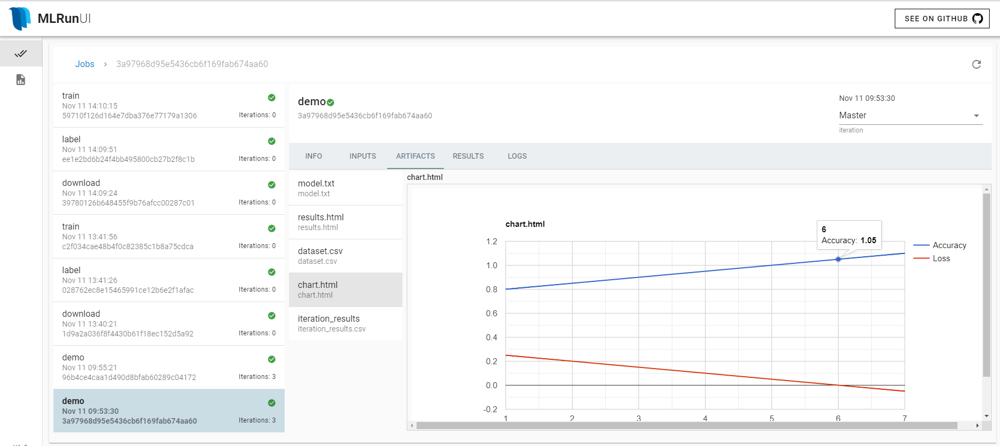

# MLRun

[](https://circleci.com/gh/mlrun/mlrun/tree/development)
[](https://opensource.org/licenses/Apache-2.0)
[](https://pypi.python.org/pypi/mlrun/)
[](https://mlrun.readthedocs.io/en/latest/?badge=latest)

A generic an easy to use mechanism for data scientists and developers/engineers 
to describe and run machine learning related tasks in various scalable runtime environments and ML pipelines
while automatically tracking code, metadata, inputs, and outputs of executions.
MLRun is integrate/use [Nuclio serverless project](https://github.com/nuclio/nuclio) and [KubeFlow](https://www.kubeflow.org/).

## General Concept and Motivation

A developer or data-scientist writes code in a local IDE or notebook, then he would 
like to run the same code on a larger cluster using scale-out containers or functions, 
once the code is ready he or another developer need to transfer the code into an automated ML workflow 
(e.g. using [KubeFlow Pipelines](https://www.kubeflow.org/docs/pipelines/pipelines-quickstart/)), add logging, monitoring, security, etc. 

In the various (`runtime`) environments we use different configurations, parameters, and data sources.
We also use different frameworks and platforms which focus on different stages in the life-cycle.
This leads to constant development and DevOps/MLops work. 

As we scale we need greater computation power or GPUs, and we need to access large scale datasets, 
this cant work on laptops, we need a way to seamlessly run our code on a remote cluster and automatically scale it out.   

When running experiments we would like to record/version all the code, configuration, outputs and and associated inputs 
(lineage), so we can easily reproduce or explain our results. The fact that we use different forms 
of storage (files, S3, ..) and databases doesnt make our life easy.

Many of those code and ML functions can be reused across projects and companies, having a function marketplace comprised 
of highly tuned open-source templates along side our internally developed functions can further accelerate our work.

Wouldnt it be great if we could write the code once in simple `local` semantics and we can run it as is on various platforms.
imagine a layer automate the build process, execution, data movement, scaling, versioning, parametrization, outputs tracking, etc.
a world of easily developed, published or consumed data/ML `Functions` which can be used to form complex and large scale ML pipelines.  

<b>This is the goal for this package!</b>

The code is in early development stages and provided as a reference, we would like to foster wide industry collaboration 
and the idea is to make all the resources pluggable, this way developers code to one API and can use various open source projects or commercial products.     

## Content
#### Installation

run `pip install mlrun` to get the library and CLI

For Kubernetes cluster installation, you need to install the API service and UI, 
both YAMLs can be found in `./hack`, edit according to the comments and 
apply to your cluster using `kubectl apply -f <yaml-file>`

```
curl -O https://raw.githubusercontent.com/mlrun/mlrun/master/hack/mlrunapi.yaml
# as a minimum replace the <set default registry url> and <access-key> with real values
# in iguazio cloud the default registry url is: docker-registry.default-tenant.<cluster-dns>:80

kubectl apply -n <namespace> -f <updated-yaml-file> 
kubectl apply -n <namespace> -f https://raw.githubusercontent.com/mlrun/mlrun/master/hack/mlrunui.yaml
```
 
#### Architecture and tutorial

* [Managed and portable execution a.k.a Serverless](#managed-and-portable-execution)
* [Automated parametrization, artifact tracking and logging](#automated-parametrization-artifact-tracking-and-logging)
* [Using hyper parameters for job scaling](#using-hyper-parameters-for-job-scaling)
* [Automated code deployment and containerization](#automated-code-deployment-and-containerization)
* [Build and run function from a remote IDE using the CLI](examples/remote.md)
* [Running with KubeFlow ML Pipeline](#running-with-kubeflow-ml-pipeline)
* [MLRun UI - WIP](#mlrun-user-interface)
* [Run and Artifact Database](#run-and-artifact-database)

#### Examples & Notebooks
* [Learn MLRun basics](examples/mlrun_basics.ipynb)
* [From local runs to Kubernetes jobs, and automated pipelines in a single Notebook](examples/mlrun_jobs.ipynb)
* [Create an end to end XGBoost pipeline: ingest, train, verify, deploy](examples/train_xgboost_serverless.ipynb)
* Examples for MLRun with scale-out runtimes
  * [Distributed TensorFlow (Horovod and MpiJob)](examples/mlrun_mpijob_classify.ipynb)
  * [Nuclio-serving (Serverless model serving)](examples/nuclio_serving.ipynb)
  * [Dask](examples/mlrun_dask.ipynb)
  * [Spark](examples/mlrun_sparkk8s.ipynb)
* [Importing and exporting functions using files or git](examples/mlrun_export_import.ipynb)
* [Query MLRUN DB](examples/mlrun_db.ipynb)

#### Additional Examples

* Complete demos can be found in [mlrun/demos repo](https://github.com/mlrun/demos)
  * [Deep learning pipeline](https://github.com/mlrun/demos/blob/master/image_classification/README.md) (data collection, labeling, training, serving + automated workflow)
* MLRun Functions Library (work in progress) is in [mlrun/functions repo](https://github.com/mlrun/functions)

## Architecture

### Managed and portable execution

We have few main elements:

* **Function** - a software package with one or more methods and a bunch of `runtime` specific attributes (e.g. image, command, 
args, environment, ..). function can run one or many runs/tasks, they can be created from templates, and be stored in a versioned database.
* **Task** - define the desired parameters, inputs, outputs of a job/task. 
Task can be created from a template and run over different `runtimes` or `functions`.
* **Run** - is the result of running a Task on a Function, it has all the attributes of a Task + the execution status and results.

MLRun support multiple `runtimes` i.e. computation frameworks, such as local, 
kubernetes job, dask, nuclio, spark, mpijob (Horovod). runtimes may support 
parallelism and clustering (i.e. distribute the work among processes/containers).

example:

    # create a task and set its attributes
    task = NewTask(handler=handler, name='demo', params={'p1': 5})
    task.with_secrets('file', 'secrets.txt').set_label('type', 'demo')
    
    run = new_function(command='myfile.py', kind='job').run(task)
    run.logs(watch=True)
    run.show()
    print(run.artifact('model'))

in this example the task defines our run spec (parameters, inputs, secrets, ..) .
we run this task on a `job` function, and print out the result 
output (in this case the `model` artifact) or watch the progress of that run. [see docs and example notebook](examples/mlrun_basics.ipynb).

we can run the same `task` on different functions, enabling code portability, re-use, and AutoML, 
or we can use the same `function` to run different tasks or parameter combinations with 
minimal coding effort.

moving from run on a local notebook, to running in a container job, a scaled-out framework
or an automated workflow engine like KubeFlow is seamless, just swap the runtime/function or wire functions in a graph,
[see this tutorial for details](), CI/CD steps (build, deploy) can also be specified as part of the workflow 
(using `.deploy_step()` function methods).

Functions can be created using one of three methods:
* `new_function()` - create a function object from scratch or another function
* `code_to_function()` - functions are created from source code, source URL or notebook
* `import_function()` - functions are imported from a local/remote YAML file or from the function DB (prefix: `db://<project>/<name>[:tag]`)

`function.save(tag="")` (store in db) and `function.export(target-path)` (store yaml) can be used to save functions

See each function doc/help and examples for details

### Automated parametrization, artifact tracking and logging 

Once our job run we need to track the run, their inputs, parameters and outputs.
`mlrun` introduces a concept of an ML `context`, the code can be instrumented to 
get parameters and inputs from the context as well as log outputs, artifacts, 
tag, and time-series metrics.


<b>Example, XGBoost training function</b>

```python
import xgboost as xgb
import os
from sklearn.datasets import load_iris
from sklearn.model_selection import train_test_split
import numpy as np
from sklearn.metrics import accuracy_score
from mlrun.artifacts import TableArtifact, PlotArtifact
import pandas as pd


def iris_generator(context, target=''):
    iris = load_iris()
    iris_dataset = pd.DataFrame(data=iris.data, columns=iris.feature_names)
    iris_labels = pd.DataFrame(data=iris.target, columns=['label'])
    iris_dataset = pd.concat([iris_dataset, iris_labels], axis=1)
    context.logger.info('saving iris dataframe to {}'.format(target))
    context.log_artifact(TableArtifact('iris_dataset', df=iris_dataset, target_path=target))
    

def xgb_train(context, 
              dataset='',
              model_name='model.bst',
              max_depth=6,
              num_class=10,
              eta=0.2,
              gamma=0.1,
              steps=20):

    df = pd.read_csv(dataset)
    X = df.drop(['label'], axis=1)
    y = df['label']
    
    X_train, X_test, Y_train, Y_test = train_test_split(X, y, test_size=0.2)
    dtrain = xgb.DMatrix(X_train, label=Y_train)
    dtest = xgb.DMatrix(X_test, label=Y_test)

    # Get params from event
    param = {"max_depth": max_depth,
             "eta": eta, "nthread": 4,
             "num_class": num_class,
             "gamma": gamma,
             "objective": "multi:softprob"}

    # Train model
    xgb_model = xgb.train(param, dtrain, steps)

    preds = xgb_model.predict(dtest)
    best_preds = np.asarray([np.argmax(line) for line in preds])

    # log results and artifacts
    context.log_result('accuracy', float(accuracy_score(Y_test, best_preds)))
    context.log_artifact('model', body=bytes(xgb_model.save_raw()), 
                         target_path=model_name, labels={'framework': 'xgboost'})
```  


The function above can be executed locally with parameters (e.g. eta, gamma), the results and artifacts 
will be logged automatically into a database with a single command. 

    train_run = new_function().run(handler=xgb_train).with_params(eta=0.3)    

we can swap the `function` with a serverless runtime and the same will run on a cluster.<br>
this can result in 10x performance boost.
more examples can be found in [`\examples`](examples) directory, with `kubernetes job`, `nuclio`, `dask`, `Spark`, or `mpijob` runtimes.
 
if we run our code from `main` we can get the runtime context by calling the `get_or_create_ctx`
method. 

The example below shows us how we can use the `context` object provide us various ways to
read and write metadata, secrets, inputs, or outputs. see the [horovod-training.py](examples/horovod-training.py) 
example for more details.

<b>Example, obtaining and using the context</b>

```python
from mlrun import get_or_create_ctx
from mlrun.artifacts import ChartArtifact, TableArtifact


def my_job():
    # load MLRUN runtime context (will be set by the runtime framework e.g. KubeFlow)
    context = get_or_create_ctx('train')
    
    # get parameters from the runtime context (or use defaults)
    p1 = context.get_param('p1', 1)
    p2 = context.get_param('p2', 'a-string')

    # access input metadata, values, files, and secrets (passwords)
    print(f'Run: {context.name} (uid={context.uid})')
    print(f'Params: p1={p1}, p2={p2}')
    print('accesskey = {}'.format(context.get_secret('ACCESS_KEY')))
    print('file\n{}\n'.format(context.get_input('infile.txt').get()))
    
    # RUN some useful code e.g. ML training, data prep, etc.

    # log scalar result values (job result metrics)
    context.log_result('accuracy', p1 * 2)
    context.log_result('loss', p1 * 3)
    context.set_label('framework', 'sklearn')

    # log various types of artifacts (file, web page, table), will be versioned and visible in the UI
    context.log_artifact('model.txt', body=b'abc is 123', labels={'framework': 'xgboost'})
    context.log_artifact('results.html', body=b'<b> Some HTML <b>', viewer='web-app')
    context.log_artifact(TableArtifact('dataset.csv', '1,2,3\n4,5,6\n',
                                        viewer='table', header=['A', 'B', 'C']))

    # create a chart output (will show in the pipelines UI)
    chart = ChartArtifact('chart.html')
    chart.labels = {'type': 'roc'}
    chart.header = ['Epoch', 'Accuracy', 'Loss']
    for i in range(1, 8):
        chart.add_row([i, i/20+0.75, 0.30-i/20])
    context.log_artifact(chart)


if __name__ == "__main__":
    my_job()
```


the code above can be invoked by calling:

    run = new_function(command='training.py').run(task)

or using the cli (while substituting the parameter and input data with remote S3 file):

    mlrun run --name train -p p2=5 -i infile.txt=s3://my-bocket/infile.txt -s file=secrets.txt training.py


### Using hyper parameters for job scaling

Data-science involve long-running compute and data intensive tasks, in order to gain 
efficiency we need to implement parallelism where ever we can, `mlrun` deliver scalability using two mechanisms:

1. Clustering - run the code on distributed processing engined (Dask, Spark, Horovod, ..)
2. Load-balancing/partitioning - partition the work to multiple workers 

mlrun can accept hyper-parameters or parameter lists, deploy many parallel workers, and partition the work among those.
the parallelism implementation is left to the `runtime`, each may have its own way to run tasks concurrently.
for example `nuclio` serverless engine manage many micro-threads in the same process which can run multiple tasks in parallel. 
In a containerized system like Kubernetes we can launch multiple containers each processing a different task.

In `mlrun` we implement parallelism you can run many parameter combinations for the `xgboost` 
function above by using `hyper params`:

    parameters = {
         "eta":       [0.05, 0.10, 0.20, 0.30],
         "max_depth": [3, 4, 5, 6, 8, 10],
         "gamma":     [0.0, 0.1, 0.2, 0.3],
         }

    task = NewTask(handler=xgb_train, out_path='/User/mlrun/data').with_hyper_params(parameters, 'max.accuracy')
    run = new_function().run(task)

    
The line above tells mlrun to run the same task while choosing the parameters from multiple lists (GridSearch).
it will record ALL the runs, but mark the one with minimal `loss` as the selected result.
for parallelism it would be better to use `runtimes` like `dask`, `nuclio`, or `jobs`.

This can also be done via the CLI:

    mlrun run --name train_hyper -x p1="[3,7,5]" -x p2="[5,2,9]" training.py

We can use a parameter file if we want to control the parameter combinations or if the parameters are more complex.

    task = NewTask(handler=xgb_train).with_param_file('params.csv', 'max.accuracy')
    run = new_function().run(task)

  
> Note: parameter list can be used for various tasks, another example is to pass a list of files and 
have multiple workers process them simultaneously instead of one at a time.


### Automated code deployment and containerization 

Mlrun adopts `nuclio` serverless technologies for automatically packaging code and building containers,
this way we can specify code with some package requirements and let the system build and deploy our software.

Building and deploying a function is as easy as typing `function.deploy(..)`, this will initiate a build/deployment job,
deployment jobs can be incorporated in pipelines just like regular jobs (using the `.deploy_step()` method, enabeling full automation and CI/CD.

functions can be built from source code, function specs, notebooks, GIT repos, or tar archives.

build can also be done using the CLI, you need to provide the function `YAML` file 
(can be generated using `function.to_yaml()` or `function.export()`)   

Example `function.yaml`:

```yaml
kind: job
metadata:
  name: remote-git-test
  project: default
  tag: latest
spec:
  command: 'myfunc.py'
  args: []
  image_pull_policy: Always
  build:
    commands: ['pip install pandas']
    base_image: mlrun/mlrun:dev
    source: git://github.com/mlrun/ci-demo.git
```
use:

    mlrun build function.yaml   


See [more examples](examples/remote.md) for building and running fuctions from remote using the CLI.


we can convert our notebook into a containerized job, see [detailed example](examples/mlrun_jobs.ipynb):

```python
# create an ML function from the notebook, attache it to iguazio data fabric (v3io)
fn = code_to_function(kind='job').apply(mount_v3io())

# prepare an image from the dependencies, so we wont need to build the image every run 
fn.build(image='mlrun/nuctest:latest')
``` 

## Running with KubeFlow ML Pipeline

Running in a pipeline would be similar to running using the command line
mlrun will automatically save outputs and artifacts in a way which will be visible to KubeFlow, and allow interconnecting steps

see a [full pipelines notebook example](examples/train_xgboost_serverless.ipynb)
```python
@dsl.pipeline(
    name='My XGBoost training pipeline',
    description='Shows how to use mlrun.'
)
def xgb_pipeline(
   eta = [0.1, 0.2, 0.3], gamma = [0.1, 0.2, 0.3]
):

    ingest = xgbfn.as_step(name='ingest_iris', handler='iris_generator',
                          params = {'target': df_path},
                          outputs=['iris_dataset'], out_path=artifacts_path).apply(mount_v3io())

    
    train = xgbfn.as_step(name='xgb_train', handler='xgb_train',
                          hyperparams = {'eta': eta, 'gamma': gamma},
                          selector='max.accuracy',
                          inputs = {'dataset': ingest.outputs['iris_dataset']}, 
                          outputs=['model'], out_path=artifacts_path).apply(mount_v3io())

    
    plot = xgbfn.as_step(name='plot', handler='plot_iter',
                         inputs={'iterations': train.outputs['iteration_results']},
                         outputs=['iris_dataset'], out_path=artifacts_path).apply(mount_v3io())

    # deploy the model serving function with inputs from the training stage
    deploy = srvfn.deploy_step(project = 'iris', models={'iris_v1': train.outputs['model']})
```

## MLRun User Interface

The UI require running the DB/API server, see k8s YAML files under [/hack](./hack), this is still under development.

<br><p align="center"></p><br>

## Run and Artifact Database

if you have specified a `rundb` the results and artifacts from each run are recorded 

you can use various `db` methods, see the [example notebook](examples/mlrun_db.ipynb)

```python
from mlrun import get_run_db

# connect to a local file DB
db = get_run_db('./').connect()

# list all runs
db.list_runs('').show()

# list all artifact for version "latest"
db.list_artifacts('', tag='').show()

# check different artifact versions 
db.list_artifacts('ch', tag='*').show()

# delete completed runs
db.del_runs(state='completed')
```

## Additional Information and Examples

### Replacing Runtime Context Parameters form CLI

`python -m mlrun run -p p1=5 -s file=secrets.txt -i infile.txt=s3://mybucket/infile.txt training.py`

when running the command above:
* the parameter `p1` will be overwritten with `5`
* the file `infile.txt` will be loaded from a remote S3 bucket
* credentials (for S3 and the app) will be loaded from the `secrets.txt` file

### Running Against Remote Code/Function

The same code can be implemented as a remote HTTP endpoint e.g. using [nuclio serverless](https://github.com/nuclio/nuclio) functions

for example the same code can be wrapped in a nuclio handler and be remotely executed using the same CLI

#### Function Deployment

to deploy the function into a cluster you can run the following commands
(make sure you first installed the nuclio-jupyter package)

```python
# create the function from the notebook code + annotations, add volumes and parallel HTTP trigger
fn = code_to_function('xgb_train', runtime='nuclio:mlrun')
fn.apply(mount_v3io()).with_http(workers=32)

run = fn.run(task, handler='xgb_train')
```


To execute the code remotely just substitute the file name with the function URL

`python -m mlrun run -p p1=5 -s file=secrets.txt -i infile.txt=s3://mybucket/infile.txt http://<function-endpoint>`


### Running HTTP Database

#### Docker

Run with `docker run -p8080:8080 -v /path/to/db:/mlrun/db`


You can pass `MLRUN_httpdb__port` environment variable to change port.

#### Command Line

    mlrun db [options]
    
```
Options:
  -p, --port INTEGER  port to listen on
  -d, --dirpath TEXT  database directory (dirpath)
```
