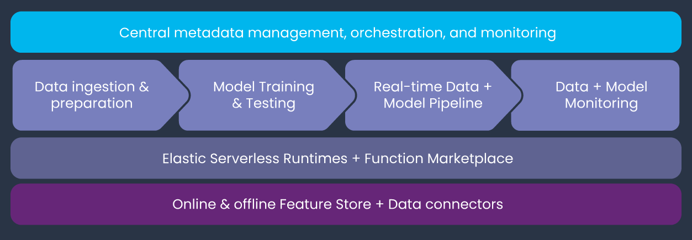

<a id="top"></a>
[](https://github.com/mlrun/mlrun/actions)
[](https://opensource.org/licenses/Apache-2.0)
[](https://pypi.python.org/pypi/mlrun/)
[](https://mlrun.readthedocs.io/en/latest/?badge=latest)
[](https://github.com/psf/black)

<p align="left"></p>

*The Open-Source MLOps Orchestration Framework*

MLRun is an open-source MLOps framework that offers an integrative approach to managing your machine-learning pipelines from early development through model development to full pipeline deployment in production.
MLRun offers a convenient abstraction layer to a wide variety of technology stacks while empowering data engineers and data scientists to define the feature and models.

<a id="mlrun-arch"></a>
#### The MLRun Architecture <!-- omit in toc -->

<p align="left"></p>

MLRun is composed of the following layers:

- **Feature and Artifact Store** &mdash;
    handles the ingestion, processing, metadata, and storage of data and features across multiple repositories and technologies.
- **Elastic Serverless Runtimes** &mdash;
    converts simple code to scalable and managed microservices with workload-specific runtime engines (such as Kubernetes jobs, Nuclio, Dask, Spark, and Horovod).
- **ML Pipeline Automation** &mdash;
    automates data preparation, model training and testing, deployment of real-time production pipelines, and end-to-end monitoring.
- **Central Management** &mdash;
    provides a unified portal for managing the entire MLOps workflow.
    The portal includes a UI, a CLI, and an SDK, which are accessible from anywhere.

<a id="key-benefits"></a>
#### Key Benefits <!-- omit in toc -->

MLRun provides the following key benefits:

- **Rapid deployment** of code to production pipelines
- **Elastic scaling** of batch and real-time workloads
- **Feature management** &mdash; ingestion, preparation, and monitoring
- **Works anywhere** &mdash; your local IDE, multi-cloud, or on-prem

&#x25B6; For more information, see the [MLRun Python package documentation](https://mlrun.readthedocs.io).

#### In This Document <!-- omit in toc -->

- [General Concept and Motivation](#general-concept-and-motivation)
  - [The Challenge](#the-challenge)
  - [Why MLRun?](#why-mlrun)
- [Installation](#installation)
  - [Installation on the Iguazio Data Science Platform](#installation-on-the-iguazio-data-science-platform)
- [Examples and Tutorial Notebooks](#examples-and-tutorial-notebooks)
  - [Additional Examples](#additional-examples)
- [Quick-Start Tutorial &mdash; Architecture and Usage Guidelines](#quick-start-tutorial--architecture-and-usage-guidelines)
  - [Basic Components](#basic-components)
  - [Managed and Portable Execution](#managed-and-portable-execution)
  - [Automated Parameterization, Artifact Tracking, and Logging](#automated-parameterization-artifact-tracking-and-logging)
    - [Example](#example)
  - [Using Hyperparameters for Job Scaling](#using-hyperparameters-for-job-scaling)
  - [Automated Code Deployment and Containerization](#automated-code-deployment-and-containerization)
  - [Running an ML Workflow with Kubeflow Pipelines](#running-an-ml-workflow-with-kubeflow-pipelines)
  - [Viewing Run Data and Performing Database Operations](#viewing-run-data-and-performing-database-operations)
    - [The MLRun Dashboard](#the-mlrun-dashboard)
    - [MLRun Database Methods](#mlrun-database-methods)
  - [Additional Information and Examples](#additional-information-and-examples)
    - [Replacing Runtime Context Parameters from the CLI](#replacing-runtime-context-parameters-from-the-cli)
    - [Remote Execution](#remote-execution)
      - [Nuclio Example](#nuclio-example)
  - [Running an MLRun Service](#running-an-mlrun-service)
    - [Using the MLRun CLI to Run an MLRun Service](#using-the-mlrun-cli-to-run-an-mlrun-service)

<a id="concepts-n-motivation"></a>
## General Concept and Motivation

<a id="the-challenge"></a>
### The Challenge

As an ML developer or data scientist, you typically want to write code in your preferred local development environment (IDE) or web notebook, and then run the same code on a larger cluster using scale-out containers or functions.
When you determine that the code is ready, you or someone else need to transfer the code to an automated ML workflow (for example, using [Kubeflow Pipelines](https://www.kubeflow.org/docs/pipelines/pipelines-quickstart/)).
This pipeline should be secure and include capabilities such as logging and monitoring, as well as allow adjustments to relevant components and easy redeployment.

However, the implementation is challenging: various environments ("runtimes") use different configurations, parameters, and data sources.
In addition, multiple frameworks and platforms are used to focus on different stages of the development life cycle.
This leads to constant development and DevOps/MLOps work.

Furthermore, as your project scales, you need greater computation power or GPUs, and you need to access large-scale data sets.
This cannot work on laptops.
You need a way to seamlessly run your code on a remote cluster and automatically scale it out.

<a id="why-mlrun"></a>
### Why MLRun?

When running ML experiments, you should ideally be able to record and version your code, configuration, outputs, and associated inputs (lineage), so you can easily reproduce and explain your results.
The fact that you probably need to use different types of storage (such as files and AWS S3 buckets) and various databases, further complicates the implementation.

Wouldn't it be great if you could write the code once, using your preferred development environment and simple "local" semantics, and then run it as-is on different platforms?
Imagine a layer that automates the build process, execution, data movement, scaling, versioning, parameterization, outputs tracking, and more.
A world of easily developed, published, or consumed data or ML "functions" that can be used to form complex and large-scale ML pipelines.

In addition, imagine a marketplace of ML functions that includes both open-source templates and your internally developed functions, to support code reuse across projects and companies and thus further accelerate your work.

<b>This is the goal of MLRun.</b>

> **Note:** The code is in early development stages and is provided as a reference.
> The hope is to foster wide industry collaboration and make all the resources pluggable, so that developers can code to a single API and use various open-source projects or commercial products.

[Back to top](#top)

<a id="installation"></a>
## Installation

Run the following command from your Python development environment (such as Jupyter Notebook) to install the MLRun package (`mlrun`), which includes a Python API library and the `mlrun` command-line interface (CLI):
```python
pip install mlrun
```

MLRun requires separate containers for the API and the dashboard (UI).
You can also select to use the pre-baked JupyterLab image.

To install and run MLRun locally using Docker or Kubernetes, see the instructions in the [**MLRun documentation**](https://mlrun.readthedocs.io/en/latest/install.html).

<a id="installation-iguazio-platform"></a>
### Installation on the Iguazio Data Science Platform

MLRun runs as a service on the [Iguazio Data Science Platform](https://www.iguazio.com) (version 2.8 and above) &mdash;

To access MLRun UI select it from the services screen, consult with Iguazio support for further details.

[Back to top](#top)

<a id="examples-n-tutorial-notebooks"></a>
## Examples and Tutorial Notebooks

MLRun has many code examples and tutorial Jupyter notebooks with embedded documentation, ranging from examples of basic tasks to full end-to-end use-case applications, including the following; note that some of the examples are found in other mlrun GitHub repositories:

- Learn MLRun basics &mdash; [**examples/mlrun_basics.ipynb**](examples/mlrun_basics.ipynb)
- Convert local runs to Kubernetes jobs and create automated pipelines &mdash; [**examples/mlrun_jobs.ipynb**](examples/mlrun_jobs.ipynb)
  - build and end to end pipeline in a single notebook
  - build custom containers and work with shared files and objects
  - use model management APIs (log_model, get_model, update_model)
- End-to-end ML pipeline&mdash; [**demos/scikit-learn**](https://github.com/mlrun/demos/tree/master/scikit-learn-pipeline), including:
  - Data ingestion and analysis 
  - Model training
  - Verification
  - Model deployment
- MLRun with scale-out runtimes &mdash;
  - Distributed TensorFlow with Horovod and MPIJob, including data collection and labeling, model training and serving, and implementation of an automated workflow &mdash; [**demos/image-classification-with-distributed-training**](https://github.com/mlrun/demos/tree/master/image-classification-with-distributed-training)
  - Serverless model serving with Nuclio &mdash; [**examples/xgb_serving.ipynb**](examples/xgb_serving.ipynb)
  - Dask &mdash; [**examples/mlrun_dask.ipynb**](examples/mlrun_dask.ipynb)
  - Spark &mdash; [**examples/mlrun_sparkk8s.ipynb**](examples/mlrun_sparkk8s.ipynb)
- MLRun project and Git life cycle &mdash;
  - Load a project from a remote Git location and run pipelines &mdash; [**examples/load-project.ipynb**](examples/load-project.ipynb)
  - Create a new project, functions, and pipelines, and upload to Git &mdash; [**examples/new-project.ipynb**](examples/new-project.ipynb)
- Import and export functions using different modes &mdash; [**examples/mlrun_export_import.ipynb**](examples/mlrun_export_import.ipynb)
  - save, auto-document, and upload functions 
  - import functions and run as: module, local-run, and clusterd job
- Query the MLRun DB &mdash; [**examples/mlrun_db.ipynb**](examples/mlrun_db.ipynb)

<a id="additional-examples"></a>
### Additional Examples

- Additional end-to-end use-case applications &mdash; [mlrun/demos](https://github.com/mlrun/demos) repo
- MLRun functions Library &mdash; [mlrun/functions](https://github.com/mlrun/functions) repo 

[Back to top](#top)

<a id="qs-tutorial"></a>
## Quick-Start Tutorial &mdash; Architecture and Usage Guidelines
<!-- TODO: Move this to a separate docs/quick-start.md file, add an opening
  paragraph, update the heading levels, add a `top` anchor, and remove the
  "Back to quick-start TOC" links (leaving only the "Back to top" links). -->

<a id="basic-components"></a>
### Basic Components

MLRun has the following main components:

- <a id="def-project"></a>**Project** &mdash; a container for organizing all of your work on a particular activity.
    Projects consist of metadata, source code, workflows, data and artifacts, models, triggers, and member management for user collaboration.

- <a id="def-function"></a>**Function** &mdash; a software package with one or more methods and runtime-specific attributes (such as image, command, arguments, and environment).

- <a id="def-run"></a>**Run** &mdash; an object that contains information about an executed function.
    The run object is created as a result of running a function, and contains the function attributes (such as arguments, inputs, and outputs), as well the execution status and results (including links to output artifacts).

- <a id="def-artifact"></a>**Artifact** &mdash; versioned data artifacts (such as data sets, files and models) that are produced or consumed by functions, runs, and workflows.

- <a id="def-workflow"></a>**Workflow** &mdash; defines a functions pipeline or a directed acyclic graph (DAG) to execute using [Kubeflow Pipelines](https://www.kubeflow.org/docs/pipelines/pipelines-quickstart/).

- <a id="def-ui"></a>**UI** &mdash; a graphical user interface (dashboard) for displaying and managing projects and their contained experiments, artifacts, and code.

<a id="managed-and-portable-execution"></a>
### Managed and Portable Execution

<a id="def-runtime"></a>MLRun supports various types of **"runtimes"** &mdash; computation frameworks such as local, Kubernetes job, Dask, Nuclio, Spark, or MPI job (Horovod).
Runtimes may support parallelism and clustering to distribute the work among multiple workers (processes/containers).

The following code example creates a task that defines a run specification &mdash; including the run parameters, inputs, and secrets.
You run the task on a "job" function, and print the result output (in this case, the "model" artifact) or watch the run's progress.
For more information and examples, see the [**examples/mlrun_basics.ipynb**](examples/mlrun_basics.ipynb) notebook.
```python
# Create a task and set its attributes
task = NewTask(handler=handler, name='demo', params={'p1': 5})
task.with_secrets('file', 'secrets.txt').set_label('type', 'demo')

run = new_function(command='myfile.py', kind='job').run(task)
run.logs(watch=True)
run.show()
print(run.artifact('model'))
```

You can run the same [task](#def-task) on different functions &mdash; enabling code portability, re-use, and AutoML.
You can also use the same [function](#def-function) to run different tasks or parameter combinations with minimal coding effort.

Moving from local notebook execution to remote execution &mdash; such as running a container job, a scaled-out framework, or an automated workflow engine like Kubeflow Pipelines &mdash; is seamless: just swap the runtime function or wire functions in a graph.
Continuous build integration and deployment (CI/CD) steps can also be configured as part of the workflow, using the `deploy_step` function method.

Functions (function objects) can be created by using any of the following methods:

- **`new_function`** &mdash; creates a function "from scratch" or from another function.
- **`code_to_function`** &mdash; creates a function from local or remote source code or from a web notebook.
- **`import_function`** &mdash; imports a function from a local or remote YAML function-configuration file or from a function object in the MLRun database (using a DB address of the format `db://<project>/<name>[:<tag>]`).
- **`function_to_module`** &mdash; import MLRun function or code as a local python module (can also be used inside another parent function) 
You can use the `save` function method to save a function object in the MLRun database, or the `export` method to save a YAML function-configuration function to your preferred local or remote location.
For function-method details and examples, see the embedded documentation/help text.

[Back to top](#top) / [Back to quick-start TOC](#qs-tutorial)

<a id="auto-parameterization-artifact-tracking-n-logging"></a>
### Automated Parameterization, Artifact Tracking, and Logging

After running a job, you need to be able to track it, including viewing the run parameters, inputs, and outputs.
To support this, MLRun introduces a concept of a runtime **"context"**: the code can be set up to get parameters and inputs from the context, as well as log run outputs, artifacts, tags, and time-series metrics in the context.

<a id="auto-parameterization-artifact-tracking-n-logging-example"></a>
#### Example

The following code example from the [**train-xgboost.ipynb**](https://github.com/mlrun/demo-xgb-project/blob/master/notebooks/train-xgboost.ipynb) notebook of the MLRun XGBoost demo (**demo-xgboost**) defines two functions:
the `iris_generator` function loads the Iris data set and saves it to the function's context object; the `xgb_train` function uses XGBoost to train an ML model on a data set and saves the log results in the function's context:

```python
import xgboost as xgb
import os
from sklearn.datasets import load_iris
from sklearn.model_selection import train_test_split
import numpy as np
from sklearn.metrics import accuracy_score
from mlrun.artifacts import PlotArtifact
import pandas as pd


def iris_generator(context):
    iris = load_iris()
    iris_dataset = pd.DataFrame(data=iris.data, columns=iris.feature_names)
    iris_labels = pd.DataFrame(data=iris.target, columns=['label'])
    iris_dataset = pd.concat([iris_dataset, iris_labels], axis=1)
    context.logger.info('Saving Iris data set to "{}"'.format(context.out_path))
    context.log_dataset('iris_dataset', df=iris_dataset)


def xgb_train(context,
              dataset='',
              model_name='model.bst',
              max_depth=6,
              num_class=10,
              eta=0.2,
              gamma=0.1,
              steps=20):

    df = pd.read_csv(dataset)
    X = df.drop(['label'], axis=1)
    y = df['label']

    X_train, X_test, Y_train, Y_test = train_test_split(X, y, test_size=0.2)
    dtrain = xgb.DMatrix(X_train, label=Y_train)
    dtest = xgb.DMatrix(X_test, label=Y_test)

    # Get parameters from event
    param = {"max_depth": max_depth,
             "eta": eta, "nthread": 4,
             "num_class": num_class,
             "gamma": gamma,
             "objective": "multi:softprob"}

    xgb_model = xgb.train(param, dtrain, steps)

    preds = xgb_model.predict(dtest)
    best_preds = np.asarray([np.argmax(line) for line in preds])

    context.log_result('accuracy', float(accuracy_score(Y_test, best_preds)))
    context.log_model('model', body=bytes(xgb_model.save_raw()), 
                      model_file='model.txt', 
                      metrics=context.results, parameters={'xx':'abc'},
                      labels={'framework': 'xgboost'},
                      artifact_path=context.artifact_subpath('models'))
```

The example training function can be executed locally with parameters, and the run results and artifacts can be logged automatically into a database by using a single command, as demonstrated in the following example; the example sets the function's `eta` parameter:
```python
train_run = run_local(handler=xgb_train, pramas={'eta': 0.3})
```

Alternatively, you can replace the function with a serverless runtime to run the same code on a remote cluster, which could result in a ~10x performance boost.
You can find examples for different runtimes &mdash; such as a Kubernetes job, Nuclio, Dask, Spark, or an MPI job &mdash; in the MLRun [**examples**](examples) directory.

If you run your code from the `main` function, you can get the runtime context by calling the `get_or_create_ctx` method, as demonstrated in the following code from the MLRun [**training.py**](examples/training.py) example application.
The code also demonstrates how you can use the context object to read and write execution metadata, parameters, secrets, inputs, and outputs:

```python
from mlrun import get_or_create_ctx
from mlrun.artifacts import ChartArtifact
import pandas as pd


def my_job(context, p1=1, p2='x'):
    # load MLRUN runtime context (will be set by the runtime framework e.g. KubeFlow)

    # get parameters from the runtime context (or use defaults)

    # access input metadata, values, files, and secrets (passwords)
    print(f'Run: {context.name} (uid={context.uid})')
    print(f'Params: p1={p1}, p2={p2}')
    print('accesskey = {}'.format(context.get_secret('ACCESS_KEY')))
    print('file\n{}\n'.format(context.get_input('infile.txt', 'infile.txt').get()))
    
    # Run some useful code e.g. ML training, data prep, etc.

    # log scalar result values (job result metrics)
    context.log_result('accuracy', p1 * 2)
    context.log_result('loss', p1 * 3)
    context.set_label('framework', 'sklearn')

    # log various types of artifacts (file, web page, table), will be versioned and visible in the UI
    context.log_artifact('model', body=b'abc is 123', local_path='model.txt', labels={'framework': 'xgboost'})
    context.log_artifact('html_result', body=b'<b> Some HTML <b>', local_path='result.html')

    # create a chart output (will show in the pipelines UI)
    chart = ChartArtifact('chart')
    chart.labels = {'type': 'roc'}
    chart.header = ['Epoch', 'Accuracy', 'Loss']
    for i in range(1, 8):
        chart.add_row([i, i/20+0.75, 0.30-i/20])
    context.log_artifact(chart)

    raw_data = {'first_name': ['Jason', 'Molly', 'Tina', 'Jake', 'Amy'],
                'last_name': ['Miller', 'Jacobson', 'Ali', 'Milner', 'Cooze'],
                'age': [42, 52, 36, 24, 73],
                'testScore': [25, 94, 57, 62, 70]}
    df = pd.DataFrame(raw_data, columns=[
        'first_name', 'last_name', 'age', 'testScore'])
    context.log_dataset('mydf', df=df, stats=True)


if __name__ == "__main__":
    context = get_or_create_ctx('train')
    p1 = context.get_param('p1', 1)
    p2 = context.get_param('p2', 'a-string')
    my_job(context, p1, p2)
```

The example **training.py** application can be invoked as a local task, as demonstrated in the following code from the MLRun [**mlrun_basics.ipynb**](examples/mlrun_basics.ipynb) example notebook:
```python
run = run_local(task, command='training.py')
```
Alternatively, you can invoke the application by using the `mlrun` CLI; edit the parameters, inputs, and/or secret information, as needed, and ensure that **training.py** is found in the execution path or edit the file path in the command:
```sh
mlrun run --name train -p p2=5 -i infile.txt=s3://my-bucket/infile.txt -s file=secrets.txt training.py
```

[Back to top](#top) / [Back to quick-start TOC](#qs-tutorial)

<a id="using-hyperparameters-for-job-scaling"></a>
### Using Hyperparameters for Job Scaling

Data science involves long computation times and data-intensive tasks.
To ensure efficiency and scalability, you need to implement parallelism whenever possible.
MLRun supports this by using two mechanisms:

1. Clustering &mdash; run the code on a distributed processing engine (such as Dask, Spark, or Horovod).
2. Load-balancing/partitioning &mdash; split (partition) the work across multiple workers.

MLRun functions and tasks can accept hyperparameters or parameter lists, deploy many parallel workers, and partition the work among the deployed workers.
The parallelism implementation is left to the runtime.
Each runtime may have its own method of concurrent tasks execution.
For example, the Nuclio serverless engine manages many micro threads in the same process, which can run multiple tasks in parallel.
In a containerized system like Kubernetes, you can launch multiple containers, each processing a different task.

MLRun supports parallelism.
For example, the following code demonstrates how to use hyperparameters to run the XGBoost model-training task from the example in the previous section (`xgb_train`) with different parameter combinations:
```python
    parameters = {
         "eta":       [0.05, 0.10, 0.20, 0.30],
         "max_depth": [3, 4, 5, 6, 8, 10],
         "gamma":     [0.0, 0.1, 0.2, 0.3],
         }

    task = NewTask(handler=xgb_train, out_path='/User/mlrun/data').with_hyper_params(parameters, 'max.accuracy')
    run = run_local(task)
```

This code demonstrates how to instruct MLRun to run the same task while choosing the parameters from multiple lists (grid search).
MLRun then records all the runs, but marks only the run with minimal loss as the selected result.
For parallelism, it would be better to use runtimes like Dask, Nuclio, or jobs.

Alternatively, you can run a similar task (with hyperparameters) by using the MLRun CLI (`mlrun`); ensure that **training.py** is found in the execution path or edit the file path in the command:
```sh
mlrun run --name train_hyper -x p1="[3,7,5]" -x p2="[5,2,9]" --out-path '/User/mlrun/data' training.py
```

You can also use a parameters file if you want to control the parameter combinations or if the parameters are more complex.
The following code from the example [**mlrun_basics.ipynb**](examples/mlrun_basics.ipynb) notebook demonstrates how to run a task that uses a CSV parameters file (**params.csv** in the current directory):
```python
    task = NewTask(handler=xgb_train).with_param_file('params.csv', 'max.accuracy')
    run = run_local(task)
```

> **Note:** Parameter lists can be used in various ways.
> For example, you can pass multiple parameter files and use multiple workers to process the files simultaneously instead of one at a time.

[Back to top](#top) / [Back to quick-start TOC](#qs-tutorial)

<a id="auto-code-deployment-n-containerization"></a>
### Automated Code Deployment and Containerization

MLRun adopts Nuclio serverless technologies for automatically packaging code and building containers.
This enables you to provide code with some package requirements and let MLRun build and deploy your software.

To build or deploy a function, all you need is to call the function's `deploy` method, which initiates a build or deployment job.
Deployment jobs can be incorporated in pipelines just like regular jobs (using the `deploy_step` method of the function or Kubernetes-job runtime), thus enabling full automation and CI/CD.

A functions can be built from source code or from a function specification, web notebook, Git repo, or TAR archive.

A function can also be built by using the `mlrun` CLI and providing it with the path to a YAML function-configuration file.
You can generate such a file by using the `to_yaml` or `export` function method.
For example, the following CLI code builds a function from a **function.yaml** file in the current directory:
```sh
mlrun build function.yaml
```
Following is an example **function.yaml** configuration file:
```yaml
kind: job
metadata:
  name: remote-git-test
  project: default
  tag: latest
spec:
  command: 'myfunc.py'
  args: []
  image_pull_policy: Always
  build:
    commands: ['pip install pandas']
    base_image: mlrun/mlrun:dev
    source: git://github.com/mlrun/ci-demo.git
```

For more examples of building and running functions remotely using the MLRun CLI, see the [**remote**](examples/remote.md) example.

You can also convert your web notebook to a containerized job, as demonstrated in the following sample code; for a similar example with more details, see the [**mlrun_jobs.ipynb**](examples/mlrun_jobs.ipynb) example:

```python
# Create an ML function from the notebook code and annotations, and attach a
# v3io Iguazio Data Science Platform data volume to the function
fn = code_to_function(kind='job').apply(mount_v3io())

# Prepare an image from the dependencies to allow updating the code and
# parameters per run without the need to build a new image
fn.build(image='mlrun/nuctest:latest')
```

[Back to top](#top)

<a id="run-ml-workflow-w-kubeflow-pipelines"></a>
### Running an ML Workflow with Kubeflow Pipelines

ML pipeline execution with MLRun is similar to CLI execution.
A pipeline is created by running an MLRun workflow.
MLRun automatically saves outputs and artifacts in a way that is visible to [Kubeflow Pipelines](https://github.com/kubeflow/pipelines), and allows interconnecting steps.

For an example of a full ML pipeline that's implemented in a web notebook, see the Sklearn MLRun demo ([**demos/scikit-learn**](https://github.com/mlrun/demos/tree/master/scikit-learn-pipeline)).
The  [**sklearn-project.ipynb**](https://github.com/mlrun/demos/blob/master/scikit-learn-pipeline/sklearn-project.ipynb) demo notebook includes the following code for implementing an ML-training pipeline:
```python
from kfp import dsl
from mlrun import mount_v3io

funcs = {}
DATASET = 'iris_dataset'
LABELS  = "label"

def init_functions(functions: dict, project=None, secrets=None):
    for f in functions.values():
        f.apply(mount_v3io())
        f.spec.image_pull_policy = 'Always'

@dsl.pipeline(
    name="My XGBoost training pipeline",
    description="Shows how to use mlrun."
)
def kfpipeline():
    
    # build our ingestion function (container image)
    builder = funcs['gen-iris'].deploy_step(skip_deployed=True)
    
    # run the ingestion function with the new image and params
    ingest = funcs['gen-iris'].as_step(
        name="get-data",
        handler='iris_generator',
        image=builder.outputs['image'],
        params={'format': 'pq'},
        outputs=[DATASET])

    # analyze our dataset
    describe = funcs["describe"].as_step(
        name="summary",
        params={"label_column": LABELS},
        inputs={"table": ingest.outputs[DATASET]})
    
    # train with hyper-paremeters 
    train = funcs["train"].as_step(
        name="train-skrf",
        params={"model_pkg_class" : "sklearn.ensemble.RandomForestClassifier",
                "sample"          : -1, 
                "label_column"    : LABELS,
                "test_size"       : 0.10},
        hyperparams={'CLASS_n_estimators': [100, 300, 500]},
        selector='max.accuracy',
        inputs={"dataset"         : ingest.outputs[DATASET]},
        outputs=['model', 'test_set'])

    # test and visualize our model
    test = funcs["test"].as_step(
        name="test",
        params={"label_column": LABELS},
        inputs={"models_path" : train.outputs['model'],
                "test_set"    : train.outputs['test_set']})

    # deploy our model as a serverless function
    deploy = funcs["serving"].deploy_step(models={f"{DATASET}_v1": train.outputs['model']})
```

[Back to top](#top) / [Back to quick-start TOC](#qs-tutorial)

<a id="db-operations"></a>
### Viewing Run Data and Performing Database Operations

When you configure an MLRun database, the results, parameters, and input and output artifacts of each run are recorded in the database.
You can view the results and perform operations on the database by using either of the following methods:

- Using [the MLRun dashboard](#mlrun-ui)
- Using [DB methods](#mlrun-db-methods) from your code

[Back to top](#top) / [Back to quick-start TOC](#qs-tutorial)

<a id="mlrun-ui"></a>
#### The MLRun Dashboard

The MLRun dashboard is a graphical user interface (GUI) for working with MLRun and viewing run data.

<br><p align="center"></p><br>

[Back to top](#top) / [Back to quick-start TOC](#qs-tutorial)

<a id="mlrun-db-methods"></a>
#### MLRun Database Methods

You can use the `get_run_db` DB method to get an MLRun DB object for a configured MLRun database or API service.
Then, use the DB object's `connect` method to connect to the database or API service, and use additional methods to perform different operations, such as listing run artifacts or deleting completed runs.
For more information and examples, see the [**mlrun_db.ipynb**](examples/mlrun_db.ipynb) example notebook, which includes the following sample DB method calls:
```python
from mlrun import get_run_db

# Get an MLRun DB object and connect to an MLRun database/API service.
# Specify the DB path (for example, './' for the current directory) or
# the API URL ('http://mlrun-api:8080' for the default configuration).
db = get_run_db('./')

# List all runs
db.list_runs('').show()

# List all artifacts for version 'latest' (default)
db.list_artifacts('', tag='').show()

# Check different artifact versions
db.list_artifacts('ch', tag='*').show()

# Delete completed runs
db.del_runs(state='completed')
```

[Back to top](#top) / [Back to quick-start TOC](#qs-tutorial)

<a id="additional-info-n-examples"></a>
### Additional Information and Examples

- [Replacing Runtime Context Parameters from the CLI](#replace-runtime-context-param-from-cli)
- [Remote Execution](#remote-execution)
  - [Nuclio Example](#remote-execution-nuclio-example)
- [Running the MLRun Database/API Service](#run-mlrun-db-service)

<a id="replace-runtime-context-param-from-cli"></a>
#### Replacing Runtime Context Parameters from the CLI

You can use the MLRun CLI (`mlrun`) to run MLRun functions or code and change the parameter values.

For example, the following CLI command runs the example XGBoost training code from the previous tutorial examples:
```sh
python -m mlrun run -p p1=5 -s file=secrets.txt -i infile.txt=s3://mybucket/infile.txt training.py
```

When running this sample command, the CLI executes the code in the **training.py** application using the provided run information:
- The value of parameter `p1` is set to `5`, overwriting the current parameter value in the run context.
- The file **infile.txt** is downloaded from a remote "mybucket" AWS S3 bucket.
- The credentials for the S3 download are retrieved from a **secrets.txt** file in the current directory.

<a id="remote-execution"></a>
#### Remote Execution

You can also run the same MLRun code that you ran locally as a remote HTTP endpoint.

<a id="remote-execution-nuclio-example"></a>
##### Nuclio Example

For example, you can wrap the XGBoost training code from the previous tutorial examples within a serverless [Nuclio](https://nuclio.io) handler function, and execute the code remotely using a similar CLI command to the one that you used locally.

You can run the following code from a Jupyter Notebook to create a Nuclio function from the notebook code and annotations, and deploy the function to a remote cluster.

> **Note:**
> - Before running the code, install the [`nuclio-jupyter`](https://github.com/nuclio/nuclio-jupyter) package for using Nuclio from Jupyter Notebook.
> - The example uses `apply(mount_v3io()`to attach a v3io Iguazio Data Science Platform data-store volume to the function.
>   By default, the v3io mount mounts the home directory of the platform's running user into the `\\User` function path.

```python
# Create an `xgb_train` Nuclio function from the notebook code and annotations;
# add a v3io data volume and a multi-worker HTTP trigger for parallel execution
fn = code_to_function('xgb_train', runtime='nuclio:mlrun')
fn.apply(mount_v3io()).with_http(workers=32)

# Deploy the function
run = fn.run(task, handler='xgb_train')
```

To execute the code remotely, run the same CLI command as in the previous tutorial examples and just substitute the code file name at the end with your function's URL.
For example, run the following command and replace `<function endpoint>` with your remote function endpoint:
```sh
mlrun run -p p1=5 -s file=secrets.txt -i infile.txt=s3://mybucket/infile.txt http://<function-endpoint>
```

[Back to top](#top) / [Back to quick-start TOC](#qs-tutorial)

<a id="run-mlrun-service"></a>
### Running an MLRun Service

An MLRun service is a web service that manages an MLRun database for tracking and logging MLRun run information, and exposes an HTTP API for working with the database and performing MLRun operations.

You can create and run an MLRun service by using either of the following methods:
- [Using Docker](#run-mlrun-service-docker)
- [Using the MLRun CLI](#run-mlrun-service-cli)

> **Note:** For both methods, you can optionally configure the service port and/or directory path by setting the `MLRUN_httpdb__port` and `MLRUN_httpdb__dirpath` environment variables instead of the respective run parameters or CLI options.

<a id="run-mlrun-service-cli"></a>
#### Using the MLRun CLI to Run an MLRun Service

Use the `db` command of the MLRun CLI (`mlrun`) to create and run an instance of the MLRun service from the command line:
```sh
mlrun db [OPTIONS]
```

To see the supported options, run `mlrun db --help`:
```
Options:
  -p, --port INTEGER  HTTP port for serving the API
  -d, --dirpath TEXT  Path to the MLRun service directory
```

