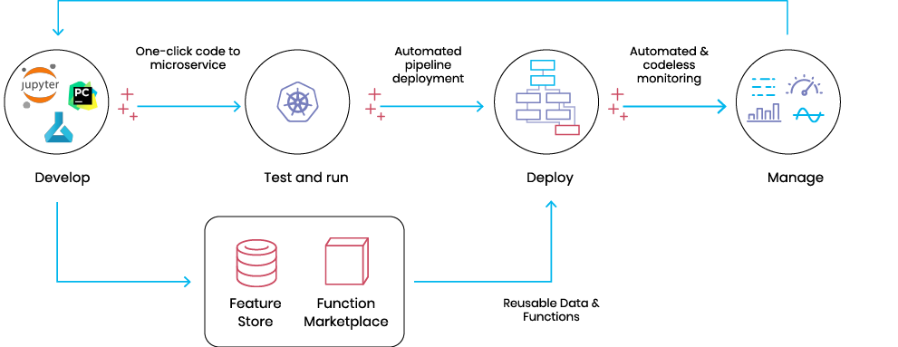
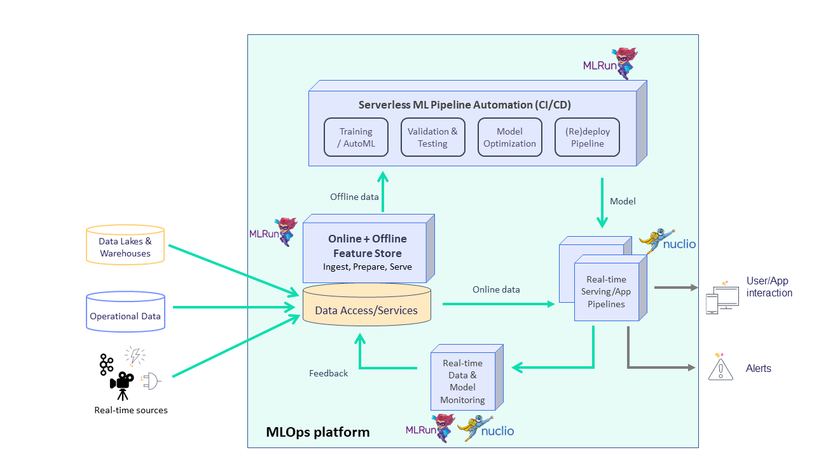

(mlrun-architecture)=

# MLRun architecture

MLRun started as a community effort to map the different components in the ML project lifecycle, provide a common metadata layer, and automate the operationalization process (a.k.a MLOps).
 
Instead of a siloed, complex, and manual process, MLRun enables production pipeline design using a modular strategy, 
where the different parts contribute to a continuous, automated, and far simpler path from research and development to scalable 
production pipelines without refactoring code, adding glue logic, or spending significant efforts on data and ML engineering.

MLRun uses **Serverless Function** technology: write the code once, using your preferred development environment and 
simple "local" semantics, and then run it as-is on different platforms and at scale. MLRun automates the build process, execution, 
data movement, scaling, versioning, parameterization, output tracking, CI/CD integration, deployment to production, monitoring, and more. 

Those easily developed data or ML "functions" can then be published or loaded from a hub and used later to form offline or real-time 
production pipelines with minimal engineering efforts.

 

## MLRun deployment

MLRun has two main components, the service and the client (SDK):

- The MLRun service runs over Kubernetes (can also be deployed using local Docker for demo and test purposes). It can orchestrate and integrate with other open source frameworks, as shown in the following diagram. 
- The MLRun client SDK is installed in your development environment and interacts with the service using REST API calls. 

 

## MLRun: an integrated and open approach

Data preparation, model development, model and application delivery, and end to end monitoring are tightly connected: 
they cannot be managed in silos. This is where MLRun MLOps orchestration comes in. ML, data, and DevOps/MLOps teams 
collaborate using the same set of tools, practices, APIs, metadata, and version control.

MLRun provides an open architecture that supports your existing development tools, services, and practices through an open API/SDK and pluggable architecture. 

<b>MLRun simplifies & accelerates the time to production !</b>

  

While each component in MLRun is independent, the integration provides much greater value and simplicity. For example:
- The training jobs obtain features from the feature store and update the feature store with metadata, which will be used in the serving or monitoring.
- The real-time pipeline enriches incoming events with features stored in the feature store. It can also use feature metadata (policies, statistics, schema, etc.) to impute missing data or validate data quality.
- The monitoring layer collects real-time inputs and outputs from the real-time pipeline and compares them with the features data/metadata from the feature store or model metadata generated by the training layer. Then, it writes all the fresh production data back to the feature store so it can be used for various tasks such as data analysis, model retraining (on fresh data), and model improvements.

When one of the components detailed above is updated, it immediately impacts the feature generation, the model serving pipeline, and the monitoring. MLRun applies versioning to each component, as well as versioning and rolling upgrades across components.

