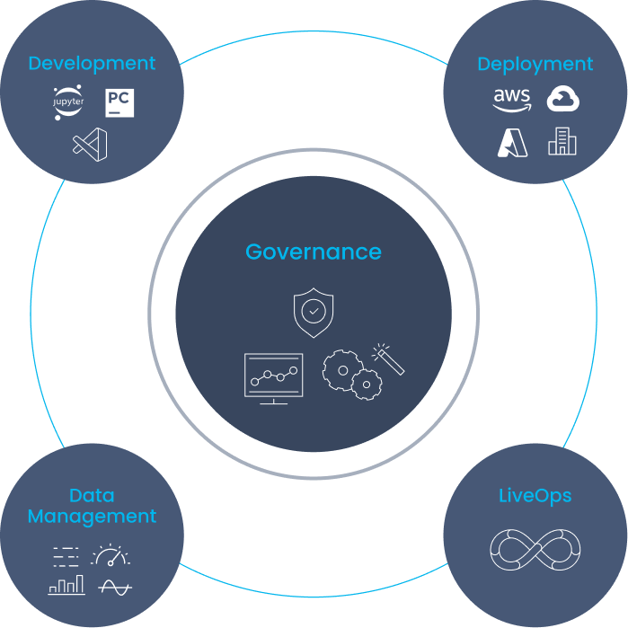
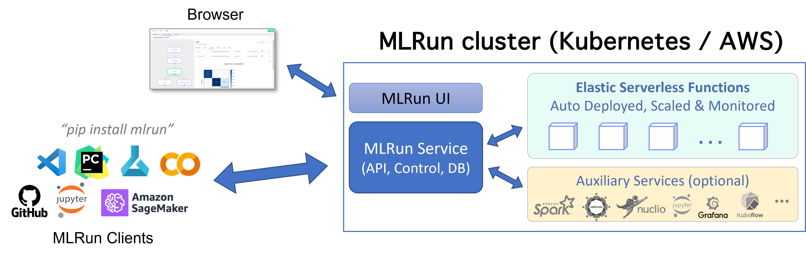

(mlrun-architecture)=

# MLRun architecture

Instead of a siloed, complex, and manual process, MLRun enables production pipeline design using a modular strategy, where the different parts contribute to a continuous, automated, and far simpler path from research and development to scalable production pipelines without refactoring code, adding glue logic, or spending significant efforts on data and ML engineering. **MLRun simplifies and accelerates the time to production.**

MLRun uses **Serverless Function** technology: write the code once, using your preferred development environment and 
simple "local" semantics, and then run it as-is on different platforms and at scale. MLRun automates the build process, execution, 
data movement, scaling, versioning, parameterization, output tracking, CI/CD integration, deployment to production, monitoring, and more. 

Those easily developed data or ML "functions" can then be published or loaded from a hub and used later to form offline or real-time 
production pipelines with minimal engineering efforts.

 

**In this section**
- [MLRun deployment](#mlrun-deployment)
- [MLRun - an integrated and open approach](#mlrun---an-integrated-and-open-approach)
- [Gen AI support](#gen-ai-support)
- [Machine learning support](#machine-learning-support)
- [MLRun non-root user support](#mlrun-non-root-user-support)

## MLRun deployment

MLRun has two main components, the service and the client (SDK):

- The MLRun service runs over Kubernetes (can also be deployed using local Docker for demo and test purposes). It can orchestrate and integrate with other open source frameworks, as shown in the following diagram. 
- The MLRun client SDK is installed in your development environment and interacts with the service using REST API calls. 

 

## MLRun - an integrated and open approach

Data preparation, model development, model and application delivery, and end to end monitoring are tightly connected: 
they cannot be managed in silos. This is where MLRun AI orchestration comes in. Gen AI, ML, data, and DevOps/MLOps teams 
collaborate using the same set of tools, practices, APIs, metadata, and version control.

MLRun provides an open architecture that supports your existing development tools, services, and practices through an open API/SDK and pluggable architecture. 

While each component in MLRun is independent, the integration provides much greater value and simplicity. For example:
- Training jobs log models, datasets, and metadata as versioned artifacts, which are then referenced directly by serving and monitoring pipelines.
- The real-time pipeline retrieves artifacts and data from the artifact store — such as preprocessing logic, embeddings, or model metadata — to enrich and validate incoming requests before inference.
- The monitoring layer collects real-time inputs and outputs from the serving pipeline and compares them against the original training data and model metadata. It logs fresh production data as new artifacts, which can be used for data analysis, model retraining, and continuous improvement.

When one of the components detailed above is updated, it immediately impacts the feature generation, the model serving pipeline, and the monitoring. MLRun applies versioning to each component, as well as versioning and rolling upgrades across components.

## Gen AI support

MLRun supports the full gen AI lifecycle, from raw data to production-grade LLM applications. It automates the pipeline for collecting and preparing unstructured data — text, images, audio — using LLMs to transform it into structured, analyzable form. Vector databases integrate directly into MLRun pipelines to enrich inference requests with relevant context, enabling patterns like RAG (Retrieval-Augmented Generation), with experiment tracking for document-based models via the LangChain API.

On the model side, MLRun supports fine-tuning LLMs on your own data, evaluating model quality, and serving any model — including pretrained Hugging Face models, OpenAI-compatible endpoints, and custom classes — as part of a scalable real-time inference pipeline. For GPU-intensive workloads, it provides built-in optimization techniques: quantization, FlashAttention, async request processing, batching, multi-GPU distribution, and CPU offloading for non-model tasks.

Once in production, MLRun monitors model and operational performance, detects concept and data drift, and can trigger automated retraining. Alerts notify teams via Slack, Git, or webhook. Guardrails can be embedded directly in the serving pipeline to filter toxic, biased, or hallucinated outputs.

A typical gen AI application uses multiple models across the flow — for instance, a lightweight model for input validation alongside a larger LLM for generation. MLRun's [function hub](https://www.mlrun.org/hub/functions) provides reusable, production-ready functions for each stage.

## Machine learning support

MLRun supports the full machine learning lifecycle, from raw data to production-grade models. It automates data ingestion and preparation pipelines that handle cleaning, imputing, encoding, and aggregating structured data, as well as converting unstructured formats — text, JSON, image, audio — into tabular or vector representations suitable for ML algorithms.

On the model side, MLRun runs training jobs at scale across distributed compute, with automatic tracking of every experiment's inputs, parameters, metrics, and outputs as versioned artifacts. It supports hyperparameter tuning, model evaluation, and automated selection across algorithms and frameworks. Trained models and their associated metadata are stored in a versioned model registry and can be loaded directly into batch or real-time serving pipelines. Production deployment uses Nuclio serverless functions to build scalable, auto-scaling inference pipelines that handle data validation, model serving, and application integration logic.

Once in production, MLRun monitors model performance and detects concept and data drift, triggering automated retraining pipelines when needed. Alerts notify teams via Slack, Git, or webhook when quality thresholds are breached. Pipelines can be triggered automatically on code changes, data updates, or detected drift — keeping models current without manual intervention.

A typical ML application chains multiple pipeline steps — data ingestion, preprocessing, training, evaluation, and deployment — each running as an independent, versioned function. MLRun's [function hub](https://www.mlrun.org/hub/functions) provides reusable, production-ready functions for each stage.

## MLRun non-root user support

By default, MLRun assigns the root user to MLRun runtimes and pods. You can improve the security context by changing the security mode, which is implemented by Iguazio during installation, and applied system-wide:

- **Override**: Use the user id of the user that triggered the current run or use the nogroupid for group id. Requires Iguazio v3.5.1 and higher.
- **Disabled**: Security context is not auto applied (the system applies the root user). (default)

See also {ref}`images-usage`.