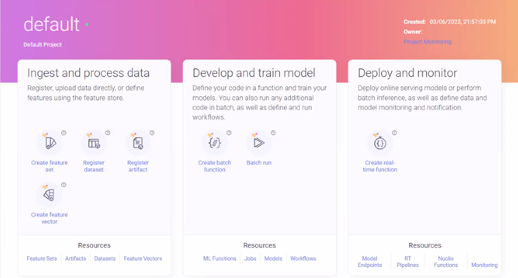

(change-log)=
# Change log
- [v1.6.4](#v1-6-4-30-june-2024) | [v1.6.3](#v1-6-3-4-june-2024)  | [v1.6.2](#v1-6-2-29-march-2024) | [v1.6.1](#v1-6-1-29-february-2024) | [v1.6.0](#v1-6-0-22-february-2024)
- [v1.5.2](#v1-5-2-30-november-2023) | [v1.5.1](#v1-5-1-2-november-2023) | [v1.5.0](#v1-5-0-23-october-2023)
- [v1.4.1](#v1-4-1-8-august-2023) | [v1.4.0](#v1-4-0-23-july-2023)
- [v1.3.4](#v1-3-4-23-august-2023) | [v1.3.3](#v1-3-3-7-jun-2023) | [v1.3.2](#v1-3-2-4-jun-2023) | [v1.3.1](#v1-3-1-18-may-2023) | [v1.3.0](#v1-3-0-22-march-2023) 
- [v1.2.3](#v1-2-3-15-may-2023) | [v1.2.2](#v1-2-2-8-may-2023) | [v1.2.1](#v1-2-1-8-january-2023) | [v1.2.0](#v1-2-0-1-december-2022)
- [v1.1.3](#v1-1-3-28-december-2022) | [v1.1.2](#v1-1-2-20-november-2022) | [v1.1.1](#v1-1-1-18-october-2022) | [v1.1.0](#v1-1-0-6-september-2022)
- [v1.0.6](#v1-0-6-16-august-2022) | [v1.0.5](#v1-0-5-11-august-2022) | [v1.0.4](#v1-0-4-13-june-2022) | [v1.0.3](#v1-0-3-7-june-2022) | [v1.0.2](#v1-0-2-19-may-2022) | [v1.0.0](#v1-0-0-22-april-2022)
- [Open issues](#open-issues)
- [Limitations](#limitations)
- [Deprecations and removed code](#deprecations-and-removed-code)

## v1.6.4 (30 June 2024)

### UI
| ID       |Description                                                               |
|----------|---------------------------------------------------------------------------|
|ML-6867|Scalability improvement. The artifacts page (artifacts/datasets/models) now displays a maximum of 1000 items. (Use filters to focus the results.) |

###  Closed issues
| ID       |Description                                                               |
|----------|---------------------------------------------------------------------------|
|ML-6770 |Resolved MLRun workers restart when running many workflows that produce artifacts.|
|ML-6795 |Can now upgrade to v1.6.4 when cluster has artifacts that do not have a `key`.|
 
## v1.6.3 (4 June 2024)

### Workflows
| ID       |Description                                                               |
|----------|---------------------------------------------------------------------------|
|ML-3521,5482|Remote/scheduled workflows can now be performed by a project with a source that is contained on the image. See [Scheduling a workflow](../concepts/scheduled-jobs.html#scheduling-a-workflow). Tech Preview. |

### Infrastructure

| ID    |Description                                                                 |
|-------|----------------------------------------------------------------------------|
|ML-5739|MLRun now supports email-like username.|

### Documentation
| ID    |Description                                                               |
|-------|---------------------------------------------------------------------------|
|ML-4620| Updated [Realtime monitoring and drift detection tutorial](../tutorials/05-model-monitoring.html) and {ref}`model-monitoring-overview` for the [model monitoring](#model-monitoring) feature introduced in v1.6.0.|
|NA     | New {ref}`genai_01_basic_tutorial` tutorial.|
|NA     | New sections describing gen AI tasks: {ref}`genai-flow`, {ref}`genai-data-mgmt`, {ref}`genai-development`, {ref}`genai-deployment`.
|NA     | New page describing {ref}`log-artifacts`.                                 |
|NA     | New page describing {ref}`parallel-workflows`.                                 |
|NA     | New page describing {ref}`conditional-workflow`.                                 |
|NA     | New page describing {ref}`exithandler-workflow`.                                 |

### Breaking change
| ID          |Description                                                               |
|-------|---------------------------------------------------------------------------|
|ML-6098|The `prediction` and `named_predictions` columns (list of all predictions) were removed from the model monitoring parquet files. Each prediction is still available in a column of its own.|

###  Closed issues

| ID       |Description                                                               |
|----------|---------------------------------------------------------------------------|
|ML-4149|UI: Workflows are now listed from newest to oldest.|
|ML-5763|The log formatter options can now be changed by an env var.|
|ML-5772|Resolved: "Projects" screen/counters may show "N/A" or "MySQL server has gone away" transient error.|
|ML-5776|Concurrent request to project deletion now do not fail.|
|ML-6000|Improved MLRun startup time on system with large number of runs.|
|ML-6026|Remote workflows using a large image no longer time-out.|
|ML-6045|UI: User-filters return all of the matching users.|
|ML-6048|UI: An admin user can now change its role in the project. |  
|ML-6051|UI: After an admin user deletes itself from a project, the user is redirected.|
|ML-6188|If a workflow runner pod fails due to an application error, an immediate response returns the error (and not that the workflow does not exist).|
|ML-6194|When running workflows with a remote engine, functions files are not synced instead they are loaded dynamically during runtime.|
|ML-6317|Reduced MLRun memory consumption.|
|ML-6384|Improved resource consumption of list runs with partitioning query |
|ML-6397|Artifacts are no longer stored in the run body in the DB, instead a map of artifact keys to URIs is maintained.|
|ML-6489|Resolved jobs transient failures with error 'ClientOSError(104, 'Connection reset by peer')'.|

## v1.6.2 (29 March 2024)

###  Closed issues
| ID          |Description                                                               |
|----------|---------------------------------------------------------------------------|
|ML-5808|Fix selecting the project-owner user.|
|ML-5907|"Invite New Members" now returns the full list of users when there are 100+ users in system.|
|ML-5749, 6037|After the user removes ownership of the currently displayed project, the UI redirects to the Projects page.|
|ML-5977|The 'Members' tab in Project settings is now shown for groups with admin privileges.|

## v1.6.1 (29 February 2024)

###  Closed issue
| ID          |Description                                                               |
|----------|---------------------------------------------------------------------------|
|ML-5799|The artifact `db_key` is not overwritten after upgrade.|

## v1.6.0 (22 February 2024)

### Data store
| ID |Description                                                                                         |
|----|-----------------------------------------------------------------------------------------------------|
|ML-3618|Integrate MLflow: seamlessly integrate and transfer logs from MLflow to MLRun. Tech Preview. See [MLflow tracker tutorial](../tutorials/mlflow.html). |
|ML-4343|Datastore profiles (for managing datastore credentials) now support Azure, DBFS, GCS, Kafka, and S3. See [Using data store profiles](../store/datastore.html#using-data-store-profiles).|

### Feature store
| ID     |Description                                                                                         |
|---------|-----------------------------------------------------------------------------------------------------|
|ML-4622|Feature set and feature vector APIs are now class methods. See examples in {ref}`feature-sets` and {ref}`create-use-feature-vectors`.| 
|ML-5109|You can set `min_replicas` and `max_replicas` for `KafkaSource`. See [Consumer function configuration](../serving/graph-ha-cfg.html#consumer-function-configuration).|

### Model monitoring 
| ID     |Description                                                                                         |
|---------|-----------------------------------------------------------------------------------------------------|
|ML-4620|Model monitoring is now based on monitoring apps that are run on a set of model end-points, see {ref}`model-monitoring-overview`. The Grafana Model Monitoring Applications dashboard now includes charts and KPIs that are relevant to a specific monitoring application (under a specific model endpoint). The graphs are: Draft status by category, Average drift value result, Latest result, Application summary, Result value by time, Drift detection history. See [Model Monitoring Applications dashboard](../model-monitoring/monitoring-models.html#model-monitoring-applications-dashboard).|

### Runtimes

| ID           | Description                                                                                                                                                                                                                        |
|--------------|------------------------------------------------------------------------------------------------------------------------------------------------------------------------------------------------------------------------------------|
| ML-3379,4997 | New `state_thresholds` used to identify pod status and abort a run. See [Preventing stuck pods](../runtimes/configuring-job-resources.html#preventing-stuck-pods) and {py:meth}`~mlrun.runtimes.DaskCluster.set_state_thresholds`. 
| ML-3728      | Labels added to pods that are running as part of KFP to facilitate monitoring. [View in Git](https://github.com/mlrun/mlrun/pull/4485/).                                                                                           |
| ML-4032      | You can now disable the automatic HTTP trigger creation in Nuclio and MLRun. See [Serving/Nuclio triggers](../cheat-sheet.html#serving-nuclio-triggers).                                                                           |
| ML-4182      | Support for notifications on remote pipelines. See [Configuring Notifications For Pipelines](../concepts/notifications.html#configuring-notifications-for-pipelines).                                                              |
| ML-4623      | You can now [Log a Databricks response as an artifact](../runtimes/databricks.html#logging-a-databricks-response-as-an-artifact).                                                                                                  |

### UI
| ID      | Description                                                                                                                                                       |
|---------|-------------------------------------------------------------------------------------------------------------------------------------------------------------------|
| ML-1855 | New **Train Model** wizard.                                                                                                                                       |
| ML-2336 | You can now delete Jobs in the UI (and not just from the SDK).                                                                                                    |
| ML-4506 | You can now delete artifacts, models, and datasets in the UI (and not just from the SDK).                             <br/>                                       |
| ML-4667 | **Project monitoring** is now the default project view. The previous default page is now named **Quick actions**, and is the second tab in the **Projects** page. |
| ML-4916 | You can now add a tag when registering an artifact in the Register Artifact, Register Dataset, and Register Model dialogs.                                        |

### Infrastructure

| ID     |Description                                                                                         |
|---------|-----------------------------------------------------------------------------------------------------|
|ML-3921|The Docker image for installation of mlrun was modified, resulting in better compatibility with external packages.|
|ML-5193|Support for Pandas 2.0.                                                                               |

### Documentation
| ID     | Description                                                                                                                                                                                                                     |
|---------|---------------------------------------------------------------------------------------------------------------------------------------------------------------------------------------------------------------------------------|
|ML-3663| New: How to build a docker image externally using a Dockerfile and then use it. See [Building a docker image using a Dockerfile and using it](../runtimes/images.html#building-a-docker-image-using-a-dockerfile-and-using-it). |
|ML-4048| New: Creating and using a custom function hub. See [Private function hub](../runtimes/load-from-hub.html#private-function-hub).                                                                                                 |
|ML-5260| New: [Load code at runtime using a non-default source](../runtimes/create-and-use-functions.html#load-code-at-runtime-using-a-non-default-source).                                                                              |
|ML-5602, ML-5680| Improved feature store documentation including sources and targets, and partitioning. See {ref}`sources-targets`.                                                                                                               |
|NA| New: {ref}`project-setup`.                                                                                                                                                                                                      |
|NA| Improved serving function example, and new example of a serving function with Git integration. See {ref}`serving-function`.                                                                                                     

### Breaking Changes
| ID     |Description                                                                                         |
|---------|-----------------------------------------------------------------------------------------------------|
|ML-4741 | The default `target_dir` path of `with_source_archive` is now `/home/mlrun_code`. It was previously `/tmp`, which could be randomly deleted. If you are running a Spark job, and cloning the git repo, with mlrun <1.6.0, run `sj.with_source_archive(source=project.source, pull_at_runtime=False)`, then run: `sj.spec.image_pull_policy = "Always"`, `sj.spec.build.commands = ["mkdir -p /mlrun"]`, `sj.with_source_archive(source=project.source, pull_at_runtime=False, target_dir="/mlrun")`|

###  Closed issues
| ID          |Description                                                               |
|----------|---------------------------------------------------------------------------|
|ML-1373|Incorrect service names do not result in stuck pods during ContainerCreating.|
|ML-1835|The index record is not duplicated in the datasets metadata. | 
|ML-3714|Runs that complete successfully do not show errors in Kubeflow. |
|ML-3856|Documentation: Add how to update a feature set with appending ingestion (and not create a new FS on every ingest). See [Ingest data locally](../data-prep/ingest-data-fs.html#ingest-data-locally).|
|ML-4093|Documentation: Improved description of [handlers](../runtimes/create-and-use-functions.html#using-set-function) and {ref}`functions`. |
|ML-4370|Hyper-param and single runs no longer generate artifacts with the same name. |
|ML-4563|Local jobs can now be aborted in the UI. |
|ML-4613|UI: Fixed the map type hint in the Batch Inference Parameters. |
|ML-4642|The UI no longer gets stuck when there is a high number of query results. | 
|ML-4678|When tagging a specific version of a model using the SDK, it does not clear the tags from the rest of the versions.|
|ML-4690|Enabling the Spark event log (sj.spec.spark_conf["spark.eventLog.enabled"] = True) no longer causes the job to fail. |
|ML-4920|Documentation: improve description of `log_artifact`. See {ref}`artifacts` and {py:meth}`~mlrun.projects.MlrunProject.log_artifact`.|
|ML-4608|The artifact `db_key` is now forwarded when registering an artifact.|
|ML-4617|Fixed error message when using a feature vector as an input to a job without first calling `get_offline_features` on the vector.|
|ML-4714|Logs are not truncated in the MLRun UI logs page for jobs that have a high number of logs or run for over day.  |
|ML-4922|Preview and Metadata tabs now indicate when there are more columns that are not displayed.|
|ML-4967|The **Deploy** button in the **Project > Models** page now creates a new endpoint/serving function.|
|ML-4992|Fixed starting a spark job from source archive (using `with_source_archive()`).|
|ML-5001|The **Monitoring workflows** page now states that it includes only workflows that have already been run. | 
|ML-5042|After creating and deleting a project, a new project cannot be created in the same folder with the same context. |
|ML-5048|UI Edit function dialog: When selecting **Use an existing image** and pressing **Deploy**, the existing image is used, as expected.|
|ML-5078|`project.create_remote()` is no longer dependant on setting `init_git=True` on project creation. | 
|ML-5089|When trying to delete a running job, an error opens that a running job cannot be deleted and it needs to be aborted first.|
|ML-5091|Monitoring does not recreate a deleted run. |                                   |
|ML-5146|Resolved OOM issues by reducing the memory footprint when monitoring runs. |
|ML-5481|You can now use `build_image` using the project source. See the example in [build_image](../projects/run-build-deploy.html#build-image).|
|ML-5576|FeatureSet can now ingest data that contains single quotes.|
|ML-5746|Labels no longer create partial projects that cannot be deleted.|


## v1.5.2 (30 November 2023)

###  Closed issues
| ID          |Description                                                               |
|----------|---------------------------------------------------------------------------|
|ML-4960|Fixed browser caching so the **Members** tab is always presented for projects.|


## v1.5.1 (2 November 2023)

###  Closed issues
| ID          |Description                                                               |
|----------|---------------------------------------------------------------------------|
|ML-3480|Add details about `label_feature` parameter. See [Creating a feature vector](../feature-store/feature-vectors.html#creating-a-feature-vector).| 
|ML-4839/4844|Running `project.build_image` now always reads the requirements.txt file. |
|ML-4860|Fixed creating and running functions with no parameters from the UI.      |
|ML-4872|Fixed synchronizing functions from project yaml.                          |

## v1.5.0 (23 October 2023)

### Data store
| ID     | Description                                                                                                                                                                                                             |
|----------|-------------------------------------------------------------------------------------------------------------------------------------------------------------------------------------------------------------------------|
|ML-2296| Add ability to manage Redis datastore credentials with datastore profiles. See [Using data store profiles](../store/datastore.html#using-data-store-profiles), [view in Git](https://github.com/mlrun/mlrun/pull/3936). |
|ML-3500| Support for DBFS data store (Databricks file system). See [Databricks file system](../store/datastore.html#databricks-file-system), [view in Git](https://github.com/mlrun/mlrun/pull/3626).                            |

### Feature store
| ID     |Description                                                                                                                                                                                                                                                                                                                  |
|---------|------------------------------------------------------------------------------------------------------------------------------------------------------------------------------------------------------------------------------------------------------------------------------------------------------------------------------|
|ML-3784|Support for feature vector-defined feature-set relations and join-type (per-join). Tech Preview. See [Feature vector with different entities and complex joins](../feature-store/feature-vectors.html#feature-vector-with-different-entities-and-complex-joins) and [view in Git](https://github.com/mlrun/mlrun/pull/3947). |

### Infrastructure
| ID     |Description                                                                                                                                                                                                                                                |
|----------|------------------------------------------------------------------------------------------------------------------------------------------------------------------------------------------------------------------------------------------------------------|
|ML-3370|Accessing the MLRun hub is now available through a service API. This will enable implementing better function version selection and combining hub functions from different sources. Tech Preview. [View in Git](https://github.com/mlrun/mlrun/pull/3384). |
|ML-3644|Support for self-signed docker registries. See [Using self-signed registry](../runtimes/image-build.html#using-self-signed-registry) and [view in Git](https://github.com/mlrun/mlrun/pull/4013).                                                          |
|ML-4132|The `invoke` function can now receive any parameter supported in the `requests.request` method. See [invoke](../api/mlrun.runtimes.html#mlrun.runtimes.RemoteRuntime.invoke) and [view in Git](https://github.com/mlrun/mlrun/pull/3872).                  |
|NA|From v1.5, clients must be running Python 3.9.|


### Runtimes
| ID     |Description                                                                                                                                                                                                                                                        |
|---------|--------------------------------------------------------------------------------------------------------------------------------------------------------------------------------------------------------------------------------------------------------------------|
|ML-3501|Support for running Spark jobs on Databricks cluster. See {ref}`databricks`. [View in Git](https://github.com/mlrun/mlrun/pull/3996).                                                                                                                              |
|ML-3854|Support for webhook notification. See webhook in [Notification Kinds](../concepts/notifications.html#notification-kinds) and [view in Git](https://github.com/mlrun/mlrun/pull/3946).                                                                              |
|ML-4059|Support for adding env vars or secrets to the docker build during runtime. See [Extra arguments](../runtimes/image-build.html#extra-arguments),  {py:meth}`~mlrun.projects.MlrunProject.build_config` and [view in Git](https://github.com/mlrun/mlrun/pull/4013). |


### UI
| ID     |Description                                                                                         |
|---------|-----------------------------------------------------------------------------------------------------|
|ML-2811|New Batch Inference wizard. Tech Preview.                                                           |
|ML-2815|New Batch Run wizard that replaces the previous New job page.                                       |
|ML-3584|The Model Endpoints page now displays the Function Tag.                                             |
|ML-4066|The Online types list of the Target Store now includes Redis.                                       |
|ML-4167|The Projects page now supports downloading the .yaml file. Tech Preview.                          |
|ML-4571|The Model Endpoints page now displays the drift threshold and the drift actual value.               |
|ML-4756|The Recents list in Jobs and Workflows (Projects pane) now displays a maximum of the last 48 hours. |
|ML-4511|You can now change the image and add new requirements (such as `xgboost`) in the Batch Infer wizard.  |

### Documentation
| ID     |Description                                                                                                                                                                        |
|---------|------------------------------------------------------------------------------------------------------------------------------------------------------------------------------------|
|ML-3763|Add description of configuring number of workers per GPU. See updated [Number of workers/GPUs](../runtimes/configuring-job-resources.html#number-of-workers-gpus).                 |
|ML-4420|Add configuration of memory in Spark Operator. See [Spark Operator runtime](../runtimes/spark-operator.html).                                                                      |
|ML-2380|Add details of V3IO and Spark runtime. See [Spark Operator runtime](../runtimes/spark-operator.html) and [Spark3Runtime](../api/mlrun.runtimes.html#mlrun.runtimes.Spark3Runtime). |

### Breaking changes
| ID     |Description                                                                                                                                                                                                                                                                      |
|---------|----------------------------------------------------------------------------------------------------------------------------------------------------------------------------------------------------------------------------------------------------------------------------------|
|ML-3823|The default format of `list projects` returns project names only. You can either get names or projects (`name_only`) and do a `get` only on the specific project you want (preferable), or get the full list (`full`).  [View in Git](https://github.com/mlrun/mlrun/pull/4198). |
|ML-4171|The Redis target implementation changed. Features-sets that use Redis as online targets must be recreated. [View in Git](https://github.com/mlrun/storey/pull/449).                                                                                                              |
|ML-4366|The MLRun images `mlrun/ml-models` and `mlrun/ml-models-gpu` were deprecated and removed. The new image mlrun/mlrun-gpu is added. Additional dependencies must be installed on an as-need basis. See [MLRun images](../runtimes/images.html#mlrun-images).                       |


### Deprecations

See [Deprecations and removed code](#deprecations-and-removed-code).

###  Closed issues
| ID     | Description                                                                   |
|---------|-------------------------------------------------------------------------------|
|ML-1584| Can now run `code_to_function` when filename contains special characters.     |
|ML-2199| Spark operator job does not fail with default requests arguments.             |
|ML-2380| Spark runtime sustains naive user actions.                                    |
|ML-4188| Projects are deleted simultaneously in the backend and the UI.                |
|ML-4212| Pipeline filters that have no results now show the labels.                    |
|ML-4214| Scheduled workflows with "-" in the name are no longer truncated.             |
|ML-4232| User attempts to create a consumer group with "-" now throws an error.        |
|ML-4316| Fixed: `list_runs` fails with `Read timed out`.                               |
|ML-4323| Fixed: pipeline step failed with "Read timed out.: get log"                   |
|ML-4391| Consumer group UI now shows complete details.                                 |
|ML-4501| Fixed: UI  shows error after deleting a function, then viewing a related job. |
|ML-4533| UI: ML functions can now be created with upper-case letters.                  |


## v1.4.1 (8 August 2023)

### Closed issues
| ID     |Description                                            |
|---------|--------------------------------------------------------|
|ML-4303|Archive out-of-sync leader projects.                   |
|ML-4232|Consumer group names cannot include the character "-". |

## v1.4.0 (23 July 2023)

### New and updated features

#### Functions
| ID     |Description                                                                                                                                                                                             |
|---------|---------------------------------------------------------------------------------------------------------------------------------------------------------------------------------------------------------|
|ML-3474|New sub-package in MLRun for packing returning outputs, logging them to MLRun and unpacking inputs, parsing data items to their required type. [View in Git](https://github.com/mlrun/mlrun/pull/3333). |


#### Notifications
| ID   |Description                                                                                                                        |
|-------|------------------------------------------------------------------------------------------------------------------------------------|
|ML-21|Supports job notifications. See full details in {ref}`notifications`, and [View in Git](https://github.com/mlrun/mlrun/pull/2414). |


#### Projects
| ID     |Description                                                                                                                                                                                                                                                                                                                                                                                                                                                                                                                                            |
|---------|--------------------------------------------------------------------------------------------------------------------------------------------------------------------------------------------------------------------------------------------------------------------------------------------------------------------------------------------------------------------------------------------------------------------------------------------------------------------------------------------------------------------------------------------------------|
|ML-3375|Two new APIs in the MlrunProject object, used to build an image directly through project API, without creating a function and building an image for it: `build_config` configures the default build for a given project; `build_image` builds a docker image based on the project configuration. See {py:class}`~mlrun.projects.MlrunProject`, [Image build configuration](../projects/run-build-deploy.html#build_config), [build_image](../projects/run-build-deploy.html#build-image), and [View in Git](https://github.com/mlrun/mlrun/pull/3594). |
|ML-4084|New API to run a setup script to enrich a project, when loading the project. [View in Git](https://github.com/mlrun/mlrun/pull/3809)                                                                                                                                                                                                                                                                                                                                                                                                                   |


#### Serving
| ID     |Description                                                                                                                                                                                                                                                                                                      |
|---------|------------------------------------------------------------------------------------------------------------------------------------------------------------------------------------------------------------------------------------------------------------------------------------------------------------------|
|ML-3654|Updates to `error_handler`: Exceptions are applied to either a graph or a step. In the case of a graph, the graph stops upon an error. In the case of a step, the graph can either stop or complete upon an error. See {ref}`pipelines-error-handling`. [View in Git](https://github.com/mlrun/mlrun/pull/3390). |

#### UI 

| ID     |Description                                                                                                                                                                                                                           |
|---------|---------------------------------------------------------------------------------------------------------------------------------------------------------------------------------------------------------------------------------------|
|ML-1248|The engine type now displays in the **Feature Set Overview** tab.                                                                                                                                                                     |
|ML-2083|The **Run on spot** value now displays in the **Jobs Overview** tab.                                                                                                                                                                  |
|ML-3176|The new **Passthrough** button in the Create Feature Set enables [creating a feature set without ingesting its data](../feature-store/feature-sets.htm#create-a-feature-set-without-ingesting-its-data), previously supported by SDK. |
|ML-3549|The new **Resource monitoring** button in the **Jobs Details** view opens the **Grafana** dashboard.                                                                                                                                  |
|ML-3551|Nested workflows (`ParallelFor`) now fully display in UI.                                                                                                                                                                             |
|ML-2922|The **Artifacts**, **Datasets** and **Models** pages have an improved filter. Enhanced look and feel in tables.                                                                                                                       |


#### Documentation
| ID     |Description                                                                                                                                                                                                                                                  |
|---------|--------------------------------------------------------------------------------------------------------------------------------------------------------------------------------------------------------------------------------------------------------------|
|ML-3548|Passing parameters between steps using the `outputs` parameter is now described in [Write a pipeline](../projects/build-run-workflows-pipelines.html#write-a-pipeline).                                                                                      |
|ML-3763|The relationship between GPUs and remote functions is now explained in [Number of GPUs](../runtimes/configuring-job-resources.html#number-of-gpus) and [Example of Nuclio function](../concepts/nuclio-real-time-functions.html#example-of-nuclio-function). |


#### New documentation pages
- {ref}`git-repo-as-hub`
- {ref}`ci-cd-automate`


### Breaking changes
| ID     |Description                                                                                                                                                                                                                                                                                                                                                                                                                                                                                                                                                                                                                                                     |
|---------|-----------------------------------------------------------------------------------------------------------------------------------------------------------------------------------------------------------------------------------------------------------------------------------------------------------------------------------------------------------------------------------------------------------------------------------------------------------------------------------------------------------------------------------------------------------------------------------------------------------------------------------------------------------------|
|ML-3733|`mlrun.get_run_db().list_model_endpoints()` returns `list`. Previously, it returned `mlrun.api.schemas.model_endpoints.ModelEndpointList`.                                                                                                                                                                                                                                                                                                                                                                                                                                                                                                                      |
|ML-3773|The aggregation mechanism on Redis databases has improved, but the history of the aggregation (from before the upgrade) is lost, as if there were 0 events during that period.                                                                                                                                                                                                                                                                                                                                                                                                                                                                                  |
|ML-4053|Pre-v1.4.0: When logging artifacts during a runtime (regular artifacts, not models (ModelArtifact via context.log_model) or datasets (DatasetArtifact via context.log_dataset)), they were strings in the RunObject outputs property. The strings were the target path to the file logged in the artifact. From v1.4.0, they are the store path of the artifact, and not the target path. (They now appear the same as the store paths for logging models and datasets.) This is breaking behavior only if you use the output of the run object as a parameter to another runtime and not as an input. [View in Git](https://github.com/mlrun/mlrun/pull/3333). |

```
 # Set 2 functions:
func1 = project.set_function(...)
func2 = project.set_function(...)

# Run the first function:
run1 = func1.run(...)
# In the function  `func1` we logged a model "my_model" and an artifact "my_artifact"
run1.outputs  
{
    "my_model": "store://...",
    "my_artifact": "store://...",  # Instead of target path: "/User/.../data.csv"
}

# The function `func2` expects a `DataItem` for the logged artifact so passing it through inputs will work as `DataItem` can work with store paths:
run2 = func2.run(..., inputs={"artifact": run1.outputs["my_artifact"]})

# But passing it through a parameter won't work as the string value is now a store path and not a target path:
run2 = func2.run(..., params={"artifact": run1.outputs["my_artifact"]})
```
### Deprecations and future deprecations
See [Deprecations and removed code](#deprecations-and-removed-code).

### Closed issues

| ID     | Description                                                                                                                                                                                                                                                                                            |
|---------|--------------------------------------------------------------------------------------------------------------------------------------------------------------------------------------------------------------------------------------------------------------------------------------------------------|
|ML-1787| Optimized distribution of load between chief and workers so that heavy loads do not cause restart of kubelet. [View in Git](https://github.com/mlrun/mlrun/pull/1780).                                                                                                                                 |
|ML-2773| Reduced memory footprint for feature vector that joins data from multiple feature sets. [View in Git](https://github.com/mlrun/mlrun/pull/2569).                                                                                                                                                       |
|ML-3166| New error message when `load_project` uses an invalid URL source. [View in Git](https://github.com/mlrun/mlrun/pull/3278).                                                                                                                                                                             |
|ML-3420| Fix artifacts corruption due to overflowing size. [View in Git](https://github.com/mlrun/mlrun/pull/3577).                                                                                                                                                                                             |
|ML-3443| Spark ingestion engine now supports more than 2 keys in online target. Tech Preview. [View in Git](https://github.com/mlrun/mlrun/pull/3379).                                                                                                                                                          |
|ML-3470| Changes in secrets are now recorded in the  audit log of the platform. [View in Git](https://github.com/mlrun/mlrun/pull/3711).                                                                                                                                                                        |
|ML-3508| Improved description of list_runs. See {py:class}`~mlrun.projects.MlrunProject.list_runs` [View in Git](https://github.com/mlrun/mlrun/pull/3686).                                                                                                                                                     |
|ML-3621| `clear_context()` now does not delete content if the path is relative; and if a subpath exists, only the sub dir is deleted/cleared. [View in Git](https://github.com/mlrun/mlrun/pull/3689).                                                                                                          |
|ML-3631| MLRun now successfully pulls the source code from GitLab with a personal access token. [View in Git](https://github.com/mlrun/mlrun/pull/3927).                                                                                                                                                        |
|ML-3633| Fix parsing of date fields when importing a context from dict. [View in Git](https://github.com/mlrun/mlrun/pull/3308).                                                                                                                                                                                |
|ML-3652| V3IO_API is now inferred from the DBPATH. [View in Git](https://github.com/mlrun/mlrun/pull/3422).                                                                                                                                                                                                     |
|ML-3703| `project.set_secrets()` now throws a `file not found` exception if the file does not exist. [View in Git](https://github.com/mlrun/mlrun/pull/3549).                                                                                                                                                   |
|ML-3713| Users can now use pipeline parameters in the spec of jobs created within the workflow python file without causing run failure. [View in Git](https://github.com/mlrun/mlrun/pull/3812).                                                                                                                |
|ML-3761| \**kwargs now forward as expected in MLRun jobs and hyper params. [View in Git](https://github.com/mlrun/mlrun/pull/3533).                                                                                                                                                                             |
|ML-3782| The (incorrect) naming of features causes error when getting the feature vector from the online feature service. The fix is an additional restriction in feature names. See [Aggregations](./feature-store/transformations.html#aggregations) [View in Git](https://github.com/mlrun/storey/pull/440). |
|ML-3806| Mismatch errors now printed when ingesting from Kafka into offline target. In case of errors (due to type mismatch) no errors are printed.[View in Git](https://github.com/mlrun/storey/pull/446).                                                                                                     |
|ML-3847| `add_code_metadata` now prints error messages when working with git [View in Git](https://github.com/mlrun/mlrun/pull/3810).                                                                                                                                                                           |
|ML-3900| Improved error message when ingesting into a feature set (online target) and no features found on retrieval. [View in Git](https://github.com/mlrun/mlrun/pull/3687).                                                                                                                                  |
|ML-4129| Errors from BigQuerySource are now forwarded to MLRun. [View in Git](https://github.com/mlrun/mlrun/pull/3887).                                                                                                                                                                                        |

## v1.3.4 (23 August 2023)

### Closed issues

| ID     |Description                                                                    |
|---------|--------------------------------------------------------------------------------|
|ML-4409|Importing a project.yaml now does not overwrite the artifacts with older tags. |

## v1.3.3 (7 Jun 2023)

### Closed issues

| ID     |Description                                                                                                                |
|---------|----------------------------------------------------------------------------------------------------------------------------|
|ML-3940 |MLRun does not initiate log collection for runs in aborted state. [View in Git](https://github.com/mlrun/mlrun/pull/3698). |

## v1.3.2 (4 Jun 2023)

### Closed issues

| ID     |Description                                                                                                             |
|---------|-------------------------------------------------------------------------------------------------------------------------|
|ML-3896|Fixed: MLRun API failed to get pod logs. [View in Git](https://github.com/mlrun/mlrun/pull/3649).                       |
|ML-3865|kubectl now returns logs as expected. [View in Git](https://github.com/mlrun/mlrun/pull/3660).                          |
|ML-3917|Reduced number of logs. [View in Git](https://github.com/mlrun/mlrun/pull/3674).                                        |
|ML-3934|Logs are no longer collected for run pods in an unknown state. [View in Git](https://github.com/mlrun/mlrun/pull/3690). |

## v1.3.1 (18 May 2023)

### Closed issues

| ID     |Description                                                                                                                                                       |
|---------|-------------------------------------------------------------------------------------------------------------------------------------------------------------------|
|ML-3764|Fixed the scikit-learn to 1.2 in the tutorial 02-model-training. (Previously pointed to 1.0.) [View in Git](https://github.com/mlrun/mlrun/pull/3437).            |
|ML-3794|Fixed a Mask detection demo notebook (3-automatic-pipeline.ipynb). [View in Git](https://github.com/mlrun/demos/releases/tag/v1.3.1-rc6).                         |
|ML-3819|Reduce overly-verbose logs on the backend side. [View in Git](https://github.com/mlrun/mlrun/pull/3531). [View in Git](https://github.com/mlrun/mlrun/pull/3553). |
|ML-3823|Optimized `/projects` endpoint to work faster. [View in Git](https://github.com/mlrun/mlrun/pull/3560).                                                           |

### Documentation
New sections describing [Git best practices](../projects/git-best-practices.html) and an example [Nuclio function](../concepts/nuclio-real-time-functions.html#example-of-nuclio-function).

## v1.3.0 (22 March 2023)

### Client/server matrix, prerequisites, and installing

The MLRun server is now based on Python 3.9. It's recommended to move the client to Python 3.9 as well. 

MLRun v1.3.0 maintains support for mlrun base images that are based on python 3.7. To differentiate between the images, the images based on
python 3.7 have the suffix: `-py37`. The correct version is automatically chosen for the built-in MLRun images according to the Python version of the MLRun client (for example, a 3.7 Jupyter gets the `-py37` images).

MLRun v1.3.x maintains support for mlrun base images that are based on a python 3.7 environment. To differentiate between the images, the images based on
python 3.7 have the suffix: `-py37`. The correct version is automatically chosen for the built-in MLRun images according to the Python version of the MLRun client (for example, a 3.7 Jupyter gets the `-py37` images).

For a Python 3.9 environment see [Set up a Python 3.9 client environment](../install/remote.html#set-up-a-python-3-9-client-environment).

#### Set up a Python 3.7 client environment (Iguazio versions up to and including v3.5.2) 

```{admonition} Note
There is a known bug with nbformat on the Jupyter version in Iguazio up to and including v3.5.2, 
which requires upgrading nbformat to 5.7.0. When using an older nbformat, some Jupyter Notebooks do not open.
```

To install on a **Python 3.7** environment (and optionally upgrade to python 3.9 environment):
  
1. Configure the Jupyter service with the env variable `JUPYTER_PREFER_ENV_PATH=false`.
2. Within the Jupyter service, open a terminal and update conda and pip to have an up-to-date pip resolver.

```
$CONDA_HOME/bin/conda install -y conda=23.1.0 	
$CONDA_HOME/bin/conda install -y 'pip>=22.0'
$CONDA_HOME/bin/conda install -y nbformat=5.7.0
```
3. If you want to upgrade to a Python 3.9 environment, create a new conda env and activate it:
```
conda create -n python39 python=3.9 ipykernel -y
conda activate python39
```
4. Install mlrun:
```
./align_mlrun.sh
```
    
### New and updated features

#### Feature store


| ID     |Description                                                                                                                                                                                                                                                                                                                                       |
|---------|---------------------------------------------------------------------------------------------------------------------------------------------------------------------------------------------------------------------------------------------------------------------------------------------------------------------------------------------------|
|ML-2592|Offline data can be registered as feature sets (Tech Preview). See [Create a feature set without ingesting its data](../feature-store/feature-sets.html#create-a-feature-set-without-ingesting-its-data).                                                                                                                                         |
|ML-2610|Supports SQLSource for batch ingestion (Tech Preview). See [SQL data source](../data-prep/ingest-data-fs.html#sql-data-source).                                                                                                                                                                                                                   |
|ML-2610|Supports SQLTarget for storey engine (Tech Preview). (Spark is not yet supported.) See [SQL target store](../data-prep/ingest-data-fs.html#sql-target-store).                                                                                                                                                                                     |
|ML-2709|The Spark engine now supports the steps: `MapValues`, `Imputer`, `OneHotEncoder`, `DropFeatures`; and supports extracting the time parts from the date in the `DateExtractor` step. See [Data transformations](../serving/available-steps.html#data-transformations).                                                                             |
|ML-2802|`get_offline_features` supports Spark Operator and Remote Spark.                                                                                                                                                                                                                                                                                  |
|ML-2957|The username and password for the RedisNoSqlTarget are now configured using secrets, as `<prefix_>REDIS_USER <prefix_>REDIS_PASSWORD` where \<prefix> is the optional RedisNoSqlTarget `credentials_prefix` parameter. See [Redis target store](../data-prep/ingest-data-fs.html#redis-target-store).                                             |
|ML-3008|Supports Spark using Redis as an online KV target, which caused a [breaking change](#breaking-changes).                                                                                                                                                                                                                                           |
|ML-3373|Supports creating a feature vector over several feature sets with different entities. (Outer joins are Tech Preview.) See [Using an offline feature vector](../feature-store/feature-vectors.html#using-an-offline-feature-vector). This API will change in a future release, moving the relationship from the feature set to the feature vector. |

#### Logging data
| ID     |Description                                                                                                                                                                                                                                                                                                                                                                |
|---------|----------------------------------------------------------------------------------------------------------------------------------------------------------------------------------------------------------------------------------------------------------------------------------------------------------------------------------------------------------------------------|
|ML-2845|Logging data using `hints`. You can now pass data into MLRun and log it using log hints, instead of the decorator. This is the initial change in MLRun to simplify wrapping usable code into MLRun without having to modify it. Future releases will continue this paradigm shift. See [more details](../cheat-sheet.html#track-returning-values-using-hints-and-returns). |


#### Projects

| ID     |Description                                                                                                                                                                        |
|---------|------------------------------------------------------------------------------------------------------------------------------------------------------------------------------------|
|ML-3048|When defining a new project from scratch, there is now a default `context` directory: \"`./`". This is the directory from which the MLRun client runs, unless otherwise specified.|

#### Serving graphs

| ID     |Description                                                                                                                                                                                                                                     |
|---------|-------------------------------------------------------------------------------------------------------------------------------------------------------------------------------------------------------------------------------------------------|
|ML-1167|Add support for graphs that split and merge (DAG), including a list of steps for the `after` argument in the `add_step()` method. See [Graph that splits and rejoins](../serving/model-serving-get-started.html#graph-that-splits-and-rejoins). |
|ML-2507|Supports configuring of consumer group name for steps following QueueSteps. See [Queue (streaming)](../serving/model-serving-get-started.html#queue-streaming).                                                                                 |


#### Storey 

| ID     |Description                                                                                                                                                                                                                                                                                                   |
|---------|---------------------------------------------------------------------------------------------------------------------------------------------------------------------------------------------------------------------------------------------------------------------------------------------------------------|
|ML-2502|The event time in storey events is now taken from the `timestamp_key`. If the `timestamp_key` is not defined for the event, then the time is taken from the processing-time metadata. [View in Git](https://github.com/mlrun/mlrun/pull/2660), and in [Storey git](https://github.com/mlrun/storey/pull/394). |
 

#### UI 

| ID     |Description                                                                                                                                                                                                                                                                                                                                                                                     |
|---------|-------------------------------------------------------------------------------------------------------------------------------------------------------------------------------------------------------------------------------------------------------------------------------------------------------------------------------------------------------------------------------------------------|
|ML-1186|The new **Projects** home page provides easy and intuitive access to the full project lifecycle in three phases, with links to the relevant wizards under each phase heading: ingesting and processing data, developing and training a model, deploying and monitoring the project. <p align="center"></p><br> |
| NA     |[UI change log in GitHub](https://github.com/mlrun/ui/releases/tag/v1.3.0)                                                                                                                                                                                                                                                                                                                      |


#### APIs 

| ID     |Description                                                                                                                                                                        |
|---------|------------------------------------------------------------------------------------------------------------------------------------------------------------------------------------|
|ML-3104|These APIs now only return reasons in kwargs: `log_and_raise`, `generic_error_handler`, `http_status_error_handler`.                                                               |
|ML-3204|New API `set_image_pull_configuration` that modifies `func.spec.image_pull_secret` and `func.spec.image_pull_policy`, instead of directly accessing these values through the spec. |
 
#### Documentation

Improvements to [Set up your environment](../install/remote.html).


#### Infrastructure improvements 

| ID     |Description                                                                                                                                                                                                                                                                                                                                                                                                                                 |
|---------|---------------------------------------------------------------------------------------------------------------------------------------------------------------------------------------------------------------------------------------------------------------------------------------------------------------------------------------------------------------------------------------------------------------------------------------------|
|ML-2609 |MLRun server is based on Python 3.9.                                                                                                                                                                                                                                                                                                                                                                                                        |
|ML-2732|The new log collection service improves the performance and reduces heavy IO operations from the API container. The new MLRun log collector service is a gRPC server, which runs as sidecar in the mlrun-api pod (chief and worker). The service is responsible for collecting logs from run pods, writing to persisted files, and reading them on request. The new service is transparent to the end-user: there are no UI or API changes. |

### Breaking changes 


- The behavior of ingest with aggregation changed in v1.3.0 (storey, spark, pandas engines). Now, when you ingest a "timestamp" column, it returns <br>
`<class 'pandas._libs.tslibs.timestamps.Timestamp'>`. <br>Previously, it returned `<class 'str'>`
- Any target data that was saved using Redis as an online target with storey engine (RedisNoSql target, introduced in 1.2.1) is not accessible after upgrading to v1.3. (Data ingested subsequent to the upgrade is unaffected.)


<a id="api-130"></a>
### Deprecated and removed APIs
Starting with v1.3.0, and continuing in subsequent releases, obsolete functions are getting removed from the code. See [Deprecations and removed code](#deprecations-and-removed-code).

### Closed issues

| ID            | Description                                                                                                                                                                                                                                                                                         |
|----------------|-----------------------------------------------------------------------------------------------------------------------------------------------------------------------------------------------------------------------------------------------------------------------------------------------------|
|ML-2421       | Artifacts logged via SDK with "/" in the name can now be viewed in the UI. [View in Git](https://github.com/mlrun/mlrun/pull/3248).                                                                                                                                                                 |
|ML-2534       | Jobs and Workflows pages now display the tag of the executed job (as defined in the API). [View in Git](https://github.com/mlrun/ui/pull/1632).                                                                                                                                                     |
|ML-2810       | Fixed the Dask Worker Memory Limit Argument. [View in Git](https://github.com/mlrun/mlrun/pull/3123).                                                                                                                                                                                               |
|ML-2896       | `add_aggregation` over Spark fails with `AttributeError` for sqr and stdvar. [View in Git](https://github.com/mlrun/mlrun/pull/3131).                                                                                                                                                               |
|ML-3104       | Add support for project default image. [View in Git](https://github.com/mlrun/mlrun/pull/2969).                                                                                                                                                                                                     |
|ML-3119       | Fix: MPI job run status resolution considering all workers. [View in Git](https://github.com/mlrun/mlrun/pull/2888).                                                                                                                                                                                |
|ML-3283       | `project.list_models()` did not function as expected for tags and labels. The `list_artifacts` method now accept a dictionary, and docstrings were added for httpdb and for MLRunProject methods: both `list_artifacts` and `list_models`. [View in Git](https://github.com/mlrun/mlrun/pull/2988). |
|ML-3286       | Fix: Project page displayed an empty list after an upgrade [View in Git](https://github.com/mlrun/ui/pull/1611).                                                                                                                                                                                    |
|ML-3316       | Users with developer and data permissions can now add members to projects they created. (Previously appeared successful in the UI but users were not added). [View in Git](https://github.com/mlrun/ui/pull/1617).                                                                                  |
|ML-3365 / 3349| Fix: UI Projects' metrics show N/A for all projects when ml-pipeline is down. [View in Git](https://github.com/mlrun/ui/pull/1613).                                                                                                                                                                 |
|ML-3378       | Aggregation over a fixed-window that starts at or near the epoch now functions as expected. [View in Git](https://github.com/mlrun/storey/pull/418).                                                                                                                                                |
|ML-3380       | Documentation: added details on [aggregation in windows](../feature-store/transformations.html#aggregations).                                                                                                                                                                                       |
|ML-3389       | Hyperparameters run does not present artifacts iteration when selector is not defined. [View in Git](https://github.com/mlrun/ui/pull/1635).                                                                                                                                                        |
|ML-3424       | Documentation: new matrix of which engines support which [sources](../feature-store/sources-targets.html#sources)/[targets](../feature-store/sources-targets.html#targets). [View in Git](https://github.com/mlrun/mlrun/pull/3279).                                                                |
|ML-3505       | Removed the upperbound on the `google-cloud-bigquery` requirement.                                                                                                                                                                                                                                  |
|ML-3575       | `project.run_function()` now uses the argument `artifact_path` (previously used the project's configured `artifact_path` instead). [View in Git](https://github.com/mlrun/mlrun/pull/3246).                                                                                                         |
|ML-3403       | Error on Spark ingestion with offline target without defined path (error: `NoneType` object has no attribute `startswith`). Fix: default path defined. [View in Git](https://github.com/mlrun/mlrun/pull/3118).                                                                                     |
|ML-3446       | Fix: Failed MLRun Nuclio deploy needs better error messages. [View in Git](https://github.com/mlrun/mlrun/pull/3241).                                                                                                                                                                               |
|ML-3482       | Fixed model-monitoring incompatibility issue with mlrun client running v1.1.x and a server running v1.2.x. [View in Git](https://github.com/mlrun/mlrun/pull/3180).                                                                                                                                 |

## v1.2.3 (15 May 2023)

### Closed issues

| ID     |Description                                                                                                                                   |
|---------|-----------------------------------------------------------------------------------------------------------------------------------------------|
|ML-3287|UI now resets the cache upon MLRun upgrades, and the Projects page displays correctly.  [View in Git](https://github.com/mlrun/ui/pull/1612). |
|ML-3801|Optimized `/projects` endpoint to work faster [View in Git](https://github.com/mlrun/ui/pull/1715).                                           |
|ML-3819|Reduce overly-verbose logs on the backend side. [View in Git](https://github.com/mlrun/mlrun/pull/3531).                                      |

## v1.2.2 (8 May 2023)

### Closed issues

| ID              |Description                                                                                                 |
|------------------|-------------------------------------------------------------------------------------------------------------|
|ML-3797, ML-3798|Fixed presenting and serving large-sized projects. [View in Git](https://github.com/mlrun/mlrun/pull/3477). |

## v1.2.1 (8 January 2023)

### New and updated features

#### Feature store
- Supports ingesting Avro-encoded Kafka records. [View in Git](https://github.com/mlrun/mlrun/issues/2649).

#### Third party integrations
- Supports Confluent Kafka as a feature store data-source (Tech Preview). See [Confluent Kafka data source](../data-prep/ingest-data-fs.html#confluent-kafka-data-source).
    
### Closed issues

- Fix: the **Projects|Jobs|Monitor Workflows** view is now accurate when filtering for > 1 hour. [View in Git](https://github.com/mlrun/mlrun/pull/2786).
- The Kubernetes **Pods** tab in **Monitor Workflows** now shows the complete pod details. [View in Git](https://github.com/mlrun/mlrun/pull/1576).
- Update the tooltips in **Projects|Jobs|Schedule** to explain that day 0 (for cron jobs) is Monday, and not Sunday. 
[View in Git](https://github.com/mlrun/ui/pull/1571).
- Fix UI crash when selecting **All** in the **Tag** dropdown list of the **Projects|Feature Store|Feature Vectors** tab. [View in Git](https://github.com/mlrun/ui/pull/1549).
- Fix: now updates `next_run_time` when skipping scheduling due to concurrent runs. [View in Git](https://github.com/mlrun/mlrun/pull/2862).
- When creating a project, the error `NotImplementedError` was updated to explain that MLRun does not have a 
DB to connect to. [View in Git](https://github.com/mlrun/mlrun/pull/2856).
- When previewing a **DirArtifact** in the UI, it now returns the requested directory. Previously it was returning the directory list from the root of the container. [View in Git](https://github.com/mlrun/mlrun/pull/2592).
- Load source at runtime or build time now fully supports .zip files, which were not fully supported previously.

### See more
- [MLRun change log in GitHub](https://github.com/mlrun/mlrun/releases/tag/v1.2.1)
- [UI change log in GitHub](https://github.com/mlrun/ui/releases/tag/v1.2.1)


## v1.2.0 (1 December 2022)

### New and updated features

#### Artifacts
- Support for artifact tagging:
   - SDK: Add `tag_artifacts`  and `delete_artifacts_tags` that can be used to modify existing artifacts tags and have 
    more than one version for an artifact.
    - UI: You can add and edit artifact tags in the UI.
    - API: Introduce new endpoints in `/projects/<project>/tags`.
    
#### Auth
- Support S3 profile and assume-role when using `fsspec`.
- Support GitHub fine grained tokens.

#### Documentation
- Restructured, and added new content.

#### Feature store
- Support Redis as an online feature set for storey engine only. (See [Redis target store](../data-prep/ingest-data-fs.html#redis-target-store).)
- Fully supports ingesting with pandas engine, now equivalent to ingestion with `storey` engine (TechPreview):
   - Support DataFrame with multi-index.
   - Support mlrun steps when using pandas engine: `OneHotEncoder` , `DateExtractor`, `MapValue`, `Imputer` and `FeatureValidation`.
- Add new step: `DropFeature` for pandas and storey engines. (TechPreview)
- Add param query for `get_offline_feature` for filtering the output.

#### Frameworks
- Add `HuggingFaceModelServer` to `mlrun.frameworks` at `mlrun.frameworks.huggingface` to serve `HuggingFace` models.

#### Functions
- Add `function.with_annotations({"framework":"tensorflow"})` to user-created functions.
- Add `overwrite_build_params` to `project.build_function()` so the user can choose whether or not to keep the 
build params that were used in previous function builds.
- `deploy_function` has a new option of mock deployment that allows running the function locally.

#### Installation
- New option to install `google-cloud` requirements using `mlrun[google-cloud]`:  when installing MLRun for integration 
with GCP clients, only compatible packages are installed.

#### Models
- The Labels in the **Models > Overview** tab can be edited.


#### Internal
- Refactor artifacts endpoints to follow the MLRun convention of `/projects/<project>/artifacts/...`. (The previous API will be deprecated in a future release.)
- Add `/api/_internal/memory-reports/` endpoints for memory related metrics to better understand the memory consumption of the API.
- Improve the HTTP retry mechanism.
- Support a new lightweight mechanism for KFP pods to pull the run state they triggered. Default behavior is legacy, 
which pulls the logs of the run to figure out the run state. 
The new behavior can be enabled using a feature flag configured in the API.

### Breaking changes

- Feature store: Ingestion using pandas now takes the dataframe and creates indices out of the entity column 
(and removes it as a column in this df). This could cause breakage for existing custom steps when using a pandas engine.

### Closed issues

- Support logging artifacts larger than 5GB to V3IO. [View in Git](https://github.com/mlrun/mlrun/issues/2455).
- Limit KFP to kfp~=1.8.0, <1.8.14 due to non-backwards changes done in 1.8.14 for ParallelFor, which isnt compatible with the MLRun managed KFP server (1.8.1). [View in Git](https://github.com/mlrun/mlrun/issues/2516).
- Add `artifact_path` enrichment from project `artifact_path`. Previously, the parameter wasn't applied to project runs when defining `project.artifact_path`. [View in Git](https://github.com/mlrun/mlrun/issues/2507).
- Align timeouts for requests that are getting re-routed from worker to chief (for projects/background related endpoints). [View in Git](https://github.com/mlrun/mlrun/issues/2565).
- Fix legacy artifacts load when loading a project. Fixed corner cases when legacy artifacts were saved to yaml and loaded back into the system using `load_project()`. [View in Git](https://github.com/mlrun/mlrun/issues/2584).
- Fix artifact `latest` tag enrichment to happen also when user defined a specific tag. [View in Git](https://github.com/mlrun/mlrun/issues/2572).
- Fix zip source extraction during function build. [View in Git](https://github.com/mlrun/mlrun/issues/2588).
- Fix Docker compose deployment so Nuclio is configured properly with a platformConfig file that sets proper mounts and network 
configuration for Nuclio functions, meaning that they run in the same network as MLRun. 
[View in Git](https://github.com/mlrun/mlrun/issues/2601).
- Workaround for background tasks getting cancelled prematurely, due to the current FastAPI version that 
has a bug in the `starlette` package it uses. The bug caused the task to get cancelled if the clients HTTP connection 
was closed before the task was done. [View in Git](https://github.com/mlrun/mlrun/issues/2618).
- Fix run fails after deploying function without defined image. [View in Git](https://github.com/mlrun/mlrun/pull/2530).
- Fix scheduled jobs failed on GKE with resource quota error. [View in Git](https://github.com/mlrun/mlrun/pull/2520).
- Can now delete a model via tag. [View in Git](https://github.com/mlrun/mlrun/pull/2433).


### See more
- [MLRun change log in GitHub](https://github.com/mlrun/mlrun/releases/tag/v1.2.0)
- [UI change log in GitHub](https://github.com/mlrun/ui/releases/tag/v1.2.0)


## v1.1.3 (28 December 2022)

### Closed issues

- The CLI supports overwriting the schedule when creating scheduling workflow. [View in Git](https://github.com/mlrun/mlrun/pull/2651).
- Slack now notifies when a project fails in `load_and_run()`. [View in Git](https://github.com/mlrun/mlrun/pull/2794).
- Timeout is executed properly when running a pipeline in CLI. [View in Git](https://github.com/mlrun/mlrun/pull/2635).
- Uvicorn Keep Alive Timeout (`http_connection_timeout_keep_alive`) is now configurable, with default=11. This maintains 
API-client connections. [View in Git](https://github.com/mlrun/mlrun/pull/2613).

### See more
- [MLRun change log in GitHub](https://github.com/mlrun/mlrun/releases/tag/v1.1.3)
- [UI change log in GitHub](https://github.com/mlrun/ui/releases/tag/v1.1.3)

## v1.1.2 (20 November 2022)

### New and updated features

**V3IO**
- v3io-py bumped to 0.5.19.
- v3io-fs bumped to 0.1.15.

### See more
- [MLRun change log in GitHub](https://github.com/mlrun/mlrun/releases/tag/v1.1.2)
- [UI change log in GitHub](https://github.com/mlrun/ui/releases/tag/v1.1.2-rc3)

## v1.1.1 (18 October 2022)

### New and updated features

#### API
- Supports workflow scheduling.

#### UI
- Projects: Supports editing model labels.

### See more
- [MLRun change log in GitHub](https://github.com/mlrun/mlrun/releases/tag/v1.1.1)
- [UI change log in GitHub](https://github.com/mlrun/ui/releases/tag/v1.1.1)


## v1.1.0 (6 September 2022)

### New and updated features

#### API
-  MLRun scalability: Workers are used to handle the connection to the MLRun database and can be increased to 
improve handling of high workloads against the MLRun DB. You can configure the number of workers for an MLRun 
service, which is applied to the service's user-created pods. The default is 2. 
   - v1.1.0 cannot run on top of 3.0.x.
   - For Iguazio versions prior to v3.5.0, the number of workers is set to 1 by default. To change this number, contact support (helm-chart change required).
   - Multi-instance is not supported for MLRun running on SQLite.
-  Supports pipeline scheduling.
      
#### Documentation
- Added Azure and S3 examples to {ref}`ingest-features-spark`.

#### Feature store
- Supports S3, Azure, GCS targets when using Spark as an engine for the feature store.
- Snowflake as datasource has a connector ID: `iguazio_platform`.
- You can add a time-based filter condition when running `get_offline_feature` with a given vector. 

#### Storey
- MLRun can write to parquet with flexible schema per batch for ParquetTarget: useful for inconsistent or unknown schema.

#### UI

- The **Projects** home page now has three tiles, Data, Jobs and Workflows, Deployment, that guide you through key 
capabilities of Iguazio, and provide quick access to common tasks.
- The **Projects|Jobs|Monitor Jobs** tab now displays the Spark UI URL.
- The information of the Drift Analysis tab is now displayed in the Model Overview.
- If there is an error, the error messages are now displayed in the **Projects|Jobs|Monitor** jobs tab.

#### Workflows
- The steps in **Workflows** are color-coded to identify their status: blue=running; green=completed; red=error.

### See more
- [MLRun change log in GitHub](https://github.com/mlrun/mlrun/releases/tag/v1.1.0)
- [UI change log in GitHub](https://github.com/mlrun/ui/releases/tag/v1.1.0)

## v1.0.6 (16 August 2022)

### Closed issues
- Import from mlrun fails with "ImportError: cannot import name dataclass_transform".
   Workaround for previous releases:
   Install `pip install pydantic==1.9.2` after `align_mlrun.sh`.
- MLRun FeatureSet was not enriching with security context when running from the UI. [View in Git](https://github.com/mlrun/mlrun/pull/2250).
- MLRun `Accesskey` presents as clear text in the mlrun yaml, when the mlrun function is created by feature set 
   request from the UI. [View in Git](https://github.com/mlrun/mlrun/pull/2250).
   
### See more
- [MLRun change log in GitHub](https://github.com/mlrun/mlrun/releases/tag/v1.0.6)
- [UI change log in GitHub](https://github.com/mlrun/ui/releases/tag/v1.0.6)

## v1.0.5 (11 August 2022)

### Closed issues
- MLRun: remove root permissions. [View in Git](https://github.com/mlrun/mlrun/pull/).
- Users running a pipeline via CLI project run (watch=true) can now set the timeout (previously was 1 hour). [View in Git](https://github.com/mlrun/mlrun/pull/).
- MLRun: Supports pushing images to ECR. [View in Git](https://github.com/mlrun/mlrun/pull/).

### See more
- [MLRun change log in GitHub](https://github.com/mlrun/mlrun/releases/tag/v1.0.5)
- [UI change log in GitHub](https://github.com/mlrun/ui/releases/tag/v1.0.5)

## v1.0.4 (13 June 2022)

### New and updated features
- Bump storey to 1.0.6.
- Add typing-extensions explicitly.
- Add vulnerability check to CI and fix vulnerabilities.

### Closed issues
- Limit Azure transitive dependency to avoid new bug. [View in Git](https://github.com/mlrun/mlrun/pull/2034).
- Fix GPU image to have new signing keys. [View in Git](https://github.com/mlrun/mlrun/pull/2030).
- Spark: Allow mounting v3io on driver but not executors. [View in Git](https://github.com/mlrun/mlrun/pull/2023).
- Tests: Send only string headers to align to new requests limitation. [View in Git](https://github.com/mlrun/mlrun/pull/2039).


### See more
- [MLRun change log in GitHub](https://github.com/mlrun/mlrun/releases/tag/v1.0.4)
- [UI change log in GitHub](https://github.com/mlrun/ui/releases/tag/v1.0.4)

## v1.0.3 (7 June 2022)

### New and updated features
- Jupyter Image: Relax `artifact_path` settings and add README notebook. [View in Git](https://github.com/mlrun/mlrun/pull/2011).
- Images: Fix security vulnerabilities. [View in Git](https://github.com/mlrun/mlrun/pull/1997).

### Closed issues

- API: Fix projects leader to sync enrichment to followers. [View in Git](https://github.com/mlrun/mlrun/pull/2009).
- Projects: Fixes and usability improvements for working with archives. [View in Git](https://github.com/mlrun/mlrun/pull/2006).

### See more
- [MLRun change log in GitHub](https://github.com/mlrun/mlrun/releases/tag/v1.0.3)
- [UI change log in GitHub](https://github.com/mlrun/ui/releases/tag/v1.0.3)

## v1.0.2 (19 May 2022)

### New and updated features

- Runtimes: Add java options to Spark job parameters. [View in Git](https://github.com/mlrun/mlrun/pull/1968).
- Spark: Allow setting executor and driver core parameter in Spark operator. [View in Git](https://github.com/mlrun/mlrun/pull/1973).
- API: Block unauthorized paths on files endpoints. [View in Git](https://github.com/mlrun/mlrun/pull/1967).
- Documentation: New quick start guide and updated docker install section. [View in Git](https://github.com/mlrun/mlrun/pull/1948).

### Closed issues
- Frameworks: Fix to logging the target columns in favor of model monitoring. [View in Git](https://github.com/mlrun/mlrun/pull/1929).
- Projects: Fix/support archives with project run/build/deploy methods. [View in Git](https://github.com/mlrun/mlrun/pull/1966).
- Runtimes: Fix jobs stuck in non-terminal state after node drain/pre-emption. [View in Git](https://github.com/mlrun/mlrun/pull/1964).
- Requirements: Fix ImportError on ingest to Azure. [View in Git](https://github.com/mlrun/mlrun/pull/1949).

### See more
- [MLRun change log in GitHub](https://github.com/mlrun/mlrun/releases/tag/v1.0.2)
- [UI change log in GitHub](https://github.com/mlrun/ui/releases/tag/v1.0.2)

## v1.0.0 (22 April 2022)

### New and updated features

#### Feature store
- Supports snowflake as a datasource for the feature store.

#### Graph
- A new tab under **Projects|Models** named **Real-time pipelines** displays the real time pipeline graph, 
with a drill-down to view the steps and their details. [Tech Preview]

#### Projects
- Setting owner and members are in a dedicated **Project Settings** section.
- The **Project Monitoring** report has a new tile named **Consumer groups (v3io streams)** that shows the total number
   of consumer groups, with drill-down capabilities for more details.

#### Resource management
- Supports preemptible nodes.
- Supports configuring CPU, GPU, and memory default limits for user jobs.

#### UI
- Supports configuring pod priority.
- Enhanced masking of sensitive data.
- The dataset tab is now in the **Projects** main menu (was previously under the Feature store).

### See more
- [MLRun change log in GitHub](https://github.com/mlrun/mlrun/releases/tag/v1.0.0)
- [UI change log in GitHub](https://github.com/mlrun/ui/releases/tag/v1.0.0)


## Open issues

| ID                                                 | Description                                                                                                                                                                                                                                                                                                                                                 | Workaround                                                                                                                                                                                                                                                                                                                                                               | Opened in |
|----------------------------------------------------|-------------------------------------------------------------------------------------------------------------------------------------------------------------------------------------------------------------------------------------------------------------------------------------------------------------------------------------------------------------|--------------------------------------------------------------------------------------------------------------------------------------------------------------------------------------------------------------------------------------------------------------------------------------------------------------------------------------------------------------------------|-----------|
| ML-76                                              | In rare cases (after changing the HEAD git commit of the project between different log_artifact calls) artifacts submitted from a git based project can't be received.                                                                                                                                                                                      | NA                                                                                                                                                                                                                                                                                                                                                                       | v0.5.5    |
| ML-2052                                            | mlrun service default limits are not applied to the wait-container on pipeline jobs.                                                                                                                                                                                                                                                                        | NA                                                                                                                                                                                                                                                                                                                                                                       | v1.0.0    |
| ML-2030                                            | Need a way to move artifacts from test to production Spark.                                                                                                                                                                                                                                                                                                 | To register artifact between different environments, e.g. dev and prod, upload your artifacts to a remote storage, e.g. S3. You can change the project artifact path using MLRun or MLRun UI. `project.artifact_path='s3:<bucket-name/..'`                                                                                                                               | v1.0.0    |
| ML-2201                                            | No error message is raised when an MPI job is created but pods cannot be scheduled.                                                                                                                                                                                                                                                                         | NA                                                                                                                                                                                                                                                                                                                                                                       | v1.0.0    |
| ML-2223                                            | Cannot deploy a function when notebook names contain "." (ModuleNotFoundError)                                                                                                                                                                                                                                                                              | Do not use "." in notebook name                                                                                                                                                                                                                                                                                                                                          | v1.0.0    |
| ML-2407                                            | Kafka ingestion service on an empty feature set returns an error.                                                                                                                                                                                                                                                                                           | Ingest a sample of the data manually. This creates the schema for the feature set, and then the ingestion service accepts new records.                                                                                                                                                                                                                                   | v1.1.0    |
| ML-2489                                            | Cannot pickle a class inside an mlrun function.                                                                                                                                                                                                                                                                                                             | Use `cloudpickle` instead of `pickle`.                                                                                                                                                                                                                                                                                                                                   | v1.2.0    |
| [2621](https://github.com/mlrun/mlrun/issues/2621) | Running a workflow whose project has `init_git=True`, results in Project error                                                                                                                                                                                                                                                                              | Run `git config --global --add safe.directory '*'` (can substitute specific directory for *).                                                                                                                                                                                                                                                                            | v1.1.0    |
| ML-3081                                            | The Monitor Workflows page does not present logs from the correct (Nuclio) deployment.                                                                                                                                                                                                                                                                      | NA                                                                                                                                                                                                                                                                                                                                                                       | v1.2.1    |
| ML-3294                                            | Dask coredump during project deletion.                                                                                                                                                                                                                                                                                                                      | Before deleting a Dask project, verify that Dask was fully terminated.                                                                                                                                                                                                                                                                                                   | v1.3.0    |
| ML-3315                                            | Spark ingestion does not support nested aggregations.                                                                                                                                                                                                                                                                                                       | NA                                                                                                                                                                                                                                                                                                                                                                       | v1.2.1    |
| ML-3386                                            | Documentation is missing full details on the feature store sources and targets.                                                                                                                                                                                                                                                                             | NA                                                                                                                                                                                                                                                                                                                                                                       | v1.2.1    |
| ML-3143/ML-3432                                    | Cannot delete a remote function from the DB (neither with SDK nor UI).                                                                                                                                                                                                                                                                                      | NA                                                                                                                                                                                                                                                                                                                                                                       | v1.2.1    |
| ML-3445                                            | `project.deploy_function` operation might get stuck when running v1.3.0 demos on an Iguazio platform running v3.2.x.                                                                                                                                                                                                                                        | Replace code: `serving_fn = mlrun.new_function("serving", image="python:3.9", kind="serving", requirements=["mlrun[complete]", "scikit-learn~=1.2.0"])` with: <br>`function = mlrun.new_function("serving", image="python:3.9", kind="serving") function.with_commands([ "python -m pip install --upgrade pip", "pip install 'mlrun[complete]' scikit-learn==1.1.2", ])` | v1.3.0    |
| NA                                                 | The feature store does not support schema evolution and does not have schema enforcement.                                                                                                                                                                                                                                                                   | NA                                                                                                                                                                                                                                                                                                                                                                       | v1.2.1    |
| ML-3526                                            | Aggregation column order is not always respected (storey engine).                                                                                                                                                                                                                                                                                           | NA                                                                                                                                                                                                                                                                                                                                                                       | v1.3.0    |
| ML-3626                                            | The "Save and ingest" option is disabled for a scheduled feature set.                                                                                                                                                                                                                                                                                       | NA                                                                                                                                                                                                                                                                                                                                                                       | v1.3.0    |
| ML-3627                                            | The feature store allows ingestion of string type for the timestamp key resulting in errors when trying to query the offline store with time filtration.                                                                                                                                                                                                    | Use only timestamp type.                                                                                                                                                                                                                                                                                                                                                 | v1.2.1    |
| ML-3636                                            | `get_online_feature_service` from Redis target returns truncated values.                                                                                                                                                                                                                                                                                    | NA                                                                                                                                                                                                                                                                                                                                                                       | v1.3.0    |
| ML-3640                                            | When running a remote function/workflow, the `context` global parameter is not automatically injected.                                                                                                                                                                                                                                                      | Use `get_or_create_ctx`                                                                                                                                                                                                                                                                                                                                                  | v1.3.0    |
| ML-3646                                            | MapValues step on Spark ingest: keys of non-string type change to string type, sometime causing failures in graph logic.                                                                                                                                                                                                                                    | NA                                                                                                                                                                                                                                                                                                                                                                       | v1.2.1    |
| ML-3680                                            | The function spec does not get updated after running a workflow.                                                                                                                                                                                                                                                                                            | NA                                                                                                                                                                                                                                                                                                                                                                       | v1.3.0    |
| ML-3804                                            | A serving step with no class does not inherit parameters from the function spec.                                                                                                                                                                                                                                                                            | Create a class to forward the parameters. See [Create a single step](../serving/writing-custom-steps.html#create-a-single-step).                                                                                                                                                                                                                                         | v1.3.1    |
| ML-4107                                            | On scheduled ingestion (storey and pandas engines) from CSV source, ingests all of the source on each schedule iteration.                                                                                                                                                                                                                                   | Use a different engine and/or source.                                                                                                                                                                                                                                                                                                                                    | v1.4.0    |	
| ML-4153                                            | When creating a passthrough feature-set in the UI, with no online target, the feature-set yaml includes a parquet offline target, which is ignored.                                                                                                                                                                                                         | NA                                                                                                                                                                                                                                                                                                                                                                       | v1.4.0    |
| ML-4166                                            | Project yaml file that is very large cannot be stored.                                                                                                                                                                                                                                                                                                      | Do not embed the artifact object in the project yaml.                                                                                                                                                                                                                                                                                                                    | v1.4.0    |
| ML-4186                                            | on `get_offline_features` ('local'/pandas engine) with passthrough, a source parquet column of type BOOL has dtype "object" or "bool" in the response                                                                                                                                                                                                       |                                                                                                                                                                                                                                                                                                                                                                          | v1.4.0    |
| ML-4442                                            | After a model is deployed without applying monitoring (`set_tracking()` was not set on the serving function), monitoring cannot be added.                                                                                                                                                                                                                   | Delete the existing model endpoint (`mlrun.get_run_db().delete_model_endpoint()`), then redeploy the model.                                                                                                                                                                                                                                                              | v1.5.0    |
| ML-4582                                            | Custom packagers cannot be added to projects created previous to v1.4.0                                                                                                                                                                                                                                                                                     | NA                                                                                                                                                                                                                                                                                                                                                                       | v1.6.0    |
| ML-4585                                            | The `mlrun/mlrun` image does not support mpijob.                                                                                                                                                                                                                                                                                                            | Create your own image that includes mpijob.                                                                                                                                                                                                                                                                                                                              | v1.5.0    |
| ML-4655                                            | Timestamp entities are allowed for feature store, but format is inconsistent.                                                                                                                                                                                                                                                                               | NA                                                                                                                                                                                                                                                                                                                                                                       | v1.5.0    |
| NL-4685                                            | When using columns with type "float" as feature set entities, they are saved inconsistently to key-value stores by different engines.                                                                                                                                                                                                                       | Do not use columns with type float as feature set entities.                                                                                                                                                                                                                                                                                                              | v1.5.0    |
| ML-4698                                            | Parameters that are passed to a workflow are limited to 10000 chars.<!-- also mentioned in /concepts/submitting-tasks-jobs-to-functions.html -->                                                                                                                                                                                                            | NA, external Kubeflow limitation.                                                                                                                                                                                                                                                                                                                                        | v1.5.0    |
| ML-4725                                            | ML functions show as if they are in the  "Creating" status, although they were created and used.                                                                                                                                                                                                                                                            | NA                                                                                                                                                                                                                                                                                                                                                                       | v1.4.1    |
| ML-4740                                            | When running function `batch_inference_v2` from the SDK, the `ingest()` function accepts 3 parameters as Data-item or other types: `dataset`, `model_path` and `model_endpoint_sample_set`. If you provided these parameters as non Data-items and later on you want to rerun this function from the UI, you need to provide these parameters as Data-item. | Prepare suitable Data-item and provide it to the batch-rerun UI.                                                                                                                                                                                                                                                                                                         | v1.5.0    |
| ML-4758                                            | In rare cases, deleting a heavy project is unsuccessful and results in a timeout error message while the project moves to offline state.                                                                                                                                                                                                                    | Delete again.                                                                                                                                                                                                                                                                                                                                                            | v1.5.0    |
| ML-4769                                            | After deleting a project, data is still present in the Artifacts and Executions of pipelines UI.                                                                                                                                                                                                                                                            | NA                                                                                                                                                                                                                                                                                                                                                                       | v1.4.0    |
| ML-4810                                            | Cannot rerun a job when the "mlrun/client_version" label has "+" in its value.                                                                                                                                                                                                                                                                              | Ensure the "mlrun/client_version" label does not include "+".                                                                                                                                                                                                                                                                                                            | v1.6.0    |
| ML-4821                                            | In some cases, deleting a very big project fails with a timeout due to the time required to delete the project resources.                                                                                                                                                                                                                                   | Delete the project again                                                                                                                                                                                                                                                                                                                                                 | NA        | v1.5.0 | 
| ML-4846                                            | With Docker Compose the V3IO_ACCESS_KEY is required for Parquet target.                                                                                                                                                                                                                                                                                     | replace this line: `feature_set.set_targets(targets=[mlrun.datastore.ParquetTarget()], with_defaults=False)` with a command that specifies the target path for the Parquet target. For example: `feature_set.set_targets(targets=[mlrun.datastore.ParquetTarget(path="/some/path/to/parquet/file")], with_defaults=False)`                                               | v1.5.0    |
| ML-4857                                            | Local runs can be aborted in the UI, though the actual execution continues.                                                                                                                                                                                                                                                                                 | NA                                                                                                                                                                                                                                                                                                                                                                       | v1.5.0    |
| ML-4858                                            | After aborting a job/run from the UI, the logs are empty.                                                                                                                                                                                                                                                                                                   | NA                                                                                                                                                                                                                                                                                                                                                                       | v1.5.0    |
| NL-4881                                            | Kubeflow pipelines parallelism parameter in dsl.ParallelFor() does not work (external dependency).                                                                                                                                                                                                                                                          | NA                                                                                                                                                                                                                                                                                                                                                                       | v1.4.1    |
| ML-4934                                            | Modifying the parameters of a serving-function (for example changing `default_batch_intervals`) that is configured for model-monitoring tracking requires a specific workflow.                                                                                                                                                                              | See [Enable model monitoring](../monitoring/initial-setup-configuration.html#enabling-model-monitoring).                                                                                                                                                                                                                                                                 | v1.6.0    |
| ML-4942                                            | The Dask dashboard requires the relevant node ports to be open.                                                                                                                                                                                                                                                                                             | Your infrastructure provider must open the ports manually. If running MLRun locally or CE, make sure to port-forward the port Dask Dashboard uses to ensure it is available externally to the Kubernetes cluster.                                                                                                                                                        | v1.5.0    |
| ML-4956                                            | A function created by SDK is initially in the "initialized" state in the UI and needs to be deployed before running it.                                                                                                                                                                                                                                     | In **Edit**, press **Deploy**                                                                                                                                                                                                                                                                                                                                            | v1.5.1    |
| ML-5079                                            | Cannot update git remote with `project.create_remote()`                                                                                                                                                                                                                                                                                                     | NA                                                                                                                                                                                                                                                                                                                                                                       | v1.5.1    |
| ML-5175                                            | For Nuclio runtimes, MLRun must be installed together with user requirements, to account for MLRun dependencies.                                                                                                                                                                                                                                            | Include MLRun in the requirements, for example                                                                                                                                                                                                                                                                     | v1.6.0    |
| ML-5204                                            | The **Projects>Settings** does not validate label names. Errors are generated from the back end.                                                                                                                                                                                                                                                            | Use [Kubernetes limitations](https://kubernetes.io/docs/concepts/overview/working-with-objects/labels/#syntax-and-character-set).                                                                                                                                                                                                                                        | v1.6.0    |
| ML-5573                                            | The default value of feature-set ingest() infer_options is "all" (which includes Preview) and as a result, during ingest, preview is done as well. As a result, if a validator was configured for a feature, each violation causes two messages to be printed.                                                                                              | NA                                                                                                                                                                                                                                                                                                                                                                       | v1.6.0    |
| ML-5732                                            | When using an MLRun client previous to v1.6.0, the workflow step status might show completed when it is actually aborted.                                                                                                                                                                                                                                   | Abort the job from the SDK instead of from the UI, or upgrade the client.                                                                                                                                                                                                                                                                                                | 1.6.0     |
| ML-5876                                            | The maximum length of project name + the longest function name for `project.enable_model_monitoring` is 63 chars.                                                                                                                                                                                                                                           | Keep the name combination at a maximum of 63 chars.                                                                                                                                                                                                                                                                                                                      | v1.6.0    |

## Limitations
| ID     |Description                                                                                                                                 |Workaround |Opened in|
|---------|---------------------------------------------------------------------------------------------------------------------------------------------------------------------------------------|----------------------------------------------------------------------------------------------------------------------------------------------------------------------------------------------------------------------------------------------------------------------------------------------------------------------------------|-----------|     
|ML-1278|Users do not automatically have access rights to the project data of the projects they are members of.    | Assign the user access permission for the project folder.             | v0.8.0   |
|ML-2014|Model deployment returns ResourceNotFoundException (Nuclio error that Service <name> is invalid.)                                                                                    |Verify that all `metadata.labels` values are 63 characters or less. See the [Kubernetes limitation](https://kubernetes.io/docs/concepts/overview/working-with-objects/labels/#syntax-and-character-set).                                                                                                                        |v1.0.0    |
|ML-3206|When `get_or_create_project` is called, and there is a project.yaml in the dir, no new project is created (even of the project name is new). The existing project.yaml is loaded instead.|v1.2.1                                                                                                                                                                                                                                                                                                                           |
|ML-3520|MLRun does not decompress large Kubeflow pipelines.                                                                                                                                 |NA                                                                                                                                                                                                                                                                                                                              |v1.3.0    |
|ML-3731|When trying to identify a failed step in a workflow with `mlrun.get_run_db().list_pipelines('project-name')`, the returned error is `None`.                                          |To see the error, use `mlrun.db.get_pipelines()` instead.                                                                                                                                                                                                                                                                        |
|ML-3743|Setting AWS credentials as project secret cause a build failure on EKS configured with ECR.                                                                                          |When using an ECR as the external container registry, make sure that the project secrets AWS_ACCESS_KEY_ID and AWS_SECRET_ACCESS_KEY have read/write access to ECR, as described in the [platform documentation](https://www.iguazio.com/docs/latest-release/services/app-services/docker-registry/#create-off-cluster-registry)|
|ML-4386|Notifications of local runs aren't persisted. | NA | v1.5.0|
|ML-4767|When using mlrun-gpu image, use PyTorch versions up to and including than 2.0.1, but not higher.       | You can build your own images with newer CUDA for a later release of PyTorch. |                 v1.5.0|   
|ML-4855|MLRun supports TensorFlow up to 2.13.1.
|ML-4907|MLRun Client does not support Win OS.                                                 | Use WSL instead. | v1.3.0 | 
|ML-5274|PySpark 3.2.x cannot always read parquet files written by pyarrow 13 or above. MLRun ingest might fail when `ingest()` is called with engine="spark" and a ParquetSource that points to parquet files that were written by pyarrow 13 or above. |Call `df.to_parquet()` with version="2.4" so that parquet files are backwards compatible.|v1.6.0|
|ML-5669|When using mlrun.mlrun image, use PyTorch versions up to and including than 2.0.1, but not higher. See [MLRun runtime images](../runtimes/images.html#mlrun-runtime-images) | You can build your own images with newer CUDA for a later release of PyTorch. |v1.6.0|  
|ML-5732|When using an MLRun client previous to v1.6.0, the workflow step status might show completed when it is actually aborted. | Upgrade the client to v1.6.0 or higher. | v1.6.0 |

## Deprecations and removed code

    
| In    |ID     |Description                                                                                                                                                                                                                         |
|--------|---------|-------------------------------------------------------------------------------------------------------------------------------------------------------------------------------------------------------------------------------------|
| v1.6.0 |ML-5137|The Create/edit function pane is removed from the UI.| 
| v1.5.0 |ML-4010|Unused artifact types: BokehArtifact, ChartArtifact                                                                                                                                                                  |
| v1.5.0 |ML-4075|Python 3.7                                                                                                                                                                                                            |
| v1.5.0 |ML-4366 |MLRun images `mlrun/ml-models` and `mlrun/ml-models-gpu`                                                                                                                                                                            |
| v1.5.0 |ML-3605|Model Monitoring:  Most of the charts and KPIs in Grafana are now based on the data store target instead of the MLRun API. It is recommended to update the model monitoring dashboards since the old dashboards won't be supported. |
| v1.0.0 |NA      |MLRun / Nuclio does not support python 3.6.                                                                                                                                                                                         |


### Deprecated APIs  

| Will be removed|Deprecated|API                                                                                |Use instead                                                                                                                                                 |
|---------------|------------|----------------------------------------------------------------------------------|-------------------------------------------------------------------------------------------------------------------------------------------------------------|
| v1.9.0       |v1.7.0    |Datastore redis:`credentials_prefix`                                                 |Datastore profiles|
| v1.9.0       |v1.6.3    |`FunctionSpec.clone_target_dir`                                                      |`ImageBuilder.source_code_target_dir`
| v1.8.0       |v1.6.0    |HTTPDB: `last` parameter of `list_runs`                                              | NA. Was not used.|
| v1.8.0       |v1.6.0    |Feature store: `get_offline_features`                                                |`FeatureVector.get_offline_features()`|
| v1.8.0       |v1.6.0    |Feature store: `get_online_feature_service`                                          |`FeatureVector.get_online_feature_service()`|
| v1.8.0       |v1.6.0    |Feature store: `preview`                                                             |`FeatureSet.preview()`|
| v1.8.0       |v1.6.0    |Feature store: `deploy_ingestion_service_v2`                                         |`FeatureSet.deploy_ingestion_service()`|
| v1.8.0       |v1.6.0    |Feature store: `ingest`                                                              |`FeatureSet.ingest()`|
| v1.8.0       |v1.6.0    |Artifacts: `uid` parameter of `store_artifact`                                       | `tree` parameter of `store_artifact` (artifact uid is generated in the backend)|
| v1.8.0       |v1.6.0    |Runtimes: `with_requirements` &mdash; `requirements` param as a requirements file    |`requirements_file` param  |
| v1.6.2       |v1.6.0    |`dashboard` parameter of the RemoteRuntime `invoke`                             |NA. The parameter is ignored. |
| v1.7.0       |v1.5.1    |`skip_deployed` parameter of `MLrunProject.build_image`                            |NA. The parameter is ignored.                                                                                                                               |
| v1.7.0       |v1.5.0    |`/files` and `/filestat`                                                           |`/projects/{project}/filestat`                                                                                                                              |
| v1.7.0       |v1.3.0   |`LegacyArtifact` and all legacy artifact types that inherit from it (`LegacyArtifact`, `LegacyDirArtifact`, `LegacyLinkArtifact`, `LegacyPlotArtifact`, `LegacyChartArtifact`, `LegacyTableArtifact`, `LegacyModelArtifact`, `LegacyDatasetArtifact`, `LegacyPlotlyArtifact`, `LegacyBokehArtifact`)|`Artifact` or other artifact classes that inherit from it                    |


### Removed APIs

| Version|API                                                                                                                                                                                                                                                                                                 |Use instead                                                                  |
|---------|------------------------------------------------------------------------------------------------------------------------------------------------------------------------------------------------------------------------------------------------------------------------------------------------------|------------------------------------------------------------------------------|
| v1.6.0 |`dashboard` parameter of `project.deploy_function`, `RemoteRuntime.deploy`, `RemoteRuntime.get_nuclio_deploy_status`, `ServingRuntime.with_secrets`| NA. The parameter was ignored.         |
| v1.6.0 |`MLRunProject.clear_context()`                                                      |This method deletes all files and clears the context directory or subpath (if defined). This method can produce unexpected outcomes and is not recommended. |
| v1.6.0 |MLRunProject object legacy parameters                                              |metadata and spec                                                                                                                                           |
| v1.6.0 |`BaseRuntime.with_commands` and `KubejobRuntime.build_config` `verify_base_image` param|`prepare_image_for_deploy`                                                                                                                                 |
| v1.6.0 |`run_local`                                                                          |`function.run(local=True)`                                                                                                                                   |
| v1.6.0 |CSVSource's `time_fields` parameter                                                   |Use `parse_dates` to parse timestamps                                                                                                                         |
| v1.6.0 |Feature-set `set_targets()`, `default_final_state `                                     |`default_final_step`                                                                                                                                          |
| v1.6.0 |`new_pipe_meta`                                                                      |`new_pipe_metadata`                                                                                                                                      |
| v1.6.0 |ttl param from pipeline                                                            |`cleanup_ttl`                                                                                                                                              |
| v1.6.0 |objects methods from artifacts list                                                |`to_objects`                
| v1.5.0 |user_project- and project-related parameters of `set_environment`. (Global-related parameters are not deprecated.)                                                                                                                                                                                  |The same parameters in project-related APIs, such as `get_or_create_project` |
| v1.5.0 |`KubeResource.gpus`                                                                                                                                                                                                                                                                                 |`with_limits`                                                                |
| v1.5.0 |Dask `gpus`                                                                                                                                                                                                                                                                                         |`with_scheduler_limits` / `with_worker_limits`                               |
| v1.5.0 |`ExecutorTypes`                                                                                                                                                                                                                                                                                     |`ParallelRunnerModes`                                                        |
| v1.5.0 |Spark runtime `gpus`                                                                                                                                                                                                                                                                                |`with_driver_limits` / `with_executor_limits`                                |
| v1.5.0 |`mount_v3io_legacy` (mount_v3io no longer calls it)                                                                                                                                                                                                                                                 |`mount_v3io`                                                                 |
| v1.5.0 |`mount_v3io_extended`                                                                                                                                                                                                                                                                               |`mount_v3io`                                                                 |
| v1.5.0 |`init_functions` in pipelines                                                                                                                                                                                                                                                                       |Add the function initialization to the pipeline code instead                 |
| v1.5.0 |The entire `mlrun/mlutils` library                                                                                                                                                                                                                                                                  |`mlrun.framework`                                                            |
| v1.5.0 |`run_pipeline`                                                                                                                                                                                                                                                                                      |`project.run`                                                                |
| v1.3.0 |`project.functions`                                                                                                                                                                                                                                                                                 |`project.get_function`, `project.set_function`, `project.list_function`      |
| v1.3.0 |`project.artifacts`                                                                                                                                                                                                                                                                                 |`project.get_artifact`, `project.set_artifact`, `project.list_artifact`      |
| v1.3.0 |`project.func()`                                                                                                                                                                                                                                                                                    |`project.get_function()`                                                     |
| v1.3.0 |`project.create_vault_secrets()`                                                                                                                                                                                                                                                                    |NA                                                                           |
| v1.3.0 |`project.get_vault_secret()`                                                                                                                                                                                                                                                                        |NA                                                                           |
| v1.3.0 |`MlrunProjectLegacy` class                                                                                                                                                                                                                                                                          |`MlrunProject`                                                               |
| v1.3.0 |Feature-store: usage of state in graph. For example: `add_writer_state`, and the `after_state` parameter in `_init_` methods.                                                                                                                                                                       |`step`                                                                       |
| v1.3.0 |`mount_path` parameter in mount_v3io()                                                                                                                                                                                                                                                              |`volume_mounts`                                                              |
| v1.3.0 |`NewTask`                                                                                                                                                                                                                                                                                           |`new_task()`                                                                 |
| v1.3.0 |Dask `with_limits`                                                                                                                                                                                                                                                                                  |`with_scheduler_limits` / `with_worker_limits`                               |
| v1.3.0 |Dask `with_requests`                                                                                                                                                                                                                                                                                |`with_scheduler_requests` / `with_worker_requests`                           |

### Removed CLIs 

| Version | CLI                                                        |
|---------|------------------------------------------------------------|
| v1.6.0  | deploy `--dashboard (nuclio/deploy)`                       |No longer supported on client side. Configure using the MLRun API.                    |
| v1.6.0  | project `--overwrite-schedule`                             |Not relevant. Running a schedule is now an operation. |
| v1.5.0  | `--ensure-project` flag of the `mlrun project` CLI command |  |