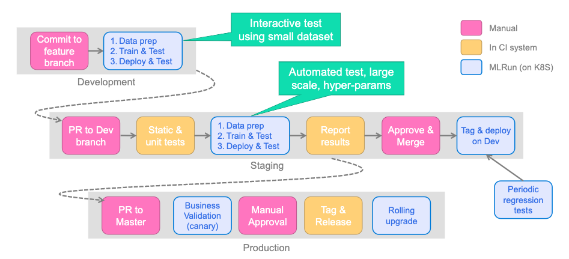
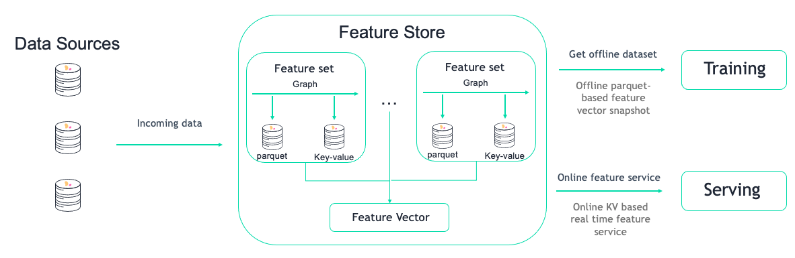
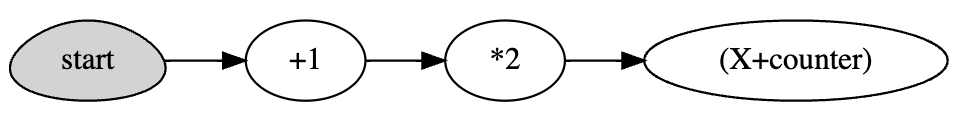
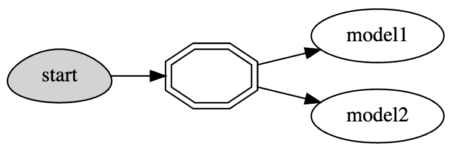
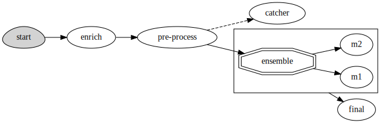

(cheat-sheet)=
# MLRun cheat sheet

## Table of contents
- [MLRun setup](#mlrun-setup)
- [MLRun projects](#mlrun-projects)
    - [General workflow](#general-workflow)
    - [Git integration](#git-integration)
    - [CI/CD integration](#ci-cd-integration)
    - [Secrets](#secrets)
- [MLRun functions](#mlrun-functions)
    - [Essential runtimes](#essential-runtimes)
    - [Distributed runtimes](#distributed-runtimes)
    - [Resource management](#resource-management)
    - [Building docker images](#building-docker-images)
- [Multi-stage workflows (batch pipelines)](#multi-stage-workflows-batch-pipelines)
- [Logging](#logging)
- [Experiment tracking](#experiment-tracking)
- [Model inferencing and serving](#model-inferencing-and-serving)
- [Model monitoring and drift detection](#model-monitoring-and-drift-detection)
- [Alerts and notifications](#alerts-and-notifications)
- [Sources and targets](#sources-and-targets)
- [Feature store](#feature-store)
- [Real-time pipelines](#real-time-pipelines)
- [Hyperparameter tuning](#hyperparameter-tuning)

## MLRun setup
Docs: [Set up your client environment](./install/remote.html), [Installation and setup guide](./install.html)

### MLRun server/client overview

MLRun has two main components, the service and the client (SDK+UI):
- MLRun service runs over Kubernetes (can also be deployed using local Docker for demo and test purposes) - see [installation documentation](./install.html) for more information
- MLRun client SDK is installed in your development environment via `pip` and interacts with the service using REST API calls

### Remote connection (laptop, CI/CD, etc.)
Docs: [Configure remote environment](../install/remote.html#configure-remote-environment)

**Localhost**: Create a `mlrun.env` file for environment variables. MLRUN_DBPATH saves the URL endpoint of the MLRun APIs 
service endpoint. Since it is localhost, username and access_key are not required:
```
mlrun config set -a http://localhost:8080
# MLRun DB
MLRUN_DBPATH=<URL endpoint of the MLRun APIs service endpoint; e.g., "https://mlrun-api.default-tenant.app.mycluster.iguazio.com">
```

**Iguazio MLOps Platform** (not MLRun CE).
```
mlrun config set -a https://mlrun-api.default-tenant.app.xxx.iguazio-cd1.com -u joe -k mykey -e 
# this is another env file
V3IO_USERNAME=joe
V3IO_ACCESS_KEY=mykey
MLRUN_DBPATH=https://mlrun-api.default-tenant.app.xxx.iguazio-cd1.com
```

**Connect via MLRun Python SDK**:

```
# Use local service
mlrun.set_environment("http://localhost:8080", artifact_path="./")
# Use remote service
mlrun.set_environment("<remote-service-url>", access_key="xyz", username="joe")
```


## MLRun projects
Docs: [Projects and automation](./projects/project.html)

### General workflow
Docs: [Create, save, and use projects](./projects/create-project.html)
```python
# Create or load a project
project = mlrun.get_or_create_project(name="my-project", context="./")

# Add a function to the project
project.set_function(
    name="train_model", func="train_model.py", kind="job", image="mlrun/mlrun"
)

# Add a workflow (pipeline) to the project
project.set_workflow(name="training_pipeline", workflow_path="straining_pipeline.py")

# Save the project and generate the project.yaml file
project.save()

# Run pipeline via project
project.run(name="training_pipeline", arguments={...})
```

### Git integration
Docs: [Create and use functions](./runtimes/create-and-use-functions.html#multiple-source-files)

An MLRun project can be backed by a Git repo. Functions consume the repo and pull the code either: once when Docker image is built (production workflow); or at runtime (development workflow).

#### Pull the repo code once (bake into Docker image)

```python
project.set_source(source="git://github.com/mlrun/project-archive.git")

fn = project.set_function(
    name="myjob",
    handler="job_func.job_handler",
    image="mlrun/mlrun",
    kind="job",
    with_repo=True,
)

project.build_function(fn)
```

#### Pull the repo code at runtime

```python
project.set_source(
    source="git://github.com/mlrun/project-archive.git", pull_at_runtime=True
)

fn = project.set_function(
    name="nuclio",
    handler="nuclio_func:nuclio_handler",
    image="mlrun/mlrun",
    kind="nuclio",
    with_repo=True,
)
```

### CI/CD integration

#### Overview

Docs: [CD/CD automation with Git](./projects/ci-cd-automate.html), [Run pipelines with GitHub Actions, GitLab](./projects/ci-integration.html)

Best practice for working with CI/CD is using [MLRun Projects](./projects/project.html) with a combination of the following:
- **Git:** Single source of truth for source code and deployments via infrastructure as code. Allows for collaboration between multiple developers. An MLRun project can (and should) be tied to a Git repo. One project maps to one Git repo.
- **CI/CD:** Main tool for orchestrating production deployments. The CI/CD system should be responsible for deploying latest code changes from Git onto the remote cluster via MLRun Python SDK or CLI. 
- **Iguazio/MLRun:** Kubernetes-based compute environment for running data analytics, model training, or model deployment tasks.  Additionally, the cluster is where all experiment tracking, job information, logs, and more, is located.

See [MLRun Projects](./projects/project.html) for more information on Git and CI/CD integration. In practice, this may look something like the following:


#### Example (GitHub Actions)

Full example: [MLRun project-demo](https://github.com/mlrun/project-demo)

```yaml
name: mlrun-project-workflow
on: [issue_comment]

jobs:
  submit-project:
    if: github.event.issue.pull_request != null && startsWith(github.event.comment.body, '/run')
    runs-on: ubuntu-latest

    steps:
    - uses: actions/checkout@v3
    - name: Set up Python 3.9
      uses: actions/setup-python@v4
      with:
        python-version: '3.9'
        architecture: 'x64'
    
    - name: Install mlrun
      run: python -m pip install pip install mlrun
    - name: Submit project
      run: python -m mlrun project ./ --watch --run main ${CMD:5}
      env:
        V3IO_USERNAME: ${{ secrets.V3IO_USERNAME }}
        V3IO_API: ${{ secrets.V3IO_API }}
        V3IO_ACCESS_KEY: ${{ secrets.V3IO_ACCESS_KEY }}
        MLRUN_DBPATH: ${{ secrets.MLRUN_DBPATH }}
        GITHUB_TOKEN: ${{ secrets.GITHUB_TOKEN }} 
        SLACK_WEBHOOK: ${{ secrets.SLACK_WEBHOOK }}
        CMD: ${{ github.event.comment.body}}
```

### Secrets
Docs: [Working with secrets](./secrets.html)

```python
# Add secrets to the project
project.set_secrets(secrets={"AWS_KEY": "111222333"}, provider="kubernetes")

# Run the job with all secrets (automatically injects all project secrets for non-local runtimes)
project.run_function(fn)

# Retrieve the secret within the job
context.get_secret("AWS_KEY")
```

## MLRun functions

### Essential runtimes
Docs: [Kinds of functions (runtimes)](./concepts/functions-overview.html)

#### Job

```python
# Job - run once to completion
job = project.set_function(
    name="my-job", func="my_job.py", kind="job", image="mlrun/mlrun", handler="handler"
)
project.run_function(job)
```

#### Nuclio

```python
# Nuclio - generic real-time function to do something when triggered
nuclio = project.set_function(
    name="my-nuclio",
    func="my_nuclio.py",
    kind="nuclio",
    image="mlrun/mlrun",
    handler="handler",
)
project.deploy_function(nuclio)
```

#### Serving

```python
# Serving - specialized Nuclio function specifically for model serving
serving = project.set_function(
    name="my-serving",
    func="my_serving.py",
    kind="serving",
    image="mlrun/mlrun",
    handler="handler",
)
serving.add_model(
    key="iris",
    model_path="https://s3.wasabisys.com/iguazio/models/iris/model.pkl",
    model_class="ClassifierModel",
)
project.deploy_function(serving)
```

### Distributed runtimes
Docs: [Kinds of functions (runtimes)](./concepts/functions-overview.html)

#### MPIJob (Horovod)

```python
project = mlrun.get_or_create_project("mpijob")
mpijob = project.set_function(
    name="my-mpijob",
    filename="my_mpijob.py",
    kind="mpijob",
    image="mlrun/mlrun",
    handler="handler",
)
mpijob.spec.replicas = 3
mpijob.run()
```

#### Dask

```python
project = mlrun.get_or_create_project("dask")
dask = project.set_function(name="my-dask", kind="dask", image="mlrun/ml-base")
dask.spec.remote = True
dask.spec.replicas = 5
dask.spec.service_type = "NodePort"
dask.with_worker_limits(mem="6G")
dask.with_scheduler_limits(mem="1G")
dask.spec.nthreads = 5
dask.apply(mlrun.mount_v3io())
dask.client
```

#### Spark Operator

```python
import os

read_csv_filepath = os.path.join(os.path.abspath("."), "spark_read_csv.py")
project = mlrun.get_or_create_project("spark")
spark = project.set_function(
    kind="spark", command=read_csv_filepath, name="sparkreadcsv"
)
spark.with_driver_limits(cpu="1300m")
spark.with_driver_requests(cpu=1, mem="512m")
spark.with_executor_limits(cpu="1400m")
spark.with_executor_requests(cpu=1, mem="512m")
spark.with_igz_spark()
spark.spec.replicas = 2

spark.deploy()  # build image
spark.run(artifact_path="/User")  # run spark job
```

### Resource management
Docs: [Managing job resources](./runtimes/configuring-job-resources.html)

#### Requests/limits (MEM/CPU/GPU)

```python
# Requests - lower bound
fn.with_requests(mem="1G", cpu=1)

# Limits - upper bound
fn.with_limits(mem="2G", cpu=2, gpus=1)
```

#### Scaling and auto-scaling

```python
# Nuclio/serving scaling
fn.spec.replicas = 2
fn.spec.min_replicas = 1
fn.spec.max_replicas = 4
```

#### Scale to zero

```python
# Nuclio/serving scaling
fn.spec.min_replicas = 0  # zero value is mandatory for scale to zero
fn.spec.max_replicas = 2

# Scaling to zero in case of 30 minutes (idle-time duration)
fn.set_config(
    key="spec.scaleToZero.scaleResources",
    value=[
        {
            "metricName": "nuclio_processor_handled_events_total",
            "windowSize": "30m",  # default values are 1m, 2m, 5m, 10m, 30m
            "threshold": 0,
        }
    ],
)
```

#### Mount persistent storage

```python
# Mount Iguazio V3IO
fn.apply(mlrun.mount_v3io())

# Mount PVC
fn.apply(
    mlrun.platforms.mount_pvc(
        pvc_name="data-claim", volume_name="data", volume_mount_path="/data"
    )
)
```

#### Pod priority

```python
fn.with_priority_class(name="igz-workload-medium")
```

#### Node selection

```python
fn.with_node_selection(node_selector={"app.iguazio.com/lifecycle": "non-preemptible"})
```

### Serving/Nuclio triggers

Docs: [Nuclio Triggers](https://github.com/nuclio/nuclio-jupyter/blob/development/nuclio/triggers.py)

By default, Nuclio deploys a default HTTP trigger if the function doesn't have one. This is because users typically want to invoke functions through HTTP. 
However, we provide a way to disable the default HTTP trigger using:
`function.disable_default_http_trigger()`
```{admonition} Note

`disable_default_http_trigger` is supported from Nuclio 1.13.1.
```

Also, you can explicitly enable the default HTTP trigger creation with:
`function.enable_default_http_trigger()`

If you didn't set this parameter explicitly, the value is taken from [Nuclio platform configuration](https://github.com/nuclio/nuclio/blob/development/docs/tasks/configuring-a-platform.md). 
 Therefore, if you haven't disabled the default HTTP trigger, don't have a custom one, and are unable to invoke the function, we recommend checking the Nuclio platform configuration.

```python
import nuclio

serve = mlrun.import_function("hub://v2_model_server")

# Set amount of workers
serve.with_http(workers=8, worker_timeout=10)

# V3IO stream trigger
serve.add_v3io_stream_trigger(
    stream_path="v3io:///projects/myproj/stream1",
    name="stream",
    group="serving",
    seek_to="earliest",
    shards=1,
)

# Kafka stream trigger
serve.add_trigger(
    name="kafka",
    spec=nuclio.KafkaTrigger(
        brokers=["192.168.1.123:39092"],
        topics=["TOPIC"],
        partitions=4,
        consumer_group="serving",
        initial_offset="earliest",
    ),
)

# Cron trigger
serve.add_trigger("cron_interval", spec=nuclio.CronTrigger(interval="10s"))
serve.add_trigger("cron_schedule", spec=nuclio.CronTrigger(schedule="0 9 * * *"))
```

```{admonition} Note
The worker uses separate worker scope. This means that each worker has a copy of the variables, 
and all changes are kept within the worker (change by worker x, do not affect worker y).
```

### Building Docker images
Docs: [Build function image](./runtimes/image-build.html), [Images and their usage in MLRun](./runtimes/images.html#images-usage)

#### Manually build image

```python
project.set_function(
    "train_code.py",
    name="trainer",
    kind="job",
    image="mlrun/mlrun",
    handler="train_func",
    requirements=["pandas==1.3.5"],
)

project.build_function(
    "trainer",
    # Specify base image
    base_image="myrepo/base_image:latest",
    # Run arbitrary commands
    commands=[
        "pip install git+https://github.com/myusername/myrepo.git@mybranch",
        "mkdir -p /some/path && chmod 0777 /some/path",
    ],
)
```

#### Automatically build image

```python
project.set_function(
    "train_code.py",
    name="trainer",
    kind="job",
    image="mlrun/mlrun",
    handler="train_func",
    requirements=["pandas==1.3.5"],
)

# auto_build will trigger building the image before running,
# due to the additional requirements.
project.run_function("trainer", auto_build=True)
```

## Multi-stage workflows (batch pipelines)

Docs: [Running a multi-stage workflow](./concepts/workflow-overview.html)

### Write a workflow

```python
# pipeline.py
from kfp import dsl
import mlrun
import nuclio


# Create a Kubeflow Pipelines pipeline
@dsl.pipeline(
    name="batch-pipeline",
    description="Example of batch pipeline for heart disease dataset",
)
def pipeline(source_url, label_column):

    # Get current project
    project = mlrun.get_current_project()

    # Ingest the data set
    ingest = mlrun.run_function(
        "get-data",
        handler="prep_data",
        inputs={"source_url": source_url},
        params={"label_column": label_column},
        outputs=["cleaned_data"],
    )

    # Train a model
    train = mlrun.run_function(
        "train",
        handler="train_model",
        inputs={"dataset": ingest.outputs["cleaned_data"]},
        params={"label_column": label_column},
        outputs=["model"],
    )
```

### Add workflow to project

```python
# Functions within the workflow
project.set_function(
    name="get-data", func="get_data.py", kind="job", image="mlrun/mlrun"
)
project.set_function(name="train", func="train.py", kind="job", image="mlrun/mlrun")

# Workflow
project.set_workflow(name="main", workflow_path="pipeline.py")

project.save()
```

### Run workflow

Python SDK
```python
run_id = project.run(
    name="main",
    arguments={
        "source_url": "store://feature-vectors/heart-disease-classifier/heart-disease-vec:latest",
        "label_column": "target",
    },
)
```

CLI
```bash
mlrun project --run main \
    --arguments source_url=store://feature-vectors/heart-disease-classifier/heart-disease-vec:latest \
    --arguments label_column=target
```

### Schedule workflow

```python
run_id = project.run(
    name="main",
    arguments={
        "source_url": "store://feature-vectors/heart-disease-classifier/heart-disease-vec:latest",
        "label_column": "target",
    },
    schedule="0 * * * *",
)
```


## Logging
Docs: [MLRun execution context](./concepts/mlrun-execution-context.html)

```python
context.logger.debug(
    message="Debugging info"
)  # logging all (debug, info, warning, error)
context.logger.info(message="Something happened")  # logging info, warning and error
context.logger.warning(message="Something might go wrong")  # logging warning and error
context.logger.error(message="Something went wrong")  # logging only error
```

```{admonition} Note
The real-time (nuclio) function uses default logger level `debug` (logging all)
```


## Experiment tracking
Docs: [MLRun execution context](./concepts/mlrun-execution-context.html), [Automated experiment tracking](./concepts/auto-logging-mlops.html), [Decorators and auto-logging](./concepts/decorators-and-auto-logging.html)

### Manual logging

```python
context.log_result(key="accuracy", value=0.934)
context.log_model(key="model", model_file="model.pkl")
context.log_dataset(key="model", df=df, format="csv", index=False)
```

### Track returning values using `hints` and `returns`

- Pass type hints into the inputs parameter of the run method. Inputs are automatically parsed to their hinted type. If type hints are 
not in code, they can be passed in the input keys. Hints use the structure: `key : type_hint`
- Pass log hints: how to log the returning values from a handler. The log hints are passed via the returns parameter in the run method. 
A log hint can be passed as a string or a dictionary.
- Use the `returns` argument to specify how to log a function's returned values.

```
def my_handler(df):
    ...
    return processed_df, result
    
log_with_returns_run = my_func.run(
    handler="my_handler",
    inputs={"df: pandas.DataFrame": DATA_PATH},
    returns=["processed_data", "sum"],
    local=True,
)
```

### Automatic logging

```python
# Auto logging for ML frameworks
from mlrun.frameworks.sklearn import apply_mlrun

apply_mlrun(model=model, model_name="my_model", x_test=X_test, y_test=y_test)
model.fit(X_train, y_train)


# MLRun decorator for input/output parsing
@mlrun.handler(
    labels={"framework": "scikit-learn"},
    outputs=["prediction:dataset"],
    inputs={"train_data": pd.DataFrame, "predict_input": pd.DataFrame},
)
def train_and_predict(train_data, predict_input, label_column="label"):

    x = train_data.drop(label_column, axis=1)
    y = train_data[label_column]

    clf = SVC()
    clf.fit(x, y)

    return list(clf.predict(predict_input))
```

## Model inferencing and serving
Docs: [Deploy models and applications](./deployment/index.html)

### Real-time serving

Docs: [Using built-in model serving classes](./serving/built-in-model-serving.html), [Build your own model serving class](./serving/custom-model-serving-class.html), [Model serving API](./serving/model-api.html)

```python
serve = mlrun.import_function("hub://v2_model_server")
serve.add_model(
    key="iris", model_path="https://s3.wasabisys.com/iguazio/models/iris/model.pkl"
)

# Deploy to local mock server (Development testing)
mock_server = serve.to_mock_server()

# Deploy to serverless function (Production K8s deployment)
addr = serve.deploy()
```

### Batch inferencing

Docs: [Batch inference](./deployment/batch_inference.html)

```python
batch_inference = mlrun.import_function("hub://batch_inference")
batch_run = project.run_function(
    batch_inference,
    inputs={"dataset": prediction_set_path},
    params={"model": model_artifact.uri},
)
```

## Model monitoring and drift detection
Docs: {ref}`model-monitoring-overview`, [Batch inference](./deployment/batch_inference.html) 

### Real-time drift detection

```python
# Log the model with training set
context.log_model("model", model_file="model.pkl", training_set=X_train)

# Enable tracking for the model server
serving_fn = import_function("hub://v2_model_server", project=project_name).apply(
    auto_mount()
)
serving_fn.add_model(
    "model", model_path="store://models/project-name/model:latest"
)  # Model path comes from experiment tracking DB
serving_fn.set_tracking()

# Deploy the model server
serving_fn.deploy()
```

### Batch drift detection

```python
batch_inference = mlrun.import_function("hub://batch_inference")
batch_run = project.run_function(
    batch_inference,
    inputs={"dataset": prediction_set_path, "sample_set": training_set_path},
    params={
        "model": model_artifact.uri,
        "label_columns": "label",
        "perform_drift_analysis": True,
    },
)
```

## Alerts and notifications

Docs: {ref}`alerts`, {ref}`notifications`

### Alerts
```python
alert_data = mlrun.alerts.alert.AlertConfig(
    project=project_name,
    name=alert_name,
    summary=alert_summary,
    severity=alert_objects.AlertSeverity.LOW,
    entities=alert_objects.EventEntities(
        kind=entity_kind, project=project_name, ids=[result_endpoint]
    ),
    trigger=alert_objects.AlertTrigger(events=[event_name]),
    criteria=None,
    notifications=notifications,
)
```

### Notifications
```python
notification = mlrun.model.Notification(
    kind="slack",
    name="slack_notification",
    message="A drift was detected",
    severity="warning",
    when=["now"],
    condition="failed",
    secret_params={
        "webhook": "https://hooks.slack.com/",
    },
).to_dict()
```


## Sources and targets

Abstract underlying storage to easily retrieve and store data from various sources

Docs: [Ingest data using the feature store](./data-prep/ingest-data-fs.html)

### Sources

Docs: [Sources](./feature-store/sources-targets.html#sources)

```python
from mlrun.datastore.sources import (
    CSVSource,
    ParquetSource,
    BigQuerySource,
    KafkaSource,
)

# CSV
csv_source = CSVSource(name="read", path="/User/getting_started/examples/demo.csv")
csv_df = csv_source.to_dataframe()

# Parquet
from pyspark.sql import SparkSession

session = SparkSession.builder.master("local").getOrCreate()
parquet_source = ParquetSource(
    name="read", path="v3io:///users/admin/getting_started/examples/userdata1.parquet"
)
spark_df = parquet_source.to_spark_df(session=session)

# BigQuery
bq_source = BigQuerySource(
    name="read", table="the-psf.pypi.downloads20210328", gcp_project="my_project"
)
bq_df = bq_source.to_dataframe()

# Kafka
kafka_source = KafkaSource(
    name="read",
    brokers="localhost:9092",
    topics="topic",
    group="serving",
    initial_offset="earliest",
)
kafka_source.add_nuclio_trigger(function=fn)

# Snowflake
snowflake_source = SnowflakeSource(
    name="read",
    query="select * from customer limit 100000",
    url="<url>",
    user="<user>",
    password="<password>",
    database="SNOWFLAKE_SAMPLE_DATA",
    db_schema="TPCH_SF1",
    warehouse="compute_wh",
)
snowflake_df = snowflake_source.to_dataframe()
```

### Targets

Docs: [Targets](./feature-store/sources-targets.html#targets), [Partitioning on Parquet target](./feature-store/sources-targets.html#partitioning-on-parquet-target)

```python
from mlrun.datastore.targets import CSVTarget, ParquetTarget

# CSV
csv_target = CSVTarget(name="write", path="/User/test.csv")
csv_target.write_dataframe(df=csv_df, key_column="id")

# Parquet
pq_target = ParquetTarget(
    name="write",
    path="/User/test.parquet",
    partitioned=True,
    partition_cols=["country"],
)
pq_target.write_dataframe(df=pq_df, key_column="id")

# Redis (see docs for writing online features)
redis_target = RedisNoSqlTarget(name="write", path="redis://1.2.3.4:6379")
redis_target.write_dataframe(df=redis_df)

# Kafka (see docs for writing online features)
kafka_target = KafkaTarget(
    name="write",
    brokers="localhost:9092",
    path="topic",
)
kafka_target.write_dataframe(df=kafka_df)
```

## Feature store
Docs: [Feature Store](./feature-store/feature-store.html), [Feature sets](./feature-store/feature-sets.html), [Feature set transformations](./feature-store/transformations.html), [Creating and using feature vectors](./feature-store/feature-vectors.html), [Feature store end-to-end demo](./feature-store/end-to-end-demo/index.html)

### Definitions

Docs: [Feature store overview](./feature-store/feature-store-overview.html)

- Feature Set: A group of features that can be ingested together and stored in logical group (usually one-to-one with a dataset, stream, table, etc.)
- Feature Vector: A group of features from different Feature Sets



### Engines

Docs: {ref}`feature-store-overview`, [Ingest features with Spark](./feature-store/using-spark-engine.html)

- `storey` engine (default) is designed for real-time data (e.g. individual records) that will be transformed using Python functions and classes.
- `pandas` engine is designed for batch data that can fit into memory that will be transformed using Pandas dataframes. Pandas is used for testing, and is not recommended for production deployments
- `spark` engine is designed for batch data.

### Feature sets

Docs: [Feature sets](./feature-store/feature-sets.html)

#### Basic ingestion

Docs: [Ingest data using the feature store](./data-prep/ingest-data-fs.html)

```python
import mlrun.feature_store as fstore
from mlrun.datastore.sources import ParquetSource

categorical_fset = fstore.FeatureSet(
    name="heart-disease-categorical",
    entities=[fstore.Entity("patient_id")],
    description="Categorical columns for heart disease dataset",
)

categorical_fset.ingest(
    source=ParquetSource(path="./data/heart_disease_categorical.parquet")
)
```

#### Feature set per engine

```python
from mlrun.datastore.sources import DataFrameSource

# Storey engine
storey_set = fstore.FeatureSet(
    name="heart-disease-storey",
    entities=[fstore.Entity("patient_id")],
    description="Heart disease data via storey engine",
    engine="storey",
)
storey_set.ingest(source=DataFrameSource(df=data))

# Pandas engine
pandas_set = fstore.FeatureSet(
    name="heart-disease-pandas",
    entities=[fstore.Entity("patient_id")],
    description="Heart disease data via pandas engine",
    engine="pandas",
)
pandas_set.ingest(source=DataFrameSource(df=data))

# Spark engine
from pyspark.sql import SparkSession

spark = SparkSession.builder.appName("Spark function").getOrCreate()

spark_set = fstore.FeatureSet(
    name="heart-disease-spark",
    entities=[fstore.Entity("patient_id")],
    description="Heart disease data via spark engine",
    engine="spark",
)
spark_set.ingest(source=CSVSource(path=v3io_data_path), spark_context=spark)
```

#### Ingestion methods

Docs: [Ingest data locally](./data-prep/ingest-data-fs.html#ingest-data-locally), [Ingest data using an MLRun job](./data-prep/ingest-data-fs.html#ingest-data-using-an-mlrun-job), [Real-time ingestion](./data-prep/ingest-data-fs.html#real-time-ingestion), [Incremental ingestion](./data-prep/ingest-data-fs.html#incremental-ingestion), [Feature store end-to-end demo](./feature-store/end-to-end-demo/index.html)

```python
# Local
from mlrun.datastore.sources import CSVSource

fs = fstore.FeatureSet("stocks", entities=[fstore.Entity("ticker")])
df = fs.ingest(source=CSVSource("mycsv", path="stocks.csv"))

# Job
from mlrun.datastore.sources import ParquetSource

fs = fstore.FeatureSet("stocks", entities=[fstore.Entity("ticker")])
df = fs.ingest(
    source=ParquetSource("mypq", path="stocks.parquet"),
    run_config=fstore.RunConfig(image="mlrun/mlrun"),
)

# Real-Time
from mlrun.datastore.sources import HttpSource

fs = fstore.FeatureSet("stocks", entities=[fstore.Entity("ticker")])
url, _ = fs.deploy_ingestion_service(
    source=HttpSource(key_field="ticker"),
    run_config=fstore.RunConfig(image="mlrun/mlrun", kind="serving"),
)

# Incremental
cron_trigger = "* */1 * * *"  # will run every hour
fs = fstore.FeatureSet("stocks", entities=[fstore.Entity("ticker")])
fset.ingest(
    source=ParquetSource(
        "mypq", path="stocks.parquet", time_field="time", schedule=cron_trigger
    ),
    run_config=fstore.RunConfig(image="mlrun/mlrun"),
)
```

#### Aggregations

Docs: [add_aggregation()](./api/mlrun.feature_store.html#mlrun.feature_store.FeatureSet.add_aggregation), [Aggregations](./feature-store/transformations.html#aggregations)

```python
quotes_set = fstore.FeatureSet("stock-quotes", entities=[fstore.Entity("ticker")])
quotes_set.add_aggregation("bid", ["min", "max"], ["1h"], "10m")
```

#### Built-in transformations

Docs: [storey.transformations](./api/storey.transformations.html#module-storey.transformations), [Built-in transformations](./feature-store/transformations.html#built-in-transformations)

```python
quotes_set.graph.to("storey.Filter", "filter", _fn="(event['bid'] > 50)")
```

#### Custom transformations

Docs: [Custom transformations](./feature-store/transformations.html#custom-transformations)

Define transformation
```python
# Storey
class MyMapStorey(MapClass):
    def __init__(self, multiplier=1, **kwargs):
        super().__init__(**kwargs)
        self._multiplier = multiplier

    def do(self, event):
        event["multi"] = event["bid"] * self._multiplier
        return event


# Pandas
class MyMapPandas:
    def __init__(self, multiplier=1, **kwargs):
        self._multiplier = multiplier

    def do(self, df):
        df["multi"] = df["bid"] * self._multiplier
        return df


# Spark
class MyMapSpark:
    def __init__(self, multiplier=1, **kwargs):
        self._multiplier = multiplier

    def do(self, df):
        df = df.withColumn("multi", df["bid"] * self._multiplier)
        return df
```

Use in graph
```python
quotes_set.graph.add_step("MyMapStorey", "multi", after="filter", multiplier=3)
```

### Feature vectors

Docs: [Feature vectors](./feature-store/feature-vectors.html)

#### Basic retrieval

```python
import mlrun.feature_store as fstore
from mlrun.datastore.targets import ParquetTarget

fvec = fstore.FeatureVector(
    name="heart-disease-vector",
    features=["heart-disease-categorical.*", "heart-disease-continuous.*"],
    description="Heart disease dataset",
)
fvec.save()

# Instantiate feature-vector from mlrun DB
fvec = fstore.get_feature_vector("iguazio-academy/heart-disease-vector")

# Offline features for training
df = fvec.get_offline_features().to_dataframe()

# Materialize offline features to parquet
fvec.get_offline_features(target=ParquetTarget())

# Online features for serving
feature_service = fvec.get_online_feature_service().feature_service.get(
    [
        {"patient_id": "e443544b-8d9e-4f6c-9623-e24b6139aae0"},
        {"patient_id": "8227d3df-16ab-4452-8ea5-99472362d982"},
    ]
)
```

## Real-time pipelines
Docs: [Real-time serving pipelines](./serving/serving-graph.html), [Real-time pipeline use cases](./serving/use-cases.html#), [Graph concepts and state machine](./serving/realtime-pipelines.html), [Model serving graph](./serving/model-serving-get-started.html), [Writing custom steps](./serving/writing-custom-steps.html)

### Definitions

Graphs are composed of the following:
- Step: A step runs a function or class handler or a REST API call
- Router: A special type of step with routing logic and multiple child routes/models
- Queue: A queue or stream that accepts data from one or more source steps and publishes to one or more output steps

Graphs have two modes (topologies):
- Router topology (default): A minimal configuration with a single router and child tasks/routes
- Flow topology: A full graph/DAG

### Simple graph

Docs: [Real-time serving pipelines getting started](./serving/getting-started.html#getting-started)

Define Python file(s) to orchestrate
```python
# graph.py
def inc(x):
    return x + 1


def mul(x):
    return x * 2


class WithState:
    def __init__(self, name, context, init_val=0):
        self.name = name
        self.context = context
        self.counter = init_val

    def do(self, x):
        self.counter += 1
        print(f"Echo: {self.name}, x: {x}, counter: {self.counter}")
        return x + self.counter
```

Define MLRun function and graph
```python
import mlrun

fn = project.set_function(
    name="simple-graph", func="graph.py", kind="serving", image="mlrun/mlrun"
)
graph = fn.set_topology("flow")

# inc, mul, and WithState are all defined in graph.py
graph.to(name="+1", handler="inc").to(name="*2", handler="mul").to(
    name="(X+counter)", class_name="WithState"
).respond()

# Local testing
server = fn.to_mock_server()
server.test(body=5)

# K8s deployment
project.deploy_function(fn)
```


### Simple model serving router

Docs: [Example of a simple model serving router](./serving/use-cases.html#example-of-a-simple-model-serving-router)

```python
# load the sklearn model serving function and add models to it
fn = mlrun.import_function("hub://v2_model_server")
fn.add_model("model1", model_path="s3://...")
fn.add_model("model2", model_path="store://...")

# deploy the function to the cluster
project.deploy_function(fn)

# test the live model endpoint
fn.invoke("/v2/models/model1/infer", body={"inputs": [5]})
```


### Custom model serving class

Docs: [Model serving graph](./serving/model-serving-get-started.html)

```python
from cloudpickle import load
from typing import List
import numpy as np

import mlrun


class ClassifierModel(mlrun.serving.V2ModelServer):
    def load(self):
        """load and initialize the model and/or other elements"""
        model_file, extra_data = self.get_model(".pkl")
        self.model = load(open(model_file, "rb"))

    def predict(self, body: dict) -> List:
        """Generate model predictions from sample."""
        feats = np.asarray(body["inputs"])
        result: np.ndarray = self.model.predict(feats)
        return result.tolist()
```

### Advanced data processing and serving ensemble

Docs: {ref}`graph-example`

```python
fn = project.set_function(
    name="advanced", func="demo.py", kind="serving", image="mlrun/mlrun"
)
graph = function.set_topology("flow", engine="async")

# use built-in storey class or our custom Echo class to create and link Task steps. Add an error
# handling step that runs only if the "Echo" step fails
graph.to("storey.Extend", name="enrich", _fn='({"tag": "something"})').to(
    class_name="Echo", name="pre-process", some_arg="abc"
).error_handler(name="catcher", handler="handle_error", full_event=True)

# add an Ensemble router with two child models (routes), the "*" prefix marks it as router class
router = graph.add_step(
    "*mlrun.serving.VotingEnsemble", name="ensemble", after="pre-process"
)
router.add_route("m1", class_name="ClassifierModel", model_path=path1)
router.add_route("m2", class_name="ClassifierModel", model_path=path2)

# add the final step (after the router), which handles post-processing and response to the client
graph.add_step(class_name="Echo", name="final", after="ensemble").respond()
```


## Hyperparameter tuning
Docs: [Hyperparameter tuning optimization](./hyper-params.html)

The following hyperparameter examples use this function:
```python
# hp.py
def hyper_func(context, p1, p2):
    print(f"p1={p1}, p2={p2}, result={p1 * p2}")
    context.log_result("multiplier", p1 * p2)


# MLRun function in project
fn = project.set_function(
    name="hp", func="hp.py", image="mlrun/mlrun", kind="job", handler="hyper_func"
)
```
```{admonition} Note

The selector can be named any value that is logged - in this case `multiplier`
```

### Grid search (default)

Docs: [Grid Search](./hyper-params.html#grid-search-default)

Runs all parameter combinations
```python
hp_tuning_run = project.run_function(
    "hp", hyperparams={"p1": [2, 4, 1], "p2": [10, 20]}, selector="max.multiplier"
)
```

### Random search

Docs: [Random Search](./hyper-params.html#random-search)

Runs a random sample of parameter combinations
```python
hp_tuning_run = project.run_function(
    "hp",
    hyperparams={"p1": [2, 4, 1], "p2": [10, 20]},
    selector="max.multiplier",
    hyper_param_options=mlrun.model.HyperParamOptions(
        strategy="random", max_iterations=5
    ),
)
```

### List search

Docs: [List Search](./hyper-params.html#list-search)

Runs the first parameter from each list followed by the second from each list, etc. **All lists must be of equal size**.
```python
hp_tuning_run = project.run_function(
    "hp",
    hyperparams={"p1": [2, 4, 1], "p2": [10, 20, 30]},
    selector="max.multiplier",
    hyper_param_options=mlrun.model.HyperParamOptions(strategy="list"),
)
```

### Parallel executors

Docs: [Parallel execution over containers](./hyper-params.html#parallel-execution-over-containers)

#### Dask

Docs: [Running the workers using Dask](./hyper-params.html#running-the-workers-using-dask)

```python
# Create Dask cluster
project = mlrun.get_or_create_project(dask - cluster)
dask_cluster = project.set_function(
    name="dask-cluster", kind="dask", image="mlrun/ml-base"
)
dask_cluster.apply(mlrun.mount_v3io())  # add volume mounts
dask_cluster.spec.service_type = "NodePort"  # open interface to the dask UI dashboard
dask_cluster.spec.replicas = 2  # define two containers
uri = dask_cluster.save()

# Run parallel hyperparameter trials
hp_tuning_run_dask = project.run_function(
    "hp",
    hyperparams={"p1": [2, 4, 1], "p2": [10, 20, 30]},
    selector="max.multiplier",
    hyper_param_options=mlrun.model.HyperParamOptions(
        strategy="grid",
        parallel_runs=4,
        dask_cluster_uri=uri,
        teardown_dask=True,
    ),
)
```

#### Nuclio

Docs: [Running the workers using Nuclio](./hyper-params.html#running-the-workers-using-nuclio)

```python
# Create nuclio:mlrun function
fn = project.set_function(
    name="hyper-tst2", func="hp.py", kind="nuclio:mlrun", image="mlrun/mlrun"
)
# (replicas * workers) must be equal to or greater than parallel_runs
fn.spec.replicas = 2
fn.with_http(workers=2)
fn.deploy()

# Run the parallel tasks over the function
hp_tuning_run_dask = project.run_function(
    "hyper-tst2",
    hyperparams={"p1": [2, 4, 1], "p2": [10, 20, 30]},
    selector="max.multiplier",
    hyper_param_options=mlrun.model.HyperParamOptions(
        strategy="grid", parallel_runs=4, max_errors=3
    ),
    handler="hyper_func",
)
```
