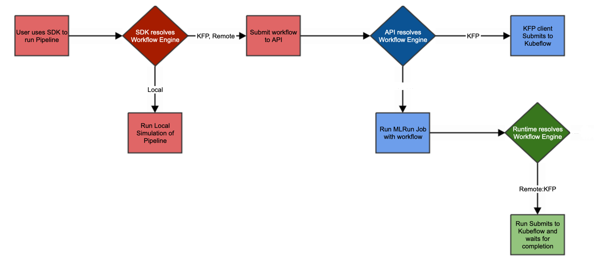

(local-remote)=
# Local vs. remote workflows

To run multiple functions, one after the other  (`jobs`), you use a pipeline. There are three types of pipeline engines:
- [Remote on KFP](#remote-kfp)
- [Remote](#remote)
- [Local](#local-workflows)

## Remote-KFP 

The pipeline runs on the remote server using KFP. You can use either a remote source, or a local source.
If your source is local, then you need to install KFP locally. In this case, the code is complied locally, and you don't have to commit the code.

The remote workflow supports sending notifications when runs are complete.

Useful: for scheduled workflows

There are several ways to run a remote-KFP workflow:
- With Git: For each run of the schedule, it clones the code, compiles the pipeline, and then runs it.
- Build the image with the source code of the pipeline, compile the pipeline, and then run it.

There is one pod for each function, and also a batch pod for each function.

Set `engine = remote:kfp` in `function.run()`.

See also [Local and KFP engine pipeline notifications](../concepts/notifications.md#local-and-kfp-engine-pipeline-notifications) and [Setting notifications on scheduled run](../concepts/notifications.md#setting-notifications-on-scheduled-runs).

## Remote

The spec file is created in MLRun and is compiled in the user environment. Then it is sent to the MLRun API, which sends it to the KFP to run the workflow.

There is one pod for each function, and also a batch pod for each function.

Remote workflows must be based on the image `mlrun/mlrun-kfp`. (See {ref}`images-usage`.) 

See also [Remote pipeline notifications](../concepts/notifications.md#remote-pipeline-notifications).

## Local workflows

Local workflows are useful when you want to debug the flow of the pipeline code itself. 

The  code is compiled locally and the pipeline runs on the host machine. The functions run on the remote KFP. KFP must be installed locally. There are pods for each function.

Running workflows locally uses a completely different environment, for example, a different python version and different packages based on the local environment.

This option is configured by setting `local=True` in `function.run()`.

Local workflows must be based on the image `mlrun/mlrun-kfp`. (See {ref}`images-usage`.)
If you are installing the package in an pre-existing python environment, it's recommended to create a new venv exclusively for installing MLRun.

See also [Local and KFP engine pipeline notifications](../concepts/notifications.md#local-and-kfp-engine-pipeline-notifications).