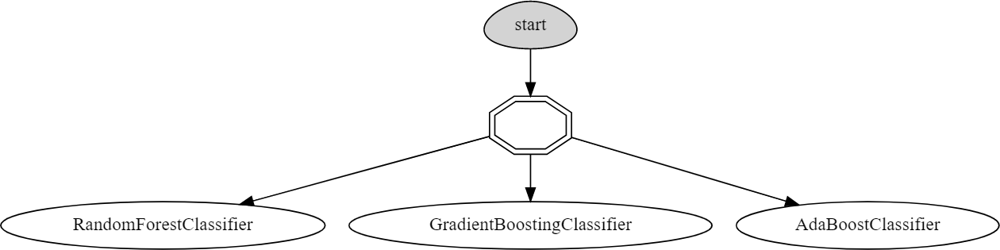
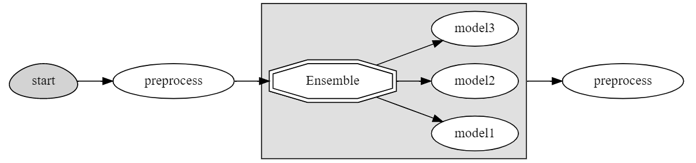

(model_serving)=
# Model Serving

MLRun model serving allows composition of multi-stage real-time pipelines that include data manipulation and execution of models. The architecture allows high scalability while maintaining low latency performance.

## Basic Model Serving

The most basic model serving capability is deployment of a single model. To do that one has to:
1. Create an MLRun function of type `serving` that implements a serving class with the `load` and `predict` methods. MLRun function marketplace comes with a range of such functions that support most common frameworks
2. Add the model to the function, using the {py:meth}`~mlrun.runtimes.ServingRuntime.add_model` method.
3. Deploy the model, using the {py:meth}`~mlrun.runtimes.ServingRuntime.deploy` method.

This results in a single model endpoint that can execute the model and return the model prediction.

Optionally, one can create a mock server, which runs the model as an in-memory object within the user's development environment. This allows testing the model without deploying it.

## Routers and Ensembles

A single serving function can host more than a single model. You can call `add_model` multiple times and specify a different model per each model key. Each `add_model` will create another model endpoint.

One can also create an ensemble of models, where a call to one model endpoint will combine the results of other models together.

## Model Serving Pipeline

Model execution is usually part of a greater pipeline, and the model serving is just a single step in that pipeline. Usually, there is a range of data processing that occurs before and after the model is executed. The process may even involve more than a single model in the pipeline, and/or filters and rules, related to the execution of the models.

MLRun implements model serving pipeline using its graph capabilities. This gives the capability to define steps, such as data processing, such as data enrichment and data manipulation, prior to calling the model as well as perform steps after the model is executed, by performing additional steps on the model output.

