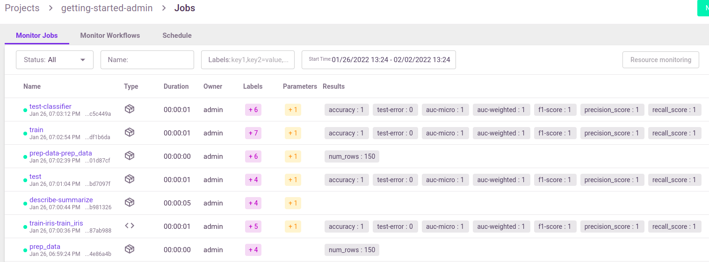

(submitting-tasks-jobs-to-functions)=
#  Running a task (job)

**In this section**
- [Submit tasks (jobs) using run_function](#run)
- [Run result object and UI](#result)

<a id="run"></a>
## Submit tasks (jobs) using run_function

Use the {py:meth}`~mlrun.projects.run_function` method for invoking a job over MLRun batch functions. 
The `run_function` method accepts various parameters such as `name`, `handler`, `params`, `inputs`, `schedule`, etc. 
Alternatively, you can pass a **`Task`** object (see: {py:func}`~mlrun.model.new_task`) that holds all of the 
parameters plus the advanced options. 

Functions can host multiple methods (handlers). You can set the default handler per function. You
 need to specify which handler you intend to call in the run command. 

You can pass `parameters` (arguments) or data `inputs` (such as datasets, feature-vectors, models, or files) to the functions through the `run` method.

* **Parameters** (`params`) are meant for basic python objects that can be parsed from text without special handling. So, passing `int`, 
`float`, `str` and `dict`, `list` are all possible using `params`. MLRun takes the parameter and assigns it to the relevant handler parameter by name.
* **Inputs** are used for passing various local or remote data objects (files, tables, models, etc.) to the function as 
{py:class}`~mlrun.datastore.DataItem`  objects. You can pass data objects using the inputs dictionary argument, where the dictionary keys 
match the function's handler argument names and the MLRun data urls are provided as the values. DataItems have many methods like `local`  
(download the data item's file to a local temp directory) and `as_df` (parse the data to a `pd.DataFrame`).  The dataItem objects handle 
data movement, tracking, and security in an optimal way.  Read more about [data items](../store/data-items.html).

When a type hint is available for an argument, MLRun automatically parses the DataItem to the hinted type (when the hinted type is supported).

You can use `run_function` as a `project` methods, or as global (`mlrun.`) methods. For example:

    # run the "train" function in myproject
    run_results = myproject.run_function("train", inputs={"data": data_url})  
    
    # run the "train" function in the current/active project (or in a pipeline)
    run_results = mlrun.run_function("train", inputs={"data": data_url})  
    
The first parameter in `run_function` is the function name (in the project), or it can be a function object if you want to 
use functions that you imported/created ad hoc, or modify a function spec, for example:

    run_results = project.run_function(fn, params={"label_column": "label"}, inputs={'data': data_url})

```{admonition} Run/simulate functions locally: 
Functions can also run and be debugged locally by using the `local` runtime or by setting the `local=True` 
parameter in the {py:meth}`~mlrun.runtimes.BaseRuntime.run` method (for batch functions).
```

MLRun also supports iterative jobs that can run and track multiple child jobs (for hyperparameter tasks, AutoML, etc.). 
See {ref}`hyper-params` for details and examples.

<a id="result"></a>
## Run result object and UI

The {py:meth}`~mlrun.projects.run_function` command returns an MLRun {py:class}`~mlrun.model.RunObject` object that you can use to track the job and its results. 
If you pass the parameter `watch=True` (default) the command blocks until the job completes.

Run object has the following methods/properties:
- `uid()` &mdash; returns the unique ID.
- `state()` &mdash; returns the last known state.
- `show()` &mdash; shows the latest job state and data in a visual widget (with hyperlinks and hints).
- `outputs` &mdash; returns a dictionary of the run results and artifact paths.
- `logs(watch=True)` &mdash; returns the latest logs.
    Use `Watch=False` to disable the interactive mode in running jobs.
- `artifact(key)` &mdash; returns an artifact for the provided key (as {py:class}`~mlrun.datastore.DataItem` object).
- `output(key)` &mdash; returns a specific result or an artifact path for the provided key.
- `wait_for_completion()` &mdash; wait for async run to complete
- `refresh()` &mdash; refresh run state from the db/service
- `to_dict()`, `to_yaml()`, `to_json()` &mdash; converts the run object to a dictionary, YAML, or JSON format (respectively).

<br>You can view the job details, logs, and artifacts in the UI. When you first open the **Monitor 
Jobs** tab it displays the last jobs that ran and their data. Click a job name to view its run history, and click a run to view more of the 
run's data.

<br>

See full details and examples in [Functions](../runtimes/functions.html).