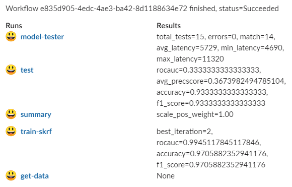

(workflow-overview)=
# Running a multi-stage workflow

A workflow is a definition of execution of functions. It defines the order of execution of multiple dependent steps in a 
directed acyclic graph (DAG). A workflow 
can reference the project’s params, secrets, artifacts, etc. It can also use a function execution output as a function execution 
input (which, of course, defines the order of execution).

MLRun supports running workflows on a `local` or [`kubeflow`](https://www.kubeflow.org/docs/components/pipelines/overview/pipelines-overview/) pipeline engine. The `local` engine runs the workflow as a 
local process, which is simpler for debugging and running simple/sequential tasks. The `kubeflow` ("kfp") engine runs as a task over the 
cluster and supports more advanced operations (conditions, branches, etc.). You can select the engine at runtime. Kubeflow-specific
directives like conditions and branches are not supported by the `local` engine.

Workflows are saved/registered in the project using the {py:meth}`~mlrun.projects.MlrunProject.set_workflow`.  
Workflows are executed using the {py:meth}`~mlrun.projects.MlrunProject.run` method or using the CLI command `mlrun project`.

Refer to the **{ref}`tutorial`** for complete examples.

**In this section**
* [Composing workflows](#composing-workflows)
* [Saving workflows](#saving-workflows)
* [Running workflows](#running-workflows)

## Composing workflows

Workflows are written as python functions that make use of {ref}` function <functions>` operations (run, build, deploy)
and can access project parameters, secrets, and artifacts using {py:meth}`~mlrun.projects.MlrunProject.get_param`, {py:meth}`~mlrun.projects.MlrunProject.get_secret` and {py:meth}`~mlrun.projects.MlrunProject.get_artifact_uri`.

For workflows to work in Kubeflow you need to add a decorator (`@dsl.pipeline(..)`) as shown below.

Example workflow:

```python
from kfp import dsl
import mlrun
from mlrun.model import HyperParamOptions

funcs = {}
DATASET = "iris_dataset"

in_kfp = True


@dsl.pipeline(name="Demo training pipeline", description="Shows how to use mlrun.")
def newpipe():

    project = mlrun.get_current_project()

    # build our ingestion function (container image)
    builder = mlrun.build_function("gen-iris")

    # run the ingestion function with the new image and params
    ingest = mlrun.run_function(
        "gen-iris",
        name="get-data",
        params={"format": "pq"},
        outputs=[DATASET],
    ).after(builder)

    # train with hyper-parameters
    train = mlrun.run_function(
        "train",
        name="train",
        params={"sample": -1, "label_column": project.get_param("label", "label"), "test_size": 0.10},
        hyperparams={
            "model_pkg_class": [
                "sklearn.ensemble.RandomForestClassifier",
                "sklearn.linear_model.LogisticRegression",
                "sklearn.ensemble.AdaBoostClassifier",
            ]
        },
        hyper_param_options=HyperParamOptions(selector="max.accuracy"),
        inputs={"dataset": ingest.outputs[DATASET]},
        outputs=["model", "test_set"],
    )
    print(train.outputs)

    # test and visualize our model
    mlrun.run_function(
        "test",
        name="test",
        params={"label_column": project.get_param("label", "label")},
        inputs={
            "models_path": train.outputs["model"],
            "test_set": train.outputs["test_set"],
        },
    )

    # deploy our model as a serverless function, we can pass a list of models to serve
    serving = mlrun.import_function("hub://v2_model_server", new_name="serving")
    deploy = mlrun.deploy_function(
        serving,
        models=[{"key": f"{DATASET}:v1", "model_path": train.outputs["model"]}],
    )

    # test out new model server (via REST API calls), use imported function
    tester = mlrun.import_function("hub://v2_model_tester", new_name="live_tester")
    mlrun.run_function(
        tester,
        name="model-tester",
        params={"addr": deploy.outputs["endpoint"], "model": f"{DATASET}:v1"},
        inputs={"table": train.outputs["test_set"]},
    )
```

```{admonition} Note
For defining the steps order you can either use steps outputs as written above, or use `.after(step_1,step_2,..)` method, that allows the user to define the order of the workflow steps without the need to forward the outputs from the previous steps.
```

## Saving workflows

If you want to use workflows as part of an automated flow, save them and register them in the project. 
Use the {py:meth}`~mlrun.projects.MlrunProject.set_workflow` method to register workflows, to specify a workflow name, 
the path to the workflow file, and the function `handler` name (or it looks for a handler named "pipeline"), and can
set the default `engine` (local or kfp).

When setting the `embed` flag to True, the workflow code is embedded in the project file (can be used if you want to 
describe the entire project using a single YAML file).

You can define the schema for workflow arguments (data type, default, doc, etc.) by setting the `args_schema` with a list 
of **{py:class}`~mlrun.model.EntrypointParam`** objects.

Example:

        # define agrument for the workflow
        arg = mlrun.model.EntrypointParam(
            "model_pkg_class",
            type="str",
            default="sklearn.linear_model.LogisticRegression",
            doc="model package/algorithm",
        )
        
        # register the workflow in the project and save the project
        project.set_workflow("main", "./myflow.py", handler="newpipe", args_schema=[arg])
        project.save()
        
        # run the workflow
        project.run("main", arguments={"model_pkg_class": "sklearn.ensemble.RandomForestClassifier"})

## Running workflows

Use the {py:meth}`~mlrun.projects.MlrunProject.run` method to execute workflows. Specify the workflow using its `name`
or `workflow_path` (path to the workflow file) or `workflow_handler` (the workflow function handler).
You can specify the input `arguments` for the workflow and can override the system default `artifact_path`.

Workflows are asynchronous by default. You can set the `watch` flag to True and the run operation blocks until 
completion and prints out the workflow progress. Alternatively, you can use `.wait_for_completion()` on the run object.

The default workflow engine is `kfp`. You can override it by specifying the `engine` in the `run()` or `set_workflow()` methods. 
Using the `local` engine executes the workflow state machine locally (its functions still run as cluster jobs).
If you set the `local` flag to True, the workflow uses the `local` engine AND the functions run as local process.
This mode is used for local debugging of workflows.

When running workflows from a git enabled context it first verifies that there are no uncommitted git changes 
(to guarantee that workflows that load from git do not use old code versions). You can suppress that check by setting the `dirty` flag to True.

Examples:

    # simple run of workflow 'main' with arguments, block until it completes (watch=True)
    run = project.run("main", arguments={"param1": 6}, watch=True)
    
    # run workflow specified with a function handler (my_pipe)
    run = project.run(workflow_handler=my_pipe)
    # wait for pipeline completion
    run.wait_for_completion()
    
    # run workflow in local debug mode
    run = project.run(workflow_handler=my_pipe, local=True, arguments={"param1": 6})
    
### Notification
Instead of waiting for completion, you can set up a notification in Slack with a results summary, similar to: <br>


Use one of:
```
project.notifiers.add_notification(notification_type="slack",params={"webhook":"<user-slack-webhook>"})
```
or in a Jupyter notebook with the` %env` magic command:
```
%env SLACK_WEBHOOK=<slack webhook url>
```