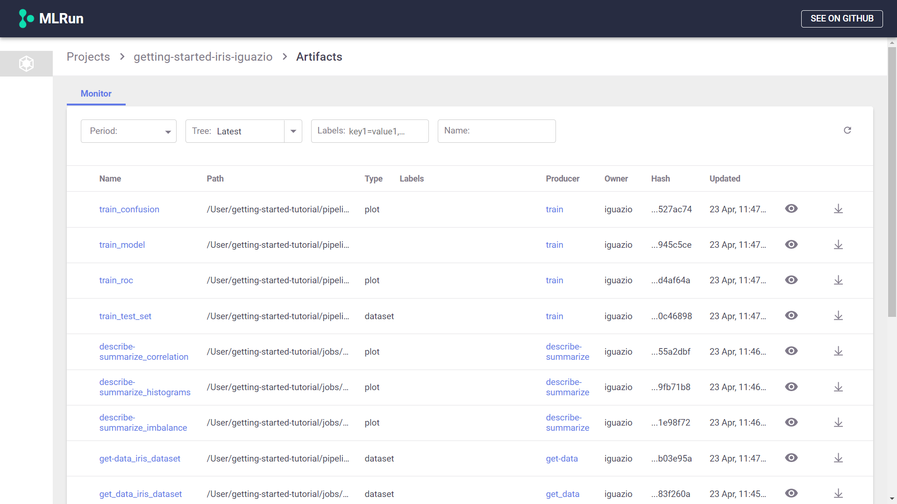

# Artifact Management and versioning <!-- omit in toc -->

- [Overview](#overview)
- [Datasets](#datasets)
- [Plots](#plots)
- [Models](#models)

## Overview
An artifact is any data that is produced and/or consumed by functions or jobs.

The artifacts are stored in the project and are divided to 3 main types:
1. **Plots** — images, figures, and plotlines.
2. **Models** — all trained models.
3. **Datasets** — any data , such as tables and DataFrames.

From the projects page, click on the **Artifacts** link to view all the artifacts stored in the project
  

You can search the artifacts based on time and labels.
In the Monitor view, you can view per artifact its location, the artifact type, labels, the producer of the artifact, the artifact owner, last update date.

Per each artifact you can view its content as well as download the artifact.

## Datasets

## Plots

## Models

