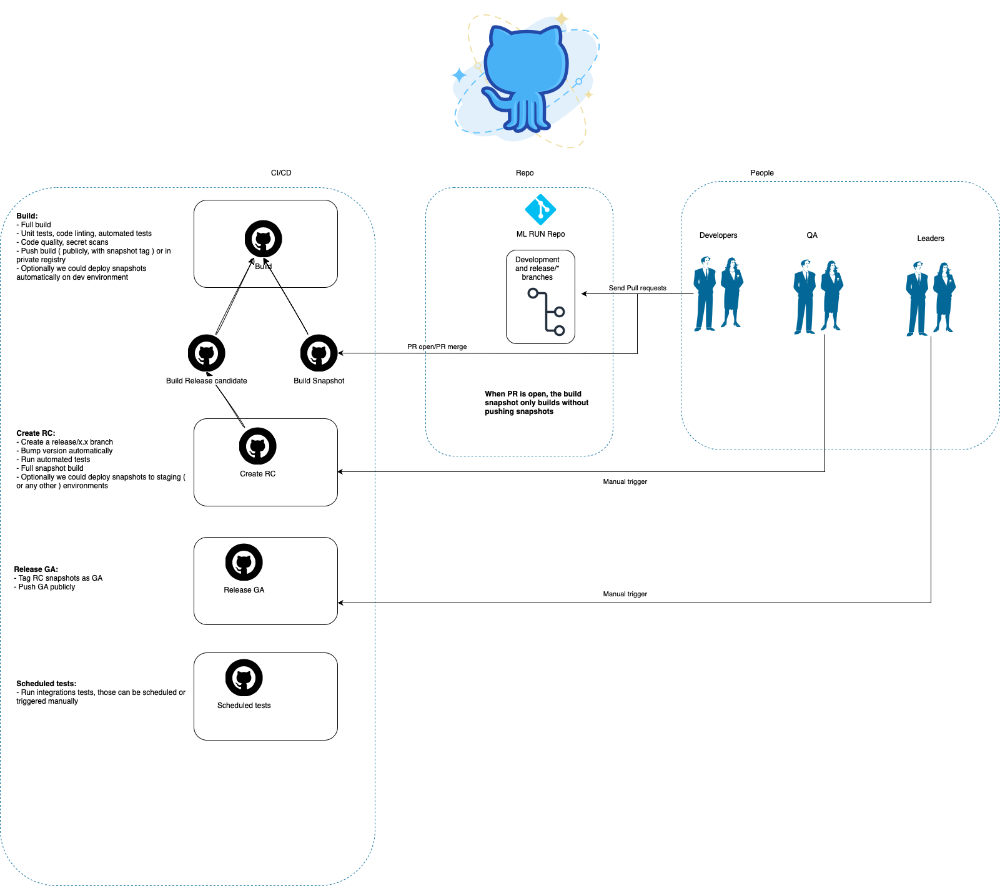

# MLRun Release Procedure

This document describes the comprehensive release procedure for MLRun, including the workflow architecture and step-by-step process.

## 🏗️ High-Level Architecture: MLRun-Release-Procedure



## 📋 Release Process Steps

### Step 1: Developer PR Workflow
**Triggers**: Developer opens/updates Pull Request

- **PR Open**:
  - ✅ Builds snapshot images for testing
  - ❌ **No push** to registry (validation only)
  - 📊 Provides quick feedback to developers
  - 🔮 **TODO**: Unit tests execution for code validation

- **PR Merge to `development`**:
  - ✅ Builds and **pushes** snapshot images
  - 🏷️ Tagged as: `unstable-{run_id}-{commit_hash}`
  - 📦 Available for integration testing

**Workflow**: `.github/workflows/build-snapshot.yaml`

### Step 2: Image Artifact Management
**Trigger**: Automatic when merging on default branch.

**Outcome**: Snapshot images available for testing

- **Registry**: `ghcr.io/mlrun/*`
- **Tag Format**: `unstable-{run_id}-{commit_hash}`
- **Images Built**:
  - `mlrun` (Python 3.9, 3.11)
  - `mlrun-api` (Python 3.11 only)
  - `mlrun-kfp` (Python 3.9, 3.11)
  - `mlrun-gpu` (Python 3.9, 3.11)
  - `jupyter` (Python 3.11)

### Step 3: Release Candidate Creation
**Triggers**: Manual trigger by Release Manager

#### 3.1 Version Management with Bumpversion
- **Tool**: `commitizen` - Semantic versioning automation
- **Configuration**: `cz.json`
- **Release Types**:
  - `patch`: `1.2.3` → `1.2.4` (bug fixes)
  - `minor`: `1.2.3` → `1.3.0` (new features)
  - `major`: `1.2.3` → `2.0.0` (breaking changes)

**NB:** The bump release type is automatically calculated based on the commit types, the commits must adhere to the [conventional commit standard](https://www.conventionalcommits.org/en/v1.0.0/) ( this is enforced locally with pre-commit and remotely with PR checks).

#### 3.2 Branch Creation Process
```bash
# Example: Creating RC for patch release
Current: development branch at v1.2.3
Action:  bumpversion patch
Result:  New branch release/v1.2.4
```

#### 3.3 Release Candidate Build
- **Workflow**: `.github/workflows/create-release-candidate.yaml`
- **Triggers**:
  - Manual dispatch (with release type selection)
  - Automatic on `release/*` branch creation
- **Output**: RC artifacts with tags like `rc-v1.2.4-{run_id}-{commit_hash}`
- **🔮 Future Enhancements**:
  - Integration tests execution
  - DevSecOps security scanning and compliance checks

**Process**:
1. 🌿 Create release branch from `development`
2. 📈 Bump version using bumpversion tool
3. 🏗️ Trigger release candidate build
4. 🔬 **Future**: Execute integration tests and security scans
5. 📦 Push RC artifacts to registry

### Step 4: QA Testing Phase
**Responsibility**: QA Team

#### 4.1 Test Artifacts
- **RC Images**: `ghcr.io/mlrun/*:rc-v1.2.4-{run_id}-{commit_hash}`
- **Test Scope**:
  - Functional testing
  - Integration testing
  - Performance validation
  - Regression testing

#### 4.2 QA Decision Points
- **✅ Approve**: Proceed to Step 5 (Release Creation)
- **❌ Reject**:
  - Log issues in tracking system
  - Return to development for fixes
  - Create new RC after fixes

### Step 5: Release Creation (Artifact Promotion)
**Triggers**: Manual trigger after QA approval

#### 5.1 Key Principle: No Rebuild
- **🚫 No compilation**: Uses existing, tested RC artifacts
- **🏷️ Re-tagging only**: Promotes RC tags to release tags ( for both git tags and container images tags)
- **⚡ Fast process**: Metadata operation, not image rebuild
- **🔒 Immutable**: Same bits that QA tested
- **⚡ Merge back**: We want to ensure that the branch where the release started, got a PR back so that versions are in sync. The PR is automatically created but will require a review ( step 6 ). Note: If we think is the case we could automate the merge back without a PR, but for now better to avoid that in an early stage.

#### 5.2 Promotion Process
**Workflow**: `.github/workflows/release.yaml`

```bash
# Example promotion
Source: ghcr.io/mlrun/mlrun-api:rc-v1.2.4-18222610666-7a5dabe5
Target: ghcr.io/mlrun/mlrun-api:v1.2.4

# Both tags point to identical image layers
```

#### 5.3 Release Outputs
- **Clean Tags**: `ghcr.io/mlrun/*:v1.2.4`
- **GitHub Release**: Created with changelog and release notes
- **Git Tag**: `v1.2.4` tagged on release branch
- **Traceability**: RC tags remain for audit trail

### Step 6: Merge back
Every release procedure ( step 5 ) will open a PR that should be reviewed and merged so that version bumping is effective also on development branch.

## 🔄 Workflow Integration

### Workflow Files Overview
| Workflow | Trigger | Purpose | Artifacts |
|----------|---------|---------|-----------|
| `build-snapshot.yaml` | PR events, `development` push | Development builds | `unstable-*` tags |
| `build-release-candidate.yaml` | `release/*` branch events | RC builds | `rc-v*` tags |
| `create-release-candidate.yaml` | Manual dispatch | Create RC branch & trigger build | Release branch |
| `release.yaml` | Manual dispatch | Promote RC to release | `v*` release tags |

### Branch Strategy
```
development (main dev branch)
├── feature/new-feature (PRs)
├── release/v1.2.4 (RC branch)
└── release/v1.2.5 (next RC branch)
```

## 🛠️ Tools & Technologies

- **Version Management**: `bumpversion`
- **Container Registry**: GitHub Container Registry (`ghcr.io`)
- **CI/CD**: GitHub Actions
- **Container Runtime**: Docker with buildx
- **Caching**: GitHub Actions cache (GHA cache type)

## 📊 Benefits of This Process

1. **🔒 Immutable Releases**: Same artifacts from dev → QA → production
2. **⚡ Fast Releases**: No rebuild during promotion
3. **🔍 Full Traceability**: RC tags preserved for audit
4. **🛡️ Quality Gates**: QA approval required before release
5. **📈 Semantic Versioning**: Automated version management
6. **🔄 Rollback Ready**: Previous versions always available


## 📚 Additional Resources

- [Semantic Versioning](https://semver.org/)
- [Conventional Commits](https://www.conventionalcommits.org/)
- [GitHub Container Registry](https://docs.github.com/en/packages/working-with-a-github-packages-registry/working-with-the-container-registry)
