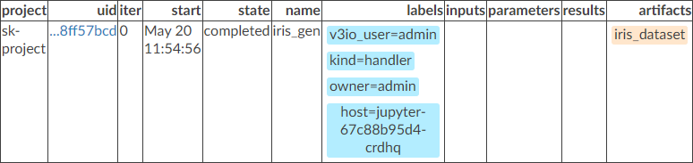

End-to-end Pipeline Tutorial
============================

Creating a local function, running predefined functions, creating and
running a full ML pipeline with local and library functions.

In this tutorial you will learn how to:
-  Create and test a simple function
-  Examine data using serverless (containarized) ``describe`` function
-  Create an automated ML pipeline from various library functions
-  Run and track the pipeline results and artifacts

.. raw:: html

    

        <iframe src="https://www.youtube.com/embed/lKEROW0GJHQ" frameborder="0" allowfullscreen style="position: absolute; top: 0; left: 0; width: 100%; height: 100%;"></iframe>
    

Create and Test a Local Function (Iris Data Generator)
------------------------------------------------------

Import nuclio SDK and magics

.. code:: ipython3

    # nuclio: ignore
    import nuclio

Specify function dependencies and configuration

.. code:: ipython3

    %%nuclio cmd -c
    pip install sklearn
    pip install pyarrow

.. code:: ipython3

    %nuclio config spec.build.baseImage = "mlrun/mlrun"

Function code
^^^^^^^^^^^^^

Generate the iris dataset and log the dataframe (as csv or parquet file)

.. code:: ipython3

    import os
    from sklearn.datasets import load_iris
    from sklearn.model_selection import train_test_split
    import numpy as np
    from sklearn.metrics import accuracy_score
    from mlrun.artifacts import PlotArtifact
    import pandas as pd
    
    def iris_generator(context, format='csv'):
        iris = load_iris()
        iris_dataset = pd.DataFrame(data=iris.data, columns=iris.feature_names)
        iris_labels = pd.DataFrame(data=iris.target, columns=['label'])
        iris_dataset = pd.concat([iris_dataset, iris_labels], axis=1)
        
        context.logger.info('saving iris dataframe to {}'.format(context.artifact_path))
        context.log_dataset('iris_dataset', df=iris_dataset, format=format, index=False)

The following end-code annotation tells ``nuclio`` to stop parsing the
notebook from this cell:

.. code:: ipython3

    # nuclio: end-code
    # marks the end of a code section

Create a project to host our functions, jobs and artifacts
----------------------------------------------------------

Projects are used to package multiple functions, workflows, and
artifacts. We usually store project code and definitions in a Git
archive.

The following code creates a new project in a local dir and initialize
git tracking on that

.. code:: ipython3

    from os import path
    from mlrun import run_local, mlconf, import_function, mount_v3io
    mlconf.dbpath = mlconf.dbpath or 'http://mlrun-api:8080'
    
    # specify artifacts target location
    artifact_path = mlconf.artifact_path or path.abspath('./')
    project_name = 'sk-project'

.. code:: ipython3

    from mlrun import new_project, code_to_function
    project_dir = './project'
    skproj = new_project(project_name, project_dir, init_git=True)

Run the data generator function locally
---------------------------------------

The functions above can be tested locally. Parameters, inputs, and
outputs can be specified in the API or the ``Task`` object. when using
``run_local()`` the function inputs and outputs are automatically
recorded by MLRun experiment and data tracking DB.

In each run we can specify the function, inputs,
parameters/hyper-parameters, etc… For more details, see the
`mlrun_basics notebook <mlrun_basics.ipynb>`__.

.. code:: ipython3

    # run the function locally
    gen = run_local(name='iris_gen', handler=iris_generator, 
                    project=project_name, artifact_path=path.join(artifact_path, 'data')) 

The output would be similar to text below:

.. highlight:: none
::

    [mlrun] 2020-05-20 11:54:56,925 starting run iris_gen uid=95d9058eac2d48bdb54352e78ff57bcd  -> http://mlrun-api:8080
    [mlrun] 2020-05-20 11:54:57,188 saving iris dataframe to /User/artifacts/data
    [mlrun] 2020-05-20 11:54:57,268 log artifact iris_dataset at /User/artifacts/data/iris_dataset.csv, size: 2776, db: Y
    

.. highlight:: none
::

    to track results use .show() or .logs() or in CLI: 
    !mlrun get run 95d9058eac2d48bdb54352e78ff57bcd --project sk-project , !mlrun logs 95d9058eac2d48bdb54352e78ff57bcd --project sk-project
    [mlrun] 2020-05-20 11:54:57,373 run executed, status=completed

Convert our local code to a distributed serverless function object
^^^^^^^^^^^^^^^^^^^^^^^^^^^^^^^^^^^^^^^^^^^^^^^^^^^^^^^^^^^^^^^^^^

.. code:: ipython3

    gen_func = code_to_function(name='gen_iris', kind='job')
    skproj.set_function(gen_func)

Load and run a library function (visualize dataset features and stats)
----------------------------------------------------------------------

Step 1: load the function object from the function hub (marketplace) >
note: the function marketplace location is configurable, by default it
points to ``mlrun/functions`` git

.. code:: ipython3

    skproj.set_function('hub://describe', 'describe')

.. code:: ipython3

    # read the remote function doc, params, usage
    skproj.func('describe').doc()
    #skproj.func('describe').spec.image_pull_policy = 'Always'

.. highlight:: none
::

    function: describe
    describe and visualizes dataset stats
    default handler: summarize
    entry points:
      summarize: Summarize a table
        context(MLClientCtx)  - the function context
        table(DataItem)  - MLRun input pointing to pandas dataframe (csv/parquet file path)
        label_column(str)  - ground truth column label, default=labels
        class_labels(List[str])  - label for each class in tables and plots
        plot_hist(bool)  - (True) set this to False for large tables, default=True
        plots_dest(str)  - destination folder of summary plots (relative to artifact_path), default=plots

Step 2: Run the describe function as a Kubernetes job with specified
parameters.

   ``mount_v3io()`` connects our function to v3io shared file system and
   allow us to pass the data and get back the results (plots) directly
   to our notebook, we can choose other mount options to use NFS or
   object storage

.. code:: ipython3

    skproj.func('describe').apply(mount_v3io()).run(params={'label_column': 'label'}, 
                                                    inputs={"table": gen.outputs['iris_dataset']}, 
                                                    artifact_path=artifact_path)

.. highlight:: none
::

    [mlrun] 2020-05-20 11:55:01,994 starting run describe-summarize uid=9fc84dd77c4142af995c33244ef870b6  -> http://mlrun-api:8080
    [mlrun] 2020-05-20 11:55:02,173 Job is running in the background, pod: describe-summarize-x6r9q
    [mlrun] 2020-05-20 11:55:12,627 starting local run: main.py # summarize
    [mlrun] 2020-05-20 11:55:16,068 log artifact histograms at /User/artifacts/plots/hist.html, size: 282853, db: Y
    [mlrun] 2020-05-20 11:55:16,597 log artifact imbalance at /User/artifacts/plots/imbalance.html, size: 11716, db: Y
    [mlrun] 2020-05-20 11:55:16,765 log artifact correlation at /User/artifacts/plots/corr.html, size: 30642, db: Y
    
    [mlrun] 2020-05-20 11:55:16,837 run executed, status=completed
    final state: succeeded

.. highlight:: none
::

    to track results use .show() or .logs() or in CLI: 
    !mlrun get run 9fc84dd77c4142af995c33244ef870b6 --project sk-project , !mlrun logs 9fc84dd77c4142af995c33244ef870b6 --project sk-project
    [mlrun] 2020-05-20 11:55:21,550 run executed, status=completed

Create a Fully Automated ML Pipeline
------------------------------------

Add more functions to our project to be used in our pipeline (from the functions hub/marketplace)
^^^^^^^^^^^^^^^^^^^^^^^^^^^^^^^^^^^^^^^^^^^^^^^^^^^^^^^^^^^^^^^^^^^^^^^^^^^^^^^^^^^^^^^^^^^^^^^^^

AutoML training (classifier), Model validation (test_classifier),
Real-time model server, and Model REST API Tester

.. code:: ipython3

    skproj.set_function('hub://sklearn_classifier', 'train')
    skproj.set_function('hub://test_classifier', 'test')
    skproj.set_function('hub://model_server', 'serving')
    skproj.set_function('hub://model_server_tester', 'live_tester')
    #print(skproj.to_yaml())

Define and save a pipeline
^^^^^^^^^^^^^^^^^^^^^^^^^^

The following workflow definition will be written into a file, it
describes a Kubeflow execution graph (DAG) and how functions and data
are connected to form an end to end pipeline.

-  Build the iris generator (ingest) function container
-  Ingest the iris data
-  Analyze the dataset (describe)
-  Train and test the model
-  Deploy the model as a real-time serverless function
-  Test the serverless function REST API with test dataset

Check the code below to see how functions objects are initialized and
used (by name) inside the workflow. The ``workflow.py`` file has two
parts, initialize the function objects and define pipeline dsl (connect
the function inputs and outputs).

   Note: the pipeline can include CI steps like building container
   images and deploying models as illustrated in the following example.

.. code:: ipython3

    %%writefile project/workflow.py
    from kfp import dsl
    from mlrun import mount_v3io
    
    funcs = {}
    DATASET = 'iris_dataset'
    LABELS  = "label"
    
    
    # init functions is used to configure function resources and local settings
    def init_functions(functions: dict, project=None, secrets=None):
        for f in functions.values():
            f.apply(mount_v3io())
         
        # uncomment this line to collect the inference results into a stream
        # and specify a path in V3IO (<datacontainer>/<subpath>)
        #functions['serving'].set_env('INFERENCE_STREAM', 'users/admin/model_stream')
    
        
    @dsl.pipeline(
        name="Demo training pipeline",
        description="Shows how to use mlrun."
    )
    def kfpipeline():
        
        # build our ingestion function (container image)
        builder = funcs['gen-iris'].deploy_step(skip_deployed=True)
        
        # run the ingestion function with the new image and params
        ingest = funcs['gen-iris'].as_step(
            name="get-data",
            handler='iris_generator',
            image=builder.outputs['image'],
            params={'format': 'pq'},
            outputs=[DATASET])
    
        # analyze our dataset
        describe = funcs["describe"].as_step(
            name="summary",
            params={"label_column": LABELS},
            inputs={"table": ingest.outputs[DATASET]})
        
        # train with hyper-paremeters 
        train = funcs["train"].as_step(
            name="train-skrf",
            params={"sample"          : -1, 
                    "label_column"    : LABELS,
                    "test_size"       : 0.10},
            hyperparams={'model_pkg_class': ["sklearn.ensemble.RandomForestClassifier", 
                                             "sklearn.linear_model.LogisticRegression",
                                             "sklearn.ensemble.AdaBoostClassifier"]},
            selector='max.accuracy',
            inputs={"dataset"         : ingest.outputs[DATASET]},
            outputs=['model', 'test_set'])
    
        # test and visualize our model
        test = funcs["test"].as_step(
            name="test",
            params={"label_column": LABELS},
            inputs={"models_path" : train.outputs['model'],
                    "test_set"    : train.outputs['test_set']})
    
        # deploy our model as a serverless function
        deploy = funcs["serving"].deploy_step(models={f"{DATASET}_v1": train.outputs['model']}, tag='v2')
        
        # test out new model server (via REST API calls)
        tester = funcs["live_tester"].as_step(name='model-tester',
            params={'addr': deploy.outputs['endpoint'], 'model': f"{DATASET}_v1"},
            inputs={'table': train.outputs['test_set']})

.. highlight:: none
::

    Overwriting project/workflow.py

.. code:: ipython3

    # register the workflow file as "main", embed the workflow code into the project YAML
    skproj.set_workflow('main', 'workflow.py', embed=True)

Save the project definitions to a file (project.yaml), it is recommended
to commit all changes to a Git repo.

.. code:: ipython3

    skproj.save()

Run a pipeline workflow
^^^^^^^^^^^^^^^^^^^^^^^

Use the ``run`` method to execute a
workflow, you can provide alternative arguments and specify the default
target for workflow artifacts. The workflow ID is returned and can be
used to track the progress or you can use the hyperlinks

   Note: The same command can be issued through CLI commands:
   ``mlrun project my-proj/ -r main -p "v3io:///users/admin/mlrun/kfp/{{workflow.uid}}/"``

The dirty flag allow us to run a project with uncommited changes (when
the notebook is in the same git dir it will always be dirty)

.. code:: ipython3

    artifact_path = path.abspath('./pipe/{{workflow.uid}}')
    run_id = skproj.run(
        'main',
        arguments={}, 
        artifact_path=artifact_path, 
        dirty=True)

This would output:

.. highlight:: none
::

    [mlrun] 2020-05-20 11:55:22,685 Pipeline run id=64d6f1e7-a582-4180-bba6-52c4a860d46b, check UI or DB for progress

Visually, the workflow would look as follows:

.. image:: _static/images/end-to-end-pipeline-tutorial-workflow.png
   :alt: Pipeline workflow

Track pipeline results
^^^^^^^^^^^^^^^^^^^^^^

.. code:: ipython3

    from mlrun import get_run_db
    db = get_run_db().connect()
    db.list_runs(project=skproj.name, labels=f'workflow={run_id}').show()

`back to top <#top>`__
