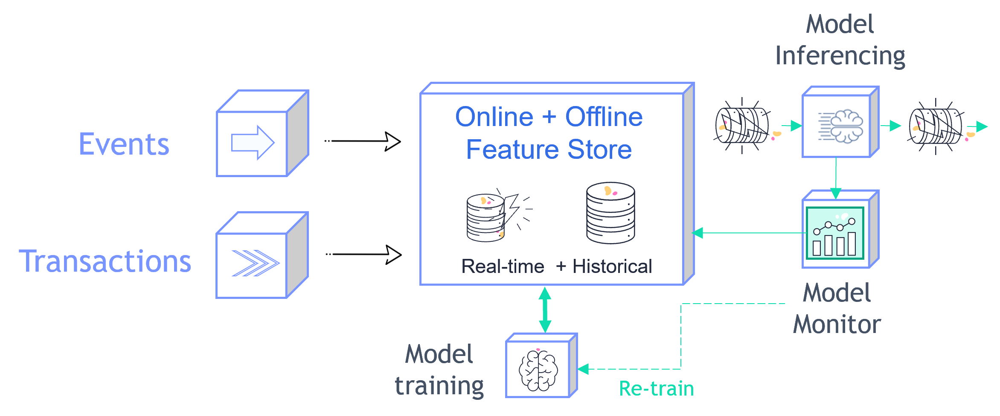

(fs-end-to-end-demo)=
# Feature store end-to-end demo

This demo shows the usage of MLRun and the feature store:

- [**Data ingestion & preparation**](01-ingest-datasources.html)
- [**Model training & testing**](02-create-training-model.html)
- [**Model serving**](03-deploy-serving-model.html)
- [**Building an automated ML pipeline**](04-pipeline.html)

Fraud prevention, specifically, is a challenge since it requires processing raw transactions and events in real-time and being able to
quickly respond and block transactions before they occur. Consider, for example, a case where you would like to evaluate the
average transaction amount. When training the model, it is common to take a DataFrame and just calculate the average. However,
when dealing with real-time/online scenarios, this average has to be calculated incrementally.

This demo illustrates how to **Ingest** different data sources to the **Feature Store**. Specifically, it covers two types of data:  

- **Transactions**: Monetary activity between two parties to transfer funds.
- **Events**: Activity performed by a party, such as login or password change.



The demo walks through creation of an ingestion pipeline for each data source with all the needed preprocessing and validation. It runs the pipeline locally within the notebook and then launches a real-time function to **ingest live data** or schedule a cron to run the task when needed.

Following the ingestion, you create a feature vector, select the most relevant features and create a final model. Then you deploy the model and showcase the feature vector and model serving.

```{toctree}
:maxdepth: 1

01-ingest-datasources
02-create-training-model
03-deploy-serving-model
04-pipeline
```
