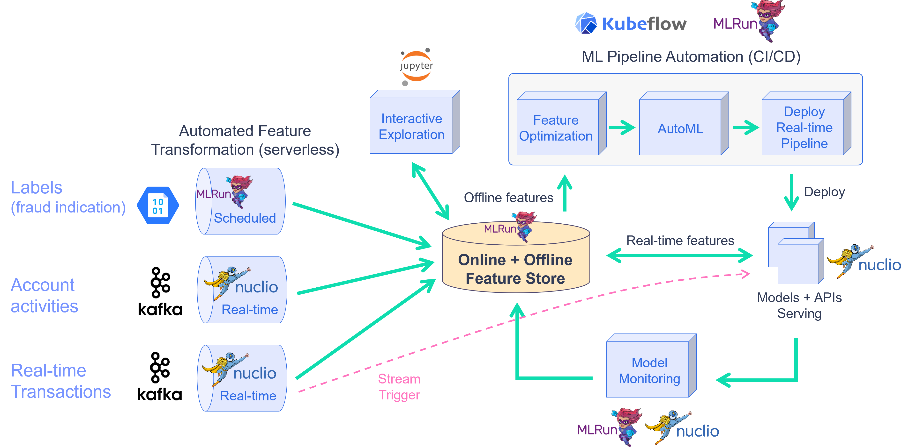

# Feature-Store End-to-End Demo

Healthcare facilities need to closely monitor their patients and identify early signs that can indicate that medical intervention is necessary. Time is a key factor, the earlier the medical teams can attend to an issue, the better the outcome. This means an effective system that can alert of issues in real-time can save lives.

This demo shows the usage of MLRun and the feature store. The demo will showcase:
- [**Data ingestion & preparation**](./01-ingest-datasources.ipynb)
- [**Model training & testing**](./02-create-training-model.ipynb)
- [**Real-time data & model pipeline**](./03-deploy-serving-model.ipynb)

In this demo we will learn how to **Ingest** different data sources to our **Feature Store**. Specifically, this patient data has been successfully used to treat hospitalized COVID-19 patients prior to their condition becoming severe or critical. To do this we will use a medical dataset which includes three types of data:  
- **Healthcare systems**: Batch updated dataset, containing different lab test results (Blood test results for ex.).
- **Patient Records**: Static dataset containing general patient details.
- **Real-time sensors**: Real-Time patient metric monitoring sensor.  



We will walk through creation of ingestion pipeline for each datasource with all the needed preprocessing and validation. We will run the pipeline locally within the notebook and then launch a real-time function to **ingest live data** or schedule a cron to run the task when needed.

Following the ingestion, we will create a feature vector and train several models using this vector. We will then deploy the model and showcase the feature vector and model serving.


```{toctree}
:maxdepth: 1

01-ingest-datasources
02-create-training-model
03-deploy-serving-model
```
