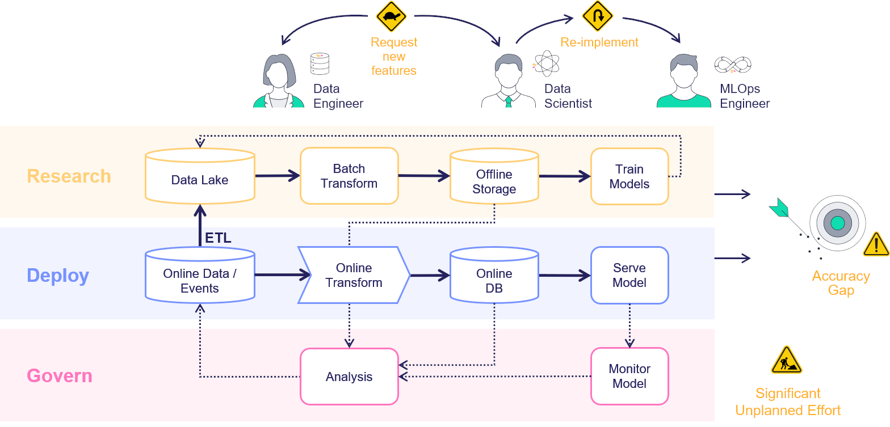
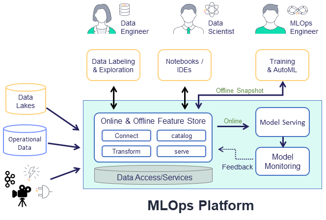
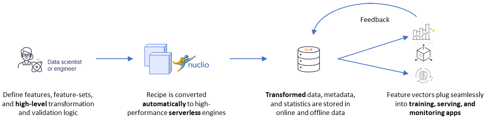
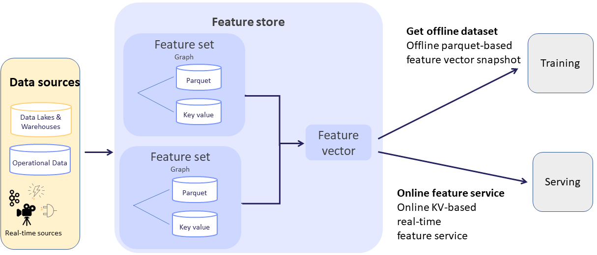

(feature-store-overview)=
# Feature store overview

In machine-learning scenarios, generating a new feature, called feature engineering, takes a tremendous amount of work. The same features 
must be used both for training, based on historical data, and for the model prediction based on the online or real-time data. This creates a 
significant additional engineering effort, and leads to model inaccuracy when the online and offline features do not match. Furthermore, 
monitoring solutions must be built to track features and results, and to send alerts upon data or model drift.

Consider a scenario in which you train a model and one of its features is a comparison of the current amount to the average amount spent 
during the last 3 months by the same person. Creating such a feature is easy when you have the full dataset in training, but for serving 
this feature must be calculated in an online manner. The "brute-force" way to address this is to have an ML engineer create an online 
pipeline that re-implements all the feature calculations that comprise the offline process. This is not just time-consuming and error-prone, but 
very difficult to maintain over time, and results in a lengthy deployment time. This is exacerbated when having to deal with thousands of 
features, and an increasing number of data engineers and data scientists that are creating and using the features.  

With MLRun's feature store you can easily define features during the training, which are deployable to serving, without having to define all the 
"glue" code. You simply create the necessary building blocks to define features and integration, with offline and online storage systems to access the features.

The feature store is comprised of the following:
- **Feature** &mdash; In machine-learning, a feature is an individual measurable property or characteristic of a phenomenon being observed. 
This can be raw data (e.g., transaction amount, image pixel, etc.) or a calculation derived from one or more other features (e.g., deviation 
from average, pattern on image, etc.).
- **{ref}`feature-sets`** &mdash;  A grouping of features that are ingested together and stored in a logical group. Feature sets take data from 
offline or online sources, build a list of features through a set of transformations, and store the resulting features, along with the 
associated metadata and statistics. For example, transactions could be grouped by the ID of a person performing the transfer or by the device 
identifier used to perform the transaction. You can also define in the timestamp source in the feature set, and ingest data into a 
feature set.
- **[Execution](./feature-sets.html#add-transformations)** &mdash; A set of operations performed on the data while it is 
ingested. The transformation graph contains steps that represent data sources and targets, and can also include steps that transform and enrich the data that is passed through the feature set. For a deeper dive, see {ref}`transformations`.
- **{ref}`Feature vectors <create-use-feature-vectors>`** &mdash; A set of features, taken from one or more feature sets. The feature vector is defined prior to model 
training and serves as the input to the model training process. During model serving, the feature values in the vector are obtained from an online service.

## How the feature store works

The common flow when working with the feature store is to first define the feature set with its source, transformation graph, and targets. (See the supported {ref}`sources-targets`.)
MLRun's robust transformation engine performs complex operations with just a few lines of Python code. To test the 
execution process, call the `infer` method with a sample DataFrame. This runs all operations in memory without storing the results. 

Once the 
graph is defined, it's time to ingest the data. 
You can ingest data directly from a DataFrame, by calling the feature set {py:class}`~mlrun.feature_store.ingest` method. You can also define an ingestion 
process that runs as a Kubernetes job. This is useful if there is a large ingestion process, or if there is a recurrent ingestion and you 
want to schedule the job. 

MLRun can also leverage [Nuclio](https://nuclio.io/docs/latest/) to perform real-time ingestion by calling the {py:class}`~mlrun.feature_store.deploy_ingestion_service` function. This means that during 
serving you can update feature values, and not just read them. For example, you can update a sliding window aggregation as part of a model 
serving process.

The next step is to define the [feature vector](feature-vectors.html). Call the {py:meth}`~mlrun.feature_store.get_offline_features` function to join together features across different feature sets. 

### Ingestion engines

MLRun supports several ingestion engines:

- `storey` engine (default) is designed for real-time data (e.g. individual records) that will be transformed using Python functions and classes
- `pandas` engine is designed for batch data that can fit into memory that will be transformed using Pandas dataframes. Pandas is used for testing, and is not recommended for production deployments
- `spark` engine is designed for batch data.

See also [transformation &mdash; engine support](./transformations.html#supporting-multiple-engines).

## Training and serving using the feature store 

  

Next, extract a versioned **offline** static dataset for training, based on the parquet target defined in the feature sets. You can train a 
model with the feature vector data by providing the input in the form of `'store://feature-vectors/{project}/{feature_vector_name}'`.

Training functions generate models and various model statistics. Use MLRun's auto logging capabilities to store the models along with all 
the relevant data, metadata, and measurements.

MLRun can apply all the MLOps functionality by using the framework specific `apply_mlrun()` method, which manages the training process and 
automatically logs all the framework specific model details, data, metadata, and metrics. 

The training job automatically generates a set of results and versioned artifacts (run `train_run.outputs` to view the job outputs).

After you validate the feature vector, use the **online** feature service, based on the 
NoSQL target defined in the feature set, for real-time serving. For serving, you define a serving class derived from 
`mlrun.serving.V2ModelServer`. In the class `load` method, call the {py:meth}`~mlrun.feature_store.FeatureVector.get_online_feature_service` function with the vector name, which returns 
a feature service object. In the class `preprocess` method, call the feature service `get` method to get the values of those features.

This feature store centric process, using one computation graph definition for a feature set, gives you an automatic online and 
offline implementation for the feature vectors with data versioning, both in terms of the actual graph that was used to calculate each data 
point, and the offline datasets that were created to train each model.

See more information in {ref}`training with the feature store <retrieve-offline-data>` and {ref}`training-serving`.
