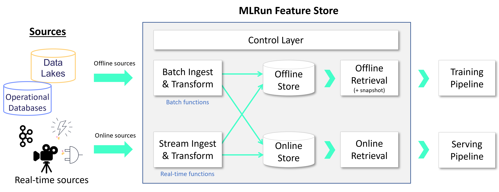

(feature-store)=
# Feature store 

A feature store provides a single pane of glass for sharing all available features across
the organization along with their metadata. The MLRun feature store supports security, versioning, 
and data snapshots, enabling better data lineage, compliance, and manageability.
 
As illustrated in the diagram below,
feature stores provide a mechanism (**`Feature Sets`**) to read data from various online or offline sources,
conduct a set of data transformations, and persist the data in online and offline
storage. Features are stored and cataloged along with all their metadata (schema,
labels, statistics, etc.), allowing users to compose **`Feature Vectors`** and use them for training 
or serving. The feature vectors are generated when needed, taking into account data versioning and time
correctness (time traveling). Different function kinds (Nuclio, Spark, Dask) are used for feature retrieval, real-time
engines for serving, and batch for training.

<br><br>


**In this section**

```{toctree}
:maxdepth: 1

feature-store-overview
feature-sets
transformations
feature-vectors
./end-to-end-demo/index
```