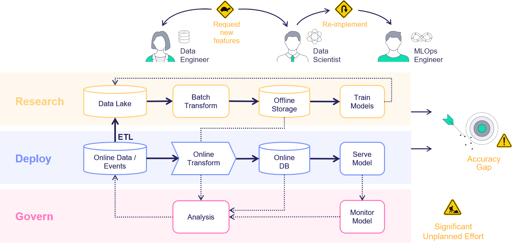
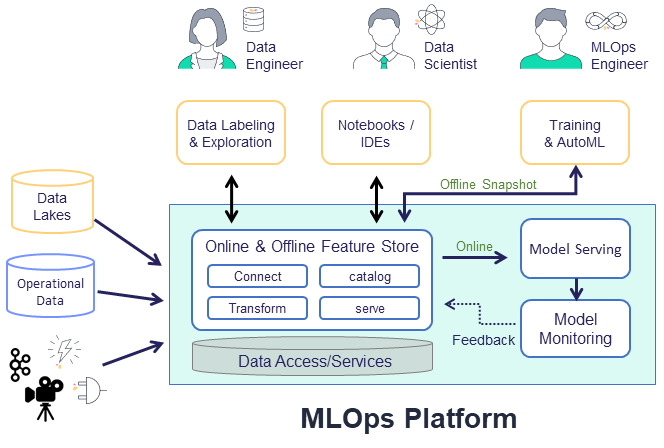

# Feature Store Overview

In Machine-Learning scenarios, generating a new feature, called feature engineering, takes a tremendous amount of work. The same features must be used both for training, based on historical data, and for the model prediction based on the online or real-time data. This creates a significant additional engineering effort, and leads to model inaccuracy when the online and offline features do not match. Furthermore, monitoring solutions must be built to track features and results and send alerts of data or model drift.

Consider, a scenario in which you train a model and one of the features is a comparison of the current amount to the average amount spent during the last 3 months by the same person. Creating such features is easy when you have the full dataset in training, but in serving, one needs to calculate this feature in an online manner. The "brute-force" way to address this, is to have an ML engineer create an online pipeline that reimplements all the feature calculations done in the offline process. This is not just time-consuming and error-prone, but very difficult to maintain over time, leading to lengthy deployment time. This is exacerbated when having to deal with thousands of features with increasing number of Data Engineers and Data Scientists who wish to create and use the features.  

A feature store creates an easy way to define features in training that are deployable to serving without the need to define all the "glue" code. This is done by creating the necessary building blocks to define features and integration with offline and online storage systems to access the features.

The feature store is comprised of the following:
- **Feature** &mdash; In Machine-Learning, a feature is an individual measurable property or characteristic of a phenomenon being observed. This may be raw data (e.g., transaction amount, image pixel, etc.) or a calculation derived from one or more other features (e.g., deviation from average, pattern on image, etc.).
- **Feature set** &mdash; A grouping of features. The grouping is done by setting the entity key or set-of keys. For example, a transaction may be grouped by the person ID performing the transfer or by the device identifier used to perform the transaction. It is also possible to define in the feature set the timestamp source. One can ingest data to a feature set.
- **Execution graph** &mdash; A set of operations performed on the data when it is being ingested. The graph contains steps which represent data sources and targets, and may also contain steps whose purpose is transformations and enrichment of the data passed through the feature set.
- **Feature vector** &mdash; A set of features, taken from one or more feature sets. The feature vector is defined prior to model training and serves as the input to the model training process. During model serving, the feature values in the vector are obtained from an online service.

## How the Feature-Store Works

The common flow when working with the feature store is to first define the feature set with its source, transformation graph, and targets. MLRun introduces a robust transformation engine that allows to perform complex operations in a few lines of Python code. To test the execution process, call the `infer` method with a sample DataFrame, this runs all operations in memory without storing the results. Once The graph is defined, it's time to ingest the data.

With MLRun you can ingest data directly from a DataFrame, this is done by calling the feature set `ingest` method. You may also define an ingestion process that runs as a Kubernetes job, this is useful if there is a large ingestion process, or if there is a recurrent ingestion and you would like to schedule the job. MLRun can also leverage Nuclio to perform real-time ingestion by calling the `deploy_ingestion_service` function. This means that during serving, one can update feature values, and not just read them. For example, one can update a sliding window aggregation as part of a model serving process.

Following data ingestion, the typical process is to create a feature vector and perform model training. Defining the feature vector allows you to join together features across different feature sets by calling the `get_offline_features` function. One can train a model with the feature vector data, by providing the input in the form of `'store://feature-vectors/{project}/{feature_vector_name}'`.

For serving, one defines a serving class derived from `mlrun.serving.V2ModelServer`. In the class `load` method call the `get_online_feature_service` function with the vector name which returns a feature service object. In the class `preprocess` method, call the feature service `get` method to get the values of those features.

For more information, see the detailed MLRun feature store documentation pages, as well as the basic feature store example and end-to-end feature store demo.
