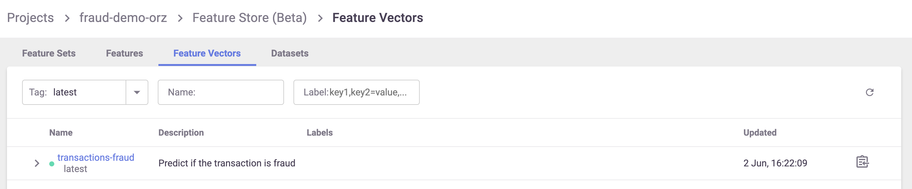
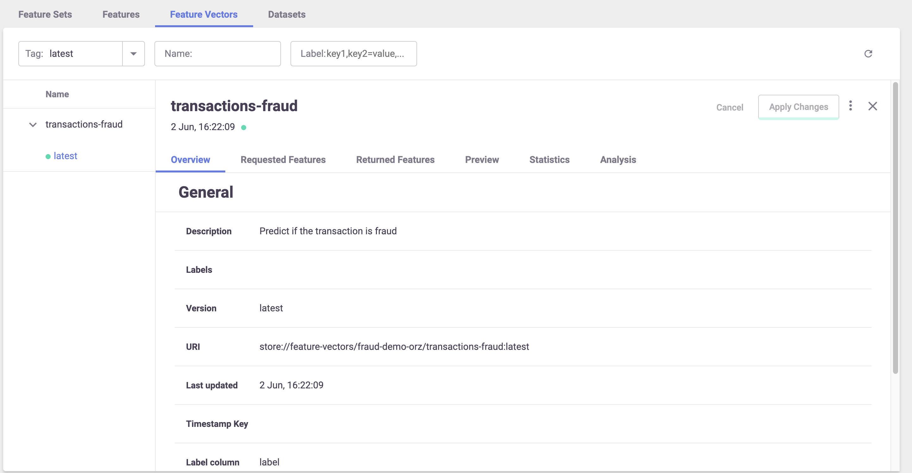

(create-use-feature-vectors)=
# Feature vectors

You can define a group of features from different feature sets as a {py:class}`~mlrun.feature_store.FeatureVector`.  
Feature vectors are used as an input for models, allowing you to define the feature vector once, and in turn create and track the 
{ref}`datasets <retrieve-offline-data>` created from it or the online manifestation of the vector for real-time prediction needs.

The feature vector handles all the merging logic for you using an `asof merge` type merge that accounts for both the time and the entity.
It ensures that all the latest relevant data is fetched, without concerns about "seeing the future" or other types of common time-related errors.

After a feature vector is saved, it can be used to create both offline (static) datasets and online (real-time) instances to supply 
as input to a machine learning model.

**In this section**

- [Creating a feature vector](#creating-a-feature-vector)
- [Using an offline feature vector](#using-an-offline-feature-vector)
- [Using an online feature vector](#using-an-online-feature-vector)

    
## Creating a feature vector

The feature vector object minimally holds the following information:

- Name &mdash; the feature vector's name as will be later addressed in the store reference `store://feature_vectors/<project>/<feature-vector-name>` and the UI (after saving the vector).
- Description &mdash; a string description of the feature vector.
- Features &mdash; a list of features that comprise the feature vector.  
The feature list is defined by specifying the `<feature-set>.<feature-name>` for specific features or `<feature-set>.*` for all of the feature set's features.
- Label feature &mdash; the feature that is the label for this specific feature vector, as a `<feature-set>.<feature-name>` string specification. In classification tasks, the `label_feature` 
may contain the expected label of each record, and be compared with the model output when training or evaluating a model.

Example of creating a feature vector:

```python
import mlrun.feature_store as fstore

# Feature vector definitions
feature_vector_name = "example-fv"
feature_vector_description = "Example feature vector"
features = [
    "data_source_1.*",
    "data_source_2.feature_1",
    "data_source_2.feature_2",
    "data_source_3.*",
]
label_feature = "label_source_1.label_feature"

# Feature vector creation
fv = fstore.FeatureVector(
    name=feature_vector_name,
    features=features,
    label_feature=label_feature,
    description=feature_vector_description,
)

# Save the feature vector in the MLRun DB
# so it can be referenced by the `store://`
# and show in the UI
fv.save()
```

After saving the feature vector, it appears in the UI:



You can also view some metadata about the feature vector, including all the features, their types, a preview, and statistics:



### Feature vectors with different entities and complex joins

```{admonition} Note
This feature is currently in Tech Preview status.
```

You can define a feature vector that joins between different feature sets not using the same entity and with a "complex" join 
types. The join types can differ for different feature set combinations. This configuration supports online and offline 
feature vectors. 

You can define relations within a feature set in two ways:
- Explicitly defining relations within the feature set itself.
- Specifying relations in the context of a feature vector by passing them through the `relations` parameter ({py:class}`~mlrun.feature_store.FeatureVector`). 
    This is a dictionary specifying the relations between feature 
    sets in the feature vector. The keys of the dictionary are feature set names, and the values are both dictionaries whose keys 
    represent column names (of the feature set), and they represent the target entities to join with. The `relations` take
    precedence over the relations that were specified on the feature sets themselves. If a specific feature set is not mentioned 
    as a key in `relations`, the function falls back to using the default relations defined in the feature set.

You can define a graph using the `join_graph` parameter ({py:meth}`~mlrun.feature_store.FeatureVector`), which defines the join type. 
You can use the graph to define complex joins and pass on the relations to the vector.  Currently, only one branch (DAG) is supported. 
This means that operations involving brackets are not available.

You can merge two feature sets when the left one has more entities, only if all the entities of the right feature set exist in the left feature set's entities.
    
When using a left join, you must explicitly specify whether you want to perform an `as_of` join or not. The left join type is the only one that 
implements the "as_of" join.

An example, assuming three feature sets: [fs1, fs2, fs3]:
```
join_graph = JoinGraph(first_feature_set=fs_1).inner(fs_2).outer(fs_3)
vector = FeatureVector("myvector", features, 
                        join_graph=join_graph, 
                        relation={fs_1:{'col_1':'entity_2'}}) # the relation between fs1-> fs3 / fs2-> fs3 is already defined or they have                           the same entity 
```

## Using an offline feature vector

Use the feature store's {py:meth}`~mlrun.feature_store.get_offline_features` function to produce a `dataset` from the feature vector.
It creates the dataset (asynchronously if possible), saves it to the requested target, and returns an {py:class}`~mlrun.feature_store.OfflineVectorResponse`.  
Due to the async nature of this action, the response object contains an `fv_response.status` indicator that, once completed, could be directly turned into a `dataframe`, `parquet` or a `csv`.

`get_offline_features` supports Storey, Dask, Spark Operator, and Remote Spark.

See {py:meth}`~mlrun.feature_store.get_offline_features` for the list of parameters it expects to receive,

You can create a feature vector that comprises different feature sets, while joining the data based on specific fields and not the entity. 
For example:
- Feature set A is a transaction feature set and one of the fields is email.
- Feature set B is feature set with the fields email and count distinct.
You can build a feature vector that comprises fields in feature set A and get the count distinct for the email from feature set B. 
The join in this case is based on the email column.

Here's an example of a new dataset from a Parquet target:

```python
# Import the Parquet Target, so you can build your dataset from a parquet file
from mlrun.datastore.targets import ParquetTarget

# Get offline feature vector based on vector and parquet target
fvec = fstore.get_feature_vector(feature_vector_name)
offline_fv = fvec.get_offline_features(target=ParquetTarget())

# Return dataset
dataset = offline_fv.to_dataframe()
```

After you create an offline feature vector with a static target (such as {py:class}`~mlrun.datastore.targets.ParquetTarget()`) the 
reference to this dataset is saved as part of the feature vector's metadata and can be referenced directly through the store 
as a function input using `store://feature-vectors/{project}/{feature_vector_name}`.

For example:

```python
fn = mlrun.import_function("hub://sklearn-classifier").apply(auto_mount())

# Define the training task, including the feature vector and label
task = mlrun.new_task(
    "training",
    inputs={"dataset": f"store://feature-vectors/{project}/{feature_vector_name}"},
    params={"label_column": "label"},
)

# Run the function
run = fn.run(task)
```

See a full example of using the offline feature vector to create an ML model in [part 2 of the end-to-end demo](./end-to-end-demo/02-create-training-model.html).

You can use `get_offline_features` for a feature vector whose data is not ingested. See 
[Create a feature set without ingesting its data](./feature-sets.html#create-a-feature-set-without-ingesting-its-data).

### Using joins in an offline feature vector

You can create a join for:
- Feature sets that have a common entity
- Feature sets that do not have a common entity

**Feature sets that have a common entity**

In this case, the join is performed on the common entity.

```
employees_set_entity = fs.Entity("id")
employees_set = fs.FeatureSet(
    "employees",
    entities=[employees_set_entity],
)
employees_set.set_targets(targets=["parquet"], with_defaults=False)
fs.ingest(employees_set, employees)

mini_employees_set = fs.FeatureSet(
    "mini-employees",
    entities=[employees_set_entity],
    },
)
mini_employees_set.set_targets(targets=["parquet"], with_defaults=False)
fs.ingest(mini_employees_set, employees_mini)

features = ["employees.name as n", "mini-employees.name as mini_name"]

vector = fs.FeatureVector(
    "mini-emp-vec", features, description="Employees feature vector"
)
vector.save()

resp = fs.get_offline_features(
    vector,
    engine_args=engine_args,
    with_indexes=True,
)
```

**Feature sets that do not have a common entity**

In this case, you define the relations between the features set with the argument: ` relations={column_name(str): Entity}`</br>
and you include this dictionary when initializing the feature set. 

```
departments_set_entity = fs.Entity("d_id")
departments_set = fs.FeatureSet(
    "departments",
    entities=[departments_set_entity],
)

departments_set.set_targets(targets=["parquet"], with_defaults=False)
fs.ingest(departments_set, departments)

employees_set_entity = fs.Entity("id")
employees_set = fs.FeatureSet(
    "employees",
    entities=[employees_set_entity],
    relations={"department_id": departments_set_entity},  # dictionary where the key is str identifying a column/feature on this feature-set, and the dictionary value is an Entity object on another feature-set
)
employees_set.set_targets(targets=["parquet"], with_defaults=False)
fs.ingest(employees_set, employees)
features = ["employees.name as emp_name", "departments.name as dep_name"]

vector = fs.FeatureVector(
    "employees-vec", features, description="Employees feature vector"
)

resp = fs.get_offline_features(
    vector,
    engine_args=engine_args,
    with_indexes=False,
)
```
    

## Using an online feature vector

The online feature vector provides real-time feature vectors to the model using the latest data available.

First create an `Online Feature Service` using {py:meth}`~mlrun.feature_store.FeatureVector.get_online_feature_service` and receive the latest value of the feature vector. Note that the response contains only the features - 
the timestamp (of the last event that updated the feature sets) is not part of the response. 

To create the {py:class}`~mlrun.feature_store.OnlineVectorService` you only need to pass it the feature vector's store reference.

```python
import mlrun.feature_store as fstore

# Create the Feature Vector Online Service
feature_vector = "store://feature-vectors/{project}/{feature_vector_name}"
fvec = fstore.get_feature_vector(feature_vector)
svc = fvec.get_online_feature_service()
```

The online feature service supports value imputing (substitute NaN/Inf values with statistical or constant value). You 
can set the `impute_policy` parameter with the imputing policy, and specify which constant or statistical value will be used
instead of NaN/Inf value. This can be defined per column or for all the columns (`"*"`).
The replaced value can be a fixed number for constants or `$mean`, `$max`, `$min`, `$std`, `$count` for statistical values.
`"*"` is used to specify the default for all features, for example: 

    fvec = fstore.get_feature_vector(feature_vector)
    svc = fvec.get_online_feature_service(impute_policy={"*": "$mean", "age": 33})


To use the online feature service you need to supply a list of entities you want to get the feature vectors for.
The service returns the feature vectors as a dictionary of `{<feature-name>: <feature-value>}` or simply a list of values as numpy arrays.

For example:

```python
# Define the wanted entities
entities = [{"<feature-vector-entity-column-name>": "<entity>"}]

# Get the feature vectors from the service
svc.get(entities)
```

The `entities` can be a list of dictionaries as shown in the example, or a list of lists where the values in the internal 
list correspond to the entity values (e.g. `entities = [["Joe"], ["Mike"]]`). The `.get()` method returns a dict by default. 
If you want to return an ordered list of values, set the `as_list` parameter to `True`. The list input is required by many ML 
frameworks and this eliminates additional glue logic. 
   
When defining a graph using the `join_graph` parameter ({py:meth}`~mlrun.feature_store.FeatureVector`),
the `get_online_feature_service` uses QueryByKey on the key-value store: all join types in the graph turn 
into left joins. Consequently, the function performs joins using the latest events for each required 
entity within each feature set.

You can use the parameter `entity_keys` to join features by relations, instead of common entities. You define the relations, 
and the starting place. 
See {py:meth}`mlrun.feature_store.FeatureVector.get_online_feature_service`.

See a full example of using the online feature service inside a serving function in [part 3 of the end-to-end demo](./end-to-end-demo/03-deploy-serving-model.html).


