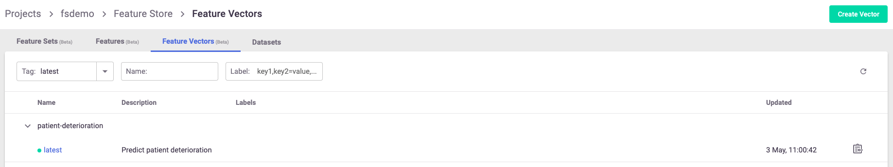

(retrieve-offline-data)=
# Training with the feature store

**In this section**
- [Creating an offline dataset](#creating-an-offline-dataset)
- [Training](#training)

## Creating an offline dataset

An offline dataset is a specific instance of the {ref}`feature vector definition <create-use-feature-vectors>`. To create this instance, use the feature store's 
`get_offline_features(<feature_vector>, <target>)` function on the feature vector using the `store://<project_name>/<feature_vector>` 
reference and an offline target (as in Parquet, CSV, etc.).

You can add a time-based filter condition when running `get_offline_feature` with a given vector. You can also filter with the query argument on all the other features as you like. See {py:meth}`~mlrun.feature_store.get_offline_features`.

<br><br>

```python
import mlrun.feature_store as fstore

feature_vector = "<feature_vector_name>"
fvec = fstore.get_feature_vector(feature_vector)
offline_fv = fvec.get_offline_features(target=ParquetTarget())
```

Behind the scenes, `get_offline_features()` runs a local or Kubernetes job (can be specific by the `run_config` parameter) to retrieve 
all the relevant data from the feature sets, merge them and return it to the specified `target` which can be a local parquet, 
AZ Blob store or any other type of available storage.

Once instantiated with a target, the feature vector holds a reference to the instantiated dataset and references it as its current offline source.

You can also use MLRun's {py:meth}`~mlrun.projects.MlrunProject.log_dataset` to log the specific dataset to the project as a specific dataset resource.

You can use the additional_filters attribute while reading from ParquetTarget, similar to additional_filters in [ParquetSource](sources-targets.md#parquet-source).
## Training

Training your model using the feature store is a fairly simple task. (The offline dataset can also be used for your EDA.)

To retrieve a feature vector's offline dataset, use MLRun's data item mechanism, referencing the feature vector and 
specifying to receive it as a DataFrame.

```python
df = mlrun.get_dataitem(
    f"store://feature-vectors/{project}/patient-deterioration"
).as_df()
```

When trying to retrieve the dataset in your training function, you can put the feature vector reference as an input to 
the function and use the `as_df()` function to retrieve it automatically.

```python
# A sample MLRun training function
def my_training_function(
    context,  # MLRun context
    dataset,  # our feature vector reference
    **kwargs,
):

    # retrieve the dataset
    df = dataset.as_df()

    # The rest of your training code...
```

And now you can create the MLRun project and function and run it locally or over the Kubernetes cluster:

```python
project = mlrun.get_or_create_project("training")
# Creating the training MLRun function with the code
fn = project.set_function(name="training", kind="job", handler="my_training_function")

# Creating the task to run the function with its dataset
task = mlrun.new_task(
    "training",
    inputs={"dataset": f"store://feature-vectors/{project}/{feature_vector_name}"},
)  # The feature vector is given as an input to the function

# Running the function over the kubernetes cluster
fn.run(task)  # Set local=True to run locally
```
