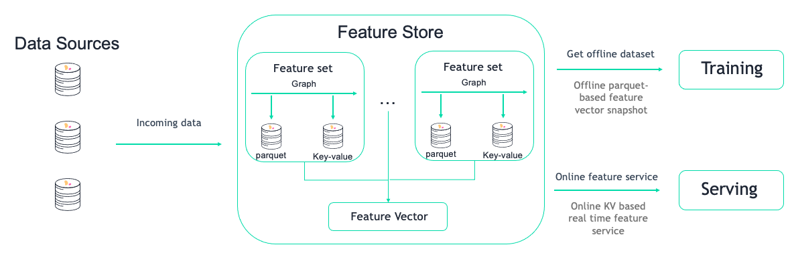

(training)=
# Training and serving using the feature store

When working on a new model we usually care about the experiment's reproducibility, results and how easy it is to re-create the proposed features and model environment for the serving task.  The feature store enables us to do all that in an easy and automated fashion.

After defining our [feature sets](transformations.md) and proposed a [feature vector](feature-vectors.md) for the experiment, the feature store will enable us to automatically extract a versioned **offline** static dataset based on the parquet target defined in the feature sets for training.

For serving, once we validated this is indeed the feature vector we want to use, we will use the **online** feature service, based on the nosql target defined in the feature set for real-time serving.

Using this feature store centric process, using one computation graph definition for a feature set, we receive an automatic online and offline implementation for our feature vectors, with data versioning both in terms of the actual graph that was used to calculate each data point, and the offline datasets that were created to train each model.

## How the solution should look like

<br><br>

## Creating an offline dataset

An "offline" dataset is a specific instance of our feature vector definition.  To create this instance we need to use the feature store's `get_offline_features(<feature_vector>, <target>)` function on our feature vector using the `store://<project_name>/<feature_vector>` reference and an offline target (as in Parquet, CSV, etc...).

<br><br>

```python
import mlrun.feature_store as fstore

feature_vector = '<feature_vector_name>'
offline_fv = fstore.get_offline_features(feature_vector=feature_vector, target=ParquetTarget())
```

Behind the scenes, `get_offline_features()` will run a local or Kubernetes job (can be specific by the `run_config` parameter) to retrieve all the relevant data from the feature sets, merge them and return it to the specified `target` which can be a local parquet, AZ Blob store or any other type of available storage.

Once instantiated with a target, the feature vector will hold a reference to the instantiated dataset and will reference that as it's current offline source.

You can also use MLRun's `log_dataset()` to log the specific dataset to the project as a specific dataset resource.

## Training

Training your model using the feature store is a fairly simple task.  we will now explore how to retrieve the offline dataset for EDA and in your training function.

To simply retrieve a feature vector's offline dataset, you can us MLRun's DataItem mechanism, simply referencing the feature vector and asking to receive it as a DataFrame.

```python
df = mlrun.get_dataitem(f'store://feature-vectors/{project}/patient-deterioration').as_df()
```

When trying to retrieve the dataset in your training function, you can simply put the feature vector reference as an input to the function and use the `as_df()` function to retrieve it automatically.

```python
# A sample MLRun training function
def my_training_function(context, # MLRun context
                         dataset, # our feature vector reference
                         **kwargs):
    
    # retreieve the dataset
    df = dataset.as_df()

    # The rest of your training code...
```

And now we can create our MLRun function and run it locally or over the kubernetes cluster

```python
# Creating the training MLRun function with our code
fn = mlrun.code_to_function('training', 
                            kind='job',
                            handler='my_training_function')

# Creating the task to run our function with our dataset
task = mlrun.new_task('training', 
                      inputs={'dataset': f'store://feature-vectors/{project}/{feature_vector_name}'}) # The feature vector is given as an input to the function

# Running the function over the kubernetes cluster
fn.run(task) # Set local=True to run locally
```

## Get online features

The online features are created ad-hoc using MLRun's feature store online feature service and are served from the **nosql** target for real-time performance needs.

To use it we will first create an online feature service with our feature vector.

```python
import mlrun.feature_store as fstore

svc = fstore.get_online_feature_service(<feature vector name>)
```

After creating the service we can now use the feature vector's Entity to get the latest feature vector for it.
You can pass a list of `{<key name>: <key value>}` pairs to receive a batch of feature vectors.

```python
fv = svc.get([{<key name>: <key value>}])
```

## Incorporating to serving model

MLRun enables you to easily serve your models using our [model server](../serving/serving-graph.md) ([example](https://github.com/mlrun/functions/blob/master/v2_model_server/v2_model_server.ipynb)).
It enables you to define a serving model class and the computational graph required to run your entire prediction pipeline and deploy it as serverless functions using [nuclio](https://github.com/nuclio/nuclio).

To embed the online feature service in your model server, all you need to do is create the feature vector service once when the model initializes and then use it to retrieve the feature vectors of incoming keys.

You can import ready-made classes and functions from our [function marketplace](https://github.com/mlrun/functions) or write your own.
As example of a scikit-learn based model server (taken from our feature store demo):

```python
from cloudpickle import load
import numpy as np
import mlrun
import os

class ClassifierModel(mlrun.serving.V2ModelServer):
    
    def load(self):
        """load and initialize the model and/or other elements"""
        model_file, extra_data = self.get_model('.pkl')
        self.model = load(open(model_file, 'rb'))
        
        # Setup FS Online service
        self.feature_service = mlrun.feature_store.get_online_feature_service('patient-deterioration')
        
        # Get feature vector statistics for imputing
        self.feature_stats = self.feature_service.vector.get_stats_table()
        
    def preprocess(self, body: dict, op) -> list:
        # Get patient feature vector 
        # from the patient_id given in the request
        vectors = self.feature_service.get([{'patient_id': patient_id} for patient_id in body['inputs']])
        
        # Impute inf's in the data to the feature's mean value
        # using the collected statistics from the Feature store
        feature_vectors = []
        for fv in vectors:
            new_vec = []
            for f, v in fv.items():
                if np.isinf(v):
                    new_vec.append(self.feature_stats.loc[f, 'mean'])
                else:
                    new_vec.append(v)
            feature_vectors.append(new_vec)
            
        # Set the final feature vector as our inputs
        # to pass to the predict function
        body['inputs'] = feature_vectors
        return body

    def predict(self, body: dict) -> list:
        """Generate model predictions from sample"""
        feats = np.asarray(body['inputs'])
        result: np.ndarray = self.model.predict(feats)
        return result.tolist()
```

Which we can deploy with:

```python
# Create the serving function from our code above
fn = mlrun.code_to_function(<function_name>, 
                            kind='serving')

# Add a specific model to the serving function
fn.add_model(<model_name>, 
             class_name='ClassifierModel',
             model_path=<store_model_file_reference>)

# Enable MLRun's model monitoring
fn.set_tracking()

# Add the system mount to the function so
# it will have access to our model files
fn.apply(mlrun.mount_v3io())

# Deploy the function to the cluster
fn.deploy()
```

And test using:

```python
fn.invoke('/v2/models/infer', body={<key name>: <key value>})
```
