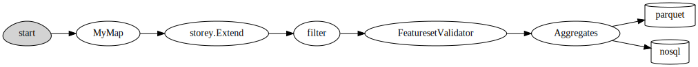
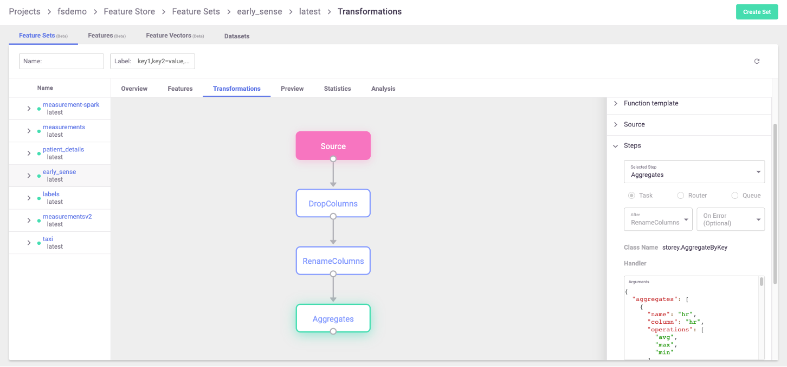

(transformations)=
# Feature set transformations

A feature set contains an execution graph of operations that are performed when data is ingested, or 
when simulating data flow for inferring its metadata. This graph utilizes MLRun's
{ref}`serving-graph`.

The graph contains steps that represent data sources and targets, and may also contain steps whose
purpose is transformations and enrichment of the data passed through the feature set. These transformations
can be provided in one of three ways:

* [**Aggregations**](#aggregations) &mdash; MLRun supports adding aggregate features to a feature set through the 
  {py:func}`~mlrun.feature_store.FeatureSet.add_aggregation` function.

* [**Built-in transformations**](#built-in-transformations) &mdash; MLRun is equipped with a set of transformations 
  provided through the {py:mod}`storey.transformations` package. These transformations can be added to the 
  execution graph to perform common operations and transformations.
  
* [**Custom transformations**](#custom-transformations) &mdash; You can extend the built-in functionality by 
  adding new classes that perform any custom operation and use them in the serving graph.

Once a feature-set is created, its internal execution graph can be observed by calling the feature-set's 
{py:func}`~mlrun.feature_store.FeatureSet.plot` function, which generates a `graphviz` plot based on the internal
graph. This is very useful when running within a Jupyter notebook, and produces a graph such as the 
following example:

<br><br>

This plot shows various transformations and aggregations being used as part of the feature-set processing, as well as 
the targets where results are saved to (in this case two targets). Feature-sets can also be observed in the MLRun
UI, where the full graph can be seen and specific step properties can be observed:

<br><br>

For a full end-to-end example of feature-store and usage of the functionality described in this page, refer
to the [feature store example](./basic-demo.html).

**In this section**
- [Aggregations](#aggregations)
- [Built-in transformations](#built-in-transformations)
- [Custom transformations](#custom-transformations)

## Aggregations

Aggregations, being a common tool in data preparation and ML feature engineering, are available directly through
the MLRun {py:class}`~mlrun.feature_store.FeatureSet` class. These transformations allow adding a new feature to the 
feature-set that is created by performing some aggregate function over feature's values within a time-based 
sliding window.

For example, if a feature-set contains stock trading data including the specific bid price for each bid at any
given time, you could introduce aggregate features that show the minimal and maximal bidding price over all 
the bids in the last hour, per stock ticker (which is the entity in question). To do that, use the code:

```python
import mlrun.feature_store as fstore
# create a new feature set
quotes_set = fstore.FeatureSet("stock-quotes", entities=[fstore.Entity("ticker")])
quotes_set.add_aggregation("bid", ["min", "max"], ["1h"], "10m")
```

Once this is executed, the feature-set has new features introduced, with their names produced from the aggregate
parameters, using this format: `{column}_{operation}_{window}`. Thus, the example above generates two new features:
`bid_min_1h` and `bid_max_1h`. If the function gets an optional `name` parameter, features are produced in `{name}_{operation}_{window}` format.
If the `name` parameter is not specified, features are produced in `{column_name}_{operation}_{window}` format.
These features can then be fed into predictive models or be used for additional 
processing and feature generation.

```{admonition} Notes
- Internally, the graph step that is created to perform these aggregations is named `"Aggregates"`. If more than one
   aggregation steps are needed, a unique name must be provided to each, using the `state_name` parameter.
- The timestamp column must be part of the feature set definition (for aggregation).
```

Aggregations that are supported using this function are:
- `count` 
- `sum`
- `sqr` (sum of squares)
- `max`
- `min`
- `first`
- `last`
- `avg`
- `stdvar`
- `stddev`

For a full documentation of this function, see the {py:func}`~mlrun.feature_store.FeatureSet.add_aggregation` 
documentation.

## Built-in transformations

MLRun, and the associated `storey` package, have a built-in library of [transformation functions](../serving/available-steps.html) that can be 
applied as steps in the feature-set's internal execution graph. In order to add steps to the graph, it should be 
referenced from the {py:class}`~mlrun.feature_store.FeatureSet` object by using the 
{py:attr}`~mlrun.feature_store.FeatureSet.graph` property. Then, new steps can be added to the graph using the
functions in {py:mod}`storey.transformations` (follow the link to browse the documentation and the 
list of existing functions). The transformations are also accessible directly from the `storey` module.

See the [built-in steps](../serving/available-steps.html).

```{admonition} Note
Internally, MLRun makes use of functions defined in the `storey` package for various purposes. When creating a 
feature-set and configuring it with sources and targets, what MLRun does behind the scenes is to add steps to the 
execution graph that wraps methods and classes, which perform the actions. When defining an async execution graph,
`storey` classes are used. For example, when defining a Parquet data-target in MLRun, a graph step is created that 
wraps storey's {py:func}`~storey.writers.WriteToParquet` function.
```

To use a function:

1. Access the graph from the feature-set object, using the {py:attr}`~mlrun.feature_store.FeatureSet.graph` property.
2. Add steps to the graph using the various graph functions, such as {py:func}`~mlrun.feature_store.graph.to()`. 
   The function object passed to the step should point at the transformation function being used.

The following is an example for adding a simple `filter` to the graph, that drops any bid which is lower than
50USD:

```python
quotes_set.graph.to("storey.Filter", "filter", _fn="(event['bid'] > 50)")
```

In the example above, the parameter `_fn` denotes a callable expression that is passed to the `storey.Filter`
class as the parameter `fn`. The callable parameter can also be a Python function, in which case there's no need for
parentheses around it. This call generates a step in the graph called `filter` that calls the expression provided
with the event being propagated through the graph as data is fed to the feature-set.

## Custom transformations

When a transformation is needed that is not provided by the built-in functions, new classes that implement 
transformations can be created and added to the execution graph. Such classes should extend the 
{py:class}`~storey.flow.MapClass` class, and the actual transformation should be implemented within their `do()` 
function, which receives an event and returns the event after performing transformations and manipulations on it.
For example, consider the following code:

```python
class MyMap(MapClass):
    def __init__(self, multiplier=1, **kwargs):
        super().__init__(**kwargs)
        self._multiplier = multiplier

    def do(self, event):
        event["multi"] = event["bid"] * self._multiplier
        return event
```

The `MyMap` class can then be used to construct graph steps, in the same way as shown above for built-in functions:

```python
quotes_set.graph.add_step("MyMap", "multi", after="filter", multiplier=3)
```

This uses the `add_step` function of the graph to add a step called `multi` utilizing `MyMap` after the `filter` step 
that was added previously. The class is initialized with a multiplier of 3.