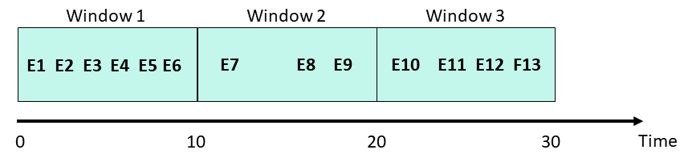

(transformations)=
# Feature set transformations

A feature set contains an execution graph of operations that are performed when data is ingested, or 
when simulating data flow for inferring its metadata. This graph utilizes MLRun's
{ref}`serving-graph`.

The graph contains steps that represent data sources and targets, and may also contain steps whose
purpose is transformations and enrichment of the data passed through the feature set. These transformations
can be provided in one of three ways:

* [**Aggregations**](#aggregations) &mdash; MLRun supports adding aggregate features to a feature set through the 
  {py:func}`~mlrun.feature_store.FeatureSet.add_aggregation` function.

* [**Built-in transformations**](#built-in-transformations) &mdash; MLRun is equipped with a set of transformations 
  provided through the {py:mod}`storey.transformations` package. These transformations can be added to the 
  execution graph to perform common operations and transformations.
  
* [**Custom transformations**](#custom-transformations) &mdash; You can extend the built-in functionality by 
  adding new classes that perform any custom operation and use them in the serving graph.

Once a feature-set is created, its internal execution graph can be observed by calling the feature-set's 
{py:func}`~mlrun.feature_store.FeatureSet.plot` function, which generates a `graphviz` plot based on the internal
graph. This is very useful when running within a Jupyter notebook, and produces a graph such as the 
following example:

<br><br>

This plot shows various transformations and aggregations being used as part of the feature-set processing, as well as 
the targets where results are saved to (in this case two targets). Feature-sets can also be observed in the MLRun
UI, where the full graph can be seen and specific step properties can be observed:

<br><br>

For a full end-to-end example of feature-store and usage of the functionality described in this page, refer
to the [feature store example](./basic-demo.html).

**In this section**
- [Aggregations](#aggregations)
- [Built-in transformations](#built-in-transformations)
- [Custom transformations](#custom-transformations)

## Aggregations

Aggregations, being a common tool in data preparation and ML feature engineering, are available directly through
the MLRun {py:class}`~mlrun.feature_store.FeatureSet` class. These transformations add a new feature to the 
feature-set, which is created by performing an aggregate function over the feature's values.

If the `name` parameter is not specified, features are generated in the format `{column_name}_{operation}_{window}`.  
If you supply the optional `name` parameter, features are generated in the format `{name}_{operation}_{window}`.


Feature names, which are generated internally, must match this regex pattern to be treated as aggregations: 
`.*_[a-z]+_[0-9]+[smhd]$`,<br>
where `[a-z]+` is the name of an aggregation. 

```{admonition} Warning
You must ensure that your features will not conflict with the automatically generated feature names. For example, 
when using `add_aggregation()` on a feature X, you may get a genegated feature name of `X_count_1h`. 
But if your dataset already contains `X_count_1h`, this would result in either unreliable aggregations or errors.
```

If either the pattern or the condition is not met, the feature is treated as a static (or "regular") feature.
    
These features can be fed into predictive models or can be used for additional processing and feature generation.

```{admonition} Notes
- Internally, the graph step that is created to perform these aggregations is named `"Aggregates"`. If more than one
   aggregation steps are needed, a unique name must be provided to each, using the `step_name` parameter.
- The timestamp column must be part of the feature set definition (for aggregation).
```

Aggregations that are supported using this function are:
- `count` 
- `sum`
- `sqr` (sum of squares)
- `max`
- `min`
- `first`
- `last`
- `avg`
- `stdvar` (variance)
- `stddev` (standard deviation)

For full description of this function, see the {py:func}`~mlrun.feature_store.FeatureSet.add_aggregation` 
documentation.

### Windows

You can use aggregation for time-based sliding windows and fixed windows. In general, sliding windows are used for real time data, 
while fixed windows are used for historical aggregations. 

A window can be measured in years, days, hours, seconds, minutes. 
A window can be a single window, e.g. ‘1h’, ‘1d’, or a 
list of same unit windows e.g. [‘1h’, ‘6h’]. If you define the time period (in addition to the window), then you have a sliding window. If 
you don't define the time period, then the time period and the window are the same.
All time windows are aligned to the epoch (1970-01-01T00:00:00Z).

- Sliding window
   
   Sliding windows are fixed-size, overlapping, windows (defined by `windows`) that are evaluated at a sliding
   interval (defined by `period`).  
   The period size must be an integral divisor of the window size. 
      
   The following figure illustrates sliding windows of size 20 seconds, and periods of 10 seconds. Since the period is less than the 
   window size, the windows contain overlapping data. In this example, events E4-E6 are in Windows 1 and 2. When Window 2 is evaluated 
   at time t = 30 seconds, events E4-E6 are dropped from the event queue.
   
      
   
   The following code illustrates a feature-set that contains stock trading data including the specific bid price for each bid at any
   given time. You can add aggregate features that show the minimal and maximal bidding price over all 
   the bids in the last 60 minutes, evaluated (sliding) at a 10 minute interval, per stock ticker (which is the entity in question). 

   ```python
   import mlrun.feature_store as fstore
   # create a new feature set
   quotes_set = fstore.FeatureSet("stock-quotes", entities=[fstore.Entity("ticker")])
   quotes_set.add_aggregation("bid", ["min", "max"], ["1h"], "10m", name="price")
   ```
   
   This code generates two new features: `bid_min_1h` and `bid_max_1h` every 10 minutes. 
   
- Fixed window

   A fixed window has a fixed-size, is non-overlapping, and gapless. 
   A fixed time window is used for aggregating over a time period, (or day of the week). For example, how busy is a 
   restaurant between 1 and 2 pm.<br>
   When using a fixed window, each record in an in-application stream belongs to a specific window. The record is processed only once 
   (when the query processes the window to which the record belongs).  
   
      
   
   To define a fixed window, omit the time period. Using the above example, but for a fixed window:
   
   ```python
   import mlrun.feature_store as fstore
   # create a new feature set
   quotes_set = fstore.FeatureSet("stock-quotes", entities=[fstore.Entity("ticker")])
   quotes_set.add_aggregation("bid", ["min", "max"], ["1h"] name="price")
   ```
   This code generates two new features: `bid_min_1h` and `bid_max_1h` once per hour.  


## Built-in transformations

MLRun, and the associated `storey` package, have a built-in library of [transformation functions](../serving/available-steps.html) that can be 
applied as steps in the feature-set's internal execution graph. To add steps to the graph,  
reference them from the {py:class}`~mlrun.feature_store.FeatureSet` object by using the 
{py:attr}`~mlrun.feature_store.FeatureSet.graph` property. Then, new steps can be added to the graph using the
functions in {py:mod}`storey.transformations` (follow the link to browse the documentation and the 
list of existing functions). The transformations are also accessible directly from the `storey` module.

See the [built-in steps](../serving/available-steps.html).

```{admonition} Note
Internally, MLRun makes use of functions defined in the `storey` package for various purposes. When creating a 
feature-set and configuring it with sources and targets, what MLRun does behind the scenes is to add steps to the 
execution graph that wraps methods and classes that perform the actions. When defining an async execution graph, 
`storey` classes are used. For example, when defining a Parquet data-target in MLRun, a graph step is created that 
wraps storey's [ParquetTarget function](https://storey.readthedocs.io/en/latest/api.html#storey.targets.ParquetTarget).
```

To use a function:

1. Access the graph from the feature-set object, using the {py:attr}`~mlrun.feature_store.FeatureSet.graph` property.
2. Add steps to the graph using the various graph functions, such as {py:func}`~mlrun.feature_store.graph.to()`. 
   The function object passed to the step should point at the transformation function being used.

The following is an example for adding a simple `filter` to the graph, that drops any bid that is lower than
50USD:

```python
quotes_set.graph.to("storey.Filter", "filter", _fn="(event['bid'] > 50)")
```

In the example above, the parameter `_fn` denotes a callable expression that is passed to the `storey.Filter`
class as the parameter `fn`. The callable parameter can also be a Python function, in which case there's no need for
parentheses around it. This call generates a step in the graph called `filter` that calls the expression provided
with the event being propagated through the graph as the data is fed to the feature-set.

## Custom transformations

When a transformation is needed that is not provided by the built-in functions, new classes that implement 
transformations can be created and added to the execution graph. Such classes should extend the 
{py:class}`~storey.flow.MapClass` class, and the actual transformation should be implemented within their `do()` 
function, which receives an event and returns the event after performing transformations and manipulations on it.
For example, consider the following code:

```python
class MyMap(MapClass):
    def __init__(self, multiplier=1, **kwargs):
        super().__init__(**kwargs)
        self._multiplier = multiplier

    def do(self, event):
        event["multi"] = event["bid"] * self._multiplier
        return event
```

The `MyMap` class can then be used to construct graph steps, in the same way as shown above for built-in functions:

```python
quotes_set.graph.add_step("MyMap", "multi", after="filter", multiplier=3)
```

This uses the `add_step` function of the graph to add a step called `multi` utilizing `MyMap` after the `filter` step 
that was added previously. The class is initialized with a multiplier of 3.

## Supporting multiple engines

MLRun supports multiple processing engines for executing graphs. These engines differ in the way they invoke graph
steps. When implementing custom transformations, the code has to support all engines that are expected to run it. 

```{admonition} Note
The vast majority of MLRun's built-in transformations support all engines. The support matrix is available 
[here](../serving/available-steps.html#data-transformations).
```

The following are the main differences between transformation steps executing on different engines:

* `storey` - the step receives a single event (either as a dictionary or as an Event object, depending on whether 
  `full_event` is configured for the step). The step is expected to process the event and return the modified event.
* `spark` - the step receives a Spark dataframe object. Steps are expected to add their processing and calculations to 
  the dataframe (either in-place or not) and return the resulting dataframe without materializing the data. 
* `pandas` - the step receives a Pandas dataframe, processes it, and returns the dataframe.

To support multiple engines, extend the {py:class}`~mlrun.feature_store.steps.MLRunStep` class with a custom
transformation. This class allows implementing engine-specific code by overriding the following methods:
{py:func}`~mlrun.feature_store.steps.MLRunStep._do_storey`, {py:func}`~mlrun.feature_store.steps.MLRunStep._do_pandas` 
and {py:func}`~mlrun.feature_store.steps.MLRunStep._do_spark`. To add support for a given engine, the relevant `do` 
method needs to be implemented. 

When a graph is executed, each step is a single instance of the relevant class that gets invoked as events flow through 
the graph. For `spark` and `pandas` engines, this only happens once per ingestion, since the entire data-frame is fed to 
the graph. For the `storey` engine the same instance's {py:func}`~mlrun.feature_store.steps.MLRunStep._do_storey` 
function will be invoked per input row. As the graph is initialized, this class instance can receive global parameters 
in its `__init__` method that determines its behavior.

The following example class multiplies a feature by a value and adds it to the event. (For simplicity, data type 
checks and validations were omitted as well as needed imports.) Note that the class also extends 
{py:class}`~mlrun.serving.utils.StepToDict` - this class implements generic serialization of graph steps to
a python dictionary. This functionality allows passing instances of this class to `graph.to()` and `graph.add_step()`:

```python
class MultiplyFeature(StepToDict, MLRunStep):
    def __init__(self, feature: str, value: int, **kwargs):
        super().__init__(**kwargs)
        self._feature = feature
        self._value = value
        self._new_feature = f"{feature}_times_{value}"

    def _do_storey(self, event):
        # event is a single row represented by a dictionary
        event[self._new_feature] = event[self._feature] * self._value  
        return event

    def _do_pandas(self, event):
        # event is a pandas.DataFrame
        event[self._new_feature] = event[self._feature].multiply(self._value)
        return event

    def _do_spark(self, event):
        # event is a pyspark.sql.DataFrame
        return event.withColumn(self._new_feature, 
                                col(self._feature) * lit(self._value)
                                )
```

The following example uses this step in a feature-set graph with the `pandas` engine. This example adds a feature called 
`number1_times_4` with the value of the `number1` feature multiplied by 4. Note how the global parameters are passed
when creating the graph step:

```python
import mlrun.feature_store as fstore

feature_set = fstore.FeatureSet("fs-new", 
                                entities=[fstore.Entity("id")], 
                                engine="pandas",
                                )
# Adding multiply step, with specific parameters
feature_set.graph.to(MultiplyFeature(feature="number1", value=4))
df_pandas = fstore.ingest(feature_set, data)
```


