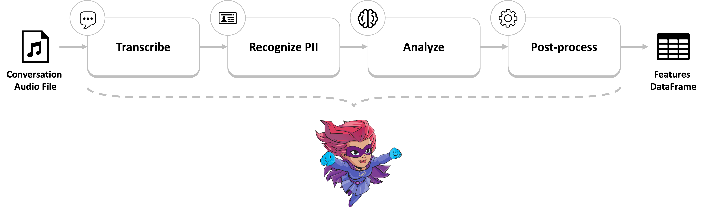
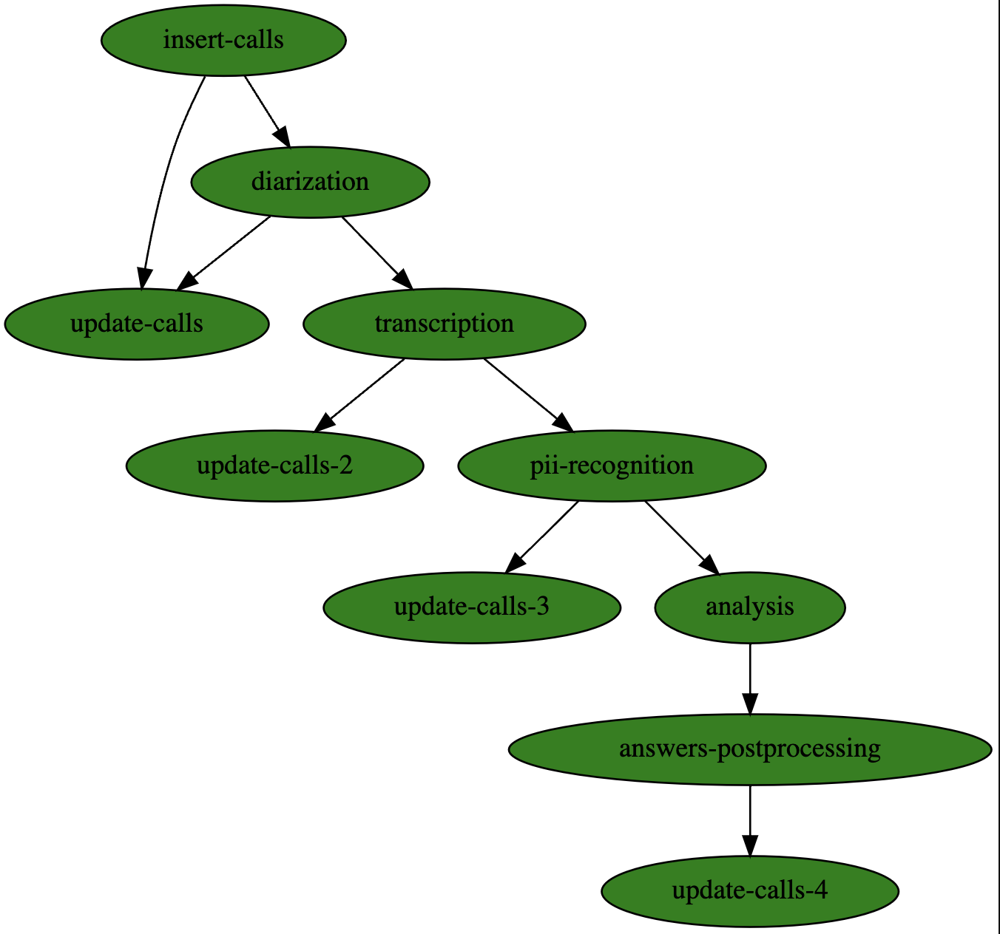

(unstructured-data)=
# Using LLMs to process unstructured data

Unstructured data, such as text, images, and audio files, has become a significant challenge for many industries. The sheer volume of unorganized data can be overwhelming, making it difficult to extract valuable insights or information. This is where Large Language Models (LLMs) come into play.

## The challenge of unstructured data

Unstructured data is the opposite of structured data, which has a predefined format or schema. Text documents, social media posts, emails, and even audio and video recordings are all examples of unstructured data. Processing this type of data can be time-consuming and labor-intensive, often requiring human intervention to extract meaningful information.


### How LLMs can help

LLMs have been trained on large amounts of text data, enabling them to identify patterns, relationships, and context within the data. By applying these capabilities to unstructured text data, LLMs can perform tasks such as:

- **Extract keywords and phrases**: Identify relevant terms and concepts from large bodies of text.

- **Classify and categorize**: Organize unstructured text into predefined categories or classes based on content, sentiment, or intent.

- **Summarize and abstract**: Condense lengthy texts into concise summaries, preserving the most important information.

- **Calculate subjective metrics**: Calculate metrics such as "professionalism" or how well a call center agent adhered to a given script. These are both subjective metrics that are difficult to quantify without a model that has an understanding of patterns and relationships in text.

### Turning unstructured data into structured data

An incredibly powerful way to leverage LLMs is to transform unstructured data into structured data that's more easily analyzed and usable in other applications, ML models, dashboards, etc. Here are some common use cases:

- **Sentiment analysis**: Analyze customer feedback from social media posts or reviews to gauge sentiment and identify trends.

- **Topic modeling**: Identify the main topics and subtopics within a large corpus of text, such as news articles or research papers.

- **Entity extraction**: Extract specific entities like names, locations, and organizations from unstructured text data.

- **Audio transcription**: Convert spoken audio recordings into written transcripts for easy analysis.

## Real world example: call center analytics

A great example of using LLMs to process unstructured data is the [MLRun Call Center Demo](https://github.com/mlrun/demo-call-center). It is based on a real use case with a banking client where audio recordings between call center agents and customers are analyzed into structured data which can be visualized in a dashboard and used in other downstream applications.



### Call analysis workflow
The call analysis workflow includes multiple steps for which all of the main functions are imported from the **[MLRun Function hub](https://www.mlrun.org/hub/)**. You can see each hub function's docstring, code, and example, by clicking the function name in the following list:

1. [**Insert the calls data to the DB**](https://github.com/mlrun/demo-call-center/blob/main/src/calls_analysis/db_management.py) &mdash; Insert the calls metadata to the MySQL DB.
2. [**Perform speech diarization**](https://github.com/mlrun/functions/tree/development/silero_vad) &ndash; ***hub function***: Analyze when each person is talking during the call for subsequent improved transcription and analysis. Diarization gives context to the LLM and yields better results. The function uses the [silero-VAD](https://github.com/snakers4/silero-vad) model. The speech diarization is performed per channel based on the assumption that each channel of the audio in the call center recordings belongs to a different speaker.
3. [**Transcribe**](https://github.com/mlrun/functions/tree/master/transcribe) &ndash; ***hub function***: Uses [Hugging Face's ASR pipeline](https://huggingface.co/transformers/main_classes/pipelines.html#transformers.AutomaticSpeechRecognitionPipeline) with [OpenAI's Whisper models](https://huggingface.co/openai).This function transcribes and translates the calls into text and saves them as text files. It is an optimized version of [OpenAI's Whisper](https://openai.com/research/whisper) package &mdash; enabled to use batching, CPU offloading to multiprocessing workers, and to distribute across multiple GPUs using MLRun and OpenMPI.
4. [**Recognize PII**](https://github.com/mlrun/functions/tree/master/pii_recognizer) &ndash; ***hub function***: Uses three techniques to recognize personally identifiable information: RegEx, [Flair](https://flairnlp.github.io/) and [Microsoft's Presidio Analyzer](https://microsoft.github.io/presidio/analyzer/) and [Anonymizer](https://microsoft.github.io/presidio/anonymizer/). The function clears the recognized personal data and produces multiple artifacts to review and understand the recognition process.
5. [**Analysis**](https://github.com/mlrun/functions/tree/master/question_answering) &ndash; ***hub function***: Uses an LLM to analyze a given text. It expects a prompt template and questions to send to the LLM, and then constructs a dataframe dataset from its answers. This demo uses a GPTQ quantized version of [Mistral-7B](https://huggingface.co/TheBloke/Mistral-7B-OpenOrca-GPTQ) to analyze the calls' conversations. It helps to extract the following features:
   
   * `topic: str` &mdash; The general subject of the call out of a given list of topics.
   * `summary: str` &mdash; The summary of the entire call in few sentences.
   * `concern_addressed: bool` &mdash; Whether the client's concern was addressed at the end of the call. Can be one of {yes, no}.
   * `customer_tone: str` &mdash; The general customer tone durring the call. Can be one of {positive, neutral, negative}.
   * `agent_tone: str` &mdash; The general agent tone during the call. Can be one of {positive, neutral, negative}.   
   * `upsale_attempted: bool` &mdash; Whether the agent tried to upsell the client during the call.
   * `upsale_success: bool` - Whether the upsell attempt was successful.
   * `empathy: int` &mdash; The level of empathy on the part of the agent from 1 to 5.
   * `professionalism: int` &mdash; The agent's professionalism from 1 to 5.
   * `kindness: int` &mdash; How kind was the agent from 1 to 5.
   * `effective_communication: int` &mdash; Efficacy of the agent's communication from 1 to 5.
   * `active_listening: int` &mdash; The level of active listening on the part of the agent from 1 to 5.
   * `customization: int` &mdash; How closely the agent responded to the client's needs from 1 to 5.

6. [**Postprocess analysis answers**](https://github.com/mlrun/demo-call-center/blob/main/src/calls_analysis/postprocessing.py) - A project function used to postprocess the LLM's answers before updating them into the DB.
 
Between each step, there is a call for the function [**Update Calls**](https://github.com/mlrun/demo-call-center/blob/main/src/calls_analysis/db_management.py) that updates the calls DB with the newly collected data and status.

### Before and after
Here you can see an example of a call row in the database before and after the analysis:

In the beginning of the workflow:

| Call ID   | Client ID | Agent ID | Date      | Time    | Audio File |
| :-------- | :-------- | :------- | :-------- | :------ | :--------- |
|123456     | 123456    |AG123     |2023-10-30 |14:12:17 |123.wav     |

After the workflow completion:

| Call ID   | Client ID | Agent ID | Date      | Time    | Status  | Audio File | Transcription File | Anonymized File | Topic     | Summary  | Concern Addressed | Client Tone | Agent Tone | Upsale Attempted | Upsale Success | Empathy | Perfossialism | Kindeness | Effective Communication | Active Listening | Customization |
| :-------- | :-------- | :------- | :-------- | :------ | :------ | :--------- | :----------------- | :-------------- | :-------- | :------- | :---------------: | :---------: | :--------: | :--------------: | :------------: | :-----: | :-----------: | :-------: | :---------------------: | :------------------: | :-----------: |
|123456     | 123456    |AG123     |2023-10-30 |14:12:17 |Analyzed |123.wav     |123.txt             |123.txt.         |Some topic |A summary |True               |Positive.    |Positive.   |False             |True            |3        |4              |5          |4                        |3                      |4              || :--------- | :-------- |

Note that the original data was simply metadata in a database as well as the audio recordings themselves. After the LLM processing pipeline, there is well structured data that can be used in a variety of downstream tasks and applications.

### Running the workflow
Executing the call analysis workflow looks like the following:
```python
workflow_run = project.run(
    name="calls-analysis",
    arguments={
        "batch": project.get_artifact_uri("batch-creation_calls_batch"),
        "calls_audio_files": project.get_artifact_uri("text-to-audio_audio_files"),
        "batch_size": 2,
        "transcribe_model": "openai/whisper-large-v3",
        "translate_to_english": True,
        "pii_recognition_model": "whole",
        "pii_recognition_entities": ["PERSON", "EMAIL", "PHONE"],
        "pii_recognition_entity_operator_map": {
            "PERSON": ("replace", {"new_value": "John Doe"}),
            "EMAIL": ("replace", {"new_value": "john_doe@email.com"}),
            "PHONE": ("replace", {"new_value": "123456789"}),
        },
        "question_answering_model": "TheBloke/Mistral-7B-OpenOrca-GPTQ",
    },
    watch=False,
    dirty=True,
    timeout=60 * 120,
)
```


For more information and full source code, see the [MLRun Call Center Demo](https://github.com/mlrun/demo-call-center).