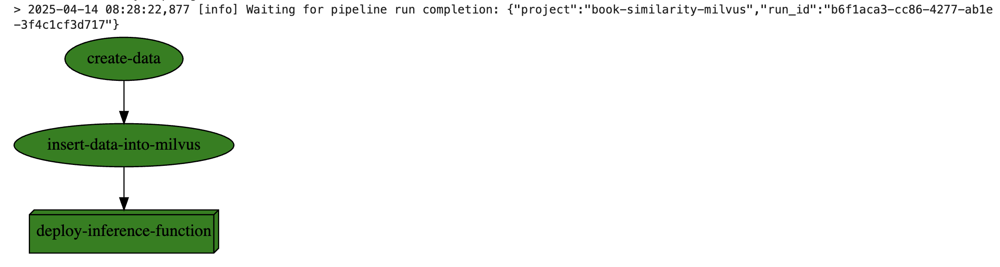
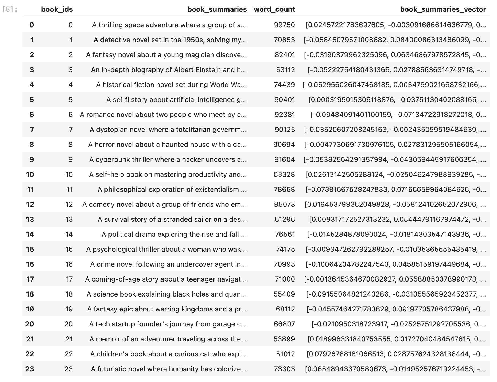
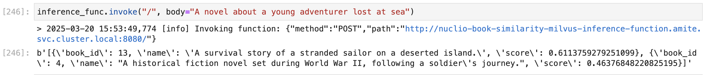

(vector-databases)=
# Vector databases

Vector databases are used to enrich the context of a request before it is passed to a model for inference. This is a common practice in text processing tasks, where the context of a request can significantly impact the model's response. For example, in a conversational AI model, the context of the conversation can help the model understand the user's intent and provide a more accurate response. Another common scenario is using vector databases with RAG (Retrieval-Augmented Generation) models to retrieve relevant documents before generating a response.

Vector databases work by storing vectors that represent the context of a request. These vectors can be generated using various techniques, such as word embeddings. When a request is received, the vector database retrieves the vectors that represent the context of the request and passes them to the model for inference. This allows the model to take into account the context of the request and provide a more accurate response.

In MLRun, you can use vector databases to enrich the context of a request before passing it to a model for inference. This allows you to build more sophisticated models that take into account the context of the request and provide more accurate responses.

MLRun does not come with a VectorDB out-of-the-box: you need to install your choice of DB,

## Using vector databases in MLRun

To use a vector database, you can create a function that stores the text data in the database. Then, typically, during the inference pipeline, you can retrieve the vectors from the database and enrich the context of the request before passing it to the model for inference.

For example, the following function adds data to a ChromaDB vector database:

```python
def handler_chroma(
    context: MLClientCtx, vector_db_data: DataItem, cache_dir: str, collection_name: str
):

    df = vector_db_data.as_df()

    # Create chroma client
    chroma_client = chromadb.PersistentClient(path=cache_dir)

    if collection_name in [c.name for c in chroma_client.list_collections()]:
        chroma_client.delete_collection(name=collection_name)

    # Add data to the collection
    collection = chroma_client.create_collection(name=collection_name)

    collection.add(
        documents=df["title"].tolist(),
        metadatas=[{"topic": topic} for topic in df["topic"].tolist()],
        ids=[f"id{x}" for x in range(len(documents))],
    )

    context.logger.info("Vector DB was created")
```

Then, during inference, you might have a function that retrieves the documents of a specific topic. For example:

```python
collection = chroma_client.get_collection(collection_name)
results = collection.query(query_texts=[topic], n_results=10)
collection.query(query_texts=[topic], n_results=10)
q_context = " ".join([f"#{str(i)}" for i in results["documents"][0]])
prompt_template = f"Relevant context: {q_context}\n\n The user's question: {question}"
```

## Vector database ingestion and inference pipeline
The following example runs an mlrun workflow that creates and ingests data into a Milvus vector DB, then it deploys a nuclio function that enables to query the vector DB.


Create the ingestion functions file (workflow_functions.py)
```python
from sentence_transformers import SentenceTransformer
from pymilvus import CollectionSchema, FieldSchema, DataType, utility, connections, Collection
import random
import time
import pandas as pd

def create_data(context):
    
    # Load a sentence embedding model
    model = SentenceTransformer('all-MiniLM-L6-v2')

    # Expanded list of book summaries
    book_summaries = [
        "A thrilling space adventure where a group of astronauts explore an uncharted galaxy.",
        "A detective novel set in the 1950s, solving mysterious murders.",
        "A fantasy novel about a young magician discovering their powers.",
        "An in-depth biography of Albert Einstein and his contributions to physics.",
        "A historical fiction novel set during World War II, following a soldier's journey.",
        "A sci-fi story about artificial intelligence gaining consciousness.",
        "A romance novel about two people who meet by chance on a train.",
        "A dystopian novel where a totalitarian government controls every aspect of life.",
        "A horror novel about a haunted house with a dark past.",
        "A cyberpunk thriller where a hacker uncovers a corporate conspiracy.",
        "A self-help book on mastering productivity and building habits.",
        "A philosophical exploration of existentialism and the meaning of life.",
        "A comedy novel about a group of friends who embark on a road trip gone wrong.",
        "A survival story of a stranded sailor on a deserted island.",
        "A political drama exploring the rise and fall of a controversial leader.",
        "A psychological thriller about a woman who wakes up with no memory of her past.",
        "A crime novel following an undercover agent infiltrating a drug cartel.",
        "A coming-of-age story about a teenager navigating life and friendships.",
        "A science book explaining black holes and quantum mechanics for beginners.",
        "A fantasy epic about warring kingdoms and a prophecy of a chosen one.",
        "A tech startup founder's journey from garage coding to Silicon Valley success.",
        "A memoir of an adventurer traveling across the globe.",
        "A children's book about a curious cat who explores different cultures.",
        "A futuristic novel where humanity has colonized Mars and faces new challenges."
    ]

    # Convert summaries into vector embeddings
    book_summaries_vectors = model.encode(book_summaries).tolist()
    
    # Generate fake book IDs and word counts
    book_ids = [i for i in range(len(book_summaries))]
    word_count = [random.randint(50_000, 100_000) for _ in book_summaries]  # Random word count

    # Create the data
    data = [book_ids, book_summaries, word_count, book_summaries_vectors]
    
    # Cast the data into a dataframe
    df = pd.DataFrame(data, index=["book_ids", "book_summaries", "word_count", "book_summaries_vector"]).transpose()
    
    # Logs the dataframe as a dataset
    context.log_dataset(key="data", df = df, format="parquet")


    
def insert_data_into_milvus(context, data_uri, alias="default", host="localhost", port="19530"):
    # Connect to the milvus DB
    connections.connect(
      alias=alias,
      host=host,
      port=port
    )
    
    # Create the collection schema
    collection_name = "real_books"
    book_id = FieldSchema(name="book_ids", dtype=DataType.INT64, is_primary=True)
    book_name = FieldSchema(name="book_summaries", dtype=DataType.VARCHAR, max_length=200)
    word_count = FieldSchema(name="word_count", dtype=DataType.INT64)
    book_intro = FieldSchema(name="book_summaries_vector", dtype=DataType.FLOAT_VECTOR, dim=384) #Our model 'all-MiniLM-L6-v2' produces 384-D vectors

    schema = CollectionSchema(
        fields=[book_id, book_name, word_count, book_intro],
        description="Book search with real embeddings",
        enable_dynamic_field=True
    )
    
    # Create the collection
    collection = Collection(name=collection_name, schema=schema, using=alias, shards_num=2)

    # Insert the data into the Milvus collection
    collection.insert(data_uri.as_df())
    
    # Create an index for the collection
    index_params = {
    "metric_type": "COSINE",
    "index_type": "IVF_FLAT",
    "params": {"nlist": 128}
    }
    collection.create_index(field_name="book_summaries_vector", index_params=index_params)
    
    # Disconnect from the DB
    connections.disconnect(alias)
```
Create the nuclio handler file (inference_function.py)
```python
from sentence_transformers import SentenceTransformer
from pymilvus import connections, Collection
import os

def init_context(context):
    
    # Load a sentence embedding model
    setattr(context.user_data, 'my_model', SentenceTransformer('all-MiniLM-L6-v2'))
    
    connections.connect(
      alias=os.environ['alias'],
      host=os.environ['host'],
      port=os.environ['port']
    )
    
def inference_function(context, event):
        
    # Get the collection
    collection = Collection(name="real_books")
    
    # Load the collection to memory
    collection.load()

    if event.body:
        # We get the user search query
        query_text = event.body.decode("utf-8")

    # Convert query to embedding
    query_vector = context.user_data.my_model.encode([query_text]).tolist()

    # Search parameters
    search_params = {
        "metric_type": "COSINE",
        "params": {"nprobe": 10}
    }

    # Perform search
    search_results = collection.search(
        data=query_vector,
        anns_field="book_summaries_vector",
        param=search_params,
        limit=2,
        output_fields=['book_summaries']
    )

    results = []
    
    # Print the results and returns them in the function's response
    for hit in search_results[0]:
        results.append({"book_id":hit.id, "name":hit.entity.get('book_summaries'), "score":hit.distance})
        print(f"Book ID: {hit.id}, Name: {hit.entity.get('book_summaries')}, Score: {hit.distance}")
        
    return context.Response(body=str(results),
                            headers={},
                            content_type='text/plain',
                            status_code=200)
```

Build the custom image with the required dependencies and set the functions as part of the project.
```python
import mlrun
project = mlrun.get_or_create_project("book-similarity-milvus", "./")

# Create the image once and use it in every function
project.build_image(image=".book-similarity-image", base_image="mlrun/mlrun", requirements=["sentence_transformers", "pymilvus"])

# Set the workflow functions
create_data_func = project.set_function(func="workflow_functions.py", name="create-data", kind="job", image=".book-similarity-image",
                                        handler="create_data")
insert_data_into_milvus_func = project.set_function(func="workflow_functions.py", name="insert-data-into-milvus", kind="job", image=".book-similarity-image",
                                       handler="insert_data_into_milvus")

# Set the inference function (nuclio)
inference_func = project.set_function(func="inference_function.py", name="inference-function", kind="nuclio", image=".book-similarity-image", 
                                      handler="inference_function")
```

Create the workflow file (workflow.py).
```python
from kfp import dsl

import mlrun

@dsl.pipeline()
def kfpipeline(alias="default", host="milvus"):
    project = mlrun.get_current_project()
    
    # First we create the data
    create_data_step = mlrun.run_function("create-data", returns=["data"])

    # Then we insert that data into the Vector DB
    insert_data_into_milvus_step = mlrun.run_function("insert-data-into-milvus", inputs={"data_uri":create_data_step.outputs['data'], "alias":"default","host":"milvus", "port":"19530"}).after(create_data_step)
    
    # Then we deploy a nuclio function that we can invoke to get similar books
    project.deploy_function("inference-function", env={"alias":alias, "host":host, "port":"19530"}).after(insert_data_into_milvus_step)
```

Set the workflow and run it.
```python
project.set_workflow(name='populate-milvus-workflow', workflow_path="workflow.py")
project.save()
project.run(name="populate-milvus-workflow", arguments={"alias":"default", "host":"milvus"}, watch=True)
```



In the first step "create-data", the following artifact was created
```python
project.get_artifact("create-data_data").to_dataitem().as_df()
```


We can now get the created nuclio function and invoke it, infering the vector DB and getting books similar to the query
```python
inference_func = project.get_function("inference-function")
inference_func.invoke("/", body="A novel about a young adventurer lost at sea")
```


## Supported vector databases

MLRun does not limit the choice of vector databases you can use. You can use any vector database that fits your use case. Some popular vector databases include:
- [ChromaDB](https://github.com/chroma-core/chroma)
- [milvus](https://github.com/milvus-io/milvus)
- [MongoDB](https://www.mongodb.com/products/platform/atlas-vector-search)
- [Pinecone](https://www.pinecone.io/)

These databases provide different features and capabilities, so you can choose the one that best fits your use case.