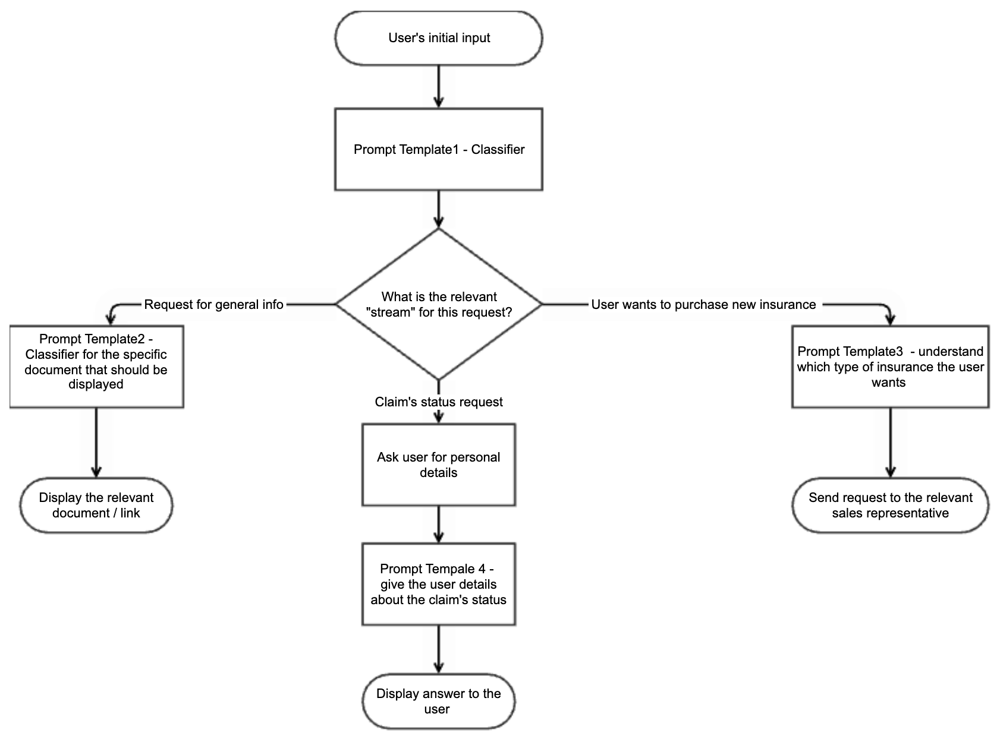

(genai-serving-graph)=
# Gen AI realtime serving graph
Learn how to create a serving graph using multiple LLMs, including specific prompt templates, inside your complete workflow.

Take a project, for example, of an insurance company customer service chatbot that receives customers' requests and gives the best answer according to the customer’s specific data and the company’s procedures.
This would require a few calls for LLMs, each with its purpose, potentially using different prompts and different LLMs. 
The first step is classification: receiving the user’s request and trying to classify it into the pre-defined flow.
This step uses a specific prompt instructing the LLM to classify the request. The LLM's answer can be a short text or a number specifying the classified path. The LLM used at this stage would not require the creation of sophisticated answers, and the invocation configuration can allow only very short answers. 
After the relevant flows are understood, the system can ask the user for their ID and answer the question based on the user’s data, such as the status of their claim. In this case, the LLM and prompt are different.

This page guides you through the basic steps to generate a serving graph using LLMs. For a full example, see the tutorial
[Using LLM prompt templates and artifacts](../../tutorials/genai-04-llm-prompt-artifact.ipynb).




**In this section**
- [Guidelines](#guidelines)
- [Define the LLM prompt template](#define-the-llm-prompt-template)
- [Log the LLM prompt artifacts](#log-the-llm-prompt-artifacts)
- [Serve the graph](#serve-the-graph)

See also
[MLRun fine-tuning demo](https://github.com/mlrun/demo-llm-tuning).

## Guidelines

- One LLM can be used by multiple LLM prompts 
- The `invocation-config` is specific per LLM prompt. For example, you can limit the tokens in a classification step, while other steps do not have a token limitation.
- When the graph is deployed, each model step, which represents a model/prompt combination, is translated to a model endpoint and can be monitored individually.


## Define the LLM prompt template 

Prompt templates guide the LLM to generate responses based on user queries and the role of this specific LLM call in the workflow. They
use variables to define the format of the prompt. 
The name of the template is important, since you will use it subsequently in filters and searches.

The prompt template format is a `list[dict]`, using variables to define the format of the prompt:
```
prompt_template = [
{ "role": "system", "content": "You are a helpful assistant ..." },
{ "role": "user", "content": "please help with this issue {user_message}" }
]
```

- There is no limitation on the list’s size, although common cases will have 2 dictionaries (system and user)
- Each content can hold plain text, a place holder or a combination of both.
- The place holders names are relevant for the entire template:  if there is a place holder “user_input” it can be used inside a few contents, and will always be the same.
- The `prompt_path` / `target_path` point to a JSON file that follows the same structure as above.
- (Optional) arguments: A dictionary of argument names and their description: what is the expected value.


## Log the LLM prompt artifacts

LLM prompt artifacts capture a prompt definition for LLM interactions. You can log prompt artifacts (to your project) with an inline prompt template, or from a file, and with optional metadata like generation parameters, a legend for variable injection, and references to a parent model artifact. 
Prompt artifacts are uniquely defined by their LLM, prompt template, and the model generation configuration.

See the parameters and examples in {py:meth}`~mlrun.projects.MlrunProject.log_llm_prompt`. 

```
project/context.log_llm_prompt(
  key,
  description: str = "", # User-provided description for this prompt template.

  prompt: str,       # Prompt text, with possible template params.
  template_params: dict = None, # Configurations for the template params.

  # Model artifact should support both local files, and URLs/remote paths to
  # remote models.
  model_artifact: Union[ModelArtifact, str] = None,
  model_config: dict = None,

  # General artifact identification and metadata params.
  artifact_path=None,
  tag = None,
  labels: Union[list[str], str] = None, # A single label or a list of labels. Each of format key[=value]
  **kwargs,
)
```

Here are examples of an inline prompt template and a template from a file:
```python
# Log directly with an inline prompt template
project.log_llm_prompt(
    key="customer_support_prompt",
    prompt_template=[
        {
            "role": "system",
            "content": "You are a helpful customer support assistant.",
        },
        {
            "role": "user",
            "content": "The customer reports: {issue_description}",
        },
    ],
    prompt_legend={
        "issue_description": {
            "field": "user_issue",
            "description": "Detailed description of the customer's issue",
        },
        "solution": {
            "field": "proposed_solution",
            "description": "Suggested fix for the customer's issue",
        },
    },
    model_artifact=model,
    invocation_config={"temperature": 0.5, "max_tokens": 200},
    description="Prompt for handling customer support queries",
    tag="support-v1",
    labels={"domain": "support"},
)

# Log a prompt from file
project.log_llm_prompt(
    key="qa_prompt",
    prompt_path="prompts/template.json",
    prompt_legend={
        "question": {
            "field": "user_question",
            "description": "The actual question asked by the user",
        }
    },
    model_artifact=model,
    invocation_config={"temperature": 0.7, "max_tokens": 256},
    description="Q&A prompt template with user-provided question",
    tag="v2",
    labels={"task": "qa", "stage": "experiment"},
)
```


## Serve the graph

Models can be either local or remote. See {ref}`genai-serving`.
The graph uses the {py:class}`mlrun.serving.ModelRunnerStep`, enabling the running of multiple models on each event.
When the graph is deployed, each model step, which represents a model/prompt combination, is translated to a model endpoint.

```
class Model():
    def __init__(name, ModelArtifact):
        # initialization.

    def load():
        # load the model from the artifact.

    # The predict method expects the body to contain a propmt.
    def predict(body):
        prompt = self.extract_prompt_from_body(body)
        # predict locally.

# A class that proxies a local/remote model. Initialized by an LLM-prompt.
class ModelProxy(Model):
    def __init__(name, llm_prompt: LLMPromptArtifact):
        # initialization.
        model_path = llm_prompt.model_path

    def load():
        # do nothing.
        pass

    def predict(body):
        # call the model's predict method, if it exists locally.
        if g1 := graph.get_model(model_path):
            # Enrich the body with the prompt to use.
            self.add_propmt_to_body(body, llm_prompt.prompt)
            g1.predict(body)
        else:
            # fail.


model = ModelArtifact("hugging_face://model1")
# Behind the scenes this create a Model class instance with the model provided.
# The graph keeps a mapping of the model path (hugging_face://model1) to the model name (m1).
graph.add_model("m1", model)

# Two different prompts for the same model.
model_artifact_1 = LLMPromptArtifact(model, "my first prompt")
model_artifact_2 = LLMPromptArtifact(model, "my second prompt")

# Create a model runner step with same model and different prompts.
# Since the model path in the artifact is the same, it will know to invoke step m1.
m1 = ModelProxy(name="m1_prompt1", model_artifact_1)
m2 = ModelProxy(name="m1_prompt2", model_artifact_2)

model_runner_step = ModelRunnerStep(
    name="my_model_runner",
    model_selector="MyModelSelector",
)

# These models actually just invoke the model step. They are tracked separately
# by Model Monitoring, though.
model_runner_step.add_model(m1)
model_runner_step.add_model(m2)
graph.to(model_runner_step)
```

## Distributed pipelines

By default, all steps of the serving graph run on the same pod in sequence. It is possible to run different steps on different pods using 
{ref}`distributed pipelines<distributed-graph>`.Typically you run steps that require CPU on one pod, and steps that require a GPU on a 
different pod that is running on a potentially different node that has GPU support.