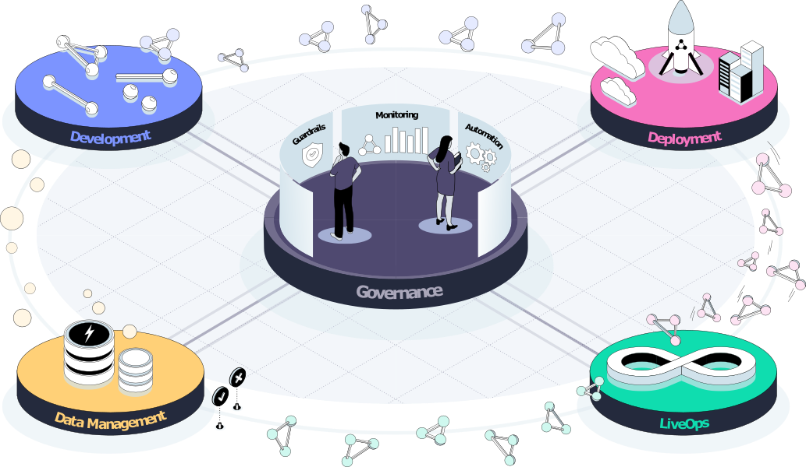

(genai-flow)=

# Gen AI development workflow

MLRun automates the flow of tuning, validation, and optimizing LLMs to specific data - efficiently over elastic resources. 
It rapidly deploys scalable real-time serving and application pipelines that host the LLM as well as the data integration and business logic.
MLRun has built-in monitoring for LLM data, training, model, and resources, with automated model retraining.
It is an open solution, supporting various LLMs and flexible deployment options (any cloud, and on-prem).

The general stages of developing and scaling a GenAI model across an enterprise entails:
1. Personalize a pre-trained model with your pre-trained data.
2. Implement measures to reduce risk: data quality (preparing data before the training), testing (ensure the model is 
doing exactly what it should be doing), guard  (answers are correct, not toxic, etc.), human feedback (examine it and return the model).
2. Build a scalable, automated, and continuous development environment.
2. Continuous monitoring and evaluation of the model, data, etc.

GenAI is a workflow in constant motion.
It's important to keep your design flexible. New solutions come out all the time, and you 
may find a better one in the near future.

A typical scenario may utilize multiple models over an entire flow. The simpler models (evaluating input for toxicity) 
probably do not need an LLM, whereas the main model does require an LLM. understand your various models so that you can 
apportion your resources appropriately. (See {ref}`mlops-dev-flow` for more details about non-LLM models.)

The implementation of a GenAI workflow is illustrated in the following figure:

[MLRun's Function hub](https://www.mlrun.org/hub/functions) provides a collection of reusable functions 
and assets that are optimized and tested to simplify and accelate the move to production.

- {ref}`genai-data-mgmt`
- {ref}`genai-development`
- {ref}`genai-deployment`
- {ref}`genai-live-ops`

