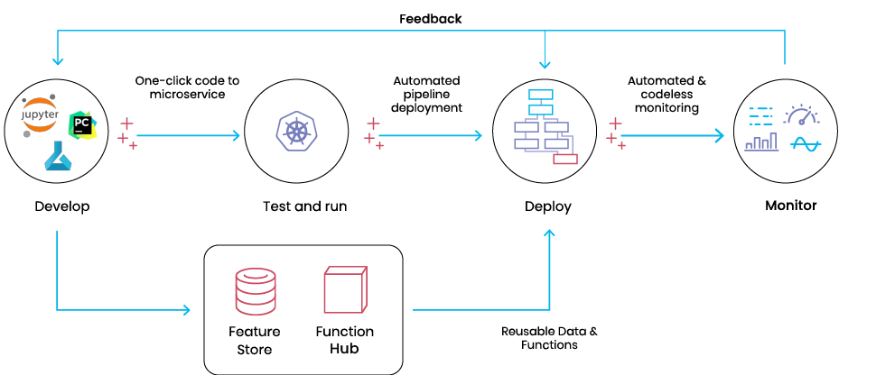

(architecture)=
# What is MLRun? <!-- omit in toc -->
- [The challenge](#the-challenge)
- [MLRun - The Open Source MLOps Orchestration](#why-mlrun)
- [Architecture](#architecture)
- [What can you do with MLRun?](#what-can-you-do)

## The challenge

Most data science solutions and platforms on the market today begin and therefore emphasize the research workflow. 
When it comes time to integrate the generated models into real-world AI applications, they have significant functionality gaps.

These types of solutions tend to be useful only for the model development flow, and contribute very little to the production pipeline: 
automated data collection and preparation, automated training and evaluation pipelines, real-time application pipelines, 
data quality and model monitoring, feedback loops, etc.

To address the full ML application lifecycle, it’s common for organizations to combine many different tools which then forces 
them to develop and maintain complex glue layers, introduce manual processes, and creates technology silos that slow down 
developers and data scientists. 

With this disjointed approach, the ML team must re-engineer the entire flow to fit production environments and methodologies 
while consuming excessive resources. Organizations need a way to streamline the process, 
automate as many tasks as possible, and break the silos between data, ML, and DevOps/MLOps teams.

## MLRun - The Open Source MLOps Orchestration

Instead of this siloed, complex and manual process, MLRun enables production pipeline design using a modular strategy, 
where the different parts contribute to a continuous, automated, and far simpler path from research and development to scalable 
production pipelines, without refactoring code, adding glue logic, or spending significant efforts on data and ML engineering.

MLRun uses **Serverless Function** technology: write the code once, using your preferred development environment and 
simple "local" semantics, and then run it as-is on different platforms and at scale. MLRun automates the build process, execution, 
data movement, scaling, versioning, parameterization, outputs tracking, CI/CD integration, deployment to production, monitoring, and more. 

Those easily developed data or ML "functions" can then be published or loaded from a marketplace and used later to form offline or real-time 
production pipelines with minimal engineering efforts.

 

Data preparation, model development, model and application delivery, and end to end monitoring are tightly connected: 
they cannot be managed in silos. This is where MLRun MLOps orchestration comes in. ML, data, and DevOps/MLOps teams 
collaborate using the same set of tools, practices, APIs, metadata, and version control.

<b>MLRun simplifies & accelerates the time to production.</b>

## Architecture 

  
MLRun is composed of the following layers:

- **{ref}`Feature Store <feature-store>`** &mdash; collects, prepares, catalogs, and serves data features for development (offline) and real-time (online) 
usage for real-time and batch data.
- **{ref}`ML CI/CD pipeline <ci-integration>`** &mdash; automatically trains, tests, optimizes, and deploys or updates models using a snapshot of the production 
data (generated by the feature store) and code from the source control (Git).
- **{ref}`Real-Time Serving Pipeline <serving>`** &mdash; Rapid deployment of scalable data and ML pipelines using real-time serverless technology, including 
the API handling, data preparation/enrichment, model serving, ensembles, driving and measuring actions, etc.
- **{ref}`Real-Time monitoring and retraining <model_monitoring>`** &mdash; monitors data, models, and production components and provides a feedback loop for exploring production data, identifying drift, alerting on anomalies or data quality issues, triggering re-training jobs, measuring business impact, etc.

While each of those layers is independent, the integration provides much greater value and simplicity. For example:
- The training jobs obtain features from the feature store and update the feature store with metadata, which will be used in the serving or monitoring.
- The real-time pipeline enriches incoming events with features stored in the feature store, and can also use feature metadata (policies, statistics, schema, etc.) to impute missing data or validate data quality.
- The monitoring layer collects real-time inputs and outputs from the real-time pipeline and compares them with the features data/metadata from the feature store or model metadata generated by the training layer. It writes all the fresh production data back to the feature store so it can be used for various tasks such as data analysis, model re-training (on fresh data), model improvements.

When one of the components detailed above is updated, it immediately impacts the feature generation, the model serving pipeline, and the monitoring. MLRun applies versioning to each component, as well as versioning and rolling upgrades across components.

## What can you do with MLRun?

With MLRun, you get a complete MLOps solution, supporting the following scenarios

### Ingest and process data

MLRun supports all data types including:
- Structured data, such as table or semi-structured data, such as JSON
- Text unstructured data
- Other unstructured data, such as image or video processing

MLRun also includes data transformation capabilities, this allows you to change the data as part of your data ingestion process. Alternatively, you may choose to use the raw data as-is (e.g., if all data transformation occurs prior to data ingestion).

### Continuous model development

MLRun has model training capabilities, you can develop and test your model in MLRun, or reference an external pre-trained model. With MLRun you can train with any existing framework, such as scikit-learn, XGBoost and LightGBM, as well as deep learning frameworks such as Tensorflow, PyTorch and SpaCy.

By defining feature vectors, you can define a feature selection process, and train a model using only the most crucial features. MLRun further supports the training process by allow hyperparameter tuning and model training at scale, by leveraging frameworks such as Dask and Horovod (MPI).

If you choose to use an existing model, you can bring your own, or use pre-trained model, such as those provided by Hugging Face.

### Deploy models & ML applications

It is possible to run models using online serving as well as batch inference. MLRun takes model execution a step further, and allow you to define a whole pipeline along with the model. This allows you to perform additional tasks, such as data manipulation prior to running a model as well as act upon the result of the model (e.g., for decisioning or for using the model output as a feature of other models).

### Model & data monitoring

Monitoring is built-in and is easy to set-up. One of the key advantages of using MLRun is that you don't have to create your own monitoring solution, as you can easily get operational, model and data results and alerts with an easy-to-use API. As an added bonus, you get monitoring UI out-of-the-box.

### MLOps automation and CI/CD

One of the key advantages of having the Data Engineer and Data Scientist use MLRun, is automation. An ML Engineer will have all the required building blocks created during the development and test processes available to easily automate using Continuous Integration and Continuous Deployment.
