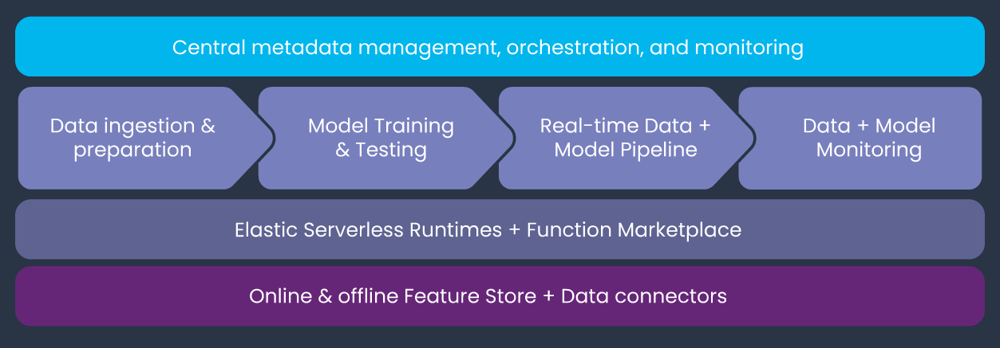

.. mlrun documentation master file, created by
   sphinx-quickstart on Thu Jan  2 15:59:37 2020.
   You can adapt this file completely to your liking, but it should at least
   contain the root `toctree` directive.

MLRun Package Documentation
============================

*The Open-Source MLOps Orchestration Framework.*

Introduction
************

MLRun is an open-source MLOps framework that offers an integrative approach to managing your machine-learning pipelines from early development through model development to full pipeline deployment in production.
MLRun offers a convenient abstraction layer to a wide variety of technology stacks while empowering data engineers and data scientists to define the feature and models.

**MLRun Architecture**

MLRun comprises of the following layers:

- **Feature & Artifact Store** - Handle the ingestion, processing, metadata and storage of data and features across multiple repositories and technologies
- **Elastic Serverless Runtimes** - Convert simple code to scalable and managed micro-services with
  workload specific runtime engines (Kubernetes jobs, Nuclio, Dask, Spark, Horovod, etc.)  .
- **ML Pipeline Automation** - Automated data preparation, model training & testing,
  deployment of production (real-time) pipelines, and end to end monitoring.
- **Central Management** - Unified portal, UI, CLI, and SDK to manage the entire MLOps workflow which is
  accessible from everywhere.

*Check the different documentation sections to learn about each of the components*

Key Benefits
------------

MLRun provides the following key benefits:

- **Rapid deployment** of code to production pipelines
- **Elastic scaling** of batch and real-time workloads
- **Feature management** – ingestion, preparation, and monitoring
- **Works anywhere** – your local IDE, multi-cloud, or on-prem

Table Of Content
----------------

.. toctree::
   :maxdepth: 1
   :caption: MLRun Basics:

   quick-start
   tutorial/index
   architecture
   install
   howto/index

.. toctree::
   :maxdepth: 1
   :caption: ML Pipelines:

   job-submission-and-tracking
   projects
   serving/index

.. toctree::
   :maxdepth: 1
   :caption: Serverless Runtimes:

   runtimes/functions
   runtimes/mlrun_jobs
   runtimes/dask-overview
   runtimes/horovod
   runtimes/spark-operator
   load-from-marketplace

.. toctree::
   :maxdepth: 1
   :caption: Feature & Artifacts Store:

   store/datastore
   store/artifacts
   store/models
   store/feature-store-demo

.. toctree::
   :maxdepth: 1
   :caption: References:

   examples
   cli
   genindex
   api/index
