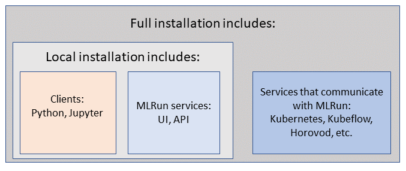

# Installation and setup guide <!-- omit in toc -->

This guide outlines the steps for installing and running MLRun. 
Once MLRun is installed you can access it remotely from your IDE (PyCharm or VSCode), read [**IDE configuration**](./howto/remote.html#ide-configuration). 

## Overview

MLrun has two parts: the client and the server. The client is installed by a simple `pip install` command.
There are two options to deploy the server side:
- [Docker (local installation)](install-local-docker-reg): Use this option to run your code locally on your laptop.
```{admonition} Note
Docker does not include Nuclio and therefore cannot be used to deploy serving functions.
```
- [Kubernetes (full installation)](install-kubernetes): Use this option to run MLRun jobs at scale on a kubernetes cluster.

The enterprise version of MLrun is deployed in an Iguazio cluster.



<a id="MLRun-client-backward-compatibility"></a>
## MLRun client backward compatibility  

Starting from MLRun 0.10.0, the MLRun client and images are compatible with minor MLRun releases that are released during the following 6 months. When you upgrade to 0.11.0, for example, you can continue to use your 0.10-based images. 

```{admonition} Important
- Images from 0.9.0 are not compatible with 0.10.0. Backward compatibility starts from 0.10.0. 
- When you upgrade the MLRun major version, for example 0.10.x to 1.0.x, there is no backward compatibility. 
- The feature store is not backward compatible. 
- When you upgrade the platform, for example from 3.2 to 3.3, the clients should be upgraded. There is no guaranteed compatibility with an older MLRun client after a platform upgrade. 
```

See also [Images and their usage in MLRun](./runtimes/images.html#mlrun-images-and-how-to-build-them).

**Installation options:**
```{toctree}
:maxdepth: 1

install-kubernetes
install-local-docker-reg
howto/remote
```