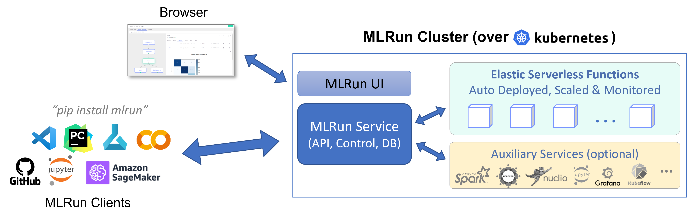

(install-setup-guide)=
# Installation and setup guide <!-- omit in toc -->

This guide outlines the steps for installing and running MLRun. 

MLRun has two main components, the service and the client (SDK and UI):

- MLRun service runs over Kubernetes (can also be deployed using local Docker for demo and test purposes). It can orchestrate and integrate with other open source open source frameworks, as shown in the following diagram. 
- MLRun client SDK is installed in your development environment and interacts with the service using REST API calls. 

This release of MLRun supports only Python 3.9 for both the server and the client. 

<p align="center"></p><br>

**In this section**
- [Deployment options](#deployment-options)
- [Set up your client](#set-up-your-client)
- [Security](#security)

## Deployment options

The deployment options are:
- {ref}`Kubernetes cluster<install-on-kubernetes>`: Deploy an MLRun server on Kubernetes.
   This option deploys MLRun on a Kubernetes cluster, which supports elastic scaling. Yet, it is more complex to install as it requires you to install Kubernetes on your own.
- [Iguazio's Managed  Service](https://www.iguazio.com): A commercial offering by Iguazio. This is the fastest way to explore the full set of MLRun functionalities.<br>
  Note that Iguazio provides a 14 day free trial.

## Set up your client

You can work with your favorite IDE (e.g. PyCharm, VSCode, Jupyter, Colab, etc.). Read how to configure your client against the deployed
MLRun server in {ref}`install-remote`.

Once you have installed and configured MLRun, follow the [Quick Start tutorial](https://docs.mlrun.org/en/latest/tutorials/01-mlrun-basics.html) and additional {ref}`Tutorials and Examples<tutorial>` to learn how to use MLRun to develop and deploy machine learning applications to production.


<a id="MLRun-client-backward-compatibility"></a>
### MLRun client backward compatibility  

Starting from MLRun v1.3.0, the MLRun server is compatible with the client and images of the previous two minor MLRun releases. When you upgrade to v1.3.0, for example, you can continue to use your v1.1- and v1.2-based images, but v1.0-based images are not compatible.

```{admonition} Important
- Images from 0.9.0 are not compatible with 0.10.0. Backward compatibility starts from 0.10.0. 
- When you upgrade the MLRun major version, for example 0.10.x to 1.0.x, there is no backward compatibility. 
- The feature store is not backward compatible. 
- When you upgrade the platform, for example from 3.2 to 3.3, the clients should be upgraded. There is no guaranteed compatibility with an older MLRun client after a platform upgrade. 
```

See also {ref}`images-usage`.


## Security

### Non-root user support

By default, MLRun assigns the root user to MLRun runtimes and pods. You can improve the security context by changing the security mode, 
which is implemented by Iguazio during installation, and applied system-wide:
- Override: Use the user id of the user that triggered the current run or use the `nogroupid` for group id. Requires Iguazio v3.5.1.
- Disabled: Security context is not auto applied (the system applies the root user). (default)

### Security context

If your system is configured in disabled mode, you can apply the security context to individual runtimes/pods by using `function.with_security_context`, and the job is assigned to the user or to the user's group that ran the job.<br>
(You cannot override the user of individual jobs if the system is configured in override mode.) The options are:

```
from kubernetes import client as k8s_client

security_context = k8s_client.V1SecurityContext(
            run_as_user=1000,
            run_as_group=3000,
        )
function.with_security_context(security_context)
```
See the [full definition of the V1SecurityContext object](https://github.com/kubernetes-client/python/blob/master/kubernetes/docs/V1SecurityContext.md).

Some services do not support security context yet:
- Infrastructure services
   - Kubeflow pipelines core services
- Services created by MLRun
   - Kaniko, used for building images. (To avoid using Kaniko, use prebuilt images that contain all the requirements.) 
   - Spark services


```{toctree}
:hidden:
:maxdepth: 1

install/kubernetes
install/remote
```
