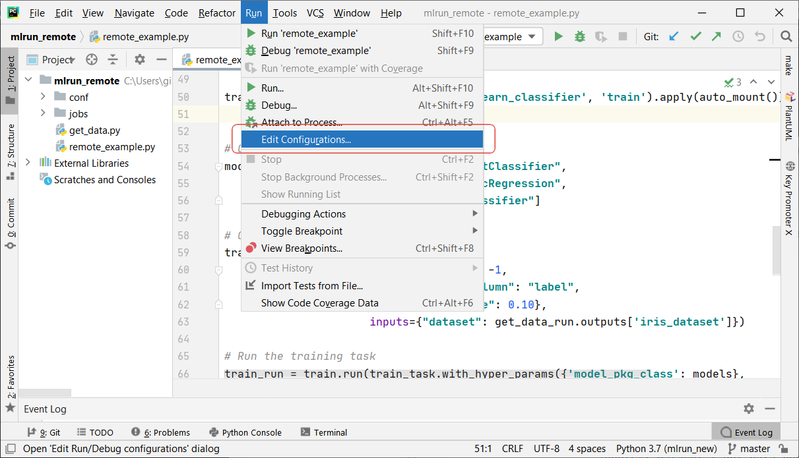
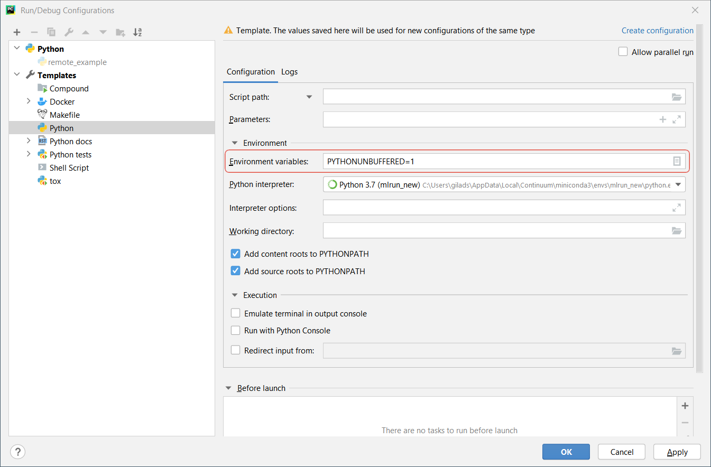
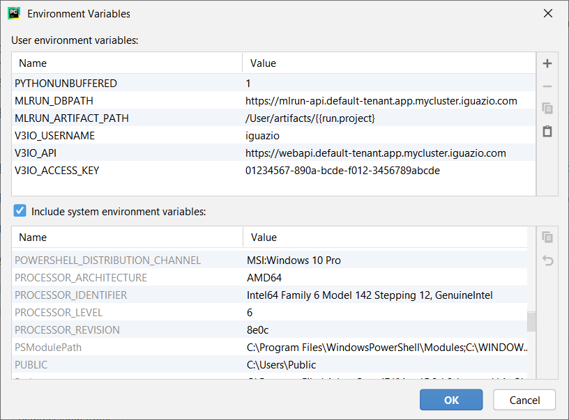
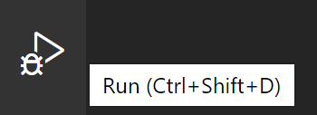
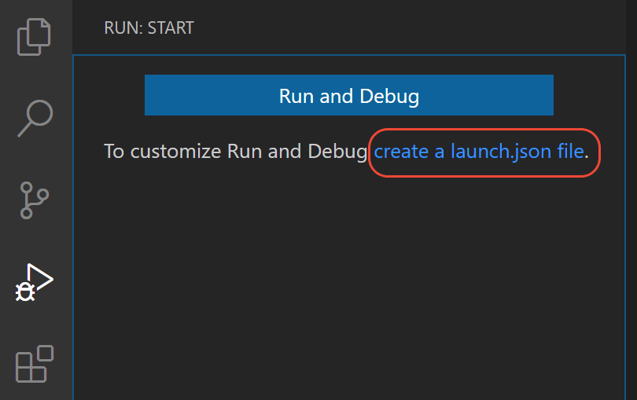
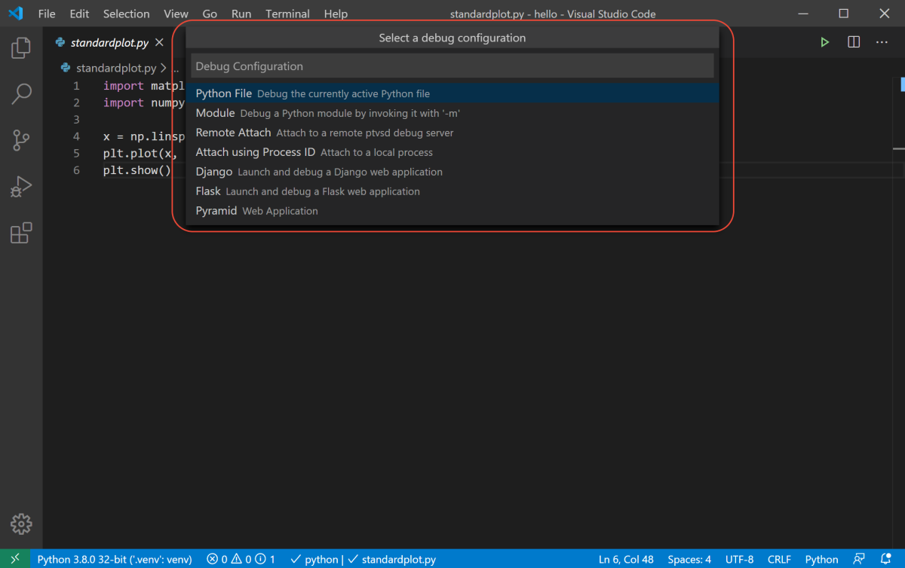
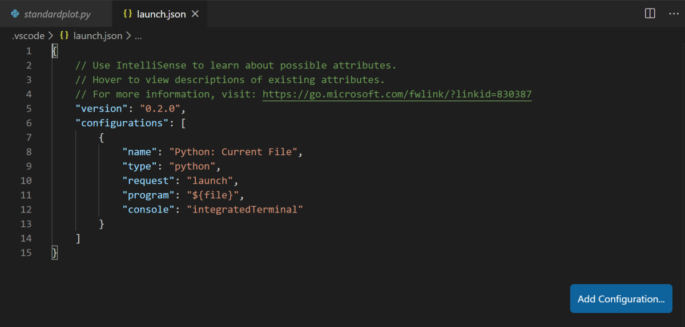

(install-remote)=
# Set up your environment <!-- omit in toc -->

You can write your code on a local machine while running your functions on a remote cluster. This tutorial explains how to set this up.

This release of MLRun supports only Python 3.9 for both the server and the client. 

**In this section**
- [Prerequisites](#prerequisites)
- [Set up a Python 3.9 client environment](#set-up-a-python-3-9-client-environment)
- [Configure remote environment](#configure-remote-environment)
   - [Using `mlrun config set` command in MLRun CLI](#using-mlrun-config-set-command-in-mlrun-cli)
   - [Using `mlrun.set_environment` command in MLRun SDK](#using-mlrun-set-environment-command-in-mlrun-sdk)
   - [Using your IDE (e.g. PyCharm or VSCode)](#using-your-ide-e-g-pycharm-or-vscode)
- [Setting up a dark site](#setting-up-a-dark-site)

<a id="prerequisites"></a>
## Prerequisites

Before you begin, ensure that the following prerequisites are met:

Applications:
- Python 3.9
- Recommended pip 22.x+

The MLRun server is based on a Python 3.9 environment. It's recommended to move the client to a Python 3.9 environment as well. 

For a Python 3.7 environment for platform versions up to and including v3.5.2, see [Set up a Python 3.7 client environment](../change-log/index.html#set-up-a-python-3-7-client-environment-iguazio-versions-up-to-and-including-v3-5-2).

## MLRun client supported OS
The MLRun client supports:
- Linux
- Mac
- Windows via WSL

## Set up a Python 3.9 client environment 

1.  **Basic** <br> 
Run ```pip install mlrun```
<br>This installs MLRun locally with the requirements in the [requirements.txt](https://github.com/mlrun/mlrun/blob/development/requirements.txt).

```{admonition} Note
To install a specific version, use the command: `pip install mlrun==<version>`. Replace the `<version>` placeholder with the MLRun version number.
```

## Note for ARM64 (Apple Silicon) Users

When using ARM64 (Apple Silicon), you need to use **conda** and install protobuf by running the following command:

```bash
conda install "protobuf>=3.20.3, <4" -y
````

2. **Advanced** <br> 
   - If you expect to connect to, or work with, cloud providers (Azure/Google Cloud/S3), you can install additional packages. This is not 
   part of the regular requirements since not all users work with those platforms. Using this option reduces the dependencies and the size 
   of the installation. The additional packages include:
     - ```pip install mlrun[s3]``` Install requirements for S3 
     - ```pip install mlrun[azure-blob-storage]``` Install requirements for Azure blob storage
     - ```pip install mlrun[google-cloud-storage]``` Install requirements for Google cloud storage
   
      
   - To install all extras, run: ```pip install mlrun[complete]``` See the full list [here](https://github.com/mlrun/mlrun/blob/development/dependencies.py#L25).<br>
     
3. Alternatively, if you already installed a previous version of MLRun, upgrade it by running:

    ```sh
    pip install -U mlrun==<version>
    ```

4. Ensure that you have remote access to your MLRun service (i.e., to the service URL on the remote Kubernetes cluster).
5. When installing other python packages on top of MLRun, make sure to install them with mlrun in the same command/requirement file to avoid version conflicts. For example:
    ```sh
    pip install mlrun <other-package>
    ```
    or
    ```sh
    pip install -r requirements.txt
    ```
    where `requirements.txt` contains:
    ```
    mlrun
    <other-package>
    ```
    Do so even if you already have MLRun installed so that pip will take MLRun requirements into consideration when installing the other package.

## Configure remote environment
You have a few options to configure your remote environment:
- [Using `mlrun config set` command in MLRun CLI](#using-mlrun-config-set-command-in-mlrun-cli)
- [Using `mlrun.set_environment` command in MLRun SDK](#using-mlrun-set-environment-command-in-mlrun-sdk)
- [Using your IDE (e.g PyCharm or VSCode)](#using-your-ide-e-g-pycharm-or-vscode)

### Using `mlrun config set` command in MLRun CLI

**Example 1**<br>
Run this command in MLRun CLI:
 ```
 mlrun config set -a http://localhost:8080
 ```

It creates the following environment file:
```
# this is an env file
MLRUN_DBPATH=http://localhost:8080
```

MLRUN_DBPATH saves the URL endpoint of the MLRun APIs service endpoint. Since it is localhost, username and access_key are not required (as in Example2) <br>

**Example 2**<br>
**Note:** Only relevant if your remote service is on an instance of the Iguazio AI Platform (**not MLRun CE**). <br>
Run this command in MLRun CLI:
 ```
 mlrun config set -a https://mlrun-api.default-tenant.app.xxx.iguazio-cd1.com -u joe -k mykey -e 
 ```

It creates the following environment file:
```
# this is another env file
V3IO_USERNAME=joe
V3IO_ACCESS_KEY=mykey
MLRUN_DBPATH=https://mlrun-api.default-tenant.app.xxx.iguazio-cd1.com
```

V3IO_USERNAME saves the username of a platform user with access to the MLRun service.
V3IO_ACCESS_KEY saves the platform access key.

You can get the platform access key from the platform dashboard: select the user-profile picture or icon from the top right corner of any 
page, and select **Access Keys** from the menu. In the **Access Keys** window, either copy an existing access key or create a new 
key and copy it. Alternatively, you can get the access key by checking the value of the `V3IO_ACCESS_KEY` environment variable in a web shell or Jupyter Notebook service.

```{admonition} Note
If the MLRUN_DBPATH points to a remote iguazio cluster and the V3IO_API and/or V3IO_FRAMESD vars are not set, they are inferred from the DBPATH.
```

**Explanation:**

The `mlrun config set` command sets configuration parameters in mlrun default or the specified environment file. By default, it stores all 
of the configuration into the default environment file, and your own environment file does not need editing. The default environment file is 
created by default at `~/.mlrun.env`. 

The `set` command can work with the following parameters:
- `--env-file` or `-f` to set the url path to the mlrun environment file
- `--api` or `-a` to set the url (local or remote) for MLRun API
- `--username` or `-u` to set the username 
- `--access-key` or `-k` to set the access key 
- `--artifact-path` or `-p` to set the [artifact path](https://docs.mlrun.org/en/latest/store/artifacts.html?highlight=artifact_path#artifact-path)
- `--env-vars` or `-e` to set additional environment variables, e.g. -e `ENV_NAME=<value>`

### Using `mlrun.set_environment` command in MLRun SDK

You can set the environment using `mlrun.set_environment` command in MLRun SDK and either use the `env_file` parameter that saves the 
path/url to the `.env` file (which holds MLRun config and other env vars) or use `args` (without uploading from the environment file), for example:

```python
# Use local service
mlrun.set_environment("http://localhost:8080", artifact_path="./")
# Use remote service
mlrun.set_environment("<remote-service-url>", access_key="xyz", username="joe")
```

For more explanations read the documentation [mlrun.set_environment](https://docs.mlrun.org/en/latest/api/mlrun.html?highlight=set_env_from_file()#mlrun.set_environment).

### Using your IDE (e.g. PyCharm or VSCode)

Use these procedures to access MLRun remotely from your IDE. These instructions are for PyCharm and VSCode.

#### Create environment file

Create an environment file called `mlrun.env` in your workspace folder. Copy-paste the configuration below:

``` ini
# Remote URL to mlrun service
MLRUN_DBPATH=<API endpoint of the MLRun APIs service endpoint; e.g., "https://mlrun-api.default-tenant.app.mycluster.iguazio.com">
# Iguazio platform username
V3IO_USERNAME=<username of a platform user with access to the MLRun service>
# Iguazio V3IO data layer credentials (copy from your user settings)
V3IO_ACCESS_KEY=<platform access key>
```

```{admonition} Note
If your remote service is on an instance of the Iguazio AI Platform, you can get all these parameters from the platform dashboard: select 
the user-profile picture or icon from the top right corner of any page, and select  **Remote settings**. They are copied to the clipboard.
```

```{admonition} Note
Make sure that you add `.env` to your `.gitignore` file. The environment file contains sensitive information that you should not store in your source control.
```

#### Remote environment from PyCharm

You can use PyCharm with MLRun remote by changing the environment variables configuration.

1. From the main menu, choose **Run | Edit Configurations**.

    
    

2. To set-up default values for all Python configurations, on the left-hand pane of the run/debug configuration dialog, expand the 
**Templates** node and select the **Python** node. The corresponding configuration template appears in the right-hand pane. Alternatively, 
you can edit a specific file configuration by choosing the corresponding file on the left-hand pane. Choose the **Environment Variables** 
edit box and expand it to edit the environment variables.

    
    

3. Add the environment variable and value of `MLRUN_DBPATH`.

    
    

   > If the remote service is on an instance of the Iguazio AI Platform, also set the environment variables and values of `V3IO_USERNAME`, and `V3IO_ACCESS_KEY`.

#### Remote environment from VSCode

Create a [debug configuration in VSCode](https://code.visualstudio.com/docs/python/debugging). Configurations are defined in a `launch.json` 
file that's stored in a `.vscode` folder in your workspace.

To initialize debug configurations, first select the **Run** view in the sidebar:



If you don't yet have any configurations defined, you'll see a button to Run and Debug, as well as a link to create a configuration (launch.json) file:



To generate a `launch.json` file with Python configurations:

1. Click the **create a launch.json file** link (circled in the image above) or use the **Run** > **Open configurations** menu command.

2. A configuration menu opens from the Command Palette. Select the type of debug configuration you want for the opened file. For now, in the 
**Select a debug configuration** menu that appears, select **Python File**.


```{admonition} Note
Starting a debugging session through the Debug Panel, **F5** or **Run > Start Debugging**, when no configuration exists also brings up the 
debug configuration menu, but does not create a launch.json file.
```

3. The Python extension then creates and opens a `launch.json` file that contains a pre-defined configuration based on what you previously 
selected, in this case **Python File**. You can modify configurations (to add arguments, for example), and also add custom configurations.

   

#### Set environment file in debug configuration

Add an `envFile` setting to your configuration with the value of `${workspaceFolder}/mlrun.env`

If you created a new configuration in the previous step, your `launch.json` would look as follows:

```javascript
{
    // Use IntelliSense to learn about possible attributes.
    // Hover to view descriptions of existing attributes.
    // For more information, visit: https://go.microsoft.com/fwlink/?linkid=830387
    "version": "0.2.0",
    "configurations": [
        {
            "name": "Python: Current File",
            "type": "python",
            "request": "launch",
            "program": "${file}",
            "console": "integratedTerminal",
            "envFile": "${workspaceFolder}/mlrun.env"
        }
    ]
}
```

## Setting up a dark site
Use this procedure for the MLRun package, and any other packages you want to install on a dark site.

To install a package in a dark (air-gapped) site:
1. Download the packages: conda==23.1.0, pip.
2. Pack the conda package file and upload it to your dark system.
2. Install the tar.gz by running:

   ```
   conda install -y <package-filename>.tar.gz 
   ```