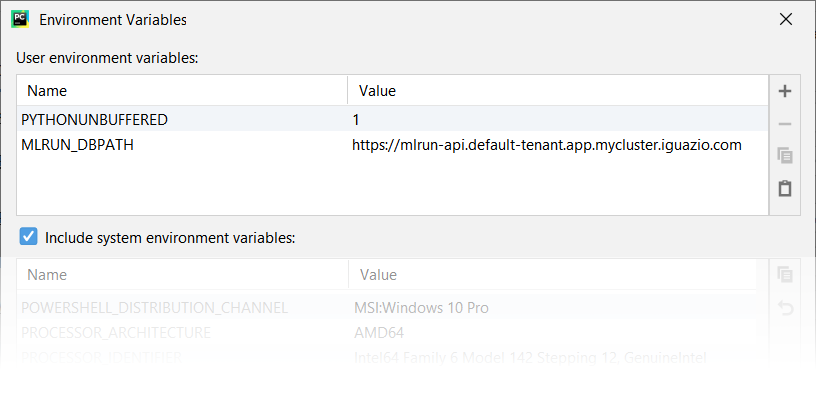

(install-remote)=
# Set up your client environment <!-- omit in toc -->

You can write your code on a local machine while running your functions on a remote cluster. This tutorial explains how to set this up.

**In this section**
- [Prerequisites](#prerequisites)
- [Configure remote environment](#configure-remote-environment)
   - [Using the default `.env` file (**Recommended**)](#using-the-default-env-file-recommended)
   - [Using your own environment file](#using-your-own-environment-file)
   - [Using MLRun SDK or CLI](#using-mlrun-sdk-or-cli)
   - [Using your IDE (e.g PyCharm or VSCode)](#using-your-ide-eg-pycharm-or-vscode)
      - [Remote environment from PyCharm](#remote-environment-from-pycharm)
      - [Remote environment from VSCode](#remote-environment-from-vscode)
         - [Create environment file](#create-environment-file)
         - [Create Python debug configuration](#create-python-debug-configuration)
         - [Set environment file in debug configuration](#set-environment-file-in-debug-configuration)


<a id="prerequisites"></a>
## Prerequisites

Before you begin, ensure that the following prerequisites are met:

1. Applications:
   - Python 3.7   
   - Recommended pip 22.x+

2. Install MLRun locally.

    You need to install MLRun locally. Make sure the that the MLRun version you install is the same as the MLRun 
    service version. Install a specific version using the following command; replace the `<version>`  placeholder 
    with the MLRun version number (e.g., `1.0.0`):
 
    ```sh
    pip install mlrun==<version>
    ```
	
	There are a two `pip install` options:
   - To install the requirements in the [requirements.txt](https://github.com/mlrun/mlrun/blob/development/requirements.txt), run:<br>
     ```pip install mlrun```
   - If you expect to connect to, or work with, cloud providers (Azure/Google Cloud/S3), you can install additional packages. 
      This is not part of the regular requirements since not all users work with those platforms. Using this option reduces the 
      dependencies and the size of the installation. The additional packages include:
      - pip install mlrun[s3] # Install requirements for S3 
      - pip install mlrun[azure-blob-storage] # install requirements for Azure blob storage
      - pip install mlrun[google-cloud-storage] # install requirements for Google cloud storage
   
      See the full list [here](https://github.com/mlrun/mlrun/blob/development/setup.py#L75).<br>
      To install all extras, run:<br>
      ```pip install mlrun[complete]```
     
3. Alternatively, if you already installed a previous version of MLRun, upgrade it by running:

    ```sh
    pip install -U mlrun==<version>
    ```

4. Ensure that you have remote access to your MLRun service (i.e., to the service URL on the remote Kubernetes cluster).

## Configure remote environment
You have few options to configure your remote environment:
1. Using the default `.env` file (**Recommended**)
  - The default `.env` file is located by default at `~/.mlrun.env` for Linux and `%USERPROFILE%/.mlrun.env` for Windows
  - The file can be edited manually or with `mlrun config set` command line (see below explanations of this command)
2. Using your own environment file
3. Using MLRun SDK or CLI
4. Using your IDE (e.g PyCharm or VSCode)

### Using the default `.env` file (**Recommended**)

Run `mlrun config set` command line to set configuration parameters in mlrun default or specified `.env` file. By default, it stores all of the configuration into the default environment file, and your own environment file does not need editing.

The `set` command can work with the following parameters:
    - `--env-file` or `-f` to set the url path to the mlrun `.env file` 
    - `--api` or `-a` to set the url (local or remote) for MLRun API
    - `--artifact-path` or `-p` to set the artifact path (optional)
    - `--username` or `-u` to set the username (for remote access)
    - `--access-key` or `-k` to set the access key (for remote access)
    - `--env-vars` or `-e` to set the environment variables (optional)
   
Example:
 ```
 mlrun config set -a http://localhost:8080 -u joe -k mykey -e AWS_ACCESS_KEY_ID=<key-id>
 ```

### Using your own environment file

You can load the env via config file when working from remote (e.g. via PyCharm).
   
Example `.env` file:

```
# this is an env file
V3IO_USERNAME=admin
V3IO_ACCESS_KEY=MYKEY123
MLRUN_DBPATH=https://mlrun-api.default-tenant.app.xxx.iguazio-cd1.com
AWS_ACCESS_KEY_ID=XXXX
AWS_SECRET_ACCESS_KEY=YYYY
```

Usage:

   - `set_env_from_file()` for reading `.env` files, setting the OS environment and reloading MLRun config
   - `project.set_secrets()` reads dict or secrets env file and stores it in the project secrets
      (note that MLRUN_DBPATH and V3IO_xxx vars are not written to the project secrets)
   - `function.set_envs()` set the pod environment variables from key/value dict or `.env` file

```{admonition} Note
The V3IO API is determined automatically. If you want to connect to a different V3IO service, set the service in the variable,br. `V3IO_API=<API endpoint of the webapi service endpoint; e.g., "https://default-tenant.app.mycluster.iguazio.com:8444">`
```

```
# set the env vars from a file and also return the results as a dict (e.g. for using in a function)
env_dict = mlrun.set_env_from_file(env_path, return_dict=True)

# read env vars from dict or file and set as project secrets (plus set the local env)
project.set_secrets({"SECRET1": "value"})
project.set_secrets(file_path=env_file)

# copy env from file into a function spec
function.set_envs(file_path=env_file)
```

### Using MLRun SDK or CLI

**You can set the environment using MLRun SDK, for example:**

```python
# Use local service
mlrun.set_environment("http://localhost:8080", artifact_path="./")
# Use remote service
mlrun.set_environment("<remote-service-url>", access_key="xyz", username="joe")
```

Explanation:

1. Set `MLRUN_DBPATH` to the URL of the remote MLRun database/API service:

    ```ini
    MLRUN_DBPATH=<URL endpoint of the MLRun APIs service endpoint; e.g., "https://mlrun-api.default-tenant.app.mycluster.iguazio.com">
    ```

2. If the remote service is on an instance of the Iguazio MLOps Platform (**not relevant for MLRun CE**), set the following environment variables as well:

    ```ini
    V3IO_USERNAME=<username of a platform user with access to the MLRun service>
    V3IO_ACCESS_KEY=<platform access key>
    ```

    You can get the platform access key from the platform dashboard: select the user-profile picture or icon from the top right corner of 
    any page, and select **Access Keys** from the menu. In the **Access Keys** window, either copy an existing access key or create a new 
    key and copy it. Alternatively, you can get the access key by checking the value of the `V3IO_ACCESS_KEY` environment variable in a web-shell or Jupyter Notebook service.


**You can also set the environment using MLRun CLI, for example:**

1. Create an env file similar to the example, with lines in the form KEY=VALUE, and comment lines starting with "#".
2. Use `--env-file <env file path>` in mlrun run/build/deploy/project CLI commands to load the config and credential env vars from file.
3. Set the `MLRUN_ENV_FILE=<env file path>` env var to point to a default env file (which will be loaded on import).
   If the `MLRUN_DBPATH` points to a remote iguazio cluster and the `V3IO_API` and/or `V3IO_FRAMESD` vars are not set, they will be inferred from the DBPATH.
4. Add the default `env` file template in the Jupyter container `~/env` (to allow quick setup of remote demos).

### Using your IDE (e.g PyCharm or VSCode)

Use these procedures to access MLRun remotely from your IDE (PyCharm or VSCode).

#### Remote environment from PyCharm

You can use PyCharm with MLRun remote by changing the environment variables configuration.

1. From the main menu, choose **Run | Edit Configurations**.

    

2. To set-up default values for all Python configurations, on the left-hand pane of the run/debug configuration dialog, expand the **Templates** node and select the **Python** node. The corresponding configuration template appears in the right-hand pane. Alternatively, you can edit a specific file configuration by choosing the corresponding file on the left-hand pane. Choose the **Environment Variables** edit box and expand it to edit the environment variables.

    

3. Add the environment variable and value of `MLRUN_DBPATH`.

    

   > If the remote service is on an instance of the Iguazio MLOps Platform, also set the environment variables and values of `V3IO_USERNAME`, and `V3IO_ACCESS_KEY`.

#### Remote environment from VSCode

##### Create environment file

Create an environment file called `mlrun.env` in your workspace folder. Copy-paste the configuration below:

``` ini
# Remote URL to mlrun service
MLRUN_DBPATH=<API endpoint of the MLRun APIs service endpoint; e.g., "https://mlrun-api.default-tenant.app.mycluster.iguazio.com">
# Iguazio platform username
V3IO_USERNAME=<username of a platform user with access to the MLRun service>
# Iguazio V3IO data layer credentials (copy from your user settings)
V3IO_ACCESS_KEY=<platform access key>
```

```{admonition} Note
Make sure that you add `.env` to your `.gitignore` file. The environment file contains sensitive information that you should not store in your source control.
```

#### Create Python debug configuration

Create a [debug configuration in VSCode](https://code.visualstudio.com/docs/python/debugging). Configurations are defined in a `launch.json` file that's stored in a `.vscode` folder in your workspace.

To initialize debug configurations, first select the Run view in the sidebar:


If you don't yet have any configurations defined, you'll see a button to Run and Debug, as well as a link to create a configuration (launch.json) file:


To generate a `launch.json` file with Python configurations:

1. Click the **create a launch.json file** link (circled in the image above) or use the **Run** > **Open configurations** menu command.

2. A configuration menu opens from the Command Palette. Select the type of debug configuration you want for the opened file. For now, in the **Select a debug configuration** menu that appears, select **Python File**.


```{admonition} Note
Starting a debugging session through the Debug Panel, **F5** or **Run > Start Debugging**, when no configuration exists also brings up the debug configuration menu, but does not create a launch.json file.
```

3. The Python extension then creates and opens a `launch.json` file that contains a pre-defined configuration based on what you previously selected, in this case **Python File**. You can modify configurations (to add arguments, for example), and also add custom configurations.

   

#### Set environment file in debug configuration

Add an `envFile` setting to your configuration with the value of `${workspaceFolder}/mlrun.env`

If you created a new configuration in the previous step, your `launch.json` would look as follows:

```javascript
{
    // Use IntelliSense to learn about possible attributes.
    // Hover to view descriptions of existing attributes.
    // For more information, visit: https://go.microsoft.com/fwlink/?linkid=830387
    "version": "0.2.0",
    "configurations": [
        {
            "name": "Python: Current File",
            "type": "python",
            "request": "launch",
            "program": "${file}",
            "console": "integratedTerminal",
            "envFile": "${workspaceFolder}/mlrun.env"
        }
    ]
}
```
