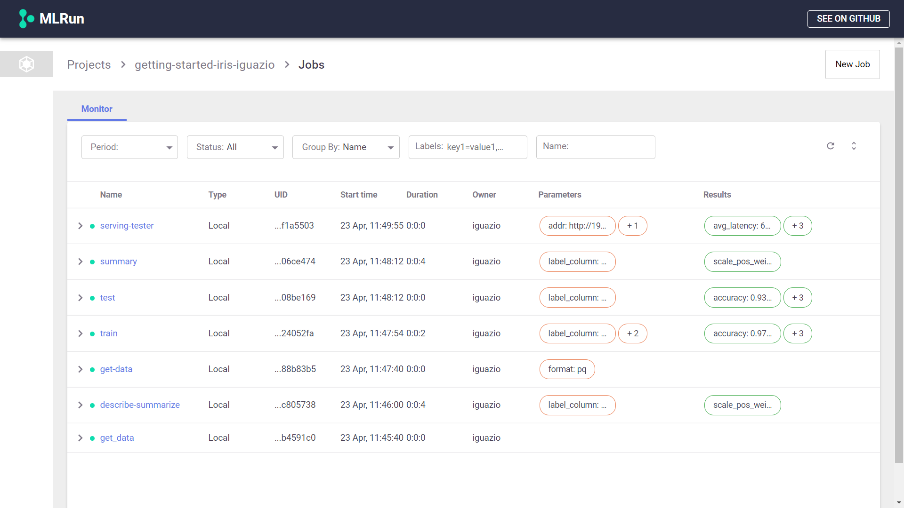

# Job Submission and Tracking  <!-- omit in toc -->

- [Projects](#projects)
- [Experiment Tracking](#experiment-tracking)
- [Tasks](#tasks)
- [Functions](#functions)
- [Jobs](#jobs)
- [Pipelines](#pipelines)

## Projects
A Project is a container for all your work on a particular activity. All the associated code, jobs and artifacts are organized within the projects. A project is also a great way to collaborate with others, since you can share your work, as well as create projects based on existing projects.
One option is to create a project

It's a best practice to have all your notebooks associated with a project. An easy way to do that is to create a project in the beginning of the notebook by calling `new_project`. For example, use the following code to create a project named **my-project** and stores the project definition in a subfolder named `conf`:

```python
from os import path
from mlrun import new_project

project_name = 'my_project'
project_path = path.abspath('conf')
project = new_project(project_name, project_path, init_git=True)

print(f'Project path: {project_path}\nProject name: {project_name}')
```

You can also ensure the project name is unique, by concatenating your current username, for example:

```python
from os import getenv
project_name = '-'.join(filter(None, ['my-project', getenv('V3IO_USERNAME', None)]))
```

You can use an existing project as a baseline by calling the `load_project` function. This enables reuse of existing code and definitions. For example, to load **my-project** based on a different project stored at `/projects/other_project/conf`:

```python
project = load_project('/projects/other_project/conf', name='my_project')
```

##  Experiment Tracking
Experiment tracking enables you to store every action and result in your project. It is a convenient way to go back to previous results and compare different artifacts. You will find 3 main sections within the your project:
1. **Functions**: The code in your project is stored in functions that are versioned. Functions can the functions you wrote, or externally loaded functions, such as functions that originate from the [MLRun Functions Marketplace](https://github.com/mlrun/functions)
2. **Jobs**: Allows you to review anything you executed, and review the execution outcome
3. **Artifacts**: Any data stored is considered an artifact. Artifacts are versioned and enable you to compare different outputs of the executed Jobs

You can compare different experiments and review these results. When using experiment tracking you don't have to worry about saving your work as you try out different models and various configurations, you can always compare your different results and choose the best strategy based on your current and past experiments.

Experiments are also a great way to collaborate. Your colleagues can review the different steps you took and try out other scenarios on their own, while building on top of your work.

Finally, experiments are useful to show your work to any reviewer. This is useful to allow other people to review your work, and ensure you have not missed anything and that your models were built based on solid methods as well as verifying you have considered other options in your work. In some cases this would be a model governance organization whose job is to verify your work. In other instances, it may just be your peer who reviews your work as part of a collaboration effort.

## Tasks

A task can be created from a template, and can run over different runtimes or functions. Therefore, you can define a task once and reuse it in different scenarios. For instance, you can define a task with some parameters and inputs datasets, and call a local function, or use the same task to call a distributed job.

For example:

```python
run = run_local(task,
                command='training.py')
```

Tasks also support the `.with_hyper_param` method, which iterates over different parameter values in a single command For instance, the following command calls `training.py` with a task that iterates through different values for `p2`:

``` python
run = run_local(task.with_hyper_params({'p2': [5, 2, 3]}, 'min.loss'),
                command='training.py')
```

## Functions

A function is a software package with one or more methods and runtime-specific attributes (such as image, command, arguments, and environment). A function can run one or more runs or tasks

Functions can be created from an existing template, for instance, check out the [MLRun Functions Marketplace](https://github.com/mlrun/functions). This marketplace is a centralized location for open-source contributions of function components that are commonly used in machine-learning development.

Functions are stored in the project and are versioned. Therefore, you can always view previous code and go back to previous functions if needed.

## Jobs

Jobs contain all the information about functions that were executed within the project. You can view per each job the parameters and the results of that job.

<br><br>


You can view the artifacts produced by each job, for example, view the datasets that were produced by this particular job

<br><br>


## Pipelines

