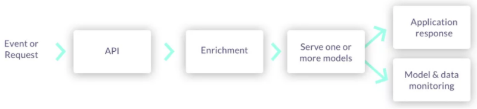

(mlops-dev-flow)=
# MLOps development workflow <!-- omit in toc -->

ML applications require you to implement the following stages in a scalable and reproducible way:

1. [Ingest and process data](#ingest)
2. [Develop and train models](#develop)
2. [Deploy models and applications](#deploy)
2. [Monitor and alert](#monitor)

MLRun automates the MLOps work. It simplifies & accelerates the time to production

## Ingest and process data

There is no ML without data. Before everything else, ML teams need access to historical and/or online data from multiple sources, and they 
must catalog and organize the data in a way that allows for simple and fast analysis (for example, by storing data in columnar data 
structures, such as Parquet).

In most cases, the raw data cannot be used as-is for machine learning algorithms for various reasons such as:

- The data is low quality (missing fields, null values, etc.) and requires cleaning and imputing.
- The data needs to be converted to numerical or categorical values which can be processed by algorithms.
- The data is unstructured in text, json, image, or audio formats, and needs to be converted to tabular or vector formats.
- The data needs to be grouped or aggregated to make it meaningful.
- The data is encoded or requires joins with reference information.
- The ML process starts with manual exploratory data analysis and feature engineering on small data extractions. In order to bring accurate models into production, ML teams must work on larger datasets and automate the process of collecting and preparing the data.

Furthermore, batch collection and preparation methodologies such as ETL, SQL queries, and batch analytics don’t work well for operational or 
real-time pipelines. As a result, ML teams often build separate data pipelines which use stream processing, NoSQL, and containerized micro-
services. 80% of data today is unstructured, so an essential part of building operational data pipelines is to convert unstructured textual, 
audio, and visual data into machine learning- or deep learning-friendly data organization.

 

MLOps solutions should incorporate a [feature store](./feature-store/feature-store.html) that defines the data collection and transformations 
just once for both batch and real-time scenarios, processes features automatically without manual involvement, and serves the features from 
a shared catalog to training, serving, and data governance applications. Feature stores must also extend beyond traditional analytics and 
enable advanced transformations on unstructured data and complex layouts.

## Develop and train models
Whether it’s deep learning or machine learning, MLRun allows you to train your models at scale and capture all the relevant metadata for experiments tracking and lineage. 

With MLOps, ML teams build machine learning pipelines that automatically collect and prepare data, select optimal features, run training 
using different parameter sets or algorithms, evaluate models, and run various model and system tests. All the executions, along with their 
data, metadata, code and results must be versioned and logged, providing quick results visualization, to compare them with past results and 
understand which data was used to produce each model.

Pipelines can be more complex—for example, when ML teams need to develop a combination of models, or use Deep Learning or NLP.

 

ML pipelines can be triggered manually, or preferably triggered automatically when:

- The code, packages or parameters change
- The input data or feature engineering logic changes
- Concept drift is detected, and the model needs to be re-trained with fresh data

ML pipelines:

- Are built using micro-services (containers or serverless functions), usually over Kubernetes.
- Have all their inputs (code, package dependencies, data, parameters) and the outputs (logs, metrics, data/features, artifacts, models) tracked for every step in the pipeline, in order to reproduce and/or explain the experiment results.
- Use versioning for all the data and artifacts used throughout the pipeline.
- Store code and configuration in versioned Git repositories.
- Use Continuous Integration (CI) techniques to automate the pipeline initiation, test automation, and for the review and approval process.

Pipelines should be executed over scalable services or functions, which can span elastically over multiple servers or containers. This way, 
jobs complete faster, and computation resources are freed up once they complete, saving significant costs.

The resulting models are stored in a versioned model repository along with metadata, performance metrics, required parameters, statistical 
information, etc. Models can be loaded later into batch or real-time serving micro-services or functions.

## Deploy models and applications
With MLRun, in addition to a batch inference, you can deploy a robust and scalable {ref}`real-time pipeline <serving-graph>` for more complex and online scenarios. 
MLRun uses Nuclio, an open source serverless framework for creating real-time pipelines for {ref}`model deployment <deployment>`.

Once an ML model has been built, it needs to be integrated with real-world data and the business application or front-end services. The 
entire application, or parts thereof, need to be deployed without disrupting the service. Deployment can be extremely challenging if the ML 
components aren’t treated as an integral part of the application or production pipeline.

Production pipelines usually consist of:

- Real-time data collection, validation, and feature engineering logic
- One or more model serving services
- API services and/or application integration logic
- Data and model monitoring services
- Resource monitoring and alerting services
- Event, telemetry, and data/features logging services

The different services are interdependent. For example, if the inputs to a model change, the feature engineering logic must be upgraded 
along with the model serving and model monitoring services. These dependencies require online production pipelines (graphs) to reflect these 
changes.

 

Production pipelines can be more complex when using unstructured data, deep learning, NLP or model ensembles, so having flexible mechanisms 
to build and wire up the pipeline graphs is critical.

Production pipelines are usually interconnected with fast streaming or messaging protocols, so they should be elastic to address traffic and 
demand fluctuations, and they should allow non-disruptive upgrades to one or more elements of the pipeline. These requirements are best 
addressed with fast serverless technologies.

Production pipeline development and deployment flow:

1. Develop production components:
   - API services and application integration logic
   - Feature collection, validation, and transformation
   - Model serving graphs
2. Test online pipelines with simulated data
2. Deploy online pipelines to production
2. Monitor models and data and detect drift
2. Retrain models and re-engineer data when needed
2. Upgrade pipeline components (non-disruptively) when needed

## Monitor and alert

Once the model is deployed, use MLRun to track the [operational statistics](./monitoring/model-monitoring-deployment.html#architecture) as well as [identify drift](./monitoring/model-monitoring-deployment.html#drift-analysis).
When drift is identified, MLRun can trigger the training pipeline to train a new model.

AI services and applications are becoming an essential part of any business. This trend brings with it liabilities, which drive further 
complexity. ML teams need to add data, code and experiment tracking, monitor data to detect quality problems, and [monitor models](./monitoring/index.html) to detect concept drift and improve model accuracy through the use of AutoML techniques and ensembles, and so on.

Nothing lasts forever, not even carefully constructed models that have been trained using mountains of well-labeled data. ML teams need to 
react quickly to adapt to constantly changing patterns in real-world data. Monitoring machine learning models is a core component of MLOps 
to keep deployed models current and predicting with the utmost accuracy, and to ensure they deliver value long-term.