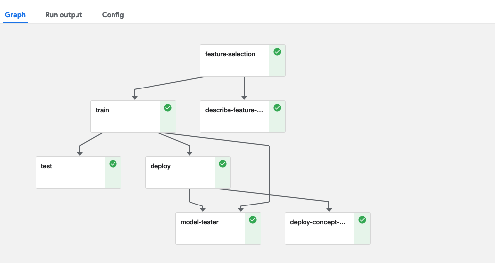

# Model Management and Serving  <!-- omit in toc -->

- [Deploy](#deploy)
  - [REST API Endpoint](#rest-api-endpoint)
  - [Streaming](#streaming)
  - [Batch Prediction](#batch-prediction)
- [Test](#test)
- [Monitoring and Drift Detection](#monitoring-and-drift-detection)

## Deploy

### REST API Endpoint

Model deployment can be done by the combination of MLRun and Nuclio. Nuclio is a serverless frameworks that enable users to run functions in a scalable way on a distributed cluster.
MLRun is integrated in a way that it provides an easy way for developers to take python code along with its model and convert it into a Nuclio function with minimal DevOps. <br>
By default, the Nuclio function is being created with an HTTP trigger so it has an endpoint that receive HTTP requests.<br>
In the functions marketplace you’ll find several serving functions that can be used out of the box.<br>
Below you can find an example of deploying a serving function from the marketplace. Make sure to set the models_path with your model. <br>


```python
fn = project.import_function('hub://model_server', 'serving')
fn.set_envs({'SERVING_MODEL_iris_dataset_v1': models_path})
fn.deploy()
```

The built-in serving functions can capture the features that are being sent to the model along with the actual results and store them as a stream for monitoring and drift detection. <br>
In order to do that one can use the `INFERENCE_STREAM` parameters and provide the path to the streaming location.

```python
fn.set_envs({'SERVING_MODEL_iris_dataset_v1': models_path,
             'INFERENCE_STREAM': 'users/admin/tststream'})
fn.deploy()
```
In some cases, there is a need to select a specific function version for alignment with the framework the user is working on. Here is an example of working with different TensorFlow frameworks:

```python
if tf_ver == 'v1':
    project.set_function('hub://tf1_serving', 'serving')
else:
    project.set_function('hub://tf2_serving', 'serving')
```

### Streaming
TBD

### Batch Prediction
TBD

## Test

Note, that once the model has been deployed, the best practice is to test the endpoint and validate that the model is working properly. In order to do that, you can also leverage the marketplace for getting those test functions.<br>
It basically takes several records from the test data and sends it over to the deployed function to validate that the model is working. <br>
When working with the Iguazio Data Science Platform, those serving functions (aka Nuclio functions) can be viewed in the Iguazio dashboard under the projects tab. when working with Nuclio standalone you can view it in the Nuclio dashboard.

```python
project.import_function('hub://model_server_tester', 'live_tester')
```

## Monitoring and Drift Detection

After the model has been deployed, users need a way to monitor the running model to make sure the model is working properly.<br> 
As we've seen in the deploy section, the best practice is to write the model's features and results to a stream. From there, we can run a drift analysis, show it in a real time dashboard and store data for historical analysis.<br>
In the functions marketplace you can find a drift detection function (AKA concept-drift) that reads the stream data, analyze if there is a drift and write it down to a time series database for real time dashboarding and also to a parquet file for historical analysis.<br>
Here is an example of such pipeline with the concept drift function:



