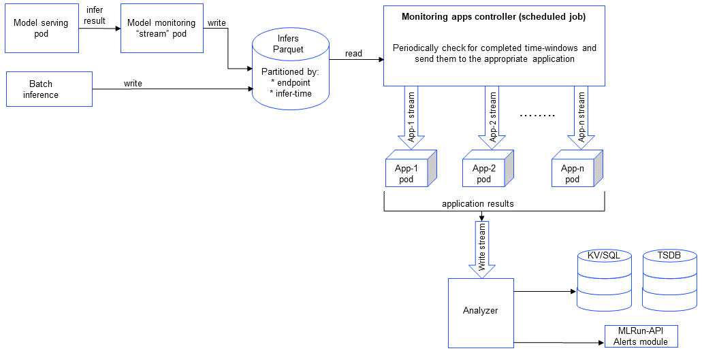
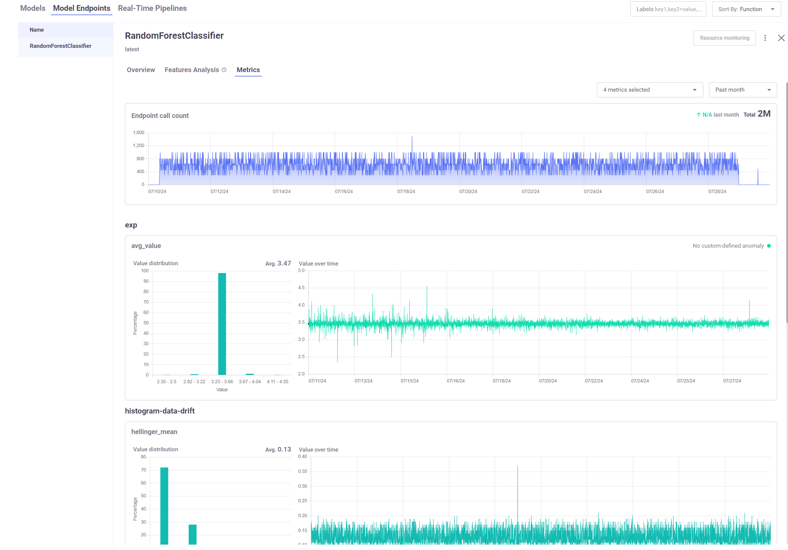

(model-monitoring-des)=
# Model monitoring description

**In this section**
- [Architecture](#architecture)
- [Model and model monitoring endpoints](#model-and-model-monitoring-endpoints)
- [Streaming platforms and credentials](#streaming-platforms-and-credentials)
- [Model monitoring applications](#model-monitoring-applications)
- [Multi-port predictions](#multi-port-predictions)
- [Batch inputs](#batch-inputs)
- [Alerts and notifications](#alerts-and-notifications)

## Architecture



</br>
</br>

When you call {py:meth}`~mlrun.projects.MlrunProject.enable_model_monitoring`, you effectively deploy three components:
- application controller function: handles the monitoring processing and the triggers the apps that trigger the writer. The controller is a real-time Nuclio job whose frequency is determined by `base_period`. 
- stream function: monitors the log of the data stream. It is triggered when a new log entry is detected. The monitored data is used to create real-time dashboards, detect drift, and analyze performance.
- writer function: writes the results and the metrics that output from the model monitoring applications to the databases, and outputs alerts according to the user configuration.

The model monitoring process flow starts with collecting operational data from a function in the model serving pod. The model 
monitoring stream pod forwards data to a Parquet database. MLRun supports integers, float, strings, images.
The controller periodically checks the Parquet DB for new data and forwards it to the relevant application. 
Each model monitoring application is a separate nuclio real-time function. Each one listens to a stream that is filled by 
the monitoring controller at each `base_period` interval.
The stream function examines the log entry, processes it into statistics which are then written to the statistics databases 
(parquet file, time series database and key value database). 
The monitoring stream function writes the Parquet files using a basic storey ParquetTarget. Additionally, there is a monitoring feature set that refers 
to the same target. 

## Model and model monitoring endpoints 

For each model that is served in a model serving function, there is a model endpoint. The model endpoint is associated 
with a feature set that manages the model endpoint statistics. See {py:meth}`model endpoint <mlrun.model_monitoring.api.get_or_create_model_endpoint>`.

All model monitoring endpoints are presented in the UI with information about the actual inference, including data on the inputs, outputs, and results.
The Model Endpoints tab presents the overall metrics. From there you can select an endpoint and view the Overview, Features Analysis, and the Metrics tabs. 
Metrics are grouped under their applications. After you select the metrics and the timeframe, you get a histogram showing the number of occurrences/values range, and a timeline 
graph of the metric and the threshold. Any alerts are shown in the upper-right corner of the metrics box. 

For example:



## Selecting the streaming and TSDB platforms

Model monitoring supports Kafka or V3io as streaming platforms, and TDEngine or V3IO as TSDB platforms.
In addition, internal model-monitoring metadata can be saved in MySQL or V3IO.

We recommend the following versions:
* TDEngine - `3.3.2.0`.
* MySQL - `8.0.39`, or higher `8.0` compatible versions.

Before you deploy the model monitoring or serving function, you need to {py:meth}`set the credentials <mlrun.projects.MlrunProject.set_model_monitoring_credentials>`. 
There are three credentials you can set, and each one can have a different value. For example:
```py
stream_path = "kafka://<some_kafka_broker>:<port>"  # or "v3io"
tsdb_connection = "taosws://<username>:<password>@<host>:<port>"  # or "v3io"
endpoint_store_connection = (
    "mysql+pymysql://<username>:<password>@<host>:<port>/<db_name>"  # or "v3io"
)
```

## Model monitoring applications

When you call `enable_model_monitoring` on a project, by default MLRun deploys the monitoring app, `HistogramDataDriftApplication`, which is 
tailored for classical ML models (not LLMs, gen AI, deep-learning models, etc.). It includes:
* Total Variation Distance (TVD) &mdash; The statistical difference between the actual predictions and the model's trained predictions.
* Hellinger Distance &mdash; A type of f-divergence that quantifies the similarity between the actual predictions, and the model's trained predictions.
* The average of TVD & Hellinger as the general drift result.
* Kullback–Leibler Divergence (KLD) &mdash; The measure of how the probability distribution of actual predictions is different from the second model's trained reference probability distribution.

You can create your own model monitoring applications, for LLMs, gen AI, deep-learning models, etc., based on the class {py:meth}`mlrun.model_monitoring.applications.ModelMonitoringApplicationBaseV2`. 
MLRun includes a built-in class, `EvidentlyModelMonitoringApplicationBase`, to integrate [Evidently](https://github.com/evidentlyai/evidently) 
as an MLRun function and create MLRun artifacts. See an example in {ref}`realtime-monitor-drift-tutor`. 

Projects are used to group functions that use the same model monitoring application. You first need to create a project for aspecific application. 
Then you disable the default app, enable your customer app, and create and run the functions. 

The basic flow for classic ML and other models is the same, but the apps and the infer requests are different. See {ref}`model-monitoring`.

## Multi-port predictions

Multi-port predictions involve generating multiple outputs or predictions at the same time from a single model or system. 
Each "port" can be thought of as a separate output channel that provides a distinct prediction or piece of information. 
This capability is particularly useful in scenarios where multiple related predictions are needed simultaneously. 
Multi-port predictions increase efficiently, reducing the time and computational resources required. 
And, multi-port predictions provide a more holistic view of the data, enabling better decision-making and more accurate forecasting. 
For example, in a gen AI model, one port gives a response on prompts, one is for meta data, and the third for images.

Multi-port predictions can be applied in several ways:
- Multi-task learning &mdash; A single model is trained to perform multiple tasks simultaneously, such as predicting different attributes of 
an object. For example, a model could predict both the age and gender of a person from a single image.
- Ensemble methods &mdash; Multiple models are combined to make predictions, and each model's output can be considered a separate port. 
The final prediction is often an aggregation of these individual outputs.
- Time series forecasting &mdash; In time series analysis, multi-port predictions can be used to forecast multiple future time points 
simultaneously, providing a more comprehensive view of future trends.

## Batch inputs

Processing data in batches allows for parallel computation, significantly speeding up the training and inference processes. This is especially 
important for large-scale models that require substantial computational resources. Batch inputs are used with CPUs and GPUs. For gen AI models, 
batch input is typically a list of prompts. For classic ML models, batch input is a list of features.

See an example of batch input in the [Serving pre-trained ML/DL models](../tutorials/03-model-serving.html#create-and-test-the-serving-function) tutorial.

## Alerts and notifications

You can set up {ref}`alerts` to inform you about suspected and detected issues in the model monitoring functions. 
And you can use {ref}`notifications` to notify about the status of runs and pipelines.