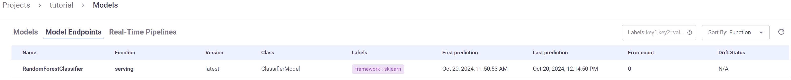
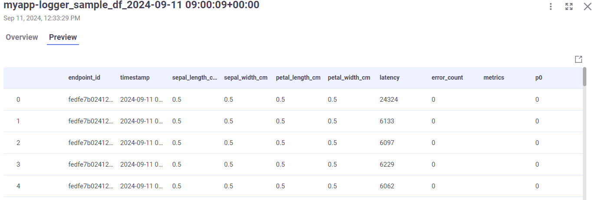

(model-monitoring)=
# Model monitoring user flow

This page gives an overview of the model monitoring user flow. See complete examples in the tutorials:
- [Model monitoring and drift detection](../tutorials/05-model-monitoring.html)
- [Model monitoring with a user-app](../tutorials/genai_02_model_monitor_user_app.html)

In this section:
- [APIs](#apis)
- [Enable model monitoring](#enable-model-monitoring)
- [Log the model with training data](#log-the-model-with-training-data)
- [Import, enable monitoring, and deploy the serving function](#import-enable-monitoring-and-deploy-the-serving-function)
- [Invoke the model](#invoke-the-model)
- [Register and deploy the model-monitoring app](#register-and-deploy-the-model-monitoring-app)
- [User-app](#)
- [Invoke the model again](#invoke-the-model-again)
- [View model monitoring artifacts and drift in Grafana](#view-model-monitoring-artifacts-and-drift-in-grafana)
- [Batch infer model-monitoring](#batch-infer-model-monitoring)

## APIs

The model monitoring APIs are configured per project. The APIs are:

- {py:meth}`~mlrun.projects.MlrunProject.enable_model_monitoring` &mdash; Brings up the controller, writer and stream realtime functions, and schedules the controller according to the `base_period`. 
You can also deploy the default histogram-based data drift application when you enable model monitoring.
- {py:meth}`~mlrun.projects.MlrunProject.create_model_monitoring_function` &mdash; Creates a monitoring function object without setting it to the project, used for user-apps and troubleshooting.
- {py:meth}`~mlrun.projects.MlrunProject.set_model_monitoring_function` &mdash; Updates or sets a monitoring function to the project. (Monitoring does not start until the function is deployed.) 
- {py:meth}`~mlrun.projects.MlrunProject.list_model_monitoring_functions` &mdash; Retrieves a list of all the model monitoring functions.
- {py:meth}`~mlrun.projects.MlrunProject.remove_model_monitoring_function` &mdash; Removes the specified model-monitoring-app function from the project and from the DB.
- {py:meth}`~mlrun.projects.MlrunProject.set_model_monitoring_credentials` &mdash; Set the credentials that are used by the project's model monitoring infrastructure functions. 
- {py:meth}`~mlrun.projects.MlrunProject.disable_model_monitoring` &mdash; Disables the controller. 
- {py:meth}`~mlrun.projects.MlrunProject.update_model_monitoring_controller`  &mdash; Redeploys the model monitoring application controller functions.
- {py:meth}`~mlrun.config.Config.get_model_monitoring_file_target_path` &mdash; Gets the full path from the configuration based on the provided project and kind.


## Enable model monitoring

Enable model monitoring for a project with {py:meth}`~mlrun.projects.MlrunProject.enable_model_monitoring`.
The controller runs, by default, every 10 minutes, which is also the minimum interval. 
You can modify the frequency with the parameter `base_period`. 
To change the `base_period`, call `update_model_monitoring_controller`. 

```python
project.enable_model_monitoring(base_period=20)
```
## Log the model with training data

See the parameter descriptions in {py:meth}`~mlrun.projects.MlrunProject.log_model`. 
{Download the pickle file}`pickle file <../tutorials/src/model.pkl>` used in this example.


```python
model_name = "RandomForestClassifier"
project.log_model(
    model_name,
    model_file="model.pkl",
    training_set=train_set,
    framework="sklearn",
)
```

## Import, enable monitoring, and deploy the serving function

Use the [v2_model_server serving](https://www.mlrun.org/hub/functions/master/v2-model-server/) function 
from the MLRun function hub.

Add the model to the serving function's routing spec ({py:meth}`~mlrun.runtimes.ServingRuntime.add_model`), 
enable monitoring on the serving function ({py:meth}`~mlrun.runtimes.ServingRuntime.set_tracking`),
and then deploy the function ({py:meth}`~mlrun.projects.MlrunProject.deploy_function`).

The result of this step is that the model-monitoring stream pod writes data to Parquet, by model endpoint. 
Every base period, the controller checks for new data and if it finds, sends it to the relevant app.


```python
# Import the serving function
serving_fn = import_function(
    "hub://v2_model_server", project=project_name, new_name="serving"
)

serving_fn.add_model(
    model_name, model_path=f"store://models/{project_name}/{model_name}:latest"
)

# enable monitoring on this serving function
serving_fn.set_tracking()

serving_fn.spec.build.requirements = ["scikit-learn"]

# Deploy the serving function
project.deploy_function(serving_fn)
```

## Invoke the model

Invoke the model function with {py:meth}`~mlrun.runtimes.RemoteRuntime.invoke`.


```python
model_name = "RandomForestClassifier"
serving_1 = project.get_function("serving")
0
for i in range(150):
    # data_point = choice(iris_data)
    data_point = [0.5, 0.5, 0.5, 0.5]
    serving_1.invoke(
        f"v2/models/{model_name}/infer", json.dumps({"inputs": [data_point]})
    )
    sleep(choice([0.01, 0.04]))
```
After invoking the model, you can see the model endpoints and minimal meta data (for example, 
last prediction and average latency) in the **Models | Model Endpoints** page.



You can also see the basic statistics in Grafana.

(register-model-monitoring-app)=
## Register and deploy the model-monitoring app
The next step is to deploy the model-monitoring job to generate the full meta data. 
Add the monitoring function to the project using {py:meth}`~mlrun.projects.MlrunProject.set_model_monitoring_function`. 
Then, deploy the function using {py:meth}`~mlrun.projects.MlrunProject.deploy_function`.

First download the {download}`demo_app <../tutorials/src/demo_app.py>`.

```
my_app = project.set_model_monitoring_function(
    func="demo_app.py",
    application_class="DemoMonitoringApp",
    name="myApp",
)

project.deploy_function(my_app)
```

You can use the MLRun built-in class, `EvidentlyModelMonitoringApplicationBase`, to integrate [Evidently](https://github.com/evidentlyai/evidently) as an MLRun function and create MLRun artifacts.
See the [Model monitoring and drift detection tutorial](../tutorials/05-model-monitoring).

## Invoke the model again

The controller checks for new datasets every `base_period` to send to the app. Invoking the model a second time ensures that the previous 
window closed and therefore the data contains the full monitoring window. The controller checks the Parquet DB every 10 minutes 
(or higher number, user-configurable), and streams any new data to the app.


```python
model_name = "RandomForestClassifier"
serving_1 = project.get_function("serving")

for i in range(150):
    data_point = choice(iris_data)
    # data_point = [0.5,0.5,0.5,0.5]
    serving_1.invoke(
        f"v2/models/{model_name}/infer", json.dumps({"inputs": [data_point]})
    )
    sleep(choice([0.01, 0.04]))
```

Now you can view the application results. 



## View model monitoring artifacts and drift in Grafana
 
Monitoring details:


And drift and operational metrics over time:


All of the Grafana dashboards are described in {ref}`monitoring-models`.

## Batch infer model-monitoring

You can use the batch function (stored in the [function hub](https://www.mlrun.org/hub/functions/master/batch_inference_2/))
to evaluate data against your logged model **without disturbing the model**, for example a one-time evaluation of new data.  

See more in the [model monitoring tutorial](../tutorials/05-model-monitoring.html#batch-infer-model-monitoring).

## See also

- {ref}`monitoring-models`
- {ref}`batch_inference_overview`