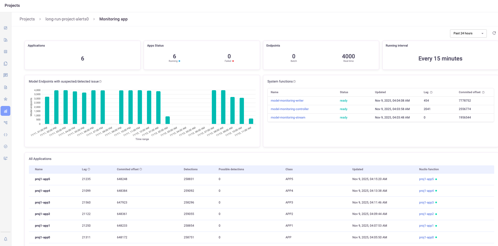
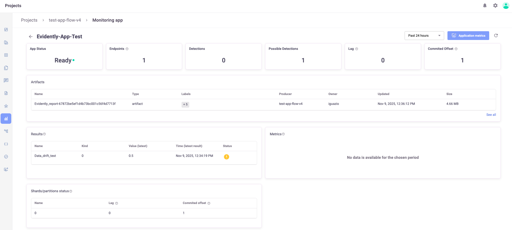
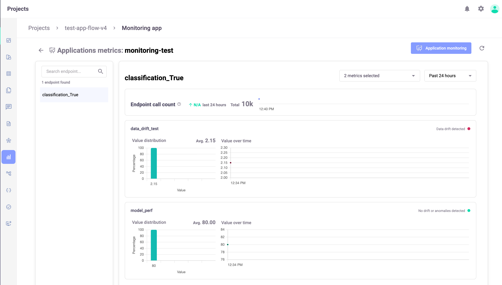

(view-mm-applications)=
# View the model monitoring applications status in the UI

The Monitoring Application view provides you with a comprehensive overview of your model monitoring applications. You can view the existing applications and their status. You can choose the time period for the statistics. The default time period is 24 hours. The maximum time period is one month. The selected period operates as a sliding window of 24 hours, updated every hour.

**In this section**
- [Monitoring App view](#monitoring-app-view)
- [Application page](#application-page)
- [Application metrics](#application-metrics)

## Monitoring App view

The <b>tiles</b> at the top present:
- Applications: The total number of monitoring applications.
- Monitoring App Status: The number of functions running and the number of failures.
- Endpoints: The total number of model endpoints, categorized by Batch and Real-time
- Running Interval: Indicates the interval at which the apps monitor the models. 

The <b>graph</b> shows the model endpoints with suspected/detected issues. The granularity in this graph is:
- Up to 6 hours: 10-minute intervals
- 2–72 hours: 1-hour intervals
- More than 72 hours: 1-day intervals

<b>System functions</b> shows the status of the three applications that support model monitoring: Controller, Writer, Reader.

<b>All applications</b> presents details of the monitoring applications running in this project, includingn the total detections across all results and model endpoints for the selected time period.
- Click in a row to see the [application details](#application-page). 
- Hover over the row to see the Open metrics button (). Click it to open the [Application metrics](#application-metrics) page. Select a metric and optionally modify the timeframe to see the metrics graph.
- Click the Nucio function name to see the function code, etc.

## Application page
From the main view, press an app name to open the App view. The tiles show the app status, number of enpdoints processed by the app during the timeframe, possible/detections, lag, and committed offset. The following tables include: a list of all artifacts, the monitoring app results, metrics, and status of all the shards. 

## Application metrics
Access the application metrics either with the Application metrics button in the Application page or from the row of the app in the Monitoring Apps view. Select a metric and optionally modify the timeframe. By default, the first model endpoint is selected. You can select an model endpoint from a list. When switching model endpoints, the previously selected metrics and results remain (if applicable).

