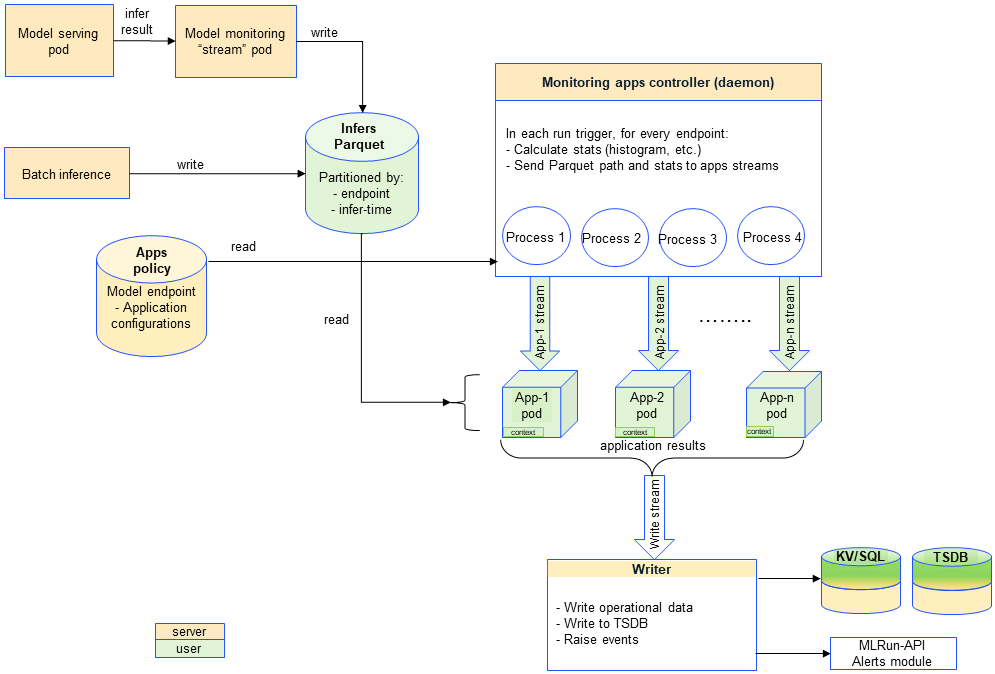

(monitoring)=

# Model monitoring
```{note}
This is currently a beta feature. This version does not support batch monitoring.
```
ML-4218 
Adding the ability for a user to define an monitoring app that should be run on a set of model end-points. 

Within this phase there are a few restrictions that will be addressed on subsequent phase:  

- All apps will be running on all model endpoints 
- Scheduling is based on the job schedules. There is no "monitoring policy" yet
- There is a single job - dividing to several jobs by different sched/app/others will be done on the next phase. 
- Drift type will remain as is - drift is detected when it is identified by the threshold


Need an Apps - ModelMonitoringApplicationBase or EvidentlyModelMonitoringApplicationBase
user can write init function eg to include directory, 
need `do_tracking` (= function)
self.context - gives MLRun context incl artifacts - context does appear in UI under Jobs and workflows.

ModelMonitoringApplicationResult - 
name - is saved in KV and TSDB
class ResultKindApp(Enum):
    """
    Enum for the result kind values
    """

    data_drift = 0
    concept_drift = 1
    model_performance = 2
    system_performance = 3


class ResultStatusApp(IntEnum):
    """
    Enum for the result status values, detected means that the app detected some problem.
    """

    irrelevant = -1
    no_detection = 0
    potential_detection = 1
    detected = 2
	
extra_data:  whatever data user wants to save.	
	



https://docs.mlrun.org/en/latest/api/mlrun.projects.html#mlrun.projects.MlrunProject.create_model_monitoring_function
https://docs.mlrun.org/en/latest/api/mlrun.db.html#mlrun.db.httpdb.HTTPRunDB.enable_model_monitoring brings up controller and writer.
mltun enable project
https://docs.mlrun.org/en/latest/api/mlrun.projects.html#mlrun.projects.MlrunProject.disable_model_monitoring - cancels the controller (not writer). In 1.6 controller is a job that runs /time. I To change base period have to disable end enable. Base period is per system! not per function.
https://docs.mlrun.org/en/latest/api/mlrun.projects.html#mlrun.projects.MlrunProject.list_model_monitoring_functions
https://docs.mlrun.org/en/latest/api/mlrun.projects.html#mlrun.projects.MlrunProject.remove_model_monitoring_function
https://docs.mlrun.org/en/latest/api/mlrun.projects.html#mlrun.projects.MlrunProject.set_model_monitoring_credentials not new. Kafka or V3IO. will change in 1.7. Not sure if it works in 1.6.
https://docs.mlrun.org/en/latest/api/mlrun.projects.html#mlrun.projects.MlrunProject.set_model_monitoring_function

Can integrate [Evidently](https://www.evidentlyai.com/) as an MLRun function to create MLRun artifacts.


Drift type will remain as is - drift is detected when it is identified by the threshold


ml-4173
When calling monitoring batch inference job (stored in marketplace - https://www.mlrun.org/hub/functions/master/batch_inference/), 
the user will be able pass endpoint_id for applying the job to a specific existing model endpoint (
and as a result to store the new events in the Parquet target of that endpoint). If not provided, 
the parquet file will be generated in a default context for the batch inference job (based on hashing 
of the batch inference job name in a particular project). 


## Configuring

enable monitpring -  base period is important - how often the controller runs (how often the entire app runs). How ofter the monitoring runs. Uses data from the base_period.
set_tracking on the model server on the serving function (same as before)
set_model_monitoring_function (=set and create) - and after deploy

(`create` creates a function but does not run it. Good for troubleshooting. Does not register the function to the project)

Then every base_period updates the monitoring 
currently in grafana and SDK, but not UI.