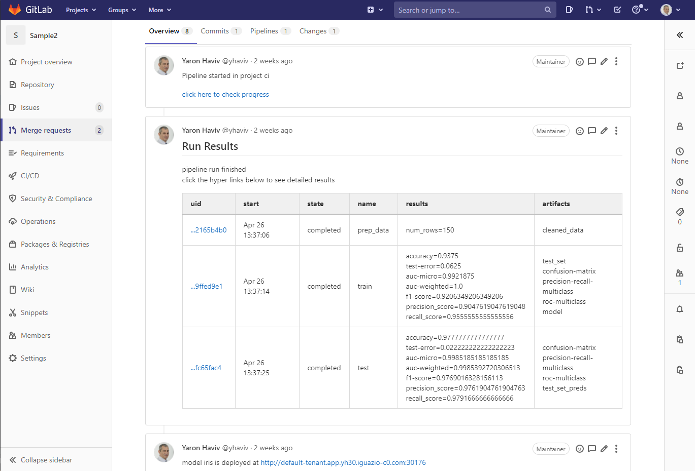

# Github/Gitlab/Jenkins and CI/CD integration

MLRun workflows can run inside the CI system. The most common method is to use the CLI command  `mlrun project` to load the project 
and run a workflow as part of a code update (e.g. pull request, etc.). The pipeline tasks are executed on the Kubernetes cluster, which is orchestrated by MLRun.

When MLRun is executed inside a [GitHub Action](https://docs.github.com/en/actions) or [GitLab CI/CD](https://docs.gitlab.com/ee/ci/) 
pipeline it detects the environment attributes automatically 
(e.g. repo, commit id, etc.). In addition, a few environment variables and credentials must be set:

* **MLRUN_DBPATH** &mdash; url of the MLRun cluster.
* **V3IO_USERNAME** &mdash; username in the remote Iguazio cluster.
* **V3IO_ACCESS_KEY** &mdash; access key to the remote Iguazio cluster.
* **GIT_TOKEN** or **GITHUB_TOKEN** &mdash; Github/Gitlab API token (set automatically in Github Actions).
* **SLACK_WEBHOOK** &mdash; optional. Slack API key when using slack notifications.

When the workflow runs inside the Git CI system it reports the pipeline progress and results back into the Git tracking system, similar to:

<br>

**Contents**
* [**Using GitHub Actions**](#using-github-actions)
* [**Using GitLab CI/CD**](#using-gitlab-ci-cd)
* [**Using Jenkins Pipeline**](#using-jenkins-pipeline)

## Using GitHub Actions

When running using [GitHub Actions](https://docs.github.com/en/actions) you need to set the credentials/secrets 
and add a script under the `.github/workflows/` directory, which is executed when the code is commited/pushed.

Example script that is invoked when you add the comment "/run" to your pull request:

```yaml
name: mlrun-project-workflow
on: [issue_comment]

jobs:
  submit-project:
    if: github.event.issue.pull_request != null && startsWith(github.event.comment.body, '/run')
    runs-on: ubuntu-latest

    steps:
    - uses: actions/checkout@v2
    - name: Set up Python 3.7
      uses: actions/setup-python@v1
      with:
        python-version: '3.7'
        architecture: 'x64'
    
    - name: Install mlrun
      run: python -m pip install pip install mlrun
    - name: Submit project
      run: python -m mlrun project ./ -w -r main ${CMD:5}
      env:
        V3IO_USERNAME: ${{ secrets.V3IO_USERNAME }}
        V3IO_API: ${{ secrets.V3IO_API }}
        V3IO_ACCESS_KEY: ${{ secrets.V3IO_ACCESS_KEY }}
        MLRUN_DBPATH: ${{ secrets.MLRUN_DBPATH }}
        GITHUB_TOKEN: ${{ secrets.GITHUB_TOKEN }} 
        SLACK_WEBHOOK: ${{ secrets.SLACK_WEBHOOK }}
        CMD: ${{ github.event.comment.body}}
```

See the full example in [**https://github.com/mlrun/project-demo**](https://github.com/mlrun/project-demo)


## Using GitLab CI/CD

When running using [GitLab CI/CD](https://docs.gitlab.com/ee/ci/) you need to set the credentials/secrets 
and update the script `.gitlab-ci.yml` directory, which is executed when code is commited/pushed.

Example script that is invoked when you create a pull request (merge requests):

```yaml
image: mlrun/mlrun

run:
  script:
    - python -m mlrun project ./ -w -r ci
  only:
    - merge_requests
```

See the full example in [**https://gitlab.com/yhaviv/test2**](https://gitlab.com/yhaviv/test2)

## Using Jenkins Pipeline

When using [Jenkins Pipeline](https://www.jenkins.io/doc/book/pipeline/) you need to set up the credentials/secrets in Jenkins and 
and update the script `Jenkinsfile` in your codebase. You can trigger the Jenkins pipeline either through Jenkins triggers or through the GitHub webhooks. 

Example `Jenkinesfile` that is invoked when you start a Jenkins pipeline (via triggers or GitHub webhooks):

```Groovy
pipeline {
   agent any
    environment {
      RELEASE='1.0.0'
      PROJECT_NAME='project-demo'
    }
   stages {
      stage('Audit tools') {
         steps{
            auditTools()
         }
      }
      stage('Build') {
            environment {
               MLRUN_DBPATH='https://mlrun-api.default-tenant.app.us-sales-341.iguazio-cd1.com'
               V3IO_ACCESS_KEY=credentials('V3IO_ACCESS_KEY')
               V3IO_USERNAME='xingsheng'
            }
            agent {
                docker {
                    image 'mlrun/mlrun:1.0.0'
                }
            }
            steps {
               echo "Building release ${RELEASE} for project ${PROJECT_NAME}..."
               sh 'chmod +x build.sh'
               withCredentials([string(credentialsId: 'an-api-key', variable: 'API_KEY')]) {
                  sh '''
                     ./build.sh
                  '''
               }
            }
        }
        stage('Test') {
            steps {
               echo "Testing release ${RELEASE}"
            }
        }
   }
   post {
      success {
         slackSend channel: '#builds',
                   color: 'good',
                   message: "Project ${env.PROJECT_NAME}, success: ${currentBuild.fullDisplayName}."
      }
      failure {
         slackSend channel: '#builds',
                   color: 'danger',
                   message: "Project ${env.PROJECT_NAME}, FAILED: ${currentBuild.fullDisplayName}."
      }
   }
}

void auditTools() {
   sh '''
      git version
      docker version
   '''
}
```
After the Jenkins pipeline is complete, you can see the MLRun job in the MLRun UI.

See the full example in [**https://github.com/mlrun/project-demo**](https://github.com/mlrun/project-demo).
