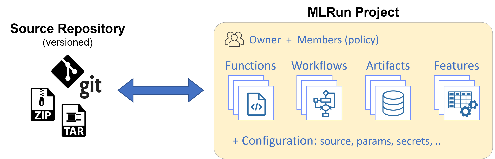
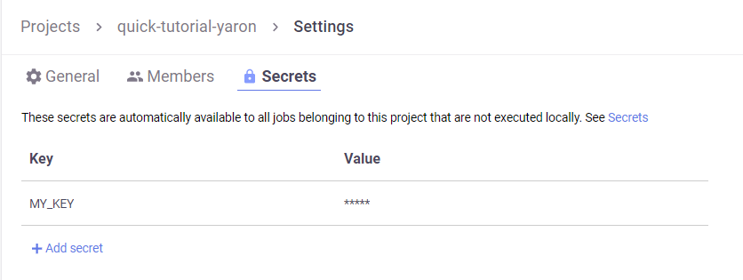
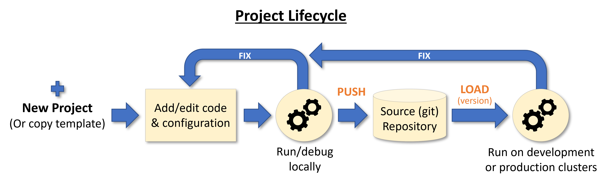

(create-projects)=
# Create, save, and use projects

A project is a container for all the assets, configuration, and code of a particular application. It is the starting point for your work. Projects are stored in a versioned source repository (GIT) or archive and can map to IDE projects (in PyCharm, VSCode, etc.).

<p align="center"></p><br>

**In this section**
- [Creating a project](#create)
- [Adding functions, artifacts, workflow, and config](#add-elements)
- [Pushing the project content into git or an archive](#push)
- [Get a project from DB or create it](#get-or-create)
- [Deleting a project](#deleting-a-project)

<a id="best-prac-projs"></a>
## Best Practices

Ensure that no project name is used as the prefix of another project name, since this would affect retrieving pipelines from Kubeflow pipelines.
For example, do not name projects `my_project` and `my_project_sec`.

<a id="create"></a>
## Creating a project

Project files (code, configuration, etc.) are stored in a directory (the project `context` path) and can be pushed to, or loaded from, the source repository. See the following project directory example:

```
my-project           # Parent directory of the project (context)
├── data             # Project data for local tests or outputs (not tracked by version control)
├── docs             # Project documentation
├── src              # Project source code (functions, libs, workflows)
├── tests            # Unit tests (pytest) for the different functions
├── project.yaml     # MLRun project spec file
├── README.md        # Project README
└── requirements.txt # Default Python requirements file (can have function specific requirements as well)
```


To define a new project from scratch, use {py:meth}`~mlrun.projects.new_project`. You must specify a `name`. 
The `context` dir holds the configuration, code, and workflow files. Its default value is "./", which is the directory 
the MLRun client runs from. File paths in the project are relative to the context root.
There are additional, optional parameters.
The `user_project=True` add the current username to the provided project name (making it unique per user). 
(When the username is an email, it is trimmed after the '@'.)
 The `init_git` flag is used to initialize git in the context dir.


```python
import mlrun

project = mlrun.new_project(
    "myproj", "./", user_project=True, init_git=True, description="my new project"
)
```
 
Projects can also be created from a template (yaml file, zip file, or git repo), allowing users to create reusable skeletons. 
The content of the zip/tar/git archive is copied into the context dir. The `remote` attribute can be used to register a remote git repository URL.  

Example of creating a new project from a zip template:

```python
# create a project from zip, initialize a local git, and register the git remote path
project = mlrun.new_project(
    "myproj",
    "./",
    init_git=True,
    user_project=True,
    remote="git://github.com/myorg/some-project.git",
    from_template="http://mysite/proj.zip",
)
```


<a id="add-elements"></a>
## Adding functions, artifacts, workflow, and config

Projects host [functions](../runtimes/functions.html), [workflows](../concepts/workflow-overview.html), [artifacts (files, datasets, models, etc.)](../store/artifacts.html), features, and configuration (parameters, [secrets](../secrets.html), source, etc.).
This section explains how to add or register different project elements. For details on the feature store and its elements (sets, vectors) see the [**feature store documentation**](../feature-store/feature-store.html).

**Adding and registering functions:**

Functions with basic attributes such as code, requirements, image, etc. can be registered using the {py:meth}`~mlrun.projects.MlrunProject.set_function` method.
Functions can be created from a single code/notebook file or have access to the entire project context directory. (By adding the `with_repo=True` flag, the project context is cloned into the function runtime environment.) See the examples:


```python
# register a (single) python file as a function
project.set_function(
    "src/data_prep.py", "data-prep", image="mlrun/mlrun", handler="prep", kind="job"
)

# register a notebook file as a function, specify custom image and extra requirements
project.set_function(
    "src/mynb.ipynb",
    name="test-function",
    image="my-org/my-image",
    handler="run_test",
    requirements="requirements.txt",
    kind="job",
)

# register a module.handler as a function (requires defining the default sources/work dir, if it's not root)
project.spec.workdir = "src"
project.set_function(
    name="train",
    handler="training.train",
    image="mlrun/mlrun",
    kind="job",
    with_repo=True,
)
```

See details and examples on how to [**create and register functions**](../runtimes/create-and-use-functions.html), 
how to [**annotate notebooks**](../runtimes/mlrun_code_annotations.html) (to be used as functions), how to [**run, build, or deploy**](./run-build-deploy.html) functions, and how to [**use them in workflows**](./build-run-workflows-pipelines.html). 

**Register artifacts:**

[Artifacts](../store/artifacts.html) are used by functions and workflows and are referenced by a key (name) and optional tag (version).
Users can define artifact files or objects in the project spec, which are registered during project load or when calling `project.register_artifacts()`.
To register artifacts use the {py:meth}`~mlrun.projects.MlrunProject.set_artifact`) method. See the examples:

```python
# register a simple file artifact in the project (point to remote object)
data_url = "https://s3.wasabisys.com/iguazio/data/iris/iris.data.raw.csv"
project.set_artifact("data", target_path=data_url)

# register a model artifact
project.set_artifact(
    "model", ModelArtifact(model_file="model.pkl"), target_path=model_dir_url
)

# register local or remote artifact object (yaml or zip), will be imported on project load
# to generate such a package use `artifact.export(zip_path)`
project.set_artifact("model", "https://mystuff.com/models/mymodel.zip")
```

```{admonition} Note
Local file paths are relative to the context dir.
```

You can delete artifacts per project. See [Deleting artifacts](../store/artifacts.html#deleting-artifacts).

**Registering workflows:**

Projects contain one or more workflows (pipelines). The workflows can be registered using the {py:meth}`~mlrun.projects.set_workflow`) method.
Project workflows are executed using the {py:meth}`~mlrun.projects.MlrunProject.run`) method. See [**building and running workflows**](./build-run-workflows-pipelines.html) for details.

```python
# Add a multi-stage workflow (./myflow.py) to the project with the name 'main' and save the project
project.set_workflow("main", "./src/workflow.py")
```

**Set project wide parameters and secrets:**

You can define global project parameters and secrets and use them in your functions enabling simple configuration and templates.
See the examples:

```python
# Read env vars from dict or file and set as project secrets
project.set_secrets({"SECRET1": "value"})
project.set_secrets(file_path="secrets.env")

project.spec.params = {"x": 5}
```

```{admonition} Note
Secrets are not loaded automatically (not part of the `project.yaml`); you need to apply `set_secrets()` methods manually or use the UI.

```

Project parameters, secrets and configuration can also be set in the UI, in the relevant project, click the 
 button at the left bottom corner.

Example, secrets configuration screen:

<p align="center"></p>

**Save the project:**

Use the {py:meth}`~mlrun.projects.MlrunProject.save` method to store all the definitions (functions, artifacts, workflows, parameters, etc.) 
in the MLRun DB and in the `project.yaml` file (for automated loading and CI/CD).

```python
project.save()
```

````{dropdown} show an example project.yaml file
The generated `project.yaml` for the above project looks like:

```yaml
ind: project
metadata:
  name: myproj
spec:
  description: my new project
  params:
    x: 5
  functions:
  - url: src/data_prep.py
    name: data-prep
    image: mlrun/mlrun
    handler: prep
  - url: src/mynb.ipynb
    name: test-function
    kind: job
    image: my-org/my-image
    handler: run_test
    requirements: requirements.txt
  - name: train
    kind: job
    image: mlrun/mlrun
    handler: training.train
    with_repo: true
  workflows:
  - path: ./src/workflow.py
    name: main
  artifacts:
  - kind: artifact
    metadata:
      project: myproj
      key: data
    spec:
      target_path: https://s3.wasabisys.com/iguazio/data/iris/iris.data.raw.csv
  source: ''
  workdir: src```
````

<a id="push"></a>
## Pushing the project content into git or an archive

Project code, metadata, and configuration are stored and versioned in source control systems like GIT or archives (zip, tar).
This allows [**loading an entire project**](./load-project.html) (with a specific version) into a development or production environment, or seamlessly [**integrating with CI/CD frameworks**](./ci-integration.html).

<p align="center"></p><br>
 
```{admonition} Note
You must push the updates before you build functions or run workflows that use code from git,
since the builder or containers pull the code from the git repo.
```

Use standard Git commands to push the current project tree into a git archive. Make sure you `.save()` the project before pushing it

    git remote add origin <server>
    git commit -m "Commit message"
    git push origin master

Alternatively, you can use MLRun SDK calls:
- {py:meth}`~mlrun.projects.MlrunProject.create_remote` - to register the remote Git path
- {py:meth}`~mlrun.projects.MlrunProject.push` - save project spec (`project.yaml`) and commit/push updates to remote repo

```{admonition} Note
If you are using containerized Jupyter you might need to first set your Git parameters, e.g. using the following commands and run git push from the terminal once to store your credentials:</b>
```
    git config --global user.email "<my@email.com>"
    git config --global user.name "<name>"
    git config --global credential.helper store


You can also save the project content and metadata into a local or remote `.zip` archive, for example:

    project.export("../archive1.zip")
    project.export("s3://my-bucket/archive1.zip")
    project.export(f"v3io://projects/{project.name}/archive1.zip")

<a id="get-or-create"></a>
## Get a project from DB or create it

If you already have a project saved in the DB and you need to access/use it (for example, from a different notebook or file), 
use the {py:meth}`~mlrun.projects.get_or_create_project` method. It first tries to read the project from the DB, 
and only if it doesn't exist in the DB it loads/creates it. 

```{admonition} Note
If you update the project object from different files/notebooks/users, make sure you `.save()` your project after a change, 
and run `get_or_create_project` to load changes made by others. 
```

Example:

```python
# load project from the DB (if exists) or the source repo
project = mlrun.get_or_create_project(
    "myproj", "./", "git://github.com/mlrun/demo-xgb-project.git"
)
project.pull("development")  # pull the latest code from git
project.run("main", arguments={"data": data_url})  # run the workflow "main"
```

## Deleting a project

See {py:class}`~mlrun.db.httpdb.HTTPRunDB.delete_project` 
also deletes the project's objects (artifact metadata, runs, etc.), 
but not the artifact data. (When deleting a project that has resources, you must use `deletion_strategy=mlrun.common.schemas.DeletionStrategy.cascade`, which deletes the objects.)
After you delete a project, the only way to delete its artifact files is by browsing the storage where they are located and deleting the files. 
