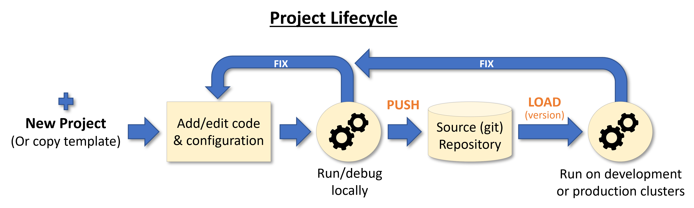

(load-project)=
# Load and run projects

Project code, metadata, and configuration are stored and versioned in source control systems like Git or archives (zip, tar) 
and can be loaded into your work environment or CI system with a single SDK or CLI command.

<p align="center"></p><br>

The project root (context) directory contains the `project.yaml` file with the required metadata and links to various project files/objects, and is read during the `load` process.

**In this section**
- [Load projects using the SDK](#load-sdk)
- [Load projects using the CLI](#load-cli)

See also details on loading and using projects [**with CI/CD frameworks**](./ci-integration.html).

<a id='load-sdk'></a>
## Load projects using the SDK

When a project is already created and stored in a local dir, git, or archive, you can quickly load and use it with the 
{py:meth}`~mlrun.projects.load_project` method. `load_project` uses a local context directory (with initialized `git`) 
or clones a remote repo into the local dir and returns a project object.

You need to provide the git/zip/tar archive `url`. The `context` dir, by default, is "./", which is the directory the MLRun client 
runs from. The `name` can be specified or taken 
from the project object. The project can also specify `secrets` (dict with repo credentials), `init_git` flag (initializes Git in the context dir), 
`clone` flag (project is cloned into the context dir, and the local copy is ignored/deleted), and `user_project` 
flag (indicates the project name is unique to the user).

Example of loading a project from git, using the default `context` dir,  and running the `main` workflow:

```python
# load the project and run the 'main' workflow
project = load_project(name="myproj", url="git://github.com/mlrun/project-archive.git")
project.run("main", arguments={'data': data_url})
```

```{admonition} Note
If the `url` parameter is not specified it searches for Git repo inside the context dir and uses its metadata, 
or if the flag init_git=True, it initializes a Git repo in the target context directory.
```

```{admonition} Note
When working with a private Git, set the project secrets. See [MLRun-managed secrets](../secrets.html#mlrun-managed-secrets).
```

After the project object is loaded use the {py:meth}`~mlrun.projects.MlrunProject.run` method to execute workflows. See details on [**building and running workflows**](./build-run-workflows-pipelines.html)), 
and how to [**run, build, or deploy**](./run-build-deploy.html) individual functions. 

You can edit or add project elements like functions, workflows, artifacts, etc. (See  [**create and use projects**](./create-project.html).)
Once you make changes use GIT or MLRun commands to push those changes to the archive (See [**save into git or an archive**](./create-project.html#push).)

<a id='load-cli'></a>
## Load projects using the CLI

Loading a project from `git` into `./` :

```
mlrun project -n myproj --url "git://github.com/mlrun/project-demo.git" .
```

Running a specific workflow (`main`) from the project stored in `.` (current dir):

```
mlrun project --run main --watch .
```

**CLI usage details**

```
Usage: mlrun project [OPTIONS] [CONTEXT]

Options:
  -n, --name TEXT           project name
  -u, --url TEXT            remote git or archive url
  -r, --run TEXT            run workflow name of .py file
  -a, --arguments TEXT      Kubeflow pipeline arguments name and value tuples
                            (with -r flag), e.g. -a x=6
  -p, --artifact-path TEXT  output artifacts path
  -x, --param TEXT          mlrun project parameter name and value tuples,
                            e.g. -p x=37 -p y='text'
  -s, --secrets TEXT        secrets file=<filename> or env=ENV_KEY1,..
  --db TEXT                 api and db service path/url
  --init-git                for new projects init git context
  -c, --clone               force override/clone into the context dir
  --sync                    sync functions into db
  -w, --watch               wait for pipeline completion (with -r flag)
  -d, --dirty               allow run with uncommitted git changes
  --handler TEXT            workflow function handler name
  --engine TEXT             workflow engine (kfp/local/remote)
  --local                   try to run workflow functions locally
  --timeout INTEGER         timeout in seconds to wait for pipeline completion
                            (used when watch=True)
  --env-file TEXT           path to .env file to load config/variables from
  --ensure-project          ensure the project exists, if not, create project
  --schedule TEXT           To create a schedule define a standard crontab
                            expression string. For using the
                            pre-defined workflow's schedule, set --schedule 'true'
 ```
