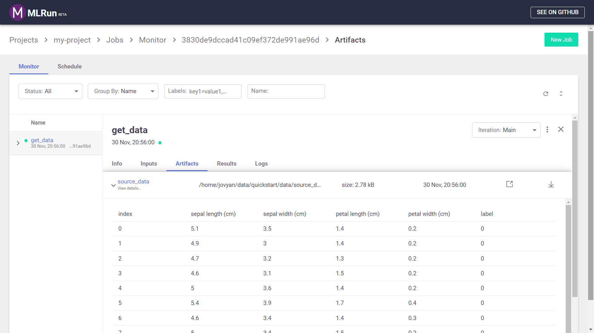
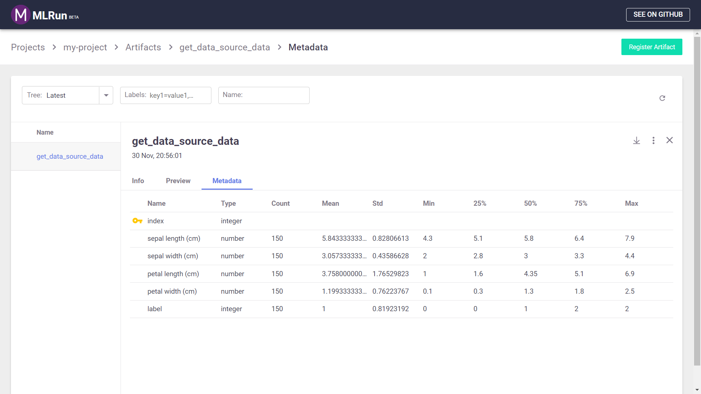
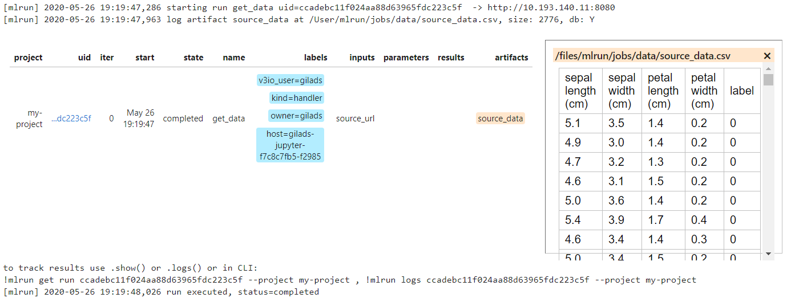
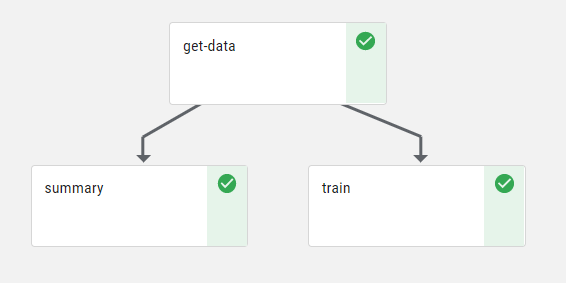

# Quick-Start <a id="top"/></a> <!-- omit in toc -->

- [Installation](#installation)
  - [Installation on Kubernetes](#installation-on-kubernetes)
  - [Alternative: Installation on a Local Docker Registry](#alternative-installation-on-a-local-docker-registry)
- [Usage](#usage)
- [Projects](#projects)
- [Experiment Tracking](#experiment-tracking)
- [Run Local Code](#run-local-code)
- [Experiment Tracking UI](#experiment-tracking-ui)
- [Functions marketplace](#functions-marketplace)
- [Running Functions on Different Runtimes](#running-functions-on-different-runtimes)
  - [Accessing shared storage on Kubernetes](#accessing-shared-storage-on-kubernetes)
  - [Run the function from the marketplace](#run-the-function-from-the-marketplace)
  - [Convert python code to a function](#convert-python-code-to-a-function)
- [Create a machine-learning training function](#create-a-machine-learning-training-function)
- [Pipelines](#pipelines)

<a id="installation"></a>
## Installation

For detailed information regarding MLRun installation, refer to the [Installation Guide](install.md).

### Installation on Kubernetes

The following prerequisites are required to install MLRun on Kubernetes:

1. Access to a Kubernetes cluster. You must have administrator permissions in order to install MLRun on your cluster. For local installation on Windows or Mac, we recommend [Docker Desktop](https://www.docker.com/products/docker-desktop)
2. The Kubernetes command-line too (kubectl) compatible with your Kubernetes cluster installed. Refer to the [kubectl installation instructions](https://kubernetes.io/docs/tasks/tools/install-kubectl/) for more information.
3. Helm CLI installed. Refer to the [Helm installation instructions](https://helm.sh/docs/intro/install/) for more information.
4. You must have an accessible docker-registry (such as [Docker Hub](https://hub.docker.com)). The registry's URL and credentials are consumed by the applications via a pre-created secret

Replace the `<...>` placeholders with the information for your docker-registry and run the following commands:

``` sh
kubectl create namespace mlrun
helm repo add v3io-stable https://v3io.github.io/helm-charts/stable

kubectl --namespace mlrun create secret docker-registry registry-credentials \
    --docker-server <server-url, e.g. https://index.docker.io/v1/ > \
    --docker-username <your-username> \
    --docker-password <your-password> \
    --docker-email <your-email>

helm --namespace mlrun \
    install my-mlrun \
    --wait \
    --set global.registry.url=<registry-url, e.g. index.docker.io/iguazio > \
    --set global.registry.secretName=registry-credentials \
    v3io-stable/mlrun-kit
```

### Alternative: Installation on a Local Docker Registry

MLRun requires separate containers for the API and the dashboard (UI).

To install and run MLRun locally using Docker:
``` sh
SHARED_DIR=~/mlrun-data

docker pull mlrun/jupyter:0.5.4
docker pull mlrun/mlrun-ui:0.5.4

docker network create mlrun-network
docker run -it -p 8080:8080 -p 30040:8888 --rm -d --network mlrun-network --name jupyter -v ${SHARED_DIR}:/home/jovyan/data mlrun/jupyter:0.5.4
docker run -it -p 30050:80 --rm -d --network mlrun-network --name mlrun-ui -e MLRUN_API_PROXY_URL=http://jupyter:8080 mlrun/mlrun-ui:0.5.4
```

When using Docker MLRun can only use local runs.

## Usage

Open Jupyter Lab on [**jupyter-lab UI**](http://localhost:30040) and create a new notebook.

Set-up an artifacts path and the MLRun Database path:

```python
from os import path, getenv
from mlrun import mlconf

# Target location for storing pipeline artifacts
if not mlconf.artifact_path:
    base_path = getenv('HOME', default=path.abspath('.'))
    mlconf.artifact_path = path.join(base_path, 'data')

mlconf.artifact_path = path.join(mlconf.artifact_path, 'quickstart')
    
# MLRun DB path or API service URL
mlconf.dbpath = mlconf.dbpath or 'http://mlrun-api:8080'

print(f'Artifacts path: {mlconf.artifact_path}\nMLRun DB path: {mlconf.dbpath}')
```

<a id="projects"></a>
## Projects

Projects in the platform are used to package multiple functions, workflows, and artifacts. Projects are created by using the `new_project` MLRun method.
Projects are visible in the MLRun dashboard only after they're saved to the MLRun database, which happens whenever you run code for a project.

For example, use the following code to create a project named **my-project** and stores the project definition in a subfolder named `conf`:


```python
from mlrun import new_project

project_name = 'my-project'
project_path = path.abspath('conf')
project = new_project(project_name, project_path, init_git=True)

print(f'Project path: {project_path}\nProject name: {project_name}')
```

<a id="experiment-tracking"></a>
## Experiment Tracking

MLRun introduces the concept of functions, and these functions are part of the project. If you have existing code, the first thing to do is to integrate this code with MLRun. This will not just allow you to run your code in different runtimes, but also enable you to track the function calls, with their inputs and results.

Let's take a simple scenario. First you have some code that reads either a csv file or parquet and returns a DataFrame.

```python
import pandas as pd

# Ingest a data set into the platform
def get_data(source_url):

    if source_url.endswith(".csv"):
        df = pd.read_csv(source_url)
    elif source_url.endswith(".parquet") or source_url.endswith(".pq"):
        df = pd.read_parquet(source_url)
    else:
        raise Exception(f"file type unhandled {source_url}")

    return df
```

We would like to do 2 things:
1. Have MLRun handle the data read
2. Log this data to the MLRun database

For this purpose, we'll add a `context` parameter which will be used to log our artifacts. Our code will now look as follows:


```python
from os import path
from mlrun.execution import MLClientCtx
from mlrun.datastore import DataItem

def get_data(context: MLClientCtx, source_url: DataItem, format: str = 'csv'):

    df = source_url.as_df()

    target_path = path.join(context.artifact_path, 'data')
    # Store the data set in your artifacts database
    context.log_dataset('source_data', df=df, format=format,
                        index=False, artifact_path=target_path)
```

<a id="run-local-code"></a>
## Run Local Code

As input, we will provide a CSV file from S3:


```python
# Set the source-data URL
source_url = 'https://s3.wasabisys.com/iguazio/data/iris/iris_dataset.csv'
```

Next call this function locally, using the `run_local` method. This is a wrapper that will store the execution results in the MLRun database.


```python
from mlrun import run_local
get_data_run = run_local(name='get_data',
                         command='get_data.py',
                         handler='get_data',
                         inputs={'source_url': source_url},
                         project=project_name)
```

When called from python, the output will similar to the following:
``` text
[mlrun] 2020-05-26 19:19:47,286 starting run get_data uid=b847f1494d45447d9445ea84e1f7271b  -> http://10.193.140.11:8080
[mlrun] 2020-05-26 19:19:47,963 log artifact source_data at /User/mlrun/jobs/data/source_data.csv, size: 2776, db: Y

[mlrun] 2020-05-26 19:19:48,026 run executed, status=completed
```

<a id="experiment-tracking-ui"></a>
## Experiment Tracking UI

Go to the MLRun UI to see the details of this job. Specifically, for the artifact you will see a preview of the DataFrame data:

<br><br>


As well as statistics:

<br><br>


If you run the function in a Jupyter notebook, the output cell for your function execution will contain a table with run information &mdash; including the state of the execution, all inputs and parameters, and the execution results and artifacts.
Click on the `source_data` artifact in the **artifacts** column to see a short summary of the data set, as illustrated in the following image:
<br><br>


<a id="functions-marketplace"></a>
## Functions marketplace

Before implementing your own functions, you should first take a look at the [**MLRun functions marketplace** GitHub repository](https://github.com/mlrun/functions/). The marketplace is a centralized location for open-source contributions of function components that are commonly used in machine-learning development.

For example, the [`describe` function](https://github.com/mlrun/functions/blob/master/describe/describe.ipynb) visualizes the data by creating a histogram, imbalance and correlation matrix plots. 

Use the `set_function` MLRun project method, which adds or updates a function object in a project, to load the `describe` marketplace function into a new `describe` project function.


```python
project.set_function('hub://describe', 'describe')
```

You can then run the function as part of your project, just as any other function that you have written yourself. To view the function documentation, call the `doc` method:


```python
project.func('describe').doc()
```

Which yields the following output:
``` text
function: describe
describe and visualizes dataset stats
default handler: summarize
entry points:
  summarize: Summarize a table
    context(MLClientCtx)  - the function context, default=
    table(DataItem)  - MLRun input pointing to pandas dataframe (csv/parquet file path), default=
    label_column(str)  - ground truth column label, default=None
    class_labels(List[str])  - label for each class in tables and plots, default=[]
    plot_hist(bool)  - (True) set this to False for large tables, default=True
    plots_dest(str)  - destination folder of summary plots (relative to artifact_path), default=plots
    update_dataset  - when the table is a registered dataset update the charts in-place, default=False
```

<a id="running-functions-on-different-runtimes"></a>
## Running Functions on Different Runtimes

One of the key advantages of MLRun is the ability to seamlessly run your code on different runtimes. MLRun can run your code locally, jobs on Kubernetes, on Dask or MPI (Horovod). In this quick-start guide we'll show how to run on Kubernetes.

### Accessing shared storage on Kubernetes

The functions need shared storage (file or object) media to pass and store artifacts.

We'll use `auto_mount(...)` to choose the mount method that is applicable to your envionment. The volume will be selected by the following order:
- Kubernetes PVC volume when both `pvc_name` and `volume_mount_path` input parameters are set.
- Iguazio V3IO volume when `V3IO_ACCESS_KEY` and `V3IO_USERNAME` environment variables are set.
- Kubernetes PVC volume when `MLRUN_PVC_MOUNT=<pvc-name>:<mount-path>` environment variable is set.

```python
from mlrun.platforms import auto_mount
```

### Run the function from the marketplace

```python
describe = project.func('describe').apply(auto_mount())

describe_run = describe.run(params={'label_column': 'label'},
                            inputs={"table": get_data_run.outputs['source_data']})
```

The expected output is:

``` text
[mlrun] 2020-05-26 19:20:10,027 starting run describe-summarize uid=0655346d86fe48b5bb8c6f34e08873ab  -> http://10.193.140.11:8080
[mlrun] 2020-05-26 19:20:10,174 Job is running in the background, pod: describe-summarize-dp8zq
[mlrun] 2020-05-26 19:20:18,690 log artifact histograms at /User/mlrun/jobs/plots/hist.html, size: 282853, db: Y
[mlrun] 2020-05-26 19:20:19,295 log artifact imbalance at /User/mlrun/jobs/plots/imbalance.html, size: 11716, db: Y
[mlrun] 2020-05-26 19:20:19,517 log artifact correlation at /User/mlrun/jobs/plots/corr.html, size: 30642, db: Y

[mlrun] 2020-05-26 19:20:19,608 run executed, status=completed
```

### Convert python code to a function

Place the previously defined `get_data` code in a file called `get_data.py`. We can then use MLRun's `code_to_function` to run that python code as an MLRun function on other runtimes: 

```python
from mlrun import code_to_function
```

```python
get_data_func = code_to_function(name='get-data',
                                 filename='get_data.py',
                                 handler='get_data',
                                 kind='job',
                                 image='mlrun/ml-models')
get_data = project.set_function(get_data_func).apply(auto_mount())
```

Similar to before, we can run this function, but this time, as a job

```python
get_data_run = get_data.run(inputs={'source_url': source_url}
```

## Create a machine-learning training function

To complete our example, see the following code that trains a simple logistic regression model. In many cases this is not needed since you will find many of the required functions already available in the **Functions Marketplace**. However, this simplified function will give you a good starting point should you need to build similar functions on your own. 

```python
import pandas as pd
from sklearn.model_selection import train_test_split
from sklearn.linear_model import LogisticRegression

from sklearn import metrics
from pickle import dumps
import matplotlib.pyplot as plt

from mlrun.execution import MLClientCtx
from mlrun.datastore import DataItem
from mlrun.artifacts import PlotArtifact

def train(context: MLClientCtx,
          dataset: DataItem,
          label_column: str,
          test_size: float = 0.30,
          random_state: int = 1
         ) -> None:

    """Train a logistic regression model.
    
    This function accepts a raw dataset and the label column. It splits the data to train and test
    datasets and trains a logistic regression model based on the training set. It then compares
    the models prediction to the test set.

    :param context:              The MLRun function context used for logging artifacts
    :param dataset:              The name of raw data file containing the dataset
    :param label_column:         The column name of the ground-truth labels within the dataset
    :param test_size:            Represent the proportion of the dataset to include in the test split
    :param random_state:         Controls the shuffling applied to the data before applying the split. Pass an int for reproducible output across multiple function calls.
    """
    
   # Get the dataframe
    df = dataset.as_df()

   # Separate the labael column from the dataframe
    labels = df.pop(label_column)
    
   # split the sample into train and test and calibration sets:
    xtrain, xtest, ytrain, ytest = train_test_split(df, labels, test_size=test_size, random_state=random_state)

   # Log the test set
    test_set = pd.concat([xtest, ytest.to_frame()], axis=1)
    context.log_dataset('test-set', df=test_set, format='parquet', local_path='data/test_set.parquet')

   # Train the model
    model = LogisticRegression(C=1e5).fit(df, labels)
    
   # Log the model
    context.log_model('model', body=dumps(model), model_dir='models', model_file='model.pkl')

   # Run the model prediction on the test set 
    ypred = model.predict(xtest)

   # Log the results of the test prediction 
    context.log_result('accuracy', value=float(metrics.accuracy_score(ytest, ypred)))

   # Log the confusion matrix 
    cmd = metrics.plot_confusion_matrix(model, xtest, ytest, normalize='all', values_format='.2g', cmap=plt.cm.Blues)
    context.log_artifact(PlotArtifact('confusion-matrix', body=cmd.figure_), local_path='plots/confusion_matrix.html')

```

Copy the code above to `train.py` file and execute the following command to run that code as a job:


```python
train_func_gen = code_to_function(name='train',
                                  handler='train',
                                  filename='train.py',
                                  kind='job',
                                  image='mlrun/ml-models')
train_func = project.set_function(train_func_gen).apply(auto_mount())
train_func.run(inputs={'dataset': get_data_run.output('source_data')},
               params={'label_column': 'label'})
```

The expected output is:
``` text
[mlrun] 2020-05-26 19:24:57,635 starting run train-train uid=8f99f4702b21470d85b40092ff548e74  -> http://10.193.140.11:8080
[mlrun] 2020-05-26 19:24:57,839 Job is running in the background, pod: train-train-glpnj
[mlrun] 2020-05-26 19:25:03,131 log artifact test-set at /User/mlrun/jobs/data/test_set.parquet, size: 5753, db: Y
[mlrun] 2020-05-26 19:25:03,187 log artifact model at /User/mlrun/jobs/models/, size: 949, db: Y
[mlrun] 2020-05-26 19:25:03,327 log artifact confusion-matrix at /User/mlrun/jobs/plots/confusion_matrix.html, size: 24535, db: Y

[mlrun] 2020-05-26 19:25:03,354 run executed, status=completed
```

<a id="pipelines"></a>
## Pipelines

You can also [**install Kubeflow Pipelines**](https://www.kubeflow.org/docs/started/getting-started/) and use MLRun to create a workflow that runs the functions defined here.

Once you have Kubeflow installed, copy the following code to **workflow.py** in your project directory (we previously set the project directory as the `conf` folder under the current directory):


```python
from kfp import dsl
from mlrun.platforms import auto_mount

funcs = {}
LABELS = "label"

# Configure function resources and local settings
def init_functions(functions: dict, project=None, secrets=None):
    for f in functions.values():
        f.apply(auto_mount())

# Create a Kubeflow Pipelines pipeline
@dsl.pipeline(
    name="Quick-start",
    description="This is  simple workflow"
)
def kfpipeline(source_url='https://s3.wasabisys.com/iguazio/data/iris/iris_dataset.csv'):

    # Ingest the data set
    ingest = funcs['get-data'].as_step(
        name="get-data",
        handler='get_data',
        inputs={'source_url': source_url},
        params={'format': 'pq'},
        outputs=['source_data'])

    # Analyze the dataset
    describe = funcs["describe"].as_step(
        name="summary",
        params={"label_column": LABELS},
        inputs={"table": ingest.outputs['source_data']})

    # Train a model
    train = funcs["train"].as_step(
        name="train",
        handler='train',
        params={"label_column": LABELS},
        inputs={"dataset": ingest.outputs['source_data']},
        outputs=['model', 'test_set'])
```

And run the following code:

```python
# Register the workflow file as "main"
project.set_workflow('main', 'workflow.py')

project.save()

run_id = project.run(
    'main',
    arguments={}, 
    artifact_path=path.abspath(path.join('pipeline','{{workflow.uid}}')), 
    dirty=True,
    watch=True)
```

The pipeline created would look as follows



