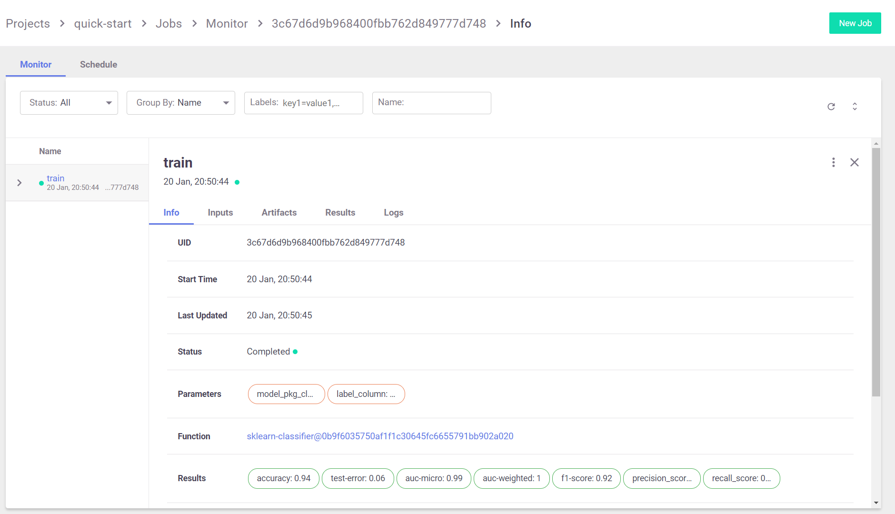
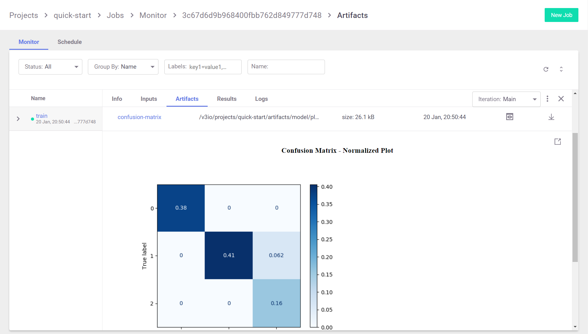
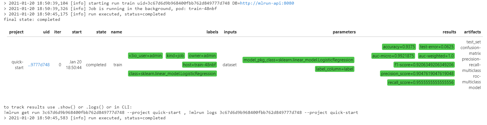
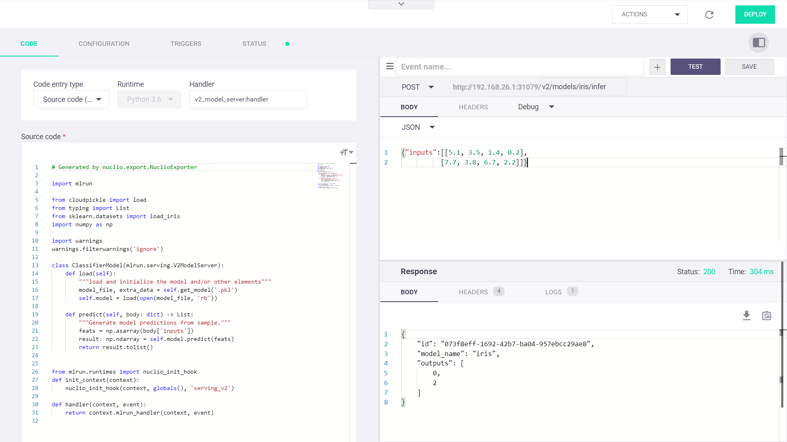

# Quick-Start <a id="top"/></a> <!-- omit in toc -->

**MLRun** is an end-to-end open source MLOps solution to manage and automate your entire analytics and machine learning lifecycle, from data ingestion through model development and full pipeline deployment. MLRun is running as a built-in service in Iguazio and is integrated well with other services in the platform.
Its primary goal is to ease the development of machine learning pipeline at scale and help organization to build a robust process for moving from the research phase to a full operational production.
## Table of Contents <!-- omit in toc -->

- [Working with MLRun](#working-with-mlrun)
  - [Train a Model](#train-a-model)
  - [Test Model](#test-model)
  - [Serve Model](#serve-model)

## Working with MLRun

If you need to install MLRun, refer to the [Installation Guide](install.md).

Open Jupyter Lab on [**jupyter-lab UI**](http://localhost:30040) and create a new notebook.

### Train a Model

Run model training

MLRun introduces the concept of functions. You can run your own code as functions, or use functions from the function marketplace. In the example below, we'll use the `sklearn_classifer` from the function marketplace to train a model.

```python
from mlrun import import_function
from mlrun.platforms import auto_mount

train = import_function('hub://sklearn_classifier').apply(auto_mount())

train_run = train.run(name='train',
                      inputs={'dataset': 'https://s3.wasabisys.com/iguazio/data/iris/iris_dataset.csv'},
                      params={'model_pkg_class': 'sklearn.linear_model.LogisticRegression',
                              'label_column': 'label'})
```


Go to the [**MLRun UI**]((http://localhost:30050)) to see the details of this job:



As well as artifacts:



If you run the function in a Jupyter notebook, the output cell for your function execution will contain a table with run information &mdash; including the state of the execution, all inputs and parameters, and the execution results and artifacts.



### Test Model

Now that you have a trained model, you can test it: run a task that uses the [`test_classifier` marketplace](https://github.com/mlrun/functions/tree/master/test_classifier) function to run the selected trained model against the test data set, as returned for the training task (train) in the previous step.

```python
test = import_function('hub://test_classifier').apply(auto_mount())
```

You can then run the function as part of your project, just as any other function that you have written yourself. To view the function documentation, call the `doc` method:


```python
test.doc()
```

Which yields the following output:
``` text
function: test-classifier
test a classifier using held-out or new data
default handler: test_classifier
entry points:
  test_classifier: Test one or more classifier models against held-out dataset

Using held-out test features, evaluates the peformance of the estimated model

Can be part of a kubeflow pipeline as a test step that is run post EDA and 
training/validation cycles
    context  - the function context, default=
    models_path(DataItem)  - artifact models representing a file or a folder, default=
    test_set(DataItem)  - test features and labels, default=
    label_column(str)  - column name for ground truth labels, default=
    score_method(str)  - for multiclass classification, default=micro
    plots_dest(str)  - dir for test plots, default=
    model_evaluator  - NOT IMPLEMENTED: specific method to generate eval, passed in as string or available in this folder, default=None
    default_model(str)  - , default=model.pkl
    predictions_column(str)  - column name for the predictions column on the resulted artifact, default=yscore
    model_update  - (True) update model, when running as stand alone no need in update, default=True
```

Configure parameters for the test function (`params`), and provide the selected trained model from the train task as an input artifact (`inputs`).

``` python
test_run = test.run(name="test",
                    params={"label_column": "label"},
                    inputs={"models_path": train_run.outputs['model'],
                            "test_set": train_run.outputs['test_set']})
```

### Serve Model

MLRun serving can take MLRun models or standard model files and produce managed real-time serverless functions based on Nuclio real-time serverless engine, which can be deployed everywhere.

Nuclio is a high-performance "serverless" framework focused on data, I/O, and compute intensive workloads. More details can be found on <https://github.com/nuclio/nuclio>

To deploy your model run the following code:

``` python
model_name='iris'
serve.add_model(model_name, model_path=train_run.outputs['model'])
addr = serve.deploy()
```

The `invoke` method enables to programmatically test the function.

``` python
import json

inputs = [[5.1, 3.5, 1.4, 0.2],
          [7.7, 3.8, 6.7, 2.2]]
my_data = json.dumps({'inputs': inputs})
```

yielding the following output

``` text
{'id': '216ae597-6514-48bd-8dc2-fa6f277cc81a',
 'model_name': 'my_model',
 'outputs': [0, 2]}
````

Open the [**Nuclio UI**](http://localhost:30040) to view the function and test it.



For a more detailed, refer to the [End-to-end Pipeline Tutorial](./end-to-end-pipeline.html).
