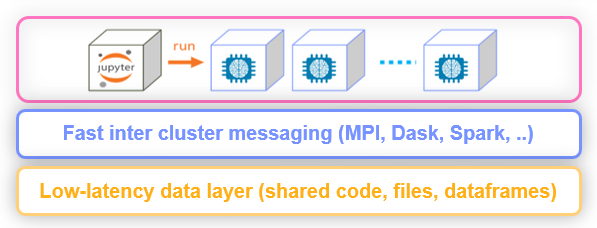

# Distributed and Hyper-param Jobs (or Multi-stage workflows)

Many of the runtimes support horizontal scaling. You can specify the number of `replicas` or the 
min - max value range (for auto scaling in Dask or Nuclio). When scaling functions MLRun uses a high speed
messaging protocol and shared storage (volumes, objects, databases, or streams). MLRun runtimes
handle the orchestration and monitoring of the distributed task.

 

MLRun also support iterative tasks for automatic and distributed execution of many tasks with variable parameters (hyper params).
 The iterative tasks can be distributed across multiple containers and allow hyper-parameter training, AutoML, and other parallel tasks.