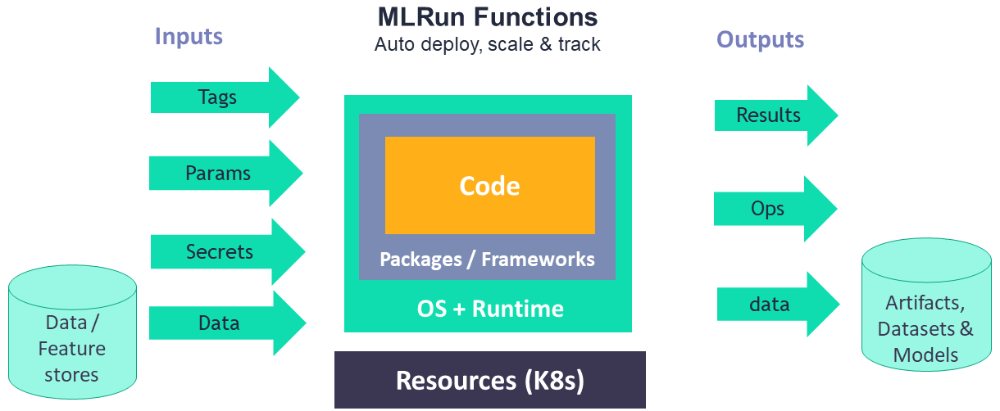
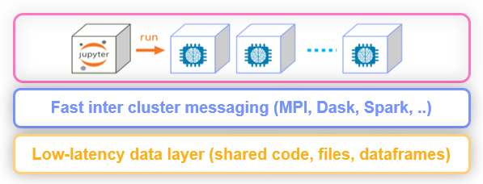

(functions-architecture)=
# Functions architecture

MLRun supports:
- [Multiple types of runtimes](../concepts/functions-overview.html).
- Configuring the function resources (replicas, CPU/GPU/memory limits, volumes, Spot vs. On-demand nodes, pod priority, node affinity). See details in [Managing job resources](configuring-job-resources.html). 
- Iterative tasks for automatic and distributed execution of many tasks with variable parameters (hyperparams). See [Hyperparam and iterative jobs](../hyper-params.html).
- Horizontal scaling of functions across multiple containers. See [Distributed and Parallel Jobs](./distributed.html).

MLRun has an open [public Function Hub](https://www.mlrun.org/hub/functions/) that stores many pre-developed functions for
use in your projects. 

 

## Distributed functions

Many of the runtimes support horizontal scaling. You can specify the number of `replicas` or the 
min&mdash;max value range (for auto scaling in {ref}`Dask <dask-overview>` or {ref}`Nuclio <nuclio-real-time-functions>`). When scaling functions, MLRun uses a high-speed
messaging protocol and shared storage (volumes, objects, databases, or streams). MLRun runtimes
handle the orchestration and monitoring of the distributed task.

 
