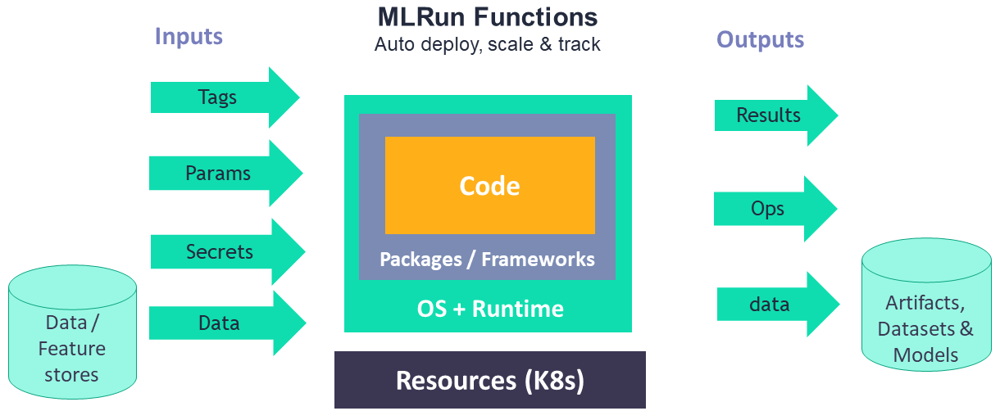

(Functions)=
# MLRun serverless functions
<!-- in Concepts -->

All the executions in MLRun are based on **Serverless Functions**. The functions allow specifying code and 
all the operational aspects (image, required packages, cpu/mem/gpu resources, storage, environment, etc.). 
The [different function runtimes](Function_runtimes) take care of automatically transforming the code and spec to fully 
managed and elastic services over Kubernetes, which saves significant operational overhead, 
addresses scalability and reduces infrastructure costs.

MLRun supports:
- Real-time functions for: serving, APIs, and stream processing (based on the high-performance Nuclio engine). 
- Batch functions: based on Kubernetes jobs, Spark, Dask, Horovod, etc.

Function objects are all inclusive (code, spec, API, and metadata definitions), which allows placing them 
in a shared and versioned function market place. This means that different members of the team can produce or 
consume functions. Each function is versioned and stored in the MLRun database with a unique hash code, 
and gets a new hash code upon changes.
There is also an open [public marketplace](https://www.mlrun.org/marketplace/functions/) that stores many pre-developed functions for
use in your projects. 

Functions can scale-out across multiple containers. Read more in [**Distributed and Parallel Jobs**](./distributed.md).

 

**Contents**
- [Distributed function runtimes](#distributed-function-runtimes)
- [Nuclio real-time functions](#nuclio-real-time-functions)
- [Node affinity for MLRun jobs](#node-affinity-for-mlrun-jobs)

## Distributed function runtimes

## Nuclio real-time functions

## Node affinity for MLRun jobs

Node affinity can be applied to MLRun to determine on which nodes the jobs can run. The rules are defined using custom labels on 
nodes and label selectors. Node affinity allows towards Spot or On Demand groups of nodes. See [Node affinity for MLRun jobs](../runtimes/node-affinity.md).
