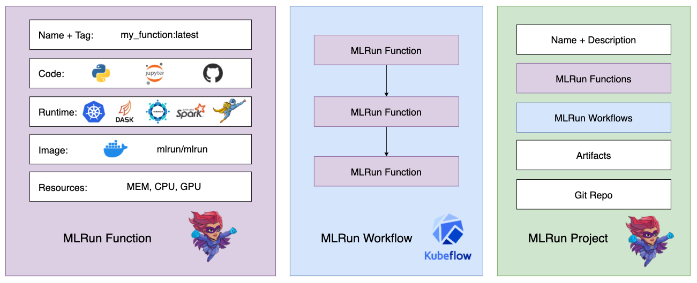

(Functions)=
# Functions 

All the executions in MLRun are based on serverless functions. Functions are essentially Python code that can be 
executed locally or on a Kubernetes cluster. 
MLRun functions are used to run jobs, deploy models, create pipelines, and more. 

There are various kinds of MLRun functions with different capabilities, however, 
there are commonalities across all functions. In general, an MLRun function looks like the following:

<br>

MLRun supports numerous real-time and batch runtimes, described in {ref}`function_runtimes`. 
The different function runtimes take care of automatically transforming the code and spec to fully 
managed and elastic services over Kubernetes, which saves significant operational overhead, 
addresses scalability, and reduces infrastructure costs. The function parameters and capabilities 
are explained in more detail in {ref}`create-and-use-functions`.

Function objects are all inclusive, containing the code and all the operational aspects: ({ref}`image <images-usage>`, required packages, 
{ref}`pod resource congifuration (replicas, CPU/GPU/memory limits, volumes, Spot vs. On-demand nodes, pod priority, node affinity) <configuring-job-resources>`, 
[storage](../runtimes/function-storage.html), environment, metadata definitions, etc.). Each function is versioned and stored in the MLRun 
database with a unique hash code, 
and gets a new hash code upon changes.

You can use the MLRun auto-logging to log results and artifacts, and to automatically and seamlessly track machine-learning processes 
while they execute, such as training a model. See {ref}`decorators-and-auto-logging`. 

## Functions and projects
Function are members of an [**MLRun project**](../projects/project.html), a container for all your work on a particular ML application. 
Once you register a function within a project, you can execute it in your local 
environment or at scale on a Kubernetes cluster.

The relationship between **functions**, [**workflows**](../projects/build-run-workflows-pipelines.html), and [**projects**](../projects/project.html), 
is as follows:



After the MLRun functions and workflows are created and [**registered into the project**](../projects/create-project.html), they are invoked 
using the project object. 
This workflow pairs especially well with {ref}`ci-cd-automate`.

## Function hub

Since function objects are all-inclusive (code, spec, API, and metadata definitions), they can be stored in, 
and reused from, a shared and versioned function hub. This means that multiple users can share the same MLRun 
project and get access to objects associated with it.

MLRun has an open [public function hub](https://www.mlrun.org/hub/functions/) that stores many pre-developed functions for
use in your projects. Read more in {ref}`load-from-hub`.

## Distributed functions

Many of the runtimes support horizontal scaling across multiple containers. You can specify the number of `replicas` or the 
min&mdash;max value range (for auto scaling in {ref}`Dask <dask-overview>` or {ref}`Nuclio <nuclio-real-time-functions>`). When scaling functions, MLRun uses a high-speed
messaging protocol and shared storage (volumes, objects, databases, or streams). MLRun runtimes
handle the orchestration and monitoring of the distributed task.

<br>

## Hyperparameters
MLRun also supports iterative tasks for automatic and distributed execution of many tasks with variable 
parameters (hyperparams). See {ref}`hyper-params`.

**In this section**

```{toctree}
:maxdepth: 1

../concepts/functions-overview
create-and-use-functions
mlrun_code_annotations
function-storage
images
image-build
load-from-hub
git-repo-as-hub
```