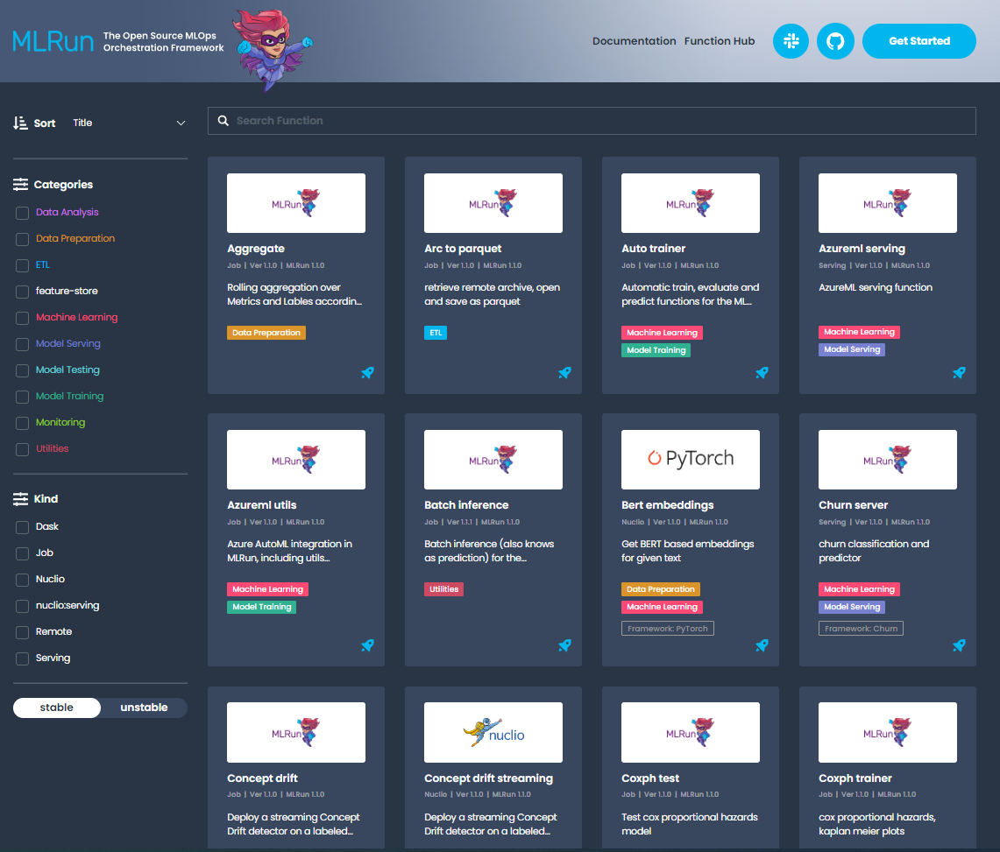

(load-from-marketplace)=
# Function Hub <!-- omit in toc -->

This section demonstrates how to import a function from the Hub into your project, and provides some basic instructions on how to run the function and view the results.

**In this section**
- [Overview](#overview)
- [Function Hub](#function-hub)
- [Searching for functions](#searching-for-functions)
- [Setting the project configuration](#setting-the-project-configuration)
- [Loading functions from the hub](#loading-functions-from-the-hub)
- [View the function params](#view-the-function-params)
- [Running the function](#running-the-function)

## Function Hub

The MLRun Function Hub has a wide range of functions that can be used for a variety of use cases.
There are functions for ETL, data preparation, training (ML & Deep learning), serving, alerts and notifications and more.
Each function has a docstring that explains how to use it. In addition, the functions are associated with categories to make it easier for you to find the relevant one.

Functions can be easily imported into your project and therefore help you to speed up your development cycle by reusing built-in code.

## Searching for functions

The Function Hub is located [here](https://www.mlrun.org/hub/). <br>
You can search and filter the categories and kinds to find a function that meets your needs.



## Setting the project configuration

The first step for each project is to set the project name and path:

```python
from os import path, getenv
from mlrun import new_project

project_name = 'load-func'
project_path = path.abspath('conf')
project = new_project(project_name, project_path, init_git=True)

print(f'Project path: {project_path}\nProject name: {project_name}')
```

### Set the artifacts path  <!-- omit in toc -->

The artifact path is the default path for saving all the artifacts that the functions generate:

```python
from mlrun import run_local, mlconf, import_function, mount_v3io

# Target location for storing pipeline artifacts
artifact_path = path.abspath('jobs')
# MLRun DB path or API service URL
mlconf.dbpath = mlconf.dbpath or 'http://mlrun-api:8080'

print(f'Artifacts path: {artifact_path}\nMLRun DB path: {mlconf.dbpath}')
```

## Loading functions from the Hub

Run `project.set_function` to load a function.<br>
`set_function` updates or adds a function object to the project.

`set_function(func, name='', kind='', image=None, with_repo=None)`

Parameters:

- **func** &mdash; function object or spec/code url.
- **name** &mdash; name of the function (under the project).
- **kind** &mdash; runtime kind e.g. job, nuclio, spark, dask, mpijob. Default: job.
- **image** &mdash; docker image to be used, can also be specified in the function object/yaml.
- **with_repo** &mdash; add (clone) the current repo to the build source.

Returns: project object

For more information see the {py:meth}`~mlrun.projects.MlrunProject.set_function` API documentation.

### Load function example  <!-- omit in toc -->

This example loads the `describe` function. This function analyzes a csv or parquet file for data analysis.

```python
project.set_function('hub://describe', 'describe')
```

Create a function object called `my_describe`:

```python
my_describe = project.func('describe')
```

## View the function params

To view the parameters, run the function with .doc():

```python
my_describe.doc()
```

``` text
    function: describe
    describe and visualizes dataset stats
    default handler: summarize
    entry points:
      summarize: Summarize a table
        context(MLClientCtx)  - the function context, default=
        table(DataItem)  - MLRun input pointing to pandas dataframe (csv/parquet file path), default=
        label_column(str)  - ground truth column label, default=None
        class_labels(List[str])  - label for each class in tables and plots, default=[]
        plot_hist(bool)  - (True) set this to False for large tables, default=True
        plots_dest(str)  - destination folder of summary plots (relative to artifact_path), default=plots
        update_dataset  - when the table is a registered dataset update the charts in-place, default=False
```

## Running the function

Use the `run` method to run the function.

When working with functions pay attention to the following:

- Input vs. params &mdash; for sending data items to a function, send it via "inputs" and not as params.
- Working with artifacts &mdash; Artifacts from each run are stored in the `artifact_path`, which can be set globally with the environment variable (MLRUN_ARTIFACT_PATH) or with the config. If it's not already set you can create a directory and use it in the runs. Using `{{run.uid}}` in the path creates a unique directory per run. When using pipelines you can use the `{{workflow.uid}}` template option.

This example runs the describe function. This function analyzes a dataset (in this case it's a csv file) and generates HTML files (e.g. correlation, histogram) and saves them under the artifact path.

```python
DATA_URL = 'https://s3.wasabisys.com/iguazio/data/iris/iris_dataset.csv'

my_describe.run(name='describe',
                inputs={'table': DATA_URL},
                artifact_path=artifact_path)
```

### Saving the artifacts in a unique folder for each run  <!-- omit in toc -->

```python
out = mlconf.artifact_path or path.abspath('./data')
my_describe.run(name='describe',
                inputs={'table': DATA_URL},
                artifact_path=path.join(out, '{{run.uid}}'))
```

### Viewing the jobs & the artifacts  <!-- omit in toc -->

There are few options to view the outputs of the jobs you ran:

- In Jupyter the result of the job is displayed in the Jupyter notebook. When you click on the artifacts it displays its content in Jupyter.
- In the MLRun UI, under the project name, you can view the job that was running as well as the artifacts it generated.
